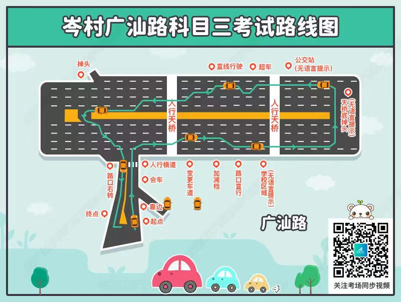
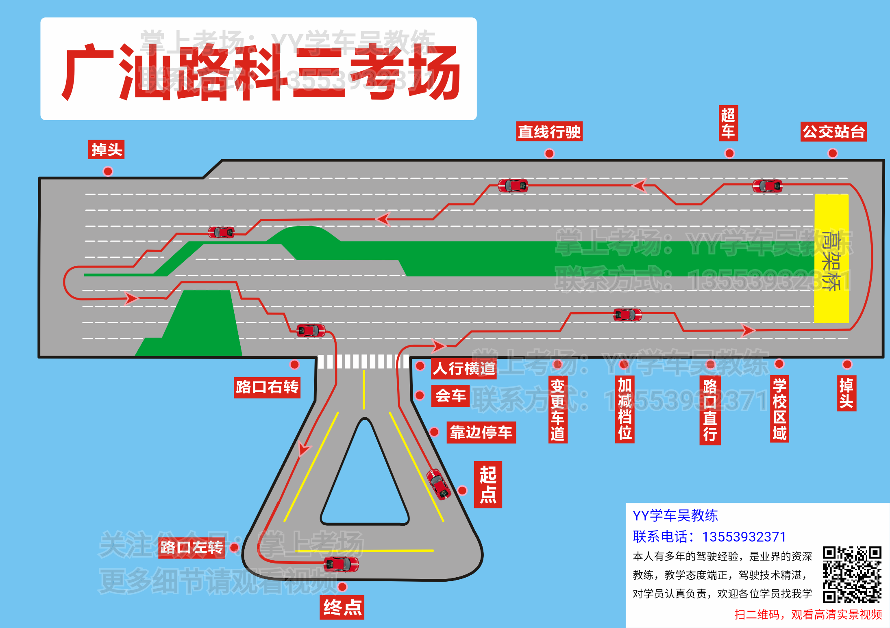
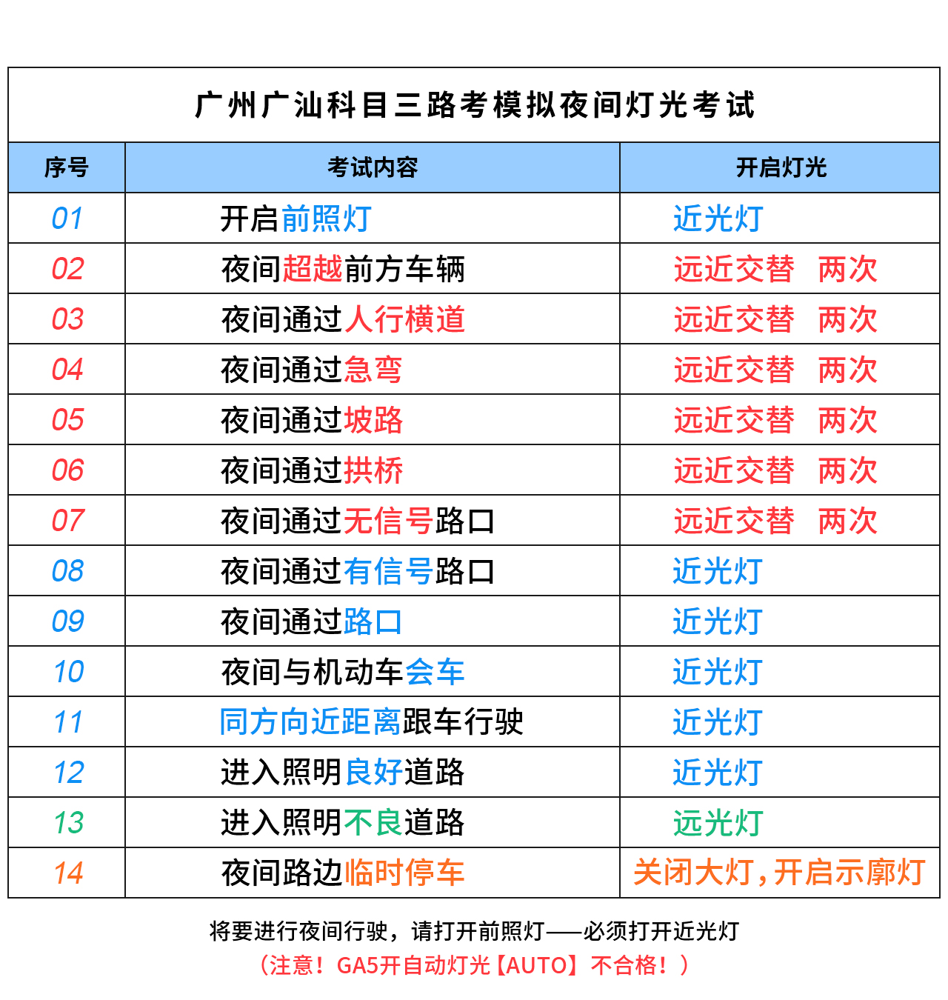

## 科目三

<!-- ---
home: true
heroImage: /hero.png
actionText: start now→
actionLink: /categories/
footer: Licensed | Copyright © 2018-present
--- -->

<style scoped>
.content:not(.custom){width: 960px;max-width: 90% !important;}
</style>
#### 广汕考场线路图



#### 夜间模拟灯光项目


#### 考试项目顺序（一停二看三通过）
```bash
0、考前准备-----`60秒内完成安全驾驶动作；下面进行模拟灯光使用考试，请在5秒内完成相应的灯光操作；`
                # 上车调整座椅、检查后视镜、灯光操作杆=>"考官，准备完毕！"=>下车逆时针绕行=>上车系安全带=>夜间模拟
1、起步---------`身份验证成功，请立即完成起步。`
                # 打左转向灯=>3s后踩脚刹，挂D挡，放手刹=>缓慢松脚刹起步
2、靠边停车-----`靠边停车`
                # 打右转向灯=>3s后缓慢向右打方向盘=>雨刮头追线=>踩脚刹，挂N挡，拉手刹
3、起步---------`请起步，继续完成考试`
                # 打左转向灯=>3s后踩脚刹，挂D挡，放手刹=>缓慢松脚刹起步
4、会车---------`会车；会车完成`
                # 点刹减速
5、人行横道-----`前方人行横道`
                # 点刹减速（注意停车观察避让行人）
6、路口右转---- # 打右转向灯，观察左边车况=>3s后，打一圈方向盘右转（注意避让社会车辆，可停车等待）（肩头对准实线开始转方向盘）
                注意：驶入右一或右二车道
7、变更车道-----`请变更车道；变更车道完成`
                # 打左转向灯，观察后视镜=>3s后，打一个拳头左右方向盘，车头驶入一半车道后回正方向盘（如灯关需补打灯）
                注意：变道完成后，进入右二车道行驶
8、路口直行-----`直行路口`  
                # 在路口前的井盖处点刹减速（注意观察后视镜，注意避让社会车辆） 
9、学校区域----- # 过指示牌后点刹减速
10、高架桥------ # 在高架桥底下点刹减速
11、掉头-------- # 打左左转向灯，打一圈方向盘掉头（注意观察右侧车况）（肩头对准实线开始转方向盘）
                注意：进入左一车道
12、公交车站---- # 过指示牌后点刹减速
13、高架桥------ # 在高架桥底下点刹减速
14、超车--------`前方请从右侧四车道进入超车项目；完成超车动作；请返回原车道`                
                # 打左转向灯，观察后视镜=>3s，转一拳头方向盘驶入左车道，车头驶入一半后回正方向盘
                #  =>3s后，打右转向灯，观察右后视镜=>3s后，转一拳头方向盘驶入右车道，车头驶入一半后回正方向盘
                注意：如果不是在最左侧车道，不用理会，听到“完成超车动作”后再开始打灯
15、直线行驶--- `直线行驶；直线行驶完成`
                # 保持20~30时速，直到听到语音“直线行驶完成”
                注意：直线行驶完成后；陆续向左变车道，直到左二车道为止
16、掉头--------`前方掉头`
                # 打左左转向灯，打一圈方向盘掉头（注意观察右侧车况）（肩头对准实线开始转方向盘）
                注意：如灯回位要补打灯；遇到停止线前要点刹减速，不管红灯还是绿灯；掉头进入左二车道；
                遇到红灯路口前要点刹减速，通过路口后，沿最右车道行驶，一直开右转向灯，根据车况自主向右变道，直到右二车道为止。
17、路口右转----`前方路口右转`
                # 打右转向灯，观察后视镜=>3s后，打一圈方向盘右转（注意避让社会车辆，可停车等待）（肩头对齐黑色围栏开始打方向盘）
                注意：路口前踩刹车
18、路口左转----`前方路口左转`
                # 打左转向灯，观察后视镜=>3s后，左转进入大院
                注意：杆前踩刹车减速
19、终点--------`考试结束，成绩合格`
                # 考试结束
                注意：挂P挡，拉手刹，解开安全带下车
```

#### 注意

广汕C2  指定区域刻意要做的刹车减速或停车效果，才能满足自动检索评判合格的项目

1`人行横道`（刹车右转向灯）
（语音起即踩刹车生效，语音播播开计20米内仍有效，最好别超15   KM时速）

2`直行路囗`<播完即踩刹车>
（语音起30米内仍有效，不超30KM时速）刚播报完的第一个路口不允许停车

3`学校区域`<有效区段刹车>
（车尾横向过完指示牌至人行天桥底共计45米内的任何位置，时速应低于30KM）

4`公交车站`<有效区段刹车>
（肩膀横向过完指示标志至10KM指示牌之间45米内的仼何位置，时速应低于30KM）

5`路口右拐`（右转向灯加正确位置刹车）
（车头盖覆盖减速线的前后6米之间，时速最好低于15KM）有危险随时停住，最后一根减速线等同于导向车道停止线，考试车离开停止线后的路口中心区域，不宜停留超过7秒。


6`路口左拐`（左转向灯加有效位置刹车）
（肩膀左侧横向对上最后12米左侧铁栅栏的任何位置，时速最好低于15KM）有危险随时停住


这6个考点是固定必须做到有效踩刹车操作，而且必须在语音发出或肩膀横向对上标志牌后的指定有效距离那段路，该刹车就踩，该保留有效转向灯就得补够，至于其它项目必须按路况进行临时变更车道，或踩刹车减速或停车，不能过分依赖单一的预定通道行驶，教和学的过程都要加以渗透，这样学员的成绩会比较有成功保障。

真正的路况，遇上正常安全距离的突然缩短，必须在本车道内加踩刹车减速甚至停车。（在路面状况欠顺畅时，用的刹车次数会更多，或停车次数更多）

以上有题序踩刹车的效果，由电子自动评判可以独立完成，如仅满足了电子评判，实际路况仍存在安全距离隐患的，学员必须增加踩刹车减速或停车，否则由安全员踩下的刹车，就会终止考试，上报总台监控，一把考试机会成绩不合格。


