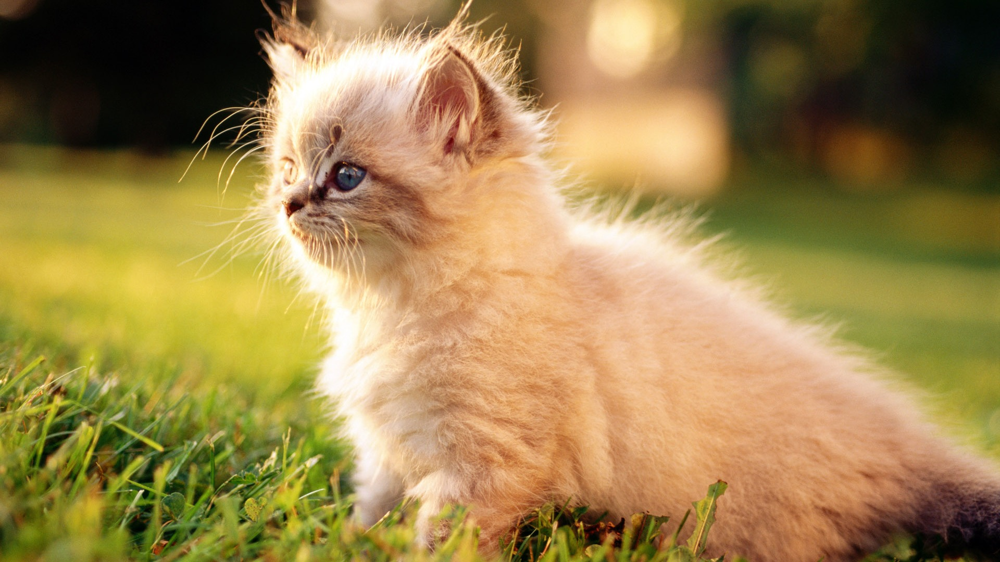
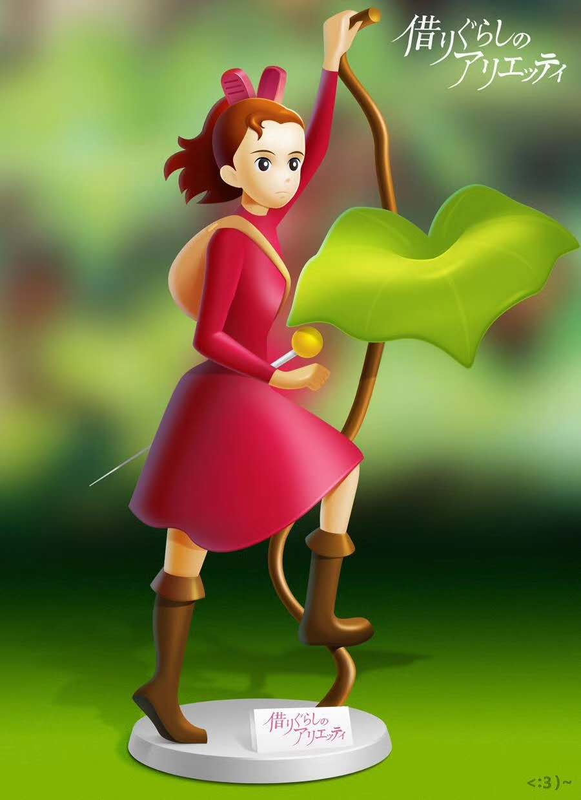
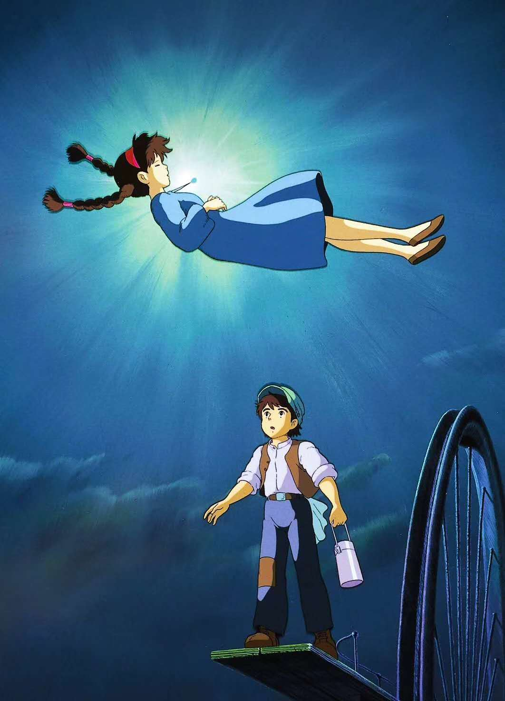
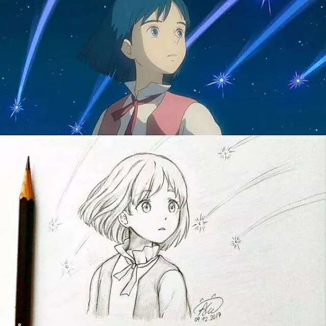
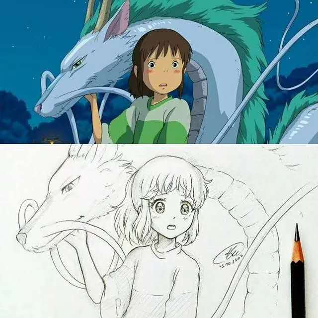

## 混合

### 壁纸

* 屏幕分辨率：1920*1080

  
  

* 手机

  

    
  

* 

## 动画/漫画

* 宫崎骏-借东西的小人

  

    
  

  

    
  

* 宫崎骏-千与千寻

  

    
  

  

    
  

* 宫崎骏-天空之城

  

    
  

  

    
  

* 大鱼海棠

  

    
  

  

    
  

* 宫崎骏

## 不一样的素描

  

    
  

  

    
  

   

    
  

## 创意摄影插图

* [摄图网](http://699pic.com/chahua-0-765-popular-all-0-all-all-1-0-0-0-0-0-0-all-all.html)

## LOGO

* [谷歌logo](https://www.google.com/doodles?hl=zh-CN//lh3.googleusercontent.com/qgqTl7c-jity4KmWat3IAdF3ultwNNY_zoT1r7imhndVk_Si0WXt_39jsC93e1EZS9JKSsAzkSwl-x7V4J41D5YODU9f9wsvLjz7x3f6)

  

    
  

  

    
  

  

    
  

  

    
  

  

    
  

  

    
  

