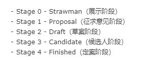

[ES6基础](http://es6.ruanyifeng.com/)

## ES6简介

### ECMAScript与JavaScript的关系

### ES6与ECMAScript2015的关系

### 语法提案的批准流程
><br>
>一个提案只要进入`stage-2`就能包括在后面的正式标准里

### ECMAScript的历史

### 部署进度
>[各大浏览器对ES6的支持](http://kangax.github.io/compat-table/es6/)<br>
>[`es6-checker`-检测各种环境对ES6的运行情况](http://es6.ruanyifeng.com/#docs/intro)

### Babel转码器
>es6转码器，将es6转为es5

>使用babel的第一步，就是配置文件.babelrc，存放在根目录，配置规则:
```js
{
  "preset": [],
  "plugins": []
}
```

>`preset`字段设定转码规则，规则集如下：<br>


>转码规则加入到配置文件.babelrc中：
```js
{
  "preset": [
    "latest",
    "react",
    "stage-2"
  ],
  "plugins": []
}
```

>`babel-cli`命令行转码<br>
>`babel-node`是babel-cli自带的一个命令，提供ES6的REPL(Read-Eval-Print-Loop，交互式运行环境)环境<br>
>`babel-register`改写require环境，只适合在开发环境使用<br>
>`babel-core`调用babel的api转码<br>
>`babel-polyfill`默认只转换新的Javascript语法，而不是转换新的api，比如Iterator、Generator、Set、Map、Proxy、Reflect、Symbol、Promise等全局对象，以及一些定义在全局对象上的方法，如Object.assign、Array.from等。直接在头部添加'reqiure("babel-polyfill")'

## let和const命令

### 1、let命令
---

* 基本用法
>es6新增命令，用来声明变量，所声明的变量只在let命令所在的代码块内（块级作用域）有效
```js
// for循环计数器很适合使用let命令
for(let i=0; i<10; i++)
```

* 不存在变量提升
>`var`会存在变量提升，即变量可以在声明前使用，值为`undefined`<br>
>`let`不存在变量提升，不能在声明前使用，否则会报错

* 暂时性死区
>如果区块中存在块级作用域命令，凡是使用了变量再声明的，都会报错，不管块外有没有声明这些变量，这种现象叫“暂时性死区”
```js
var tmp = 123
if (true) {
  tmp = 'abc' // error
  let tmp
}
```

* 不允许重复声明
>同一个变量可以使用`var`反复声明<br>
>同一个变量只能用`let`声明一次

### 2、块级作用域
---
* 什么是块级作用域
>块级作用域只在代码块内有效，外层作用域无法获得内层作用域的变量

* 为什么需要块级作用域
>es5只有`全局作用域`和`函数作用域`, 没有块级作用域，这带来了很多不合理的场景，例如：
```js
<!-- 场景一：内层变量可能会覆盖外层变量 -->
var tmp = new Date()
function f(){
  console.log(tmp)
  if(false){
    var tmp = 'hw'
  }
}
f()
```

### 3、const命令
---


### 4、顶层对象的属性
---


### 5、global对象
---


