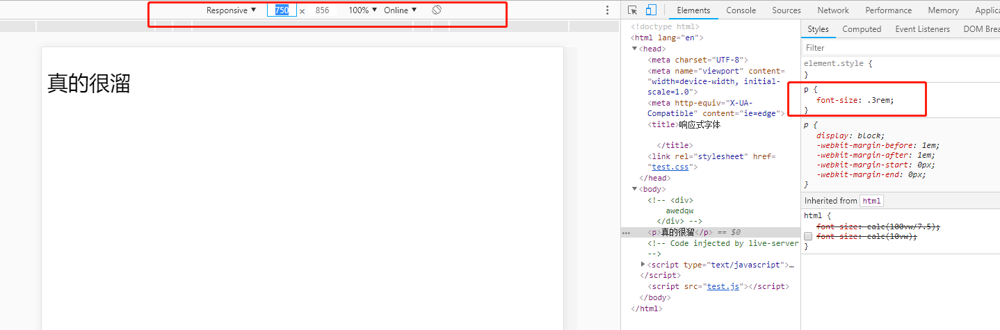
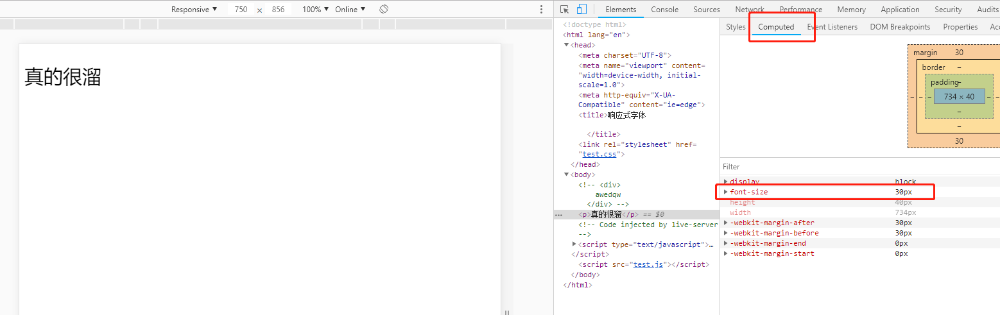

### 字体大小自适应布局

-------

在不了解的情况，前端开发人员一直很疑惑，web移动的字体单位到底是用px好还是用rem好？</br>
这个要视具体情况而定：</br>
 -- 1、只需要适配少部分手机设备，且分辨率对页面影响不大情况，建议使用px即可, 字体大小不会随设备进行适配</br>
 -- 2、需要适配各种设备，则使用rem，字体会随设备大小变化

* 移动设备的`viewport`

进行移动端开发都需要添加`<meta name='viewport' content='width="deviceWidth", initial-scale=1.0>`,</br>
其中与viewport相关的单位有四个，分别为vw、vh、vmin和vmax，其中：</br>
-- **vw**：是Viewport's width的简写，`1vw = window.innerWidth * 1%`，那么100vw等于屏幕宽度</br>
-- **vh**：和vw类似，是Viewport's height的简写，，`1vw = window.innerHeight * 1%`</br>
-- **vmin**：vmin的值是当前vw和vh中较小的值</br>
-- **vmax**：vmax的值是当前vw和vh中较大的值</br>

* 关于`rem`

rem的大小取决于根元素html的设置，1rem等于html中font-size的大小。</br>
如果html没有设置font-size值,那么1rem就等于浏览器默认的字体大小，一般是16px，例如：
```css
html{
  font-size: 100px
}
p {
  font-size: 1rem; /*1rem=100px*/
}
```

* [关于calc()函数](https://www.w3cplus.com/css3/how-to-use-css3-calc-function.html)

calc()是css3的新属性，用于计算元素长度或者大小的函数，可以实现页面自适应布局以及字体自适应调整

* 根元素字体大小计算

如今移动端设计稿一般使用两种分辨率：640px与750px（移动设备竖屏时的横屏分辨率）。
字体大小的设置与设置稿有关。例如设计稿基于手机设备竖屏时的横向分辨率为640px,那么为了计算方便，100px的font-size作为参照，根元素html的font-size:deviceWidth/6.4

上面有讲到，1vw是设备分辨率的1%，那么100vw就等于屏幕宽度，那么100vw/6.4可以让1rem的大小在640宽度的屏幕下等于100px，即1rem = 100px：
```css
html{
  font-size: calc(100vw/6.4); /*calc()获取计算结果*/
}
p{
  font-size: .3rem; /*640px下的30px*/
}
```
同理，让1rem的大小在750宽度的屏幕下等于100px，即1rem = 100px;
```css
html{
  font-size: calc(100vw/7.5);
}
p{
  font-size: .3rem; /*750px下的30px*/
}
```
注意：chrome下针对中文的最小字体是12px

* 开发技巧

我们在开发指定屏幕宽度的移动端时，例如750px的宽度，可以这样干：

1、使用Chrome浏览器移动版开发工具，设置Responsive属性的屏幕宽度为750


2、指定根元素的字体大小
```css
html{
  font-size: calc(100vw/7.5);
}
```

3、如果设计稿某文案（例如"真的很溜"）字体大小为30个像素点
```html
<p>真的很溜</p>
```
那么可以使用rem设置p标签大小为.3rem:
```css
p{
  font-size: .3rem; /*浏览器计算后为30px, 与设计稿像素保持一致，这样就不会有误差了！*/
}
```

`font-size: .3rem`，实际等于750宽度下的30px.点击`computed`，可以看到浏览器计算之后的css属性：


4、当缩小屏幕时，字体也会随着变小

例如，在iPhone6/7/8屏幕宽度为375px下，“真的很溜”为15px

