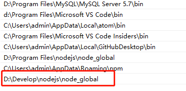

### 全局安装与非全局安装的区别：

* 全局安装命令为`npm install [package-name] --global`，全局安装的包保存在C盘路径`C:\Users\admin\AppData\Roaming\npm`，全局安装成功的包可以在此文件夹中看到安装的包，那么安装成功的包可以在终端使用包相应的命令行，比如全局安装webpack、webpack-cli，则可以查看其版本号以及其相应的打包命令。

* 非全局安装的包，不能在终端查看其版本号以及相应的命令，否则会报错。非全局安装的包，只能供本项目的文件夹相互调用，而不能在项目外使用。

* 全局安装的包不能通过命令删除，只能手动删除。

* 任意终端均可以全局安装某个包。

>注意：想要安装的全局变量起作用，必须将全局安装的包的路径配置到环境变量中，电脑右键->属性->高级系统设置->环境变量->双击打开用户变量`Path`,将全局安装的包的路径添加上去
> 
>  
>配置完成后重启电脑即可使用
----

* `internal-ip`: 获取本地的`ipv4`或者`ipv6`
* `opn`: 服务端打开浏览器， 如打开百度opn('http://www.baidu.com')
* `webpack-log`: 用于打印webpack日志
* `child_process`: npm命令包