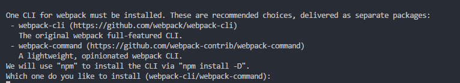

### webpack v4.16.4

[webpack2/3最优化配置](https://developers.google.com/web/fundamentals/performance/webpack/)
[webpack4最优化配置](https://medium.com/webpack/webpack-4-released-today-6cdb994702d4)
[webpack使用指南](https://www.webpackjs.com/guides/)

#### 环境准备

* 新建`webpack-study`文件夹
* 命令行生成`package.json`文件: `npm init`
* 开发环境安装`webpack`、`webpack-cli`、`webpack-dev-server`: npm i --save-dev webpack webpack-cli webpack-dev-server, 期中：
  - webpack用于构建打包压缩并输出静态资源
  - webpack-dev-server在开发过程中监听文件变化，在内存中构建编译资源文件，并不输出打包压缩好的文件
  - 当webpack有配置文件时，例如`webpack --config=config/webpack.dev.js`会报错:

    

    此时必须安装webpack-cli，webpack才能通过配置文件构建打包压缩静态资源文件

#### webpack打包

* 终端直接输入`webpack`命令行会报错

  

  因为webpack命令默认打包src下的index.js文件, 且默认输出dist/main.js, 如果没有src/index.js则会报错

* 命令行新建`src`文件夹：`md src` 或者 `mkdir src`
  - 删除文件命令：`rd src` 或者 `rmdir src`
* src文件夹下新建index.js文件
* 终端输入`webpack`命令，可生成压缩好的静态资源：`dist/main.js`

#### 配置文件

* [entry入口](https://www.webpackjs.com/concepts/entry-points/#%E5%8D%95%E4%B8%AA%E5%85%A5%E5%8F%A3-%E7%AE%80%E5%86%99-%E8%AF%AD%E6%B3%95)

  ```js
  module.exports = {
    entry: {
      main: './src/index.js'
    }
  }
  ```
  config文件夹下，entry打包入口的路劲为什么是`'./src/index.js'`呢？因为配置文件是相对于跟目录而言的，只有使用相对路径

* [output输出](https://www.webpackjs.com/concepts/output/)

  ```js
  const path = require('path')
  module.exports = {
    output: {
      path: path.resolve(__dirname, '../dist'),
      filename: '[name].js'
    }
  }
  ```
  [name]是以文件名命名压缩文件名称

参考链接：

[webpack4.x入门配置](https://www.jianshu.com/p/6712e4e4b8fe)<br/>
[webpack4.x 入门一篇足矣](https://juejin.im/post/5b2b9a00e51d45587b48075e)