# 辅导员职业知识高频考点

## 一、辅导员基础知识

<a href="#1_1">1、新形势下高校思想政治教育的**基本原则**</a><br/>
<a href="#1_2">2、新形势下高校思想政治教育的**指导思想**</a><br/>
<a href="#1_3">3、大学生思想政治教育工作**队伍主体**和主要职责</a><br/>
<a href="#1_4">4、辅导员**誓词**</a><br/>
<a href="#1_5">5、辅导员的**职业定义**</a><br/>
<a href="#1_6">6、辅导员选聘的**标准**</a><br/>
<a href="#1_7">7、辅导员的**主要工作职责**</a><br/>
<a href="#1_8">8、辅导员工作的**意义**</a><br/>
<a href="#1_9">9、辅导员**自我完善与发展**的途径与方式</a><br/>
<a href="#1_10">10、新时期辅导员应树立的**意识**</a><br/>

------

1、加强和改进新形势下`高校思想政治教育`的**基本原则**是什么？<br id="1_1"/>
```bash
（1）`坚持党对高校的领导`。落实全面从严治党要求，把党的建设贯穿始终，着
力解决突出问题，维护党中央权威、保证党的团结统一，牢牢掌握党对高校的领导权。

（2）`坚持社会主义办学方向`。坚持马克思主义指导地位，坚持以人民为中心的
发展思想，更好为改革开放和社会主义现代化建设服务、为人民服务。

（3）`坚持全员全过程全方位育人`。把思想价值引领贯穿教育教学全过程和各环
节，形成教书育人、科研育人、实践育人、管理育人、服务育人、文化育人、组织育人长效机制。

（4）`坚持遵循教育规律、思想政治工作规律、学生成长规律`。把握师生思想
特点和发展需求，注重理论教育和实践活动相结合、普遍要求和分类指导相结
合，提高工作科学化精细化水平。

（5）`坚持改革创新`。推进理念思路、内容形式、方法手段创新，增强工作时代感和实效性。
```
2、加强和改进新形势下`高校思想政治教育`的**指导思想**是什么？<br id="1_2"/>
```bash
（1）`高举`中国特色社会主义`伟大旗帜`，`以`马克思列宁主义、毛泽东思想、邓小平理论、
“三个代表”重要思想、科学发展观`为指导`，

（2）`深入学习贯彻`习近平总书记系列重要讲话精神和治国理政新理念新思想新战略，`全面提升`
思想政治工作水平，`紧密团结`在以习近平同志为核心的党中央领导，

（3）`全面贯彻`党的教育方针、党的十八大和十八届三中、四中、五中、六中全会精神，
`坚持`社会主义办学方向，`扎根`中国大地核心价值观为引领，

（4）`切实抓好各方面`基础性建设和基础性工作，`切实加强和改善`党的领导，`牢固树立`政治意识、
大局意识、核心意识、看齐意识，

（5）`坚定不移维护`党中央权威和党中央集中统一领导，`为实现`“两个一百年”奋斗目标、`实现`中华民族
伟大复兴的中国梦，`培养`又红又专、德才兼备、全面发展的中国特色社会主义`合格建设者和可靠接班人`。
```
3、大学生思想政治教育工作**队伍主体**是什么？各部分的**主要职责**是什么？<br id="1_3"/>
```bash
（一）大学生思想政治教育工作`队伍主体`是：学校党政干部和共青团干部、思想政治理论课和
哲学社会科学课教师、辅导员和班主任。

（二）各部分主要职责：
  （1）`学校党政干部`和`共青团干部`负责学生思想政治教育的组织、协调、实施；
  （2）`思想政治理论`和`哲学社会科学课教师`根据学科和课程的内容、特点，负责对学生进行
  思想理论教育、思想品德教育和人文素质教育；
  （3）`辅导员、班主任`是大学生思想政治教育的骨干力量，辅导员按照`党委的部署`有针对性地开展
思想政治教育活动，班主任负有在`思想、学习和生活`等方面指导学生的职责
```
4、辅导员**誓词**<br id="1_4"/>
```bash
我志愿成为一名高校辅导员，拥护党的领导，献身教育事业，恪守职业规范，提升专业素养，情系学生成长，
做好良师益友。为培养社会主义合格建设者和可靠接班人而努力奋斗！
```
5、辅导员的**职业定义**<br id="1_5"/>
```bash
（1）辅导员是高等学校`教师队伍`和`管理队伍`的重要组成部分，具有`教师`和`干部`的双重身份。

（2）辅导员是开展`大学生思想政治教育`的骨干力量，是高校学生`日常思想政治教育`和`管理工作`的
    组织者、实施者和指导者。

（3）辅导员应当努力成为学生的`人生导师`和健康成长的`知心朋友`。
```
6、辅导员选聘的**标准**是什么（依据 43 号 令作答）<br id="1_6"/>
```bash
（1）具有较高的`政治素质`和坚定的`理想信念`，坚决贯彻执行党的`基本路线`和各项`方针政策`，
有较强的`政治敏感性`和`政治辨别力`；

（2）具备`本科以上`学历，热爱大学生`思想政治教育`事业，甘于奉献，潜心育人，具有强烈的
`事业心`和`责任感`；

（3）具有从事`思想政治教育`工作相关学科的宽口径`知识储备`，掌握`思想政治教育`工作相关学科的
`基本原理`和`基础知识`，掌握`思想政治教育`专业`基本理论`、`知识`和`方法`，掌握`马克思主义中国化`
`相关理论`和`知识`，掌握大学生`思想政治教育`工作实务相关知识，掌握有关`法律法规`知识。

（4）具备较强的`组织管理能力`和`语言`、`文字表达能力`，及`教育引导能力`、`调查研究能力`，
具备开展`思想理论教育`和`价值引领工作`的能力；

（5）具有较强的`纪律观念`和`规矩意识`，遵纪守法，为人正直，作风正派，廉洁自律。
```

7、辅导员的**主要工作职责**是（依据 43  号令作答）<br id="1_7"/>
```bash
（1）思想理论教育和价值引领
（2）党团和班级建设
（3）学风建设
（4）学生日常事务管理
（5）心理健康教育与咨询工作
（6）网络思想政治教育
（7）校园危机事件应对
（8）职业生涯规划与就业创业指导
（9）理论和实践研究
```
8、辅导员工作的**意义**（为什么重视辅导员工作）<br id="1_8"/>
```bash
（1）辅导员工作在`大学生思想政治教育`的第一线，对大学生的`成长成才`起着至关重要的作用，
做好辅导员工作，关系到`大学生思想政治教育`能否进一步加强和改进，大学生能否`健康成长`；

（2）`学校的改革、发展`离不开稳定的环境，辅导员开展大量细致的日常工作，使得`许多不稳定因素`
被化解在`萌芽状态`中；也正是由于辅导员们`在关键时候`冲在最前面，使得`一些影响稳定的事端`
及时得到平息；

（3）辅导员工作平台是为高校`锻炼高素质人才、储备人才`的平台。
```
9、辅导员**自我完善与发展**有哪些途径与方式？<br id="1_9"/>
```bash
（1）通过`学习`全面提升自身素质；

（2）通过`实践`全面提高自身能力和业务素质、提升团队精神和交际能力；

（3）通过`思考`和`总结`升华思想理念。
```
10、新时期辅导员应树立哪几种意识？<br id="1_10"/>
```bash
参考答案：政治意识、责任意识、阵地意识、底线意识
```

## 二、辅导员专业知识

```bash
                                      理论体系

`思想政治教育专业基本理论、基本知识、基本方法`
思想政治教育学、思想政治教育心理学、心理学健康教育等

`马克思主义中国化相关理论`
毛泽东思想相关理论、中国特色社会主义理论体系、社会主义核心价值观、中华人民共和国历史等

`大学生思想政治教育工作务实相关知识`
党团班级建设、职业生涯规划和就业创业指导、网络思想政治教育、危机事件、突发事件应对和管控
```

<a href="#2_1">1、党团组织的重要作用</a></br>
<a href="#2_2">2、提高大学生心理健康教育和心理咨询工作水平</a></br>
<a href="#2_3">3、把握大学生思想特点的常用方法</a></br>
<a href="#2_4">4、大学生心理健康的标准</a></br>
<a href="#2_5">5、大学不同年级学生心理辅导的侧重点</a></br>
<a href="#2_6">6、应对突发事件</a></br>
<a href="#2_7">7、抵御宗教渗透</a></br>
<a href="#2_8">8、辅导员职业知识体系中应具的专业知识</a></br>
<a href="#2_9">9、入职开展大学生思想教育工作</a></br>
<a href="#2_10">10、贫困生的主要途径和渠道</a></br>
<a href="#2_11">11、大学生入党的基本程序</a></br>
<a href="#2_13">13、入职开展大学生日常事务管理工作</a></br>
<a href="#2_14">14、入职开展大学生心理健康教育与咨询工作</a></br>
<a href="#2_15">15、入职开展大学生网络思想政治教育工作</a></br>
<a href="#2_16">16、入职开展学校危机事件应对工作</a></br>

-------


1. 如何充分发挥**党团组织**在`大学生思想政治教育`中的重要作用？<br id="2_1"/>
```bash
（1）发挥党的`政治`优势和`组织`优势，做好大学生思想政治教育工作。

（2）发挥`共青团和学生组织`作用，推进大学生思想政治教育。

（3）依托`班级、社团`等组织形式，开展大学生思想政治教育。
```
2. 如何努力提高大学生`心理健康`教育和`心理咨询`工作水平？<br id="2_2"/>
```bash
（1）`积极引导`大学生保持健康向上的心理状态。

（2）`切实帮助`大学生解决实际问题。

（3）`认真做好`大学生心理辅导和咨询工作。

（4）`充分发挥`课堂教学在大学生心理健康教育中的重要作用。

（5）`积极开展`心理健康宣传教育活动。

（6）`努力构建和完善`大学生心理问题高危人群预警机制。
```
3. 把握大学生思想特点的`常用方法`有哪些？<br id="2_3"/>
```bash
参考答案：日常观察；个别谈心法；活动检验法；理论学习法。
```
4. 简述大学生心理健康的`标准`<br id="2_4"/>
```bash
（1）能够从心理上正确认识自己、接纳自己
（2）能较好地适应现实环境
（3）具有和谐的人际关系
（4）具有较强的自我调节能力,能较好地协调与控制情绪
（5）合理的行为
（6）具有完整统一的人格品质
```
5. 请简要阐述大学不同年级学生心理辅导的`侧重点`<br id="2_5"/>
```bash
根据大学生活不同阶段以及各层次、各学科门类学生、特殊群体学生的心理特
点，有针对性地实施心理健康教育。

（1）`新生`心理健康教育重点放在`适应新环境`等内容上，帮助他们尽快完成`从中
学到大学`的转变与适应；

（2）`二、三年级学生`心理健康教育要以帮助他们`了解`心理科学基础知识、`初步
掌握`心理调适技能以及`处理好`学习成才、人际交往、交友恋爱、人格发展等方
面的困惑为重点

（3）对于`毕业生`,要`配合`就业指导工作，`帮助`他们正确认识职业特点,`客观分析`
自我职业倾向，`做好`就业的心理准备。

（4）在`日常的学习、生活`中，`要针对`大学生普通存在的、较为集中的心理问题
安排`专题教育`，`要重视`经济困难学生等特殊群体学生的`心理健康教育`工作。
```
6.  辅导员应对**突发事件**应该做哪些工作？<br id="2_6"/>
```bash
（1）`组织开展`基本安全教育。

（2）`参与`学校、院（系）危机事件工作预案`制定和执行`。

（3）`对`校园危机事件`进行初步处理`，`稳定`局面`控制`事态发展，
`及时掌握`危机事件信息`并`按程序`上报`。

（4）`参与`危机事件`后期应对`及`总结研究分析`。
```
7. 新时期高校如何`抵御宗教渗透`？<br id="2_7"/>
```bash
（1）要在`加强教育`上下功夫。第一，加强大学生思想政治教育；第二，切实加强对大学生
宗教知识和宗教政策的教育。

（2）要在`加强管理`上下功夫。第一加强对涉外人员的管理，包括对外籍教师、留学生和
境外来访人员的管理；第二加强对大学生日常生活的管理。

（3）要在`加强建设`上下功夫。第一要加强高校思想政治工作队伍建设，充分发挥教职工作用。
第二，要加强党团基层组织建设，构筑反宗教渗透防线。第三要加强校园文化建设，丰富大学生业余生活。

（4）在`加强研究`上下功夫。
```
8. 辅导员`职业知识体系中`应具有哪些**专业知识**？<br id="2_8"/>
```bash
（1）`思想政治教育专业基本理论、基本知识、基本方法`。具体包括：思想政治
教育学原理、思想政治道德观教育、思想政治教育方法论、思想政治教育心理
学和心理健康教育相关知识与技能等。

（2）`马克思主义中国化相关理论及知识`。具体包括：毛泽东思想相关理论、中
国特色社会主义理论体系、社会主义核心价值体系、中华人民共和国史等。

（3）`大学生思想政治教育工作实务相关知识`。具体包括：大学生党团班级建设
的相关知识、职业生涯规划与就业指导相关知识、网络思想政治教育相关知
识、危机事件、突发事件应对与管控的相关知识等。
```
9. 假如你通过本校本次辅导员招聘考试，刚入职的你将如何**开展大学生思想教育工作**？每项工作分别要求你具备何种能力？<br id="2_9"/>
```bash
（1）熟悉学生家庭情况、个人特长等基本信息，掌握学生思想特点、动态及思想政治状况。
`所需能力`：能通过日常观察、谈心谈话、问卷调查等方式，收集学生基本信息，了解学生思想动态；
能针对学生关心的热点、焦点问题，及时进行教育和引导。

（2）深入开展中国特色社会主义、中国梦宣传教育和社会主义核心价值观教育，帮助学生树立
正确的世界观、人生观、价值观，确立在中国共产党领导下走中国特色社会主义道路、实现
中华民族伟大复兴的共同理想和坚定信念。
`所需能力`：能掌握主题教育、个别谈心、党团活动、社会实践活动等思想政治
教育的基本方法能针对学生关注的思想理论热点问题做基本解释。

（3）有针对性地帮助大学生处理好学习成才、择业交友、健康生活等方面的具体问题。
`所需能力`：能结合大学生实际，广泛深入开展谈心活动，引导学生养成良好的心理品质和
自尊、自爱、自律、自强的优良品格。
```
10. 做好高校贫困生的助学工作，首先要做好贫困生的身份确定。请简述**确定贫困生**的主要途径和渠道有哪些？<br id="2_10"/>
```bash
（1）由学生本人反映家庭经济状况
（2）县民政局、乡镇政府、村委会、接到居委会出具贫困证明
（3）班主任、同学、室友反映情况
（4）通过调查饭卡等的消费情况了解学生的生活水平
（5）日常谈话、侧面了解等。
```
11. 大学生入党的基本程序是什么？<br id="2_11"/>
```bash
（1）申请人自愿向党组织提出申请，并`递交入党申请书`；
（2）党支部根据已向党组织提出申请并在各方面都符合条件的同学，`确定积极分子`；
（3）经过定期考察的积极分子，党支部要组织他们`参加`上级党委组织的党校`入党积极分子培训班`
进行学习；
（4）经过一年以上培养、考察、培训成绩合格，基本具备党员条件的积极分子，征求党内外群众意见后，
由党支部委员会集体讨论`确定为发展对象`；
（5）经过政审合格后，填写《入党志愿书》，接收为`预备党员`；一年后，`转为正式党员`。
```
12. 假如你通过本校本次辅导员招聘考试，刚入职的你将如何开展**党团和班级建设**工作？每项工作分别要求你具备何种能力？<br id="2_12"/>
```bash
（1）做好学生骨干的遴选、培养、激励工作。
`所需能力`：能考察学生思想政治素质、道德品质、工作能力、发展潜力等基本素质，
能激励学生积极主动参与班团事务；

（2）做好学生入党积极分子培养教育工作。
`所需能力`：能教育引导学生坚定理想信念，增强党性修养，端正入党动机；能组织学生学习党的理论知识；

（3）做好学生党员发展和教育管理服务工作。
`所需能力`：能从思想政治、能力素质、道德品行、现实表现等方面综合考察学生的先进性和纯洁性；
熟悉党员发展的环节和程序；能利用各种教育载体激发党员的学习积极性和主动性。

（4）指导学生党支部和班团组织建设。
`所需能力`：能选好配强党支部和班团组织负责人；能积极推动组织生活等工作创新能发挥
学生党员的先锋模范作用和党支部的战斗堡垒作用。
```
13. 假如你通过本校本次辅导员招聘考试，刚入职的你将如何开展**大学生日常事务管理**工作？每项工作分别要求你具备何种能力？<br id="2_13"/>
```bash
（1）开展新生入学教育。
`所需能力`：能通过主题班会、参观实践、讲座报告、交流讨论等形式开展入学
教育，帮助新生熟悉、接纳并适应大学生活

（2）做好毕业生离校教育、管理和服务工作。
`所需能力`：能通过主题演讲、主题征文、座谈会、毕业纪念册、毕业衫等形式
做好毕业生的爱校荣校教育；能为毕业生办理好毕业派遣、户档转出、党组织
关系转接等工作

（3）组织好学生军训工作。
`所需能力`：能通过宣讲和谈心等形式做好学生军训动员工作，指导学生积极参
与军训。

（4）有效开展助、贷、勤、减、补工作，落实好家庭经济困难学生的资助工作。
`所需能力`：能组织评审各类助学金，指导学生办理助学贷款，组织学生开展勤
工俭学活动，为学生办理学费减免和临时困难补助工作

（5）做好学生奖励评优和奖学金评审工作。
`所需能力`：能组织学生开展素质综合测评，公开公平的做好奖励评优和奖学金评审工作。

（6）为学生的日常事务提供基本咨询，进行生活指导。
`所需能力`：能根据学校相关政策规定及社会、生活常识为学生解答一些日常问
题；能指导学生依法维护自身权益。

（7）指导学生开展宿舍文化建设，促进学生和谐相处，互帮互助。
所需能力：能通过召开宿舍长会议、组织宿舍文化符号比赛等形式活跃宿舍文
化能通过团体辅导、个别谈心等形式化解宿舍学生之间的矛盾。
```
14. 假如你通过本校本次辅导员招聘考试，刚入职的你将如何开展**大学生心理健康教育与咨询**工作？每项工作分别要求你具备何种能力？<br id="2_14"/>
```bash
（1）协助学校心理健康教育机构开展心理筛查；

（2）对学生进行初步心理问题排查和疏导。
以上两点`所需能力`：能协助心理健康教育机构完成心理筛查的组织实施、能了
解大学生的心理特点，熟悉大学生常见的发展性心理问题，掌握倾听、共情、
尊重等沟通技能，能够与大学生建立积极有效的师生关系，帮助学生调适一般的心理困扰

（3）组织开展心理健康教育宣传活动。
`所需能力`：能组织开展形式多样的心理健康教育宣传活动，如举办讲座、设计
宣传展板等；能组织学生参加陶冶情操、磨炼意志的课外文体活动，提高学生心理健康水平。
```
15. 假如你通过本校本次辅导员招聘考试，刚入职的你将如何开展**大学生网络思想政治教育**工作？每项工作分别要求你具备何种能力？<br id="2_15"/>
```bash
（1）构建网络思想政治教育重要阵地，有效传播先进文化、弘扬主旋律。
`所需能力`：能及时把握学生对信息技术的应用趋势；能熟悉网络语言特点和规律；

（2）拓展工作途径，加强与学生的网上互动交流，运用网络平台为学生提供学习、生活、就业心理咨询
等服务。
`所需能力`：能熟练使用博客、微博及微信等新媒体技术

（3）及时了解网络舆情信息，密切关注学生的网络动态，敏锐把握一些苗头性、倾向性、群体性问题。
`所需能力`：能及时研判网络舆情
```
16. 假如你通过本校本次辅导员招聘考试，刚入职的你将如何开展**学校危机事件应对**工作？ 每项工作分别要求你具备何种能力？<br id="2_16"/>
```bash
（1）对危机事件作初步处理，努力稳定并控制局面。
`所需能力`：能第一时间赶赴现场；能尽快确认相关人员基本情况；能执行危机
事件处理预案，及时稳定相关人员情绪

（2）了解事件相关信息并及时逐级上报
`所需能力`：能通过学生骨干、密切接触人员等渠道快速了解事件相关信息；
能对事件性质做出初步判断；能将相关情况及时向上级领导汇报

（3）组织基本安全教育并建立基层应急队伍。
`所需能力`：掌握基本安全教育方法，能组织开展学生安全教育活动；
能培训指导各级学生骨干具备初步应急常识
```

## 三、高等教育学、教育心理学

1. 简述马斯洛的**需要层次理论**。
```bash
马斯洛认为人的基本需要有五种，由低到高排列依次是：
生理的需要，安全的需要，归属和爱的需要，尊重的需要，自我实现的需要。

`生理需要`是最基本的需要，
`自我实现的需要`是最高级的需要，包括认知、审美和创造的需要。
```
2. 简述马克思主义关于人的**全面发展学说**的主要内容。
```bash
（1）`旧式分工`造成了人的片面发展；

（2）`机器大工业生产`提供了人的全面发展的基础和可能；

（3）`社会主义制度`是实现人的全面发展的社会条件，`教育与生产劳动相结合`是实现人的全面发展的
惟一途径
```
3. 大学生**身心的特殊性**表现在 。
```bash
1.他们具有较高的`智力水平`。
2.他们具有较扎实的知识`基础`和较丰富的`知识`面。
3.他们具有较好的`品德修养`。
4.他们具有较为远大的`理想`。
5.他们面对的`压力`也很`大`。
6.他们的`心理成熟度`还不够高。
```
4.大学生**学习的基本特点**：
```bash
（1）学习`内容上`的特点:
专业化程度较高,职业定向性较强,要求掌握丰富的实践知识,较强的动手能力,学科内容的高层次性和争议性。

（2）学习`方法上`的特点:
自学方式日益占有重要地位,学习的独立性、批判性和自觉性不断增强,课堂学习与课外和校外学习相结合。
```
5. 大学生**记忆发展的特点**
```bash
(1)逻辑记忆能力得到显著提高
(2)各种记忆品质得到全面发展
(3)掌据各种有效的记忆方法
```
6. 简述当前**大学生问题的研究**中应加强的几个方面。
```bash
（1）大学生的`学习生活`。由于对专业培养目标的模糊，有的学生对学习积极性不高，针对性不强。
（2）大学生的`经济生活`。分化严重，家庭条件好的奢侈，困难生比重大，学费生活费难解决。
（3）大学生的`课余生活`，两极分化。
（4）大学生`心里健康问题`，不容忽视。
```
7. 影响当代大学生思想特点的因素是什么？
```bash
①社会时代的大背景；
②家庭环境的熏陶；
③地域特征的延续；
④不同年级的特点；
⑤学生自我主观因素的影响。
```
8、 简述大学生**思维发展的基本特点**
```bash
（1）处于由`形式逻辑思维`向`辨证逻辑思维`过度的阶段
（2）在`常规思维`继续发展的同时,`创造思维`也在显著发展。
（3）在`思维能力`高度发展的同时,形成了对思维的元认识。
```
9、 谈谈你对**教师威信**的认识
```bash
（1）`教师的威信`指教师具有那种使学生感到尊严而信服的`精神感召力量`, 是教师对学生在心理上和行为上
所产生的一种`崇高的影响力`,是师生间的一种`积极肯定的人际关系`的表现；

（2）教师的威信和威严不同，`威信`使人亲而近之，`威严`则使人敬而远之；

（3）`教师威信的形成`：高尚的思想道德品质、渊博的知识和高超的教育教学艺术是获取威信的基本条件，
和学生保持长期而密切的交往，良好的仪表、生活作风和习惯有助于教师树威信，给学生的第一印象也影响
威信的树立，严格要求自己,有自我批评的精神。
```
11 ．简述**教育学**产生与发展的阶段及其代表人、著作。
```bash
①教育学学科的建立：夸美纽斯《大教学论》；
②规范教育学的建立：赫尔巴特《普通教育学》，杜威《民本主义与教育》；
③当代教育学的发展：凯洛夫《教育学》。
```

## 四、高频填空、简单题汇编

1、一带一路
```bash
（一）定义：建设`丝绸之路经济带`和`二十一世纪海上丝绸之路`。
这是我国`扩大开放`的重大战略举措和`经济外交`的顶层设计。
-----------------------------------------------------------------------------------
2013-9-7   习主席  哈萨克斯坦 纳扎尔巴耶夫大学   演讲  提出共同建设“丝绸之路经济带”
2013-10-3  习近平  印度尼西亚国会               演讲  提出共同建设21世纪“海上丝绸之路”
-----------------------------------------------------------------------------------
（温馨提示：不仅要知道一带一路是什么，还要知道何时在哪个国家提出的）

（二）一带一路的共建原则
1.恪守联合国宪章的宗旨和原则。
2.坚持开放合作。
3.坚持和谐包容。
4.坚持市场运作。
5.坚持互利共赢。

（三）高校在国家“一带一路”战略中发挥的作用: “一带一路”战略中高等学校的智库作用。
1.`为国家政策制定提供决策咨询服务`。高等学校能发挥的作用就是积极配合“一带一路”战略需要，
就“一带一路”中的重大战略问题、政策问题开展研究，为国家战略决策提供咨询建议
2.`积极探索国际合作以及全球治理新模式`。“一带一路”战略打造政治互信、经济融合、文化包容的
利益共同体、命运共同体和责任共同体，实际上是要建立一个全新的和谐的区域治理体系甚至全球治理模式，
这种体系和模式不同于现在西方国家主导的世界体系和治理模式，应该是平等合作、和谐包容、互利共赢、
共同发展、共同繁荣的新体系和新模式。高等学校拥有智力优势、知识优势，可以为新的区域治理体系甚至
全球治理模式的建立献计献策;
3.`是协助相关行业制定质量标准`。在“五通”之中最核心的是设施联通、贸易畅通。高等学校可尝试与
行业企业的专家一道， 共同参与制定有关铁路、公路、港口、通信、电力等重要设施和贸易商品的质量标准;
4、`为社会提供咨询服务`。高等学校还可以面向社会各界和市场，做好“一带一路”知识普及工作，并就
所涉及的问题提供咨询服务。
```
2、两学一做
```bash
`学习`共产党党章党规，`学习`贯彻习近平总书记系列重要讲话精神，`做`合格党员。
```
3、两个“一百年”
```bash
在`中国共产党成立一百年`时全面建成小康社会；在`新中国成立一百年`时建成富强民主文明和谐美丽的
社会主义现代化强国。
```
4、两个维护
```bash
`坚决维护`习近平总书记党中央和全党的核心地位；`坚决维护`党中央权威和集中统一领导。
```
5、两个大计
```bash
教育是国之大计，党之大计。（来源于《全国教育大会》双一流高校!）
```
6、“双一流”高校
```bash
（一）`双一流建设总体目标`
着眼于国家“两个一百年”的战略目标，统筹推进一流大学和一流学科建设将分三步走：
`第一步到2020年`，若干所大学和一批学科进入世界一流行列，若干学科进入世界一流学科前列；
`第二步到2030年`，更多的大学和学科进入世界一流行列，若干所大学进入世界一流前列，
一批学科进入世界一流学科前列，高等教育整体实力显著提升；
`第三步到本世纪中叶`，一流大学和一流学科的数量和实力进入世界前列，基本建成高等教育强国。

（二）`高校如何发力建设“双一流”大学`
国务院印发《统筹推进世界一流大学和一流学科建设总体方案》，要求按照“四个全面”战略布局和党中央、
国务院决策部署,坚持以中国特色、世界一流为核心，以立德树人为根本，以支撑创新驱动发展战略服务
经济社会发展为导向，加快建成一批世界一流大学和一流学科，提升我国高等教育综合实力和国际竞争力。

（三）`世界一流大学建设的基本路径`
以一流学科建设为龙头，带动学科生态集聚。
以一流师资建设为抓手，助推创新人才培养。
以重大课题攻关为契机，引领创新平台建设。
以高端智库建设为端口，促进优质社会服务。

（四）`我国高校建设世界一流大学的路径选择`
`抢抓机遇，超常跨越`。新中国成立以来，我国创办的一批实力较强的大学可以借鉴它们的做法，
抓住中国高等教育发展的大好时机，充分利用自身的特色，采取超常规的策略，实现跨越式发展。
`秉承传统，追求卓越`。今天的大学若没有很强的科学研究和服务社会的能力，建成世界一流大学是不可能的。
这类大学，可以发挥自身的优势，学习哈佛大学等古典大学的经验，重视科学研究，重点进行知识创新，
并注重研究成果的转化，为建设创新型国家做贡献，实现向世界一流大学的转变。
`异军突起，重点突破`。 坚持有所为有所不为，集中力量重点建设关键学科，使学校有一些独具特色的
且被世界公认的一流水平的学科，是有效的战略选择。
`固强扶弱，问鼎一流`。 从校情出发，认清优势与劣势、强势与弱势，继续保持优势学科，通过优势学科
带动其他的学科，而对于那些没有发展潜力的学科，要限制其发展，甚至淘汰拖后腿的学科。并且，这类大学
千万不要走外延式的发展道路，不必再铺新摊子，上新的学科，而应该重视那些与优势学科相关的交叉学科，
从而提高学科的整体水平。
`别具一格，彰显特色`。 学校必须轻装上阵，或减少某些实力不强的学科，或停办水平一般的学科，
或缩小办学规模，或强化研究生教育和科学研充,从而提高办学水平，尽快向世界一流大学的目标靠近。
```
7、“双师型”教师
```bash
“双师型”教师指同时具备`教师资格`和`职业资格`，从事职业教育工作的教师。
“双师型”教师是教育教学能力和工作经验兼备的复合型人才，对提高职业教育教学水平具有重要意义。
```
8、“两个”巩固
```bash
要巩固马克思主义在`意识形态领域`的指导地位，巩固`全党全国人民团结奋斗`的`共同思想基础`。
这是宣传思想工作的根本任务。
```
9、“两大”历史性课题
```bash
提高党的执政能力和领导水平，提高拒腐防变和抵御风险能力。
```
10、三严三实
```bash
严以修身、严以用权、严以律己；
谋事要实、创业要实、做人要实
```
11、党的三大优良作风
```bash
理论与实际相结合的作风；
与人民群众紧密地联系在一起的作风；
批评与自我批评的作风。
```
12、“三会一课”
```bash
定期召开支部大会、支部委员会、党小组会，按时上好党课
```
13、“三因”
```bash
`因事而化、因时而进、因势而新`

既是对`高校思想政治工作规律`的`高度凝练`，也是对`高校思想政治工作方法`的`深刻总结`。

`因事而化`的基本要义是抓住事务、解疑释惑、化解难题；

`因时而进`的基本要义是抓住时机、锐意进取、谋求发展；

`因势而新`的基本要义是抓住大势、与时俱进、创新发展。
```
14、三全育人
```bash
全员全方位全过程
```
15、入党誓词
```bash
我志愿加入中国共产党，拥护党的纲领，遵守党的章程，履行党员义务，执行党的决定，严守党的纪律，
保守党的秘密，对党忠诚，积极工作，为共产主义奋斗终身，随时准备为党和人民牺牲一切，永不叛党。
```
16、中国共产党的**最高理想和最终目标**
```bash
实现共产主义
```
17、中国共产党的**根本宗旨**
```bash
全心全意为人民服务
```
18、党的纪律处分有
```bash
警告、严重警告、撤销党内职务、留党察看、开除党籍
```
19、中国共产党**党徽**
```bash
为镰刀和锤头组成的图案
```
20、五大发展理念
```bash
创新、协调、绿色、开放、共享
```
21、四个全面
```bash
全面建成小康社会、全面深化改革、全面依法治国、全面从严治党
```
22、实现中国梦的基础
```bash
实践基础是中国特色社会主义道路，
理论基础就是中国特色社会主义理论体系，
制度基础就是中国特色社会主义制度，
动力基础就是不断增强人民群众的幸福感。
```
23、五位一体
```bash
经济建设、政治建设、文化建设、社会建设、生态文明建设
```
24、四个意识
```bash
政治意识、大局意识、核心意识、看齐意识
```
25、四讲四有
```bash
讲政治、有信念，讲规矩、有纪律，讲道德、有品行，讲奉献、有作为
```
26、入党条件
```bash
（1）年满十八岁的中国工人、农民、军人、知识分子和其他社会阶层的先进分子；
（2）承认党的纲领和章程，愿意参加党的一个组织并在其中积极工作、执行党的决议；
（3）按期交纳党费。
```
27、四个服从
```bash
党员个人服从党的组织，少数服从多数，下级组织服从上级组织，
全党各个组织和全体党员服从党的全国代表大会和中央委员会。
```
28、党的性质
```bash
中国共产党
是中国工人阶级的先锋队，同时是中国人民和中华民族的先锋队，是中国特色社会主义事业的领导核心，
代表中国先进生产力的发展要求，代表中国先进文化的前进方向，代表中国最广大人民的根本利益。
```
29、党的指导思想
```bash
中国共产党以马克思列宁主义、毛泽东思想、邓小平理论、“三个代表”重要思想、科学发展观和
习近平中国特色社会主义理论体系思想。
```
30、四项基本原则
```bash
坚持社会主义道路，
坚持人民民主专政，
坚持中国共产党的领导，
坚持马克思列宁主义毛泽东思想。
```
31、预备党员的权利与正式党员的权利相比的区别
```bash
预备党员没有表决权、选举权和被选举权。
```
32、党的根本组织制度
```bash
民主集中制
```
33、党员必须履行的义务
```bash
（1）认真学习马克思列宁主义、毛泽东思想、邓小平理论和“三个代表”重要思想，学习科学发展观，
学习党的路线、方针、政策和决议，学习党的基本知识，学习科学、文化、法律和业务知识，
努力提高为人民服务的本领。

（2）贯彻执行党的基本路线和各项方针、政策，带头参加改革开放和社会主义现代化建设，
带动群众为经济发展和社会进步艰苦奋斗，在生产、工作、学习和社会生活中起先锋模范作用。

（3）坚持党和人民的利益高于一切，个人利益服从党和人民的利益，吃苦在前，享受在后，
克己奉公，多做贡献。

（4）自觉遵守党的纪律，模范遵守国家的法律法规，严格保守党和国家的秘密，执行党的决定，
服从组织分配，积极完成党的任务。

（5）维护党的团结和统一，对党忠诚老实，言行一致，坚决反对一切派别组织和小集团活动，
反对阳奉阴违的两面派行为和一切阴谋诡计。

（6）切实开展批评和自我批评，勇于揭露和纠正工作中的缺点、错误，坚决同消极腐败现象作斗争。

（7）密切联系群众，向群众宣传党的主张，遇事同群众商量，及时向党反映群众的意见和要求，
维护群众的正当利益。

（8）发扬社会主义新风尚，带头实践社会主义荣辱观，提倡共产主义道德，为了保护国家和人民的利益，
在一切困难和危险的时刻挺身而出，英勇斗争，不怕牺牲。
```

34、党员享有的权利
```bash
（1）参加党的有关会议，阅读党的有关文件，接受党的教育和培训。

（2）在党的会议上和党报党刊上，参加关于党的政策问题的讨论。

（3）对党的工作提出建议和倡议。

（4）在党的会议上有根据地批评党的任何组织和任何党员，向党负责地揭发、检举党的任何组织和任何党员
违法乱纪的事实，要求处分违法乱纪的党员，要求罢免或撤换不称职的干部。

（5）行使表决权、选举权，有被选举权。

（6）在党组织讨论决定对党员的党纪处分或作出鉴定时，本人有权参加和进行申辩，
其他党员可以为他作证和辩护。

（7）对党的决议和政策如有不同意见，在坚决执行的前提下，可以声明保留，并且可以把自己的意见
向党的上级组织直至中央提出。

（8）向党的上级组织直至中央提出请求、申诉和控告，并要求有关组织给以负责的答复。
```

35、“一个中心、两个基本点”
```bash
`一个中心`，即以经济建设为中心；`两个基本点`，即四项基本原则和改革开放
```
36、党的最高领导机关
```bash
党的`全国代表大会`和它所产生的`中央委员会`
```
37、党员的党龄
```bash
从预备期满转为正式党员之日起算起
```
38、新时代我国社会主要矛盾
```bash
人民日益增长的`美好生活需要`和`不平衡不充分的发展`之间的矛盾

# 我国社会主义初级阶段的主要矛盾是人民日益增长的物质文化需求同落后的社会生产力之间的矛盾。
```

39、民族工作“三个离不开”
```bash
汉族离不开少数民族，少数民族也离不开汉族，各少数民族之间互相离不开
```
40、民族工作“五个认同”
```bash
（1）认同伟大祖国；
（2）认同中华民族；
（3）认同中华文化；
（4）认同中国共产党；
（5）认同中国特色社会主义。
```
41、中国梦的内涵和实质
```bash
国家富强、民族振兴、人民幸福
```
42、四个伟大
```bash
伟大斗争、伟大工程、伟大事业、伟大梦想
```
43、四有教师
```bash
有理想信念；有道德情操；有扎实知识；有仁爱之心
```
44、四点希望
```bash
（2018年五四青年节，习大大考察北京大学，对青年提出的4点希望）
一是要爱国，忠于祖国，忠于人民；
二是要励志，立鸿鹄志，做奋斗者；
三是要求真，求真学问，练真本领；
四是要力行，知行合一，做实干家。

早在2014年，习大大在北大师生座谈会上发表重要讲话，着重谈了社会主义核心价值观，
对青年树立和培育社会主义核心价值观提出4点希望：
一是要勤学，下得苦功夫，求得真学问；
二是要修德，加强道德修养，注重道德实践；
三是要明辨，善于明辨是非，善于决断选择；
四是要笃实，扎扎实实干事，踏踏实实做人。
```
45、四个回归
```bash
回归常识，回归本分，回归初心，回归梦想
```
46、四个提高，四个正确认识，三个规律
```bash
（2016 年底习大大在全国高校思政会议上的讲话）
高校学生思想政治工作的目标——`四个提高`：`提高思想水平、政治觉悟、道德品质和文化素养`。

学生思想政治工作的切入点——`四个正确认识`：
`教育引导学生正确认识世界和中国发展大势、中国特色和国际比较、时代责任和历史使命、
远大抱负和脚踏实地`。

学生思想政治工作要遵循`三个规律`——`思想政治工作规律、教书育人规律和学生成长规律`。
```
47、四个坚持不懈
```bash
（2016 年底习大大在全国高校思政会议上的讲话，对我国高校办学提出了“四个坚持不懈”的具体要求）
一是坚持不懈传播马克思主义科学理论；
二是坚持不懈培育和弘扬社会主义核心价值观；
三是坚持不懈促进高校和谐稳定；
四是坚持不懈培育优良校风和学风。
```
48、四讲四有
```bash
讲政治、有信念，
讲规矩、有纪律，
讲道德、有品行，
讲奉献、有作为
```
49、四进四信
```bash
“四进”即进支部、进社团、进网络、进团课，
“四信”即牢固树立对党的科学理论的信仰、坚定走中国特色社会主义道路实现“中国梦”的信念、
增强对党和政府的信任、增进对以习近平同志为总书记的党中央的信赖。
```
50、四个底线
```
法律底线、政治底线、纪律底线、道德底线
```
51、四大危险
```bash
精神懈怠危险、能力不足危险、脱离群众危险、消极腐败危险
```
52、四大考验
```bash
执政考验、改革开放考验、市场经济考验、外部环境考验
```
53、习大大对青年的六大要求（2019年纪念五四运动100周年讲话）
```bash
（1）`树立远大理想`
树立对马克思主义的信仰、对中国特色社会主义的信念、对中华民族伟大复兴中国梦的信心，
到新时代新天地中去，让青春在创新创造中闪光。

（2）`热爱伟大祖国`
听党话、跟党走，胸怀忧国忧民之心、爱国爱民之情，以一生的真情投入、一辈子的顽强奋斗来体现
爱国主义情怀，让爱国主义的伟大旗帜始终在心中高高飘扬。

（3）`担当时代责任`
让青春在新时代改革开放的广阔天地中绽放，让人生在实现中国梦的奋进追逐中展现出勇敢奔跑的英姿，
努力成为德智体美劳全面发展的社会主义建设者和接班人。

（4）`勇于砥砺奋斗`
勇做走在时代前列的奋进者、开拓者、奉献者，在劈波斩浪中开拓前进，在披荆斩棘中开辟天地，
在攻坚克难中创造业绩，用青春和汗水创造出让世界刮目相看的新奇迹。

（5）`练就过硬本领`
增强学习紧迫感，努力学习马克思主义立场观点方法，努力掌握科学文化知识和专业技能，努力提高人文素养，
以真才实学服务人民，以创新创造贡献国家。

（6）`锤炼品德修为`
自觉树立和践行社会主义核心价值观，明大德、守公德、严私德，追求更有高度、更有境界、更有品位的人生，
让清风正气、蓬勃朝气遍布全社会。
```
54、中国精神
```bash
中国精神
是实现中华民族伟大复兴的中国梦必须弘扬的精神，
是以爱国主义为核心的民族精神和以改革创新为核心的时代精神。

中国精神
以马列主义、毛泽东思想、邓小平理论、“三个代表”重要思想、科学发展观、习近平新时代
中国特色社会主义思想为指导，贯穿于中华民族五千年历史、积蕴于近现代中华民族复兴历程，
特别是在中国的快速崛起中迸发出来的具有很强的民族集聚、动员与感召效应的精神及其气象，
是中国文化软实力的重要显示。
```
55、工匠精神
```bash
工匠精神
是一种职业精神，它是职业道德、职业能力、职业品质的体现，
是从业者的一种职业价值取向和行为表现。

工匠精神的基本内涵
包括敬业、精益、专注、创新等方面的内容。
```
56、十九大主题
```bash
不忘初心，牢记使命，高举中国特色社会主义伟大旗帜，决胜全面建成小康社会，
夺取新时代中国特色社会主义伟大胜利，为实现中华民族伟大复兴的中国梦不懈奋斗。
```
57 、社会主义核心价值观
```bash
富强、民主、文明、和谐、
自由、平等、公正、法治、
爱国、敬业、诚信、友善
```

## 五、大学生职业生涯规划与就业指导

1、定义
```bash
大学生在大学生活阶段通过对自身和外部环境的了解，为自己确立职业方向、职业目标，通过职业道路，
确定教育计划、发展计划，为实现职业生涯目标而确定行动时间和行动方案 
```

2、主要内容
```bash
一、认识自我（价值观、兴趣、性格、能力）
二、认识职场环境
三、职业决策
四、提升求职技巧
五、了解就业政策
```

3、辅导形式
```bash
一、学生活动
  1.职业指导课程与讲座
  2.社团活动
  3.校友经验分享
  4.体验式活动
  5.竞赛式活动
二、个别辅导
三、团体辅导
四、职业实践
  1.企业参观
  2.就业实践
  3.实习、兼职
```

4、真题
```bash
1、面对当前就业形势，高校应该怎样建立长远规划？

# 参考答案：
# 一、聚焦专业设置，做到与时俱进
#   1、加强专业设置定位。( 科学合理、均衡、根据社会发展调整)
#   2、转变陈旧的专业设置理念，树立科学的可持续发展与人才发展理念
#   3、建立动态的专业调整机制
# 二、创新服务理念，建立服务机制
#   1、人才培养紧密围绕地方重点行业发展
#   2、创建服务品牌。积极引导学生到专业对口部门进行实践，强化考核，培养实用人才
#   3、建立校乡合作、校企合作的有效路径
# 三、实施全程育人，职业生涯教育
#   为学生创造实践岗位，培养实践动手能力


2、你所带的毕业班学生在一次求职中被用人单位发现了某张荣誉证书系伪造，学生在向你承认造假行为的
同时，告诉你自己是在学校门口的打印社里制作的伪造证书，并且有很多同学有类似举动，作为辅导员，
你该如何应对?

# 参考答案：
# 解决该案例核心是毕业学生诚信教育问题。
# ( 一) 纠正错误，教育引导。与学生进行深入的谈心谈话，从正确的价值观引导角度，
# 对于学生的这一问题进行有效解释，及时指出学生错误，进行教育和引导。
# ( 二) 明确定位，精准发力。 及时将上述问题的症结和学生状况进行汇报，及时反应学校周边相关单位
# 存在的问题，由相关具体负责部门进行处理。加强学生的诚信教育，组织以诚信教育为主题的教育活动。
# ( 三) 成风化人，着眼长远。辅导员要以“内化于心，外化于行”为准则，常态化的开展
# 社会主义核心价值观的教育，要将工作有效落小落实落细。


3、一学生因为创业而通过网络平台贷款，后来拆东墙补西墙，欠了很多债，无心学习，
导致挂5科，作为辅导员应该怎么做？


# 参考答案：
# 微观和宏观两个角度来作答:
# 从微观角度: 
# 1、找该同学进行谈话，了解具体情况;
# 2、联系该生家长说明情况，协助家长处理债务问题;
# 3、引导该生树立正确的创业及理财观念;
# 4、引导其认识到学习的重要性，将挂科成绩补回来;
# 5、让学生干部留意观察
# 从宏观角度: 
# 1、开展关于网贷的安全教育班会，加强金融知识及相关法律法规普及。
# 2、邀请创业导师开展经验交流会
# 3、建立不良"校园贷"监测和处理机制。


4、辅导员应该如何做好毕业生工作？


# 1.毕业生安全稳定工作。（毕业在即，安全第一）
# 2.毕业生就业去向工作。（落实就业，形成合力）
# 3.毕业生各类服务工作。（答疑解惑，助力毕业）
# 4.毕业生培养情怀工作。（人文关怀，培养情怀）

```

## 六、大学生党团与班级建设
```bash
2017
```

## 七、日常事务管理_突发事件类

1、突发事件的定义

```bash
由自然的、人为的、或社会政治等原因引发的，在高校内部忽然发生，并迅速演化为较大规模的，
以大学生为主导，不以高校管理者的意志为转移的，对学校的教学、工作、生活秩序乃至社会秩序
造成一定影响、冲击或危害的事件。
```

2、高校学生突发事件的特点
```bash
1、`主体特殊性`，主体为在校大学生，他们有知识、有思想、有热情，关注社会发展，对非常规事务
有天然的好奇心理，并表现出这个年龄的热情和冲动；

2、`参与群体性`，高校是众多大学生聚集的场所，虽然紧急事件有时仅涉及少数甚至个别学生，
但如果发现不及时或处理不当，极易发展为群体性事件；

3、`后果严重性`，大学生群体事件在某一高校的积聚、爆发，也会形成辐射效应进而引发更大的群体事件。
与大学生关联的事件更容易引起社会关注，极易为社会上别有用心者和闲杂人员所利用；

4、`影响持久性`，高校学生紧急事件一旦发生，很容易波及其他高校，即使最先引起紧急事件的高校局面得到
有效控制，其他高校的联动反应也难以立刻消除。同时，紧急事件对人民的思想和心理产生的影响也不会
随事件的结束在短时间内迅速消失。
```

3、突发事件的分类
```bash
高校学生突发事件的性质划分：
1、`社会政治类`，此类突发事件带有浓厚的政治色彩，如学生为表达良好的政治愿望和爱国热情，
但却没能采取正确的表达方式而参与非法集会、游行、邪教组织活动等冲击学校机关及政府机关等过激行为。

2、`学校管理类`，因学校内部在联合办学、专业设置、后勤服务、医疗保险、考试管理、教学管理等方面
存在问题而得不到及时、有效的解决而引发的突发事件。如因后勤管理问题引发的罢餐、罢浴；

3、`校园治安类`，来自学校内部和外部的暴力侵害、自杀伤害、盗窃抢劫、群体械斗等;

4、`安全事故类`，如意外交通事故、学生宿舍火灾、实验室爆炸等事件；

5、`公共卫生类`，如集体性食物中毒、传染性疾病扩散等；

6、`自然灾害类`，如因地震、洪水等自然灾害而造成的师生人身伤害、停课等突发事件。
```

4、高校学生突发事件的应对体系
```bash
建立健全`预警防控`机制、`应急处理`机制、`善后处理`机制，现实案例演练

学生突发事件的处理，
包括了从校园突发事件发生到终结的各种情况，是有组织、有计划、持续性的动态管理过程。
要立足于“发现得早”、“控制得了”、“处理得好”，构建三个机制。
```

5、建立健全**预警防控**机制
```bash
1、`提高认识，立足平时`
“与其补救于已然，不如防范于未然”做好学生紧急事件处理工作，功夫在平时，要对学生的基本情况，
通过各种方法、进行准确把握，对于有心理疾患、情绪波动较大的“重点人”、“重点事”给与重点看护。

树立三个观念：
(1)树立`“防不胜防也得防”`的观念;
(2)树立`“管了没用也要管”`的观念;
(3)树立`“说了不听也要说”`的观念。

2、`从严过细，构建机制`（预警）
(1)建立`组织有力、运转高效、职责分明`的组织机构，形成及时、快捷、畅通的信息沟通网络;
(2)构建`心理预警机制`，监测学生群体平时的心理行为变化规律并预测紧急事件发生时学生可能出现的个体、
   群体的心理行为，提起决策，采取有针对性的措施;
(3)制定`紧急事件应急`处理预案，充分考虑可能出现的情况，备有多套成文的应急处理预案;
(4)`完善日常工作机制`。包括重点学生的关注、信息沟通渠道。
```

6、建立健全**应急处理**机制
```bash
1、`处理学生突发事件的依据`

辅导员要认真学习《中华人民共和国高等教育法》、《高等学校学生行为准则》、《中华人民共和国道
路交通安全法》等相关法律法规，在紧急事件发生后，能够依据有关法律法规和校规校纪，理顺学生和
学校之间的法律关系，收集保全必要的证据，明确责任，进行客观公正、及时妥善的处理，保护学校及
各方当事人的合法权益。

2、`规范突发事件处理程序`

(1)`在事件之初以情入手，稳定当事人的情绪和事件的局面`
a.接报之初，立即赶往现场，保护现场; 
b.根据事件性质和程度不同，拨打电话请求救援; 
c.迅速成立临时工作组，现场指挥、处理工作，防止事态恶化;
d.事件稍微稳定后与相关人员谈话，初步了解事发原因; 
e.及时将事件及初步调查情况向主管部门和领导报告。

(2)`出情入理，分析事件性质，明确相关责任，以理服人`
a.启动紧急事件工作组，分工负责家长接待、信息沟通事件跟踪处理等; 
b.根据处理情况，每天安排一次协调会 ，确定下一步工作中重点以及具体实施方案; 
c.将事件的真实情况在一定范围内进行通报，以正视听，做好舆论导向工作，防止媒体对事件的
  夸大或扭曲报道; 
d.协助、配合学校保卫处、学生处或公安机关确定事件性质; 
e.向家长通报事件的起因、初步鉴定结果，同时听取家长的意见，并把沟通情况报告学校; 
f.做好家长的情绪安抚工作，在坚持原则的基础上尊重家长的感情和意愿，稳定情绪; 
g.将事件的处理工程进行翔实记录，并汇总成书面材料上报相关领导。

(3) `在学校相关部门的指导下，依法办事，依法结案，做到快捷、准确、不留隐患`
a.辅导员要配合学校根据事件的最终性质认定，做好家长或学生的解释及协商处理，
b.与家长或学生签署事件处理备忘录或协议(必要时进行公证)。
```

7、建立健全**善后处理**机制
```bash
善后处理机制是在紧急事件结束后，总结工作、惩前毖后而采取的一系列步骤，是学校把危机转化为契机，
强化管理，把损失降到最低的最后环节。

事件之后，辅导员要及时展开讨论、吸取教训、总结经验、形成案例，
以进一步完善学生紧急事件预警及处理工作

1、`坚持“三不放过”、“三个满意”的原则。`
问题不搞清楚不放过，有关责任人不受到深刻教育不放过，用事实教育更多学生、不教育一批人不放过。
当事人和家长是否满意、学校是否满意，上级主管部门是否满意。

2、`善后处理机制的主要内容。`
紧急事件中伤亡人员的善后处理，紧急事件造成的财产损失的善后处理，紧急事件后学生正常学习、
生活秩序的恢复，紧急事件后当事人心理辅导和咨询，紧急事件的原因调查、结果评估、责任追究。

3、`善后处理机制的一般步骤。`

(1)`调查与分析`。
调查分析紧急事件发生的原因和经过，明确责任，追究相关责任人。

(2)`评估与评价`。
评估紧急事件应对体系，包括预警、预案的拟定和演练工作，紧急事件管理的规范化、制度化程度，
危机处理小组的领导能力，紧急事件方案的执行，各方利益主体沟通协调的有效程度等。
详尽地寻找紧急事件应对体系的薄弱环节。

(3)`反思与整改`。
根据调查与评估阶段发现的问题，有积极实践处理领导小组组织各责任部门和人员讨论并提出整改要求，
各个责任部门和人员按要求贯彻落实。

(4)`存档与学习`。
将紧急事件整理成案例，进行归档。将紧急事件处理过程的各种会议记录、建议方案执行方案、
善后处理报告等，都一一进行整理并归档。通过对案例的学习，帮助更多辅导员提高紧急事件预防及处理水平。
```

8、突发事件万能模板
```bash
题目属于..类问题，面对题目中的这种问题，
我会沉着应对，保持镇静，从由急到缓，由近及远三个维度，通过三个阶段来解决问题。

`首先`，事故发生中
1、作为辅导员得到消息我会第一时间赶到现场 ，初步了解事件起因，向`学院主管领导`汇报，
并`通知保卫处`等相关部门到场协助处理，带领`学生干部`，配合学校保卫部门成立`临时工作小组`，
现场指挥，处理工作。( 要充分发挥学生干部先锋模范作用)

2、`安抚学生情绪`，制止打架斗殴，立即将当事人带离现场，`防止事态扩大，同时，疏散围观学生`。
3、组织施救，根据受伤情况，拨打120 ，安排就医陪护，并`及时与学生家长联系`。
4、及时`调查取证`，查清事件的原因、经过和结果，注意`做好文字记录`。

`其次`，事后处理
分析事件性质，追究责任，对涉事学生进行批评教育处理

1、找`当事人`分别谈话，严肃指出当事人所犯错误的严重性，引导当事人正视自己的错误并深刻反思，
认识到自己的错误。同时，对当事人平时有点长处予以肯定。
2、向`当事人家长`告知情况，将事件情况在一定范围内进行通告 ，以正视听，防止以讹传讹。
3、开展`主题班会`
4、将事件整个进展情况形成`书面材料存档备案`，为以后的工作提供参考。

`最后`，善后工作
我将坚持“三不放过”、“三个满意”原则，即问题不搞清楚不放过、相关责任人不受到教育不放过、
通过此事不教育一批人不放过。 三满意就是做到学生家长满意、学院领导满意、学校满意。

通过此事对我的`启示`是：
1.`提高认识，立足平时`。
在学生日常教育和管理中，要树立三个观念，也就是树立“防不胜防也得防”的观念；
树立 “管了没用也要管”的观念；树立“说了不听也要说”的观念;

2.`从严过细，构建预警机制`
(1)建立组织有力、运转高效、职责分明的组织机构，形成及时、快捷、畅通的信息沟通网络。
(2)构建心理预警机制。
(3)制定紧急事件应急处理预案。
(4)完善日常工作机制。

3.`提高认识，立足平时，从严过细，构建预警机制`。
A 建立并逐步完善“重点人档案”，对可能发生情况的学生或事件做到心中有数
  (学业方面;生活方面;择业方面;治安方面)。
B 建立以党员、党支部为主线的信息采集机制，辅之以辅导员定期宿舍走访。
C 完善信息沟通。
D 建立心理健康协会，普及心理健康知识。
E 辅导员应保持全天候信息畅通，保证在第一时间能够接报消息，到达紧急事件现场。

```

**9、真题**

* 晚上就寝前，班委给你打电话，告知寝室有同学因热水瓶爆炸烫伤，你如何处理？
```bash
`首先，事故发生中`
1、作为辅导员得到消息我会第一时间赶到现场，带领学生部将烫伤学生送往医院，防止伤势严重，
同时，疏散围观学生。到医院后，安排学生干部就医陪护。
2.初步了解事件起因，向学院主管领导汇报。与学生家长取得联系，做好受伤学生及家长安抚工作。
3.及时调查取证，查清事件的原因、经过和结果，注意做好文字记录。

`其次，事后处理，分析事件性质，追究责任，对涉事学生进行批评教育处理。`
1.待烫伤学生恢复健康后找其进行个别谈话，严肃指出寝室安全的重要性，引导学生以此为戒，防止意外，
  再次发生。
2.向当事人家长告知情况，将事件情况在一定范围内进行通告，以正视听，防止以讹传讹。
3.开展安全教育主题班会、请安全教育专家开讲座
4.将事件整个进展情况形成书面材料存档备案，为以后的工作提供参考。

`最后，善后工作我将坚持“三不放过、三个满意”原则`
问题不搞清楚不放过、相关责任人不受到教育不放过、通过此事不教育一批人不放过。
三满意就是做到学生家长满意、学院领导满意、学校满意。

`通过此事对我的启示是`：

1.`提高认识，立足平时。`
在学生日常教育和管理中，要树立三个观念，也就是树立“防不胜防也得防”的观念；
树立“管了没用也要管”的观念；树立“说了不听也要说”的观念。

2.`从严过细，构建预警机制`
( 1 )建立组织有力、运转高效、职责分明的组织机构，形成及时、快捷、畅通的安全信息沟通网络。
( 2 )构建安全预警机制。
( 3 )制定紧急事件应急处理预案。
( 4 )完善日常工作机制。

A 建立以党员、党支部为主线的信息采集机制，辅之以辅导员定期宿舍查访。
B 完善信息沟通。
C 每周信息通报制度。
D 辅导员应保持全天候信息畅通，保证在第一时间能够接报消息，到达紧急事件现场。
```

* 你所在的政治管理学院正在举行学术报告会，院学生会邀请了一位海归来的教师为学生作报告。
报告会上教师大谈所谓“西方民主”优越性，极力美化所谓“三权分立”的制度，有学生部向你反映，
作为辅导员，你该如何应对？
```bash
题目属于突发事件类问题，面对题目中的这种问题，要做到解决现场危机与加强跟进教育相结合。

`首先，事件发生中`
1.作为辅导员得到消息我会第一时间赶到现场 ，初步了解事件起因，向学院主管领导汇报，紧急
通知在场的学生党员和学生干部，注意现场秩序的维护，及时反映现场状况，协调保卫部门共同到场，
维持秩序。

2.到场后，迅速找到活动主办的学生干部，关掉音响设备，以设备故障为由，及时终止报告会进程。
在保卫部门和学生骨干的协助下，做好秩序引导有序离场。学生离场后，辅导员要敢于担当，主动作为，
以同事的身份，规劝教师明确错误，主动配合澄清，消除影响，并将问题及时向相关部门汇报。

3.发动网络评论员队伍和学生党员、学生骨干等的积极作用，及时关注网络舆情，
避免错误认识引发网络集中发酵，通过官微主动发声，在网络上正面引领，线上
线下形成联。

`其次，事后处理，分析事件性质，解决两类问题(思想问题和实际问题)、做好两项工作(个体跟进与整体教育)`

(1)`全面掌握危机影响与舆情扩散情况`
逐个深入基层，深入宿舍，在学生骨干、班级导师等力量协助下逐一进行摸排，及时进行引导。

(2)`统一思想言行出台正确说明`
在充分汇报的基础上，结合社会主义民主政治方面的正确论述，针对错误观点正锋亮剑，果断纠偏，
恰用比方比如“鞋合不合适只有脚知道” ，擅用类比比如借助现场的花盆讲解“土壤不同，果实也不同”，
要紧接地气，精准扼要，引出”道路自信、理论自信、制度自信、文化自信”的正确理论，讲明实现中国梦
“必须走中国道路、弘扬中国精神、凝聚中国力量”的道理，教育学生明辨是非。

(3)`迅速整改工作补缺漏洞`
学生会邀请该教师，是否严格执行了审批手续？详细调研了教师的实际情况？如果没有严格履行相关手续，
辅导员要加强教育与管理，尤其是加强对于学生组织队伍建设、学生干部培养方面须加大考量。举办以学习会、
报告会为主题的形式多样的干部培养培训活动，明确纪律意识，使得学生组织正确发挥桥梁纽带作用。

`通过此事对我的启示是：`

1.`找寻漏洞`
辅导员要反思其中的工作缺失。里面包括了对于学生组织的指导是否得当？重大活动是否亲临现场积极参与？
对于学生干部的培养是否充分？做到既要符合学生规律，又能紧扣育人大局目的的相统一。
当然我们千万不能忽视一个关键词，问题居然发生在政治管理学院。该有其明显的专业特色，但是也
尖锐的存在着正反两位思想的激烈交锋，做好该学院的思想政治工作，更应该高度警觉，主动出击，小心应对。

2.`反思问题`
坚持教书与和育人相结合，意味着学生的成长成才一定是合力育人的结晶。高等学校各门课程都具有育人功能，
所有教师都负有育人职责。广大教师必须要以高度负责的态度，率先垂范、言传身教，坚持学术研究无禁区、
课堂讲授有纪律，在讲台上和教材中不得散布违背宪法和党的路线方针政策的错误观点和言论，
辅导员把准定位，及时汇报，要多方统筹，配合跟进，确保思想政治教育工作的一致性。

3.`及时改进`
该案例既然反映了辅导员对于工作的过程管控不足与危机意识缺失，应重点补齐以下几项工作。
一是准确分析事态起因，牢牢把握发展趋势，设立涵盖不同级别的应对机制；
二是摸清症结，增强对于校内外相关部门的工作协调能力。
三是深层次研究，形成文字材料改进工作，提出长远对策。
```

9、典型学生紧急事件应对
```bash
`校园火灾`

一.成因
1.使用大功率电器
2.使用明火

二、特点
人员集中，疏散困难，往往造成严重火灾伤亡。特别是当前学生公寓高层建筑增多，人员更加集中难于疏散。

三、处理方式
1.加强消防安全教育
2.接到火警要迅速处理
3.要坚持经常性的安全隐患排查工作

`校园治安`

一、成因
个别学生心理失衡或误入歧途，违反校规甚至违反犯罪，造成重大的恶性事件

二、特点
内容广泛、形式多样，危害有大有小，预防和处置难易程度不等。

三、处理方式
1.加强平时的教育和预防
2.处理案件要公平公正、维护学生利益
3.处理校园治安案件要把握尺度

`交通事故`

一、成因
1.学生步行或骑自行车横穿马路时被机动车撞倒
2.学生集体或个人外出乘坐的汽车、火车等交通工具发生事故

二、特点
具有突发性和难以预料性

三、处理方式
1.加强交通事故预防
2.发生事故后要从为学生及家长提供帮助的角度耐心处理。

`疾病防控`

一、成因
一些已知未知的传染性疾病对大学生的侵袭是形成此类紧急的直接原因

二、特点
传播速度快、传染面广，危害性大。

三、处理方式
1.及时准确地向学校相关部门汇报情况
2.及时有效地发布相关信息
3.加强思想教育工作
4.做到特殊情况和常规工作两不误

`安全稳定`

一、成因
高校学生忧国忧民、追求民主、富于激情、爱参与以及群体性点

二、特点
学生聚集性强，事件扩散速度快，社会影响大而且多种矛盾交织;事件虽然可以预见，可一旦爆发，处理难度大

三、处理方式
1.成立以辅导员为主体的临时工作组
2.辅导员必须千方百计地做好学生的教育疏导工作
3.及时向上级主管领导汇报情况
```

## 八、日常事务管理_入学教育
1、概述
```bash
新生入学后，学校依据培养目标和大学特点，针对学生在思想、学习、生活、
心理等方面的变化和要求开展的一系列工作，是大学生日常思想政治教育的一项重
要环节。
对于学生：入学教育阶段是他们人生新的起跑线。谁能更早地适应大学生活并
确立自己奋斗地目标，谁就能在成功成长的道路上取得先机。
对于学校：新生入学教育的成败在很大程度上影响到学校的学风和校风，从而
影响到学习的整个育人环境。
做好大学新生入学教育工作，对于高校履行立德树人根本任务，实现学生思想政
治教育和人才培养工作的良好开端，落实好全程育人和全方位育人目标都具有重要
意义。
```
2、基本内容
>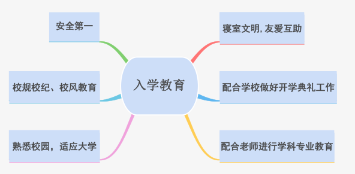

3、当前大学生的主要特点
>

4、大一新生不适应的表现
>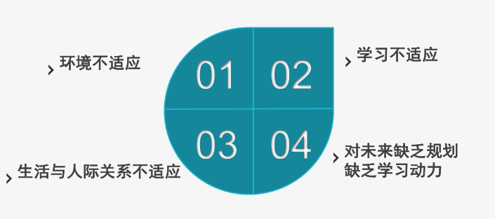

5、入学教育基本方法
>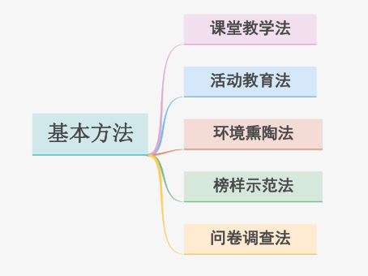

6、真题
```bash
1、如何做好入学教育
# 是什么：
# 指新生入学后，学校依据培养目标和大学特点，针对学生在思
# 想、学习、生活、心理等方面的变化和要求开展的一系列工作，是
# 大学生日常思想政治教育的一项重要环节。
# 重要性：
# 对于刚刚踏入大学校园的新生来说，面临的第一个问题就是
# 生活适应性问题。由于家庭、受教育环境、成长经历等相差很大，
# 到大学后自我认知、同学交往、自然环境等方面都面临全面的调整
# 适应。开展入学教育是大学生适应角色、生活、学习、交往、管理
# 变化的需要，新生入学教育的效果直接关系到新生能否顺利完成从
# 中学到大学的转变，关系到新生在大学期间的成长以及将来能否顺
# 利走向社会并成为社会所需人才。
# 怎么做 ：
# 辅导员要高度重视，明确入学教育主要内容，按照校院文件要求，灵活运用各种方法和途径
# 开展好入学教育，力求取得突出教育实效。
# 1. 做好准备工作： 与前辈交流学习，虚心请教，做好心理准备，学会互换角色。
# 2. 迅速了解学生： 记住名字，了解特长，少数民族，贫困生，重点留意有潜在问题的学生。
# 3. 做好服务工作：  新生报到安排，宿舍安排，军训服务，与系主任、优秀学长见面，建立朋
# 辈教育模式。院系迎新晚会，大学生活专题座谈会，各类新生入学讲座。举办新生各类比赛，中
# 秋活动，帮助新生熟悉校园，适应校园生活。
# 4. 做好管理工作： 增强新生班级凝聚力和集体荣誉感，抓好学生干部选拔和培养，充分利用
# 学生干部与学生党员两个群体的带头作用。
# 5. 做好教育工作: 包括安全、校风校纪学风、宿舍文明、学科专业教育等
# 6. 问卷调查: 了解学生的所想所需,不断改进优化工作质量

2、朴同学家住上海，在高中时成绩直名列前某，高考成绩优异，因
志愿填报失误，被录取到现在的学校。入学后，她习惯独来独往，沉
默寡言，也不愿意参加活动，多次向你提出要退学。作为辅导员，你
应该如何开导?
```
>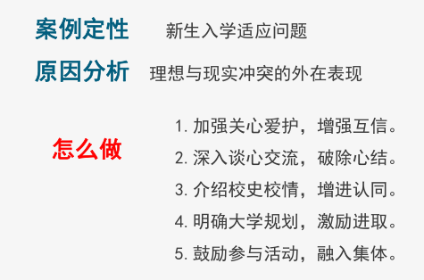

```bash
3、学生孙某，自新生军训开始，住校期间晚上和同班的另外二位学生爬围墙外出上网，事后认识态度也很差。
正式上课后该生和同班的一位同学也经常旷课外出上网，理由是：学校开的课太无聊，电脑课也不能上网。
面对这样的情况，你应该如何找孙某谈话？
```
>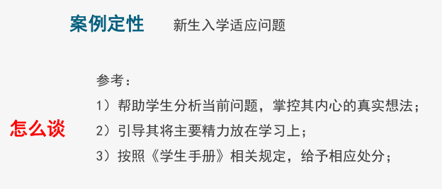
>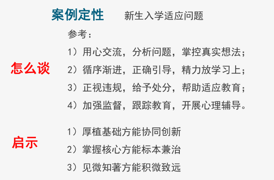

7、小结
```bash
1）选择判断鲜少，简答论述居多
2）注意关键词“新生”、“军训”、“大一”
3）掌握特点、表现及方法
```

## 九、日常事务管理_贫困生工作

**1、贫困生资助主要内容**
>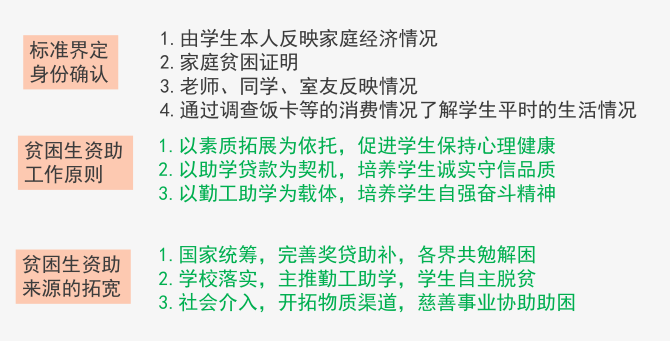

**2、贫困生工作-高频考点**
>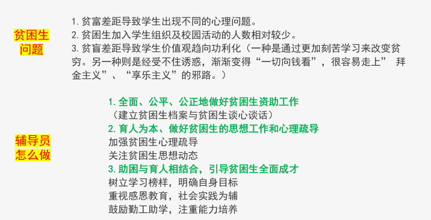

3、真题
```bash
1、辅导员如何做好"资助”与“育人”工作

# 一、全面、公平、公正地做好贫困生资助工作
# 二、育人为本、做好贫困生的思想工作和心理疏导
# (一)关注贫困生思想动态
# (二)加强贫困生心理疏导
# 三、助困与育人相结合，引导贫困生全面成才
# (一)树立学习榜样，明确自身目标
# (二)重视感恩教育，社会实践为辅
# (三)鼓励勤工助学，注重能力培养

2、大二女生张某来自农村，最近父亲去世给原本贫困的家庭雪上加霜，母亲身体患病，
无力承担学习和生活费用，该生找到辅导员想申请退学作为辅导员的你该如何与他交谈?

# 1.帮助张某树立信心，告诉她认识道路上会碰到各种困难和挫折，只要她坚定
# 信念,学校会给予力所能及的帮助; （亲切交流，帮助树立信心）
# 2.介绍学院学生资助体系。报考国家及学院自主设立两部分，含有“奖、助、
# 贷、免、补”五个方面，主要是奖励在校全日制优秀学生，资助由于家庭经济
# 困难不能正常完成学业的困难学生。符合国家及学院各种资助政策要求的学生
# 均可申请。（解决困难，介绍资助政策）
# 长期关注，助力成长成才
# 加分点:
# 1.根据学生的具体情况更有针对性地指导学生申请国家相关资助项目，更可以
# 加上一些报考高校有的资助项目，以体现你对国家和该校资助政策了解颇深且
# 运用自如。
# 2.该生家庭遭遇重大变故，萌生退学之心，经济和心理都遭到重大挫折，承受
# 较大压力，辅导员可从如何回报父母回报社会角度入手，开导学生，只有自己
# 自强了才是对父母最大的宽慰，也不辜负学校社会国家的帮助与栽培。自强不
# 息，宽慰父母报效祖国

3、黄某家庭困难，父母皆务农家庭收入低，黄某不愿意申请国家助学贷款，
觉得借钱是件不光彩的事情，帮他找了食堂清洁员的勤工助学岗位他却找到
辅导员觉得做清洁员很没面子，希望把他调到图书馆、阅览室，值班员的位
置上，这样他就能有更多的时间进行学习。（直接以资助为主题）

# 1.先与学生聊聊家庭情况与学习近况，营造轻松的聊天氛围，与学生建
# 立信任。（拉近距离，建立信任）
# 2.肯定学生重视学业，将学习放在首要位置，具有良好的学习态度。
# （重视学习，端正态度）
# 3.切入主题，了解同学对于勤工助学的认识，也跟学生聊聊勤工助学的
# 真正目的，告诉学生工作不分贵贱，靠自己的双手赚钱都是一件光荣的
# 事情，讲明助学贷款的政策。（切入主题，标本兼治）
# 4.通过别的学生的例子，帮助小黄正确理解勤工助学和学习之间的关系。
# （榜样引领，正确理解）
# 加分点:
# 国家助学贷款是国家为了帮助贫困学生能够顺利的完成学业，享有公
# 平的教育资源而出台的一项政策，许多学生都愿意通过这种方式来减轻
# 家里的负担，提前花未来的钱，毕业后再用自己的工作逐年还款，这不
# 仅不是一件不光彩的事情，反而是一件很值得钦佩的事。况且，助学贷
# 款能够帮助你在很大程度上缓解学费与生活费的压力，这样你也有更多
# 的时间来投入学习

4、军训期间，某辅导员听说本班王同学从不到食堂吃早餐，站军
姿时，她的脸色很差，几度因低血糖昏倒，通过了解发现该生是回
族，因为民族信仰坚决不到普通餐厅就餐，必须到清真餐厅吃饭，
但学校的清真餐厅并不提供早餐，而该生因家境贫寒也不舍得花钱
去超市买面包和牛奶等物充饥。如果你是辅导员，你该怎么做?（间接穿插资助工作）

# 1.先与学生聊聊家庭情况与回族的一些特点，再聊聊在学校的近况。
# 2.针对学生目前的情况，一方面要向学生表达自己和学校对回族饮
# 食习惯的尊重与理解，另一方面要鼓励学生以更开阔的心态适应新
# 环境，在不触及底线的情况下，以身体健康和学习为第一要务，
# 适当调整自己，做出改变。
# 3.向校后勤部门提出开设清真食堂早餐档口的合理建议，将后勤部
# 门的有关回应第一时间告诉学生，避免学生出现对校方的不满情绪。
# 加分项:
# (1)针对该生家境贫寒这个问题，辅导员可对该生的家庭情况做进一步
# 的了解，是否是五类特殊学生，是否提交家庭情况调查表，指导该生
# 申请助学金，并向该生介绍国家助学贷款、国家励志奖学金等各项资
# 助政策，鼓励该生树立自强精神。
# (2)对学生进行一定的心理疏导， 鼓励学生积极的融入新环境，以开
# 放的心态与同学们交流，调整自己更快融入新环境。
# (3)向学生介绍勤工助学政策，待学生正式进入学习状态后，学有余力
# 可以申请勤工助学岗位，补贴自己的生活费用。

5、马同学进入三年级后，学习成绩下滑，上课无精打采， 时常请
假甚至缺课。经辅导员了解，该生二年级时因母亲生病住院，急需
大笔费用，已超出马某家庭承受力，马某便与几个老乡注册了一家
科技公司，开始了边创业边读书的生涯。但创业的艰难花费了马某
大量的精力，但收效一般。马某认为他必须坚持下去，一是要赚钱
给母亲治病，二是创业都有一个艰难的过程，坚持就是胜利。因此，
创业与学业发生碰撞，马某很苦恼。如果你是马某辅导员，你该怎
么办？（巧妙运用资助政策答题）

# (1)了解到这些原因后，我首先找到该生，询问了具体的情况，跟他详细
# 讲解了大学生学习和创业的利于弊。创业是一个艰难的自我成才过程，
# 很少人能一次创业就成功，因此是一场攻坚战，在目前这一阶段，不易
# 操之过急，应放慢脚步，踏踏实实以学业为主走好创业之路，毕竟-个优
# 秀的学习能力和学位能够帮助你更好的打开社会大门。
# (2)向该生介绍一些大学生创新创业扶持政策，鼓励学生去参加大学生双
# 创大赛，不仅得到专业的指导还有机会获得资金支持。
# 加分项:
# 了解该生目前的家庭情况，建议该生申请国家助学贷款和国家助学金
# 等资助项目，以缓解家庭压力，鼓励学生花更多时间在学习上，便有机
# 会获得社会和高校的各类奖助学金。

6、辅导员要如何处理学生中的“贫富差距”问题？

# 贫富差距对大学生造成的心理影响:
# 1.贫官差距导致学生中出现不同的心理问题。富裕家庭的学生，由于家长过分溺爱，来到学
# 校后对新环境、新生活难以适应，以致产生学习、发展等方面的心理问题，有的由于没有经
# 济上的后顾之忧，以学生群体中的贵族身份自居，心理上的优越感、自尊心过强，只能接受
# 成功的荣誉，经不起任何挫折和失败。贫困学生力重重，焦虑不安，没有朋友，没有自信，
# 没有快乐，心理严重失衡，产生强烈的自卑感、失落感。
# 2.贫困生加入学生组织及校园活动的人数相对减少。学生参与到学生组织与校园活动里，必
# 然要增加大量的交际，这就需要具备一定的经济基础。因此， 经济条件好的学生更容易、更
# 喜欢加入到学生组织中去，交朋结友，开展社交，而贫困生自然就敬而远之。
# 3.面对贫富落差，贫困生大致有两种价值取向:一种是通过更加刻苦学习来改变贫穷，另一种
# 则是经受不住诱惑，渐渐变得“一切向钱看”,很容易走上“拜金主义”“享乐主义”的邪路。
# 同时会出现理想、 信念淡化，胸无大志。

# 辅导员应该如何做?
# I.让学生感受到社会、学校的关怀与温暖，减轻由于贫富差距过大而产生的不公平感，加大引进企业等
# 经济组织在高校设立奖助学金工作的力度。
# 2.做好世界观人生观教育，加强社会主义核心价值观体系建设: 通过加强爱国主义、社会主义、集体主
# 义的三观教育，引导他们正确认识社会发展规律，坚决抵制拜金、享乐主义。
# 3.加强艰苦奋斗精神教育，引导大学生树立正确的贫富观和消费观。引导学生认识艰苦奋斗精神是中华
# 民族的优良传统，要继承和发扬这种精神，要引导学生把宝贵青春用在学习文化知识上，把家长的血汗
# 钱用在正当、有益的学习消费上。
# 4.加强大学生心理健康教育。
# 5.关注学生组织的构成，为贫困生提供一定的舞台和空间。
# 6.丰富校园文化，营造团结友爱、奋发向上的校园氛围。

```

## 十、日常事务管理_国家资助体系

**1、资助概述**
>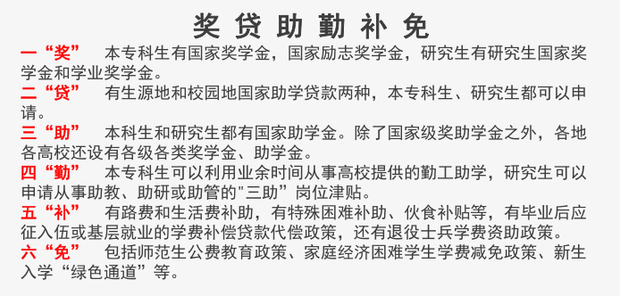

**考题**
>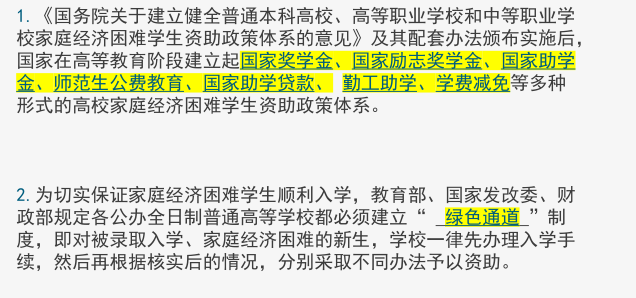

**3、国家奖学金**
>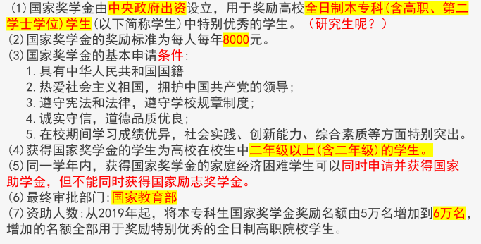

**考题**
```bash
对于国家助学金、国家奖学金和国家励志奖学金，同一学年
内下列说法正确的是( )
A学生可同时申请国家助学金、国家奖学金
B学生可同时申请国家助学金、国家励志奖学金
C学生可同时申请国家奖学金和国家励志奖学金
D学生可同时申请国家助学金、国家奖学金和国家励志奖学金

国家奖学金奖励对象是谁? ( )
A.高校全日制本专科(含高职、第二学士学位)学生(以下简称学生)中特别
优秀的在校生中一年级以上(含一年级)的学生
B.高校全日制本专科(不含高职、第二学士学位)学生(以下简称学生)中特
别优秀的在校生中二年级以上(含二年级)的学生
C.高校全日制本专科(含高职、不含第二学士学位)学生(以下简称学生)中
特别优秀的在校生中二年级以上 (含二年级)的学生
D.高校全日制本专科(含高职、第二学士学位)学生(以下简称学生)中特别
优秀的在校生中二年级以上(含二年级)的学生
````

**4、国家励志奖学金**
```bash
(1) 为了激励普通本科高校、高等职业学校和高等专科学校的家庭经济困难学生勤奋
学习、努力进取，在德、智、体、美等方面全面发展，由中央和地方政府共同出资设
立的，奖励资助品学兼优的家庭经济困难学生的奖学金。
中央部门所属高校国家励志奖学金所需资金由中央财政负担。地方所属高校国家励志
奖学金所需资金根据各地财力及生源状况由中央与地方财政按比例分担。
(2)国家励志奖学金的奖励标准为每人每年5000元。资助覆盖面本科生3%，高职学生
3.3% (原为3%，自2019年起提高10%)
(3)国家励志奖学金的基本申请条件:
1.热爱社会主义祖国，拥护中国共产党的领导;
2.遵守宪法和法律，遵守学校规章制度;
3.诚实守信，道德品质优良;
4.在校期间学习成绩优秀;
5.家庭经济困难;
6.社会能力，工作能力较强，有一定的群众基础;
7.无其他不良嗜好和不适合该荣誉称号的表现。

(4)国家励志奖学金用于奖励资助高校全日制本专科(含高职、第二学士
学位)学生(以下简称学生)中品学兼优的家庭经济困难，且二年级以上
(含二年级)的学生。
(5)同学年内，申请国家励志奖学金的学生可以同时申请并获得国家助
学金，但不能同时获得国家奖学金。
(6)试行公费教育的教育部直属师范院校师范类专业学生不再同时获得
国家励志奖学金。
(7)最终审批部门:中央高校评审结果报中央主管部门，地方高校评审结
果逐级报至省级教育部门。

考题
1.判断题:国家励志奖学金是由中央出资设立。( )
2.国家每年下达的国家励志奖学金指标是在校生总人数的（ ）
```

**4、国家助学金**
```bash
(1）国家助学金用于资助高校全日制本专科(含高职、第二学士学
位)在校生中的家庭经济困难学生。国家助学金由中央和地方政府
共同出资设立。中央部门所属高校国家助学金所需资金由中央财
政负担。地方所属高校国家助学金所需资金根据各地财力及生源
状况由中央与地方财政按比例分担。
(2)国家助学金主要资助家庭经济困难学生的生活费用开支。国家
助学金的平均资助标准为每生每年3300元，具体标准在每生每年
2000-4000元范围内确定，可以分为2-3档；资助面：本科生20%，
高职院校22%
(3)国家助学金的基本申请条件:
1.热爱社会主义祖国，拥护中国共产党的领导;
2.遵守宪法和法律，遵守学校规章制度;
3.诚实守信，道德品质优良;
4.勤奋学习，积极上进;
5.家庭经济困难，生活俭朴。
(4)在同一学年内，申请并获得国家助学金的学生，可同时申请共
获得国家奖学金或国家励志奖学金。
(5)试行公费教育的教育部直属师范院校师范类专业学生，不再同
时获得国家助字金。
(6)高校应按月将国家助学金发放到受助学生手中。（10个月，
330元/月）

考题1.国家助学的基本申请条件?
A热爱社会主义祖国，拥护中国共产党的领导:
B遵守宪法和法律，遵守学校规章制度:
C诚实守信，道德品质优良;
D勤奋学习，积极上进;
E家庭经济困难，生活俭朴。
考题2.国家每年下达的国家助学金指标分别是在校生总人数的（）
```

**5、助学贷款**
```bash
(1)家庭经济困难学生可申请办理国家助学贷款，解决学费与住宿费，
本科生每人每年最高不超过8000元。研究生每人每年最高不超过
12000元。国家助学贷款包括生源地信用助学贷款与校园地国家助学
贷款。
(2)生源地信用助学贷款需要共同借贷人，由双方共同还款。而校园
地国家助学贷款无需共同借贷人，是以个人名义申请的，还款人是
本人。
(3)全日制普通本专科学生在同一学年内不得重复申请获得校园地国
家助学贷款和生源地信用助学贷款，只能选择申请办理其中一种贷
款。全日制研究生原则上申请办理校园地国家助学贷款。
(4) 最长还款期限:学制+13年，最长不超过20年
(5)还本宽限期: 3年。借款学生毕业当年不再继续攻读学位的，与
经办机构和经办银行确认还款计划时，可选择使用还本宽限期。还
本宽限期内借款学生只需偿还利息，无需偿还贷款本金。还本宽限
期从还款计划确认开始，计算至借款学生毕业后第36个月底。在还
款期内继续攻读学位的借款学生再读学位毕业后，仍可享受36个月
的还本宽限期。
(6)全日制普通本专科学生国家助学贷款全国平均资助比例应与当年
国家助学金资助比例相当，各地区、各高校资助比例应与本地区、
本高校当年国家助学金资助比例相当。全日制研究生国家助学贷款
资助比例根据国家奖学金、学业奖学金等奖助政策覆盖范围和家庭
经济困难学生情况确定。

考题1.以下关于高校助学贷款表述正确的是( )
A、没有开展生源地信用助学贷款省份学生可以申请高校
助学贷款
B、高校助学贷款最高申请金额是8000元
C、高校助学贷款需要提供共同借款人
D、高校助学贷款无需共同借款人和担保人
```

**6、学费代偿、国家助学贷款代偿**
```bash
高等学校学生应征入伍服义务兵役学费补偿、国家助学贷款代偿及学费减免的
标准
●高校学生应征入伍服义务兵役国家资助资金，全部由中央财政安排
●学费补偿、国家助学贷款代偿及学费减免标准，本专科生每人每年最高不超
过8000元，研究生每人每年最高不超过12000元。

高等学校毕业生赴基层单位就业学费补偿国家助学贷款代偿标准，以及退役士兵学费资助标准
● 高校毕业生到中西部地区和艰苦边远地区基层单位就业、服务期在3年以上(含3年)的，其学
费由国家实行代偿。在校学习期间获得国家助学贷款(含高校国家助学贷款和生源地信用助学贷
款，下同)的，代偿的学费优先用于偿还国家助学贷款本金及其全部偿还之前产生的利息。
●学费和国家助学贷款代偿所需资金，由中央财政安排
●学费补偿、国家助学贷款代偿及学费减免标准，本专科生每人每年最高不超过8000元，研究
生每人每年最高不超过12000元。
●国家对到中西部地区和艰苦边远地区基层单位就业的获得学费和国家助学贷款代偿资格的高
校毕业生采取分年度代偿的办法，学生毕业后每年代偿学费或国家助学贷款总额的1/3, 3年代
偿完毕。

考题1.下列选项中，哪一个不属于毕业生应征入伍服
义务兵役享受的优惠政策?
A、优先报名应征、优先政审、优先审批
B、优先选拔
C、补偿学费或代偿国家助学贷款
D、优先推荐上高一层次学校
```

**7、勤工助学**
```bash
●勤工助学活动必须坚持“立足校园、服务社会”的宗旨，按照学有余力、
自愿申请、信息公开、扶困优先、竞争上岗、遵纪守法的原则，由学校在
不影响正常教学秩序和学生正常学习的前提下有组织地开展。
●学生参加勤工助学不应当影响学业，原则上每周不超过8小时，每月不
超过40小时。
●学生参加校内固定岗位的勤工助学，其劳动报酬由学校按月计算。每月
40个工时的酬金原则上不低于当地政府或有关部制定的最低工资标准或居
民最低生活保障标准，可以适当上下浮动。学生参加校内临时岗位的勤工
助学，其劳动报酬由学校按小时计算。每小时酬金原则上不低于8元人民
币。学生参加校外勤工助学的酬金标准不低于学校所在地政府或有关部门
规定的最低工资标准，具体数额由用人单位、学校与学生协商确定，并写
进聘用协议。

考题1.在高校学生资助体系中，家庭经济困难学生-般可通过以下哪项
解决学费、住宿费问
题?
A国家助学贷款和国家励志奖学金 B国家助学贷款和国家奖学金
C国家助学贷款和国家助学金 D国家助学贷款和国家奖助学金
考题2.在高校学生资助体系中，家庭经济困难学生-般可通过以下哪项
解决生活费问题?
A国家助学金和勤工助学 B国家励志奖学金和勤工助学
C国家奖学金和勤工助学 D国家奖助学金和勤工助学
```

**8、学费减免**
```bash
师范生公费教育政策
●师范生公费教育是指国家在北京师范大学、华东师范大学、东北师范大学、华中师范大学、
陕西师范大学和西南大学六所教育部直属师范大学(以下简称部属师范大学)面向师范专业本
科生实行的，由中央财政承担其在校期间学费、住宿费并给予生活费补助的培养管理制度。
●公费师范生毕业后一般回生源所在省份中小学任教，并承诺从事中小学教育工作6年以上
(原为10年)。到城镇学校工作的公费师范生，应到农村义务教育学校任教服务至少1年(原为
2年)国家鼓励公费师范生长期从教、终身从教。
●优惠政策:一是的事业编制省内统筹调剂使用制度有关要求，通过优先利用空编接收等办
法，在现有事业编制总量内，由中央财政承担公费师范生在校学习期间的学费、住宿费和生
活费补助;二是按照建立“动态调整、周转使用”妥善解决公费师范生到中小学任教所需编
制。;三是公费师范生在协议规定服务期内，经省级教育行政部门同意，可在学校间流动或
从事教育管理工作;四是公费师范生按协议履约任教满。可以免试攻读非全日制教育硕士专
业学位。

家庭经济困难学生学费减免政策
●国家对公办全日制普通高校中部分确因经济条件所限，交纳学费有困难的学生，特别是其中的
孤残学生、少数民族学生及烈士子女、优抚家庭子女等，实行减免学费政策。其中在校月收入(包
括各种奖学金和各种补贴)已低于学校所在地区居民的平均最低生活水准线，学习和生活经济条件
特别困难的学生免收全部学费；对其它一般困难的学生可适当减收部分学费。具体减免办法由省
级教育、物价、财政部门制定。
“ 绿色通道 ”是确保普通高校家庭经济困难新生顺利入学的最直接、最有效的措施
●“绿色通道”是近年来为切实确保即对被录取入学、经济困难的新生，经审核对经济困难无法
缴纳学杂费用的，批准暂缓缴纳学杂费，先进入学校学习，然后学校帮助这部分学生通过申清国
家助学贷款、勤工助学等方式来解决经济困难的教育部规定各公办普通高等学校都必须建立的一
种制度。

考题1.家庭经济困难学生考入大学，可通过学校的什么渠道按时报道?
A绿色通道
B助学贷款
C学费减免
D奖助学金
```

**9、总结**
```bash
）选择填空处处是陷阱，细心检查找差别
2）掌握核心，列出对比表格
```
>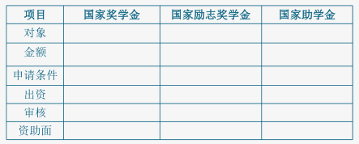

## 十一、奖助学金的区别

>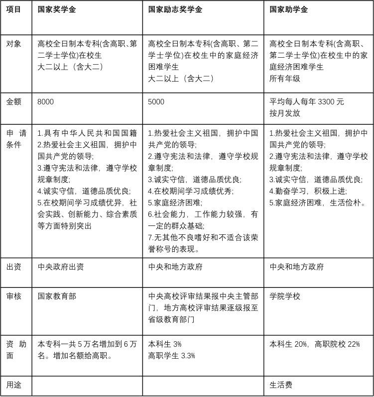
>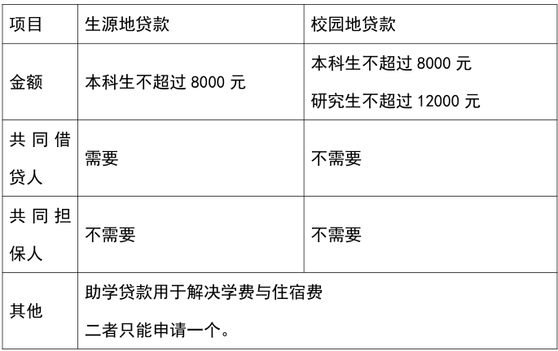


