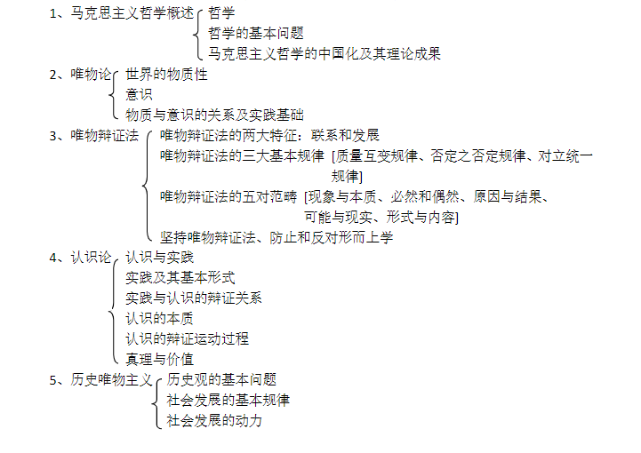

>subjects：radio/单选、checkbox/多选、indefinite options/不定选项、pratice/实务、discourse/论述、brief analysis/简析、writing/写作、case study/案例分析、comprehensive analysis/综合分析、materials analysis/材料分析

### Points

* Principles of Marxist Philosophy `1、马克思主义哲学原理`
* Introduction to Mao Zedong Thought `2、毛泽东思想概论`
* Theoretical system of socialism with Chinese characteristics `3、中国特色社会主义理论体系`
* Government and politics in contemporary China `4、当代中国的政府与政治`
* Professional ethics of state organ staff `5、国家机关工作人员职业道德`
* Legal knowledge  `6、法律知识`
* Basic Chinese and official document Writing  `7、语文基础与公文写作部分`
* Economic knowledge and technological knowledge  `8、经济知识与科技知识`

# 第一篇 政治常识

## Chapter_1  `Principles of Marxist Philosophy`
>马克思主义哲学原理

<a href="#section-1-overview-of-marxist-philosophy">1  Overview of Marxist Philosophy `马克思主义哲学概述`</a><br>
<a href="#section-2-materialism">2 Materialism `唯物论`</a><br>
<a href="#section-3-materialism-dialectics">3 Materialism Dialectics`唯物辩证法`</a><br>
<a href="#section-4-epistemology">4 Epistemology`认识论`</a><br>
<a href="#section-5-historical-materialism">5 Historical Materialism`历史唯物主义`</a><br>
>

### Section_1 Overview of Marxist Philosophy 

#### 一、哲学
```bash
1. 哲学：
        是理论化、系统化的世界观；
        是`世界观`和`方法论`的统一；
        是自然知识、社会知识、思维知识的概括、总结；
2. 与具体科学，是`共性`与`个性`，`一般`与`特性`的关系；
   `具体科学`，是哲学的基础；
   哲学，随其他科学的发展而发展；
   哲学，给具体科学以世界观、方法论的指导，使之相互作用、相互促进

# keywords: 
# 1. theorization/theoretical, systematization/systematic, world view, methodology,
# 2. natural knowledge, social knowledge, thinking knowledge
# 3. specific science, commonality, personality, generality, charateristics
```

#### 二、哲学的基本问题
```bash
1.物质和意识的问题
  1️⃣ 谁为第一性 => 划分`唯物主义`、`唯心主义`的唯一标准。哲学两大派别的根本区别。
  2️⃣ 有无统一性 => 划分可知论、不可知论的标准。
                   `可知论`：一切的唯物主义 & 彻底的唯物主义
                   `不可知论`：本质上是唯心主义的一种表现
2.唯物主义和唯心主义、可知论和不可知论
  1️⃣ 唯心主义的基本类型：主观唯心主义 & 可观唯心主义

                                            区    别
        =---------------------------------------=---------------------------------=
         `主观唯心主义`                            `客观唯心主义`                  
        =---------------------------------------=---------------------------------=
         `人的精神`是世界的本源；                   `客观精神`是世界的本源；         
         如感觉、经验、心灵、意识、观念、意志；     某种客观精神或原则先于物质世界；  
         世界上的一切事物由此派生                  并独立于物质世界而存在；          
         极端主张`唯我论`。                        物质世界是这种客观精神的外化或表现。
        =---------------------------------------=---------------------------------=
         万物皆备于我；吾心即宇宙；                 事在理先；谋事在人，成事在天；
         存在就是被感知；人是万物的尺度。           上帝创造世界；
                                                   理论是事物存在的根据和模仿的原型。
        =---------------------------------------=---------------------------------=
  
  2️⃣ 唯物主义的历史形态
      三种形态：
              `古代朴素`唯物主义；
              `形而上学`唯物主义=机械唯物主义：机械性、形而上学、不彻底
              `现代`唯物主义：`辩证`唯物主义、`历史`唯物主义
3.马克思主义哲学
  1️⃣ 产生条件
      `社会历史条件`：资本主义经济高速发展、资本主义社会矛盾充分暴露；
      `阶级基础`：无产阶级与资产阶级矛盾上升为主要矛盾，无产阶级作为独立的政治力量登上历史舞台；
      `自然科学`：19世纪自然科学三大发现 —— 细胞学说、能量守恒与转化定律、生物进化论；
      `直接理论来源`：19世纪德国古典哲学，黑格尔的辩证法哲学，费尔巴哈的唯物主义哲学。
  2️⃣ 基本特征
      √（1）`第一次在实践的基础上实现了唯物主义和辩证法的统一；唯物主义的辩证法、辩证的唯物主义`
      √（2）`第一次实现了唯物主义的自然观和历史观的统一；将唯物辩证观念贯穿到社会历史领域；`
      √（3）`实现了实践基础上的科学性和革命性的统一；由它的实践性决定的、阶级性要求的。`
           科学性：坚持科学的实践观，全部理论来自实践又经过实践的反复检验。
           革命性：改变世界的科学，指导人类解放的科学，无产阶级革命的思想体系。
  3️⃣ 其他
      马克思主义`最根本的理论特征`：辩证唯物主义&历史唯物主义的世界观、方法论；
      马克思主义哲学`首要的基本观点`：实践的观点 —— 认识和改造世界的强大思想武器；
      马克思主义哲学区别于其他科学的`最主要最根本的特征`：实践性。

# keywords:
# substance/matter, awareness/consciousness, agnosticism
# materialism, idealism, subjective, objective
# Ancient Naive Materialism, metaphysics, dialectical materialism
# proletariat, bourgeosie, contradiction
# scientificity, revolutionary
```

#### 三、马克思主义哲学的中国化及其理论成功
```bash
第一成果，毛泽东思想；
第二成果，邓小平理论；
最新成果，中国特色社会主义理论体系。

# keywords:
# sinicication, Mao Zedong Thought, Deng Xiaoping Theory
# The theoretical system of socialism whith Chinese characteristics
```

### Section_2 Materialism 

#### 一、世界的物质性
```bash
1.物质的客观实在性
  1️⃣ 马克思主义的物质观
      `客观实在性，是物质的唯一特性。`
  2️⃣ 马克思主义物质观的理论意义
      坚持物质的`客观实在性`原则，坚持`唯物主义一元论`，同唯心主义一元论、二元论划清界限；
      坚持能动的`反映论`和`可知论`，批判不可知论；
      体现`唯物主义自然观`和`唯物主义历史观`的统一，为彻底的唯物主义奠定基础。
  3️⃣ 世界的物质统一性
      世界的本质是，物质、自然界、人类社会都是物质的，世界的真正统一性，在于它的物质性。
      （1）世界的物质统一性原理
        √ `世界是物质的，物质是运动的。`
          运动，是物质存在的方式和根本属性；
          运动，是标志一切事物和现象的变化及其过程的哲学范畴；
          不运动的物质 —— 导致形而上学；
          无物质的运动 —— 导致唯心主义。
        √ `运动是绝对的，静止是相对的。`
          静止，包括空间位置和根本性质暂时未变这两种运动的特殊状态；
          运动的绝对性，体现了物质运动的变动性、无条件性；
          静止的相对性，体现了物质运动的稳定性、有条件性。
        √ `时间和空间是物质运动的存在方式`
          时间，指物质运动的持续性、顺序性，特点是一维性；
          空间，指物质运动的广延性、伸张性，特点是三维性。
      （2）社会的物质性表现
          人类社会依赖于自然界，是整个物质世界的组成部分；
          人类活动是以物质力量改造物质力量的活动，是物质性的活动；
          物质资料的生存方式，是人类社会存在和发展的基础，集中体现这人类社会的物质性。 
2.辩证唯物主义的实践观
  1️⃣ 实践的形式、特点
      实践，是人以一定的手段能动地改造和探索客观世界的一切社会性的对象活动；
      基本形式：生成实践、调控社会关系实践、科学实验；
      特点：直接现实性、自觉能动性、社会历史性。
  2️⃣ 人对物质世界的实践把握
      （1）主体与客体
           主体，指处于一定社会关系中，从事实践认识活动的人；
           客体，指人的认识实践活动所指向的对象。
      （2）实践，是人与世界相互作用的中介
           相互作用通过改造与被改造，即主体对象化（主体客体化）、
           客体非对象化（客体主体化）的双向互动。

# keywords:
# material view, agnosticism, dialectical materialism
```

#### 二、意识
```bash
1. 意识的起源
   1️⃣ 是物质世界高度发展的产物，产生的四个决定性环节：
      >无生命物质的反应特征 => 低等动物的刺激感应性 => 动物的感应和心理 => 人类意识的产生
   2️⃣ 是社会的产物，社会性劳动活动 —— 意识产生过程中起决定性作用
2. 意识的本质
   1️⃣ 意识，是人脑的机能
      人脑是意识的物质基础，意识是人脑的机能和产物。
   2️⃣ 意识，是客观世界的主观印象
      （1）意识的内容，是客观的。
           不论思想正确与否，都是对外部世界某种形式的反应。
           >恩格斯：一切观念都来自经验，都是现实的反应 —— 正确或歪曲的反应。
      （2）意识的形式，是主观的。
3. 意识的能动作用
   1️⃣ 意识的能动作用，指人们在实践的基础上能动地认识、改造世界的能力和作用。
   2️⃣ 表现：
      （1）意识活动的`目的性、计划性` —— 人与动物区别的根本特征之一；
      （2）意识活动，是一个`能动创造性`的过程。
           反应事物的`外部现象`，由`感性认识`上升到`理想认识`，从`现象`深入到`本质`和`规律`。
           复制当前现象，能够追溯过去、预测未来。
           能动的`反应现实`，能动的`指导实践`，通过实践转化为现实。
      （3）意识，对客观世界的改造作用。`人的意识具有目的性、计划性`。
      （4）意识，对人体生理机能活动的控制。

# keywords:
# consciouness/awareness/sence, perceptual knowledge, rational knowledge
```

#### 三、物质与意识的关系及实践基础
```bash
1. 物质与意识，是辩证统一的。
   1️⃣ `物质，对意识具有决定性作用`。
      物质决定意识，意识是对物质的反映。
   2️⃣ `意识，对物质具有能动作用`。
      首先，意识能够正确地反映客观事物；
      其实，意识能反作用于客观事物；
      正确的意识指导人们有效开展实践活动，促进客观事物的发展；
      错误的意识把人的活动引向歧途，阻碍客观事物的发展。
2. 二者辩证关系的方法论意义。
   决定了我们要坚持一切从实际出发，使主观符合客观；
   坚持主观和客观具体的历史统一；
   同时反对教条主义、经验主义。
```

### Section_3 Materialism Dialectics

#### 一、唯物辩证法的两大特征
```bash
1. 世界的普遍联系
   1️⃣ 联系
      联系，指事物之间以及事物内部诸要素之间的相互影响、相互作用和相互制约的关系。
      `特征：普遍性、客观性、条件性、多样性、系统性`。
      世界的普遍联系，是世界物质统一性的内在体现。
   2️⃣ 系统
      系统，指相互联系、相互作用的若干要素构成的具有`稳定结构`和`特定功能`的有机整体。
     ` 特征：整体性、结构性、层次性、开放性。（整体性，最基本特征、本质属性）`
      整体的功能和效益，是认识、解决问题的出发点和归宿。
      整体性观点要求：观察处理问题时着眼有机整体，在总览全局的前提下，
                     认识处理好局部问题，从而实现系统的最佳功能。
2. 世界的永恒发展
   发展的观点，是唯物辩证法的又一基本观点和总特征。
   1️⃣ 发展的含义和实质
      发展，揭示事物运动、变化的`整体趋势和方向`的范畴，
            是具有`前进`性质的运动。
            是事物由`低级`向`高级`、由`简单`到`复杂`、由`无序`向`有序`的`上升运动`。
      实质：`新事物的产生，旧事物的灭亡`。
           新事物，指合乎事物发展规律、具有远大前途的事物；
           旧事物，指事物在发展过程中逐渐丧失其存在必然性的、日趋灭亡的事物；
           根本区别：是否同事物发展的必然趋势相符合。
   2️⃣ 用发展的观点看问题
      如实地把事物看成一个，变化发展的过程；
      明确事物在`变化发展`过程中所处的阶段和地位；
      坚持`与时俱进`，培养创新精神，促进新生事物的成长。
         创新包括：`理论创新，体质创新，科技创新`等。
         在科学理论的基础上，创造前所未有的`新原理、新方法、新体制、新科技`。

# keywords:
# keep up with the times                 
```

#### 二、唯物辩证法的三大基本规律
```bash
1. `质量互变规律` —— 揭示了事物发展的`形式`、`状态`
   质变、量变，是事物变化发展的两种基本形态。
   1️⃣ `量变`， 是事物存在和发展在`数量`上、`程度`上`逐渐的`、`不显著的`变化；
       `质变`，是事物`根本性的变化`。
   2️⃣ 二者的辩证关系：
       `量变`，是质变的`前提`和`必要`准备；
       量变，发展到一定程度，必然引起质变。
   3️⃣ `量变质变互相转化规律`
       事物的发展状态按照：
       量变=>质变=>新的量变=>新的质变 <=> 循环往复，由低到高，由简到繁，永不停息。
   4️⃣ `方法论的意义`
      （1）`坚持适度原则`
           度，是质和量的统一；
               是事物保持自己质的稳定性及量的范围、幅度、限度；
           事物的度，有其关节点（关节点，指事物度的上限和下限），
           认识度，才能确切把握事物的质。
      （2）`不失时机地促进事物的飞跃`
      （3）`重视量的积累`
           质量互变规律，揭示了事物发展过程是`连续性（量变）`和`阶段性（质变）`的统一；
           `不断革命论`和`革命发展阶段论`相统一，`最高纲领`与`最低纲领`相统一的`哲学依据`；
           对正确处理社会主义革命、发展、稳定的关系，具有指导意义。

2. `否定之否定规律` —— 揭示了事物发展的`方向`、`道路`
   1️⃣ 肯定、否定，及其辩证关系
       `任何事物都包含肯定、否定两个方面`；
       肯定方面，是事物保持自身存在和稳定性的方面；
       否定方面，是事物否定自身存在，促使自我否定和质变的方面

       辩证关系：`对立统一`。
                肯定中包含否定，在一定意义上肯定就是否定；
                否定包含肯定，在一定意义上否定就是肯定。
   2️⃣ `辩证的否定观`
       是事物的自我否定，是发展和联系环节的统一；
       `实质`是，`扬弃`：
               是继承和发扬旧事物内部积极的、合理的因素；
               是抛弃和否定旧事物内部消极的、丧失必然性的因素；
               是发展和抛弃的统一，是既克服又统一。
       `形而上学`的立场和方式：`否定一切`、`全盘抛弃`。
   3️⃣ 辩证的否定观的方法论意义
       `既是世界观，又是方法论，是观察和分析一切问题的方法论原则。`
       （1）是我们坚信新生事物不可战胜的哲学依据
            `新事物必然战胜旧事物`，是由`事物发展`的`辩证本性`和`新旧事物`的`本质特点`决定的。
            a. 事物都是肯定方面和否定方面的统一体，代表着否定方面的新生事物是旧事物不可缺少的因素；
            b. 新生事物，代表着事物的发展方向，具有强大的生命力和远大的发展前途，
               旧事物，则是丧失其存在的必然性、日趋灭亡的事物；
            c. 新生事物，实在旧事物的母腹中生长的，吸收了旧事物的优点，又克服了它的缺点，
               并增加了旧事物所容纳不了的新内容，因而具有无比的优越性；
            d. 社会领域中，新生事物，代表历史发展的方向，符合人民的根本利益，故能得到广大人民的拥护。
       （2）对一切事物采取科学的分析态度和方法
            要在肯定中看到否定，否定中看到肯定，不能肯定一切或否定一切。
   4️⃣ `否定之否定`
       事物运动的总体辩证过程：`肯定=>否定=>否定的否定`
       经历了两次否定，三个阶段，是一个周期性过程；一个“仿佛回到原来出发点的过程”
       第三个阶段的“否定之否定”和第一阶段的“肯定”有着现象上的相似，但不是第一阶段的重复，而是更高阶段的发展形态。——为进一步发展开辟了新方向、新道路。
       是一种`螺旋式的上升`，或`波浪式的前进`。
       =>表明，事物的发展是前进性和曲折性的统一，总趋势是前进的、道路是曲折的、在曲折中前进。
   5️⃣ 事物发展`前进性`和`曲折性`的统一
       发展方向上，事物发展的总趋势是`前进的`；
       发展道路上，事物的发展总是`迂回曲折的`（曲折性是事物发展过程中的限制特征）；
       `事物发展的周期性`，体现了前进行和曲折性的统一；
       反对两种`形而上学`的观点：`循环论、直线论`。
   6️⃣ 事物发展趋势原理的方法论意义
       （1）正确对待社会主义建设事业中遇到的问题；
       （2）正确对待自己的人生，提高应对挫折的心理承受能力。

3. `对立统一规律` —— 揭示了事物运动和发展的`源泉`、`动力`
   1️⃣ 矛盾的含义
       矛盾，是事物自身既对立又统一的关系；
       （1）矛盾的两个基本属性 —— 同一性、斗争性
            ◼ `同一性`：
               矛盾双方，在一定条件下，相互依存，一方的存在以另一方的存在为前提，双方共处于一个矛盾体中；
               矛盾双方，依据一定的条件，各向自己相反的方向发展。
            ◼ `斗争性`：
               矛盾双方，互相排斥，相互分离。
            ◼ 关系：
               a. 同一性，是相对的，其存在是有条件的、暂时的；
               b. 斗争性，是绝对的，其存在是无条件的、永恒的；
               c. 在对立中把握统一，在统一中把握对立。
            ◼ 在事物发展中的作用：
               `矛盾，是新事物产生、旧事物灭亡的内在根据。`
               a. 矛盾的同一性和斗争性相结合，推动事物的发展；
                  矛盾的同一性，
                  使事物的对立面`相互依存`，在相互依存的统一体中存在和发展；
                  使对事物的对立面`相互作用`，相互汲取有利于自身的因素，在相互促进中各自得到发展；
                  使事物的对立面`相互贯通`，规定事物发展的基本趋势——向自己的对立面转化。
                  矛盾的斗争性，
                  贯穿于事物发展的量变、质变之中。
               b. 事物发展的内因和外因。
                  事物的发展，离不开内部矛盾（内因），也离不开外部矛盾（外因）；
                  事物的发展，是内外因共同作用的结果；
                  `内因，是变化的根据，外因，是变化的条件。`
   2️⃣ 矛盾的普遍性和特殊性
       ◼ `普遍性`，指矛盾存在于一切事物的发展过程中，每一事物的发展过程都存在于自始至终的矛盾运动；
          方法论的意义：
                     a. 敢于承认矛盾，揭露矛盾
                     b. 善于分析矛盾，解决矛盾
       ◼ `特殊性`，指具体事物在其运动中的矛盾及每一矛盾的各方面都有其特点。
          方法论的意义，具体问题具体分析 
          √ `具体问题具体分析`的内涵
            含义：在矛盾普遍性原理指导下，具体分析矛盾的特殊性，并找出解决矛盾的正确方法。
            地位：`马克思主义重要原则、活的灵魂`，我们工作的基本方法。
            意义：人们正确认识事物的基础，正确解决矛盾的关键
            方法论：与`一切从实际出发`的方法论并用；
            >注意：坚持它，就必须反对“一刀切”、“一哄而起”
       ◼ 普遍性和特殊性的关系
          1）相互区别：
                    矛盾的普遍性，是事物的共性，是无条件的、绝对的；
                    矛盾的特殊性，是事物的个性，是有条件的、相对的；
                    共性比个性深刻，个性比共性丰富。
          2）相互联系：
                    任何事物都是`共性`和`个性`的统一；
                    `普遍性`寓于`特殊性`中，通过特殊性表现出来，没有特殊性就没有普遍性；
                    特殊性离不开普遍性，在特殊的事物都包含着普遍性。
                    在一定条件下，二者可以相互转化。
   3️⃣ 矛盾的不平衡性
       指构成事物的多种矛盾，以及每一矛盾的各个方面，在事物发展中的地位和作用是不同的
       有主要矛盾、次要矛盾，及矛盾的主要方面和次要方面
       （1）`主要矛盾和次要矛盾`
            主要矛盾，在一个矛盾体系中，居支配地位，对事物的发展过程起决定性作用的矛盾
            次要矛盾，对主要矛盾有影响，次要矛盾处理得好，有利于解决主要矛盾
            在一定条件下，二者可以相互转化。
       （2）`矛盾的主要方面和次要方面`
            矛盾的主要方面，指主要矛盾/次要矛盾中，其对立双方中处于支配地位、起主导作用；
            矛盾的次要方面，指处于被支配地位、不起主导作用的一方。
            关系：
               矛盾的主要方面，决定事物的性质；
               次要方面，对矛盾总体的变化、发展有不可忽视的影响作用；
               二者可相互转化。
   4️⃣ 矛盾的方法论意义——两点论和重点论相结合
       两点论，就是要同时看到主要矛盾和次要矛盾，矛盾的主要方面和次要方面的辩证关系；
       重点论，就是要看到两方面的同时，分清主次，抓住矛盾的主要矛盾和主要方面。（事物的性质，是由主要矛盾的主要方面决定的）
       反对，均衡论和一点论。
   5️⃣ `对立统一规律——是唯物辩证法的实质和核心`
       揭示了普遍联系的根本内容，及变化发展的内心动因；
       是贯穿于其他规律、范畴的中心线索；
       矛盾分析法，是最根本的认识方法；
       体现了辩证法和形而上学的根本分歧。

# keywords:
# contradiction, discipline/law , the law of unity of opposites
```

#### 三、唯物辩证法的五对范畴
```bash
1. 现象和本质
   是揭示客观事物`外部表现`和`内在联系`相互关系的一对范畴。
   1️⃣ 区别和对立
       a. `现象`，有真象和假象。
                `真象`，从正面表现`本质`的现象；
                `假象`，从反面歪曲体现事物本质的现象：≠标志主观反映范畴的`错觉`
       b. `本质`，是事物的`根本性质`和事物`基本要素`的内在联系。
          现象，是事物的外部联系和表面特征。
       c. 区别：
         ------------------------------------------
          `现象`                 `本质`
         ------------------------------------------
          个别的、片面的       同类现象的共性
         ------------------------------------------
          多变的、易逝的       相对稳定的
         ------------------------------------------
          表现于外，表面的，   深藏于内，深刻的，
          感官可直接感知的     靠理性思维把握的
         ------------------------------------------
          丰富多样的           单纯的
         ------------------------------------------

   2️⃣ 辩证统一
       本质，是现象的根据，决定现象，总要通过现象来表现；
       现象，总是表现着本质，没有不表现本质的现象；
       `一切事物，都是现象和本质的统一`。
2. 必然和偶然
   揭示和反映事物变化发展的`确定趋势`和`不确定趋势`之间的关系的一对哲学范畴。
   1️⃣ 含义
       ◼ `必然性`, 指客观事物联系和发展过程中合乎规律、一定要发生的、确定不移的趋势；
                  产生于事物内部的`主要矛盾`、`根本矛盾`，居`支配地位`，决定事物发展的前途方向。          
       ◼ `偶然性`, 客观事物联系发展过程中，不一定要发生、可以这样出现，也可以那样出现的不确定趋势；
                  产生于事物`次要的`、`外部的`原因，居`从属地位`；
                  对事物发展的必然过程起促进或延作用，使事物的趋势具有这样或那样的特点和偏差。
   2️⃣ 关系
      ---------------------------------------------------------------------------
       不同          必然性                        偶然性
      ---------------------------------------------------------------------------  
       产生原因      产生于事物内部的根本矛盾       产生于非根本毛肚和外部条件
      ---------------------------------------------------------------------------
       表现形式      比较稳定，时空上较确定，       不稳定的、暂时的、不确定的，
                     是同类事物普遍具有的趋势       事物发展中的个别表现
      ---------------------------------------------------------------------------              
       在事物发展中  支配地位，决定事物发展的方向   从属地位，起促进或延缓作用，
       的地位作用                                  使发展确定趋势带有一点特点和偏差
      ----------------------------------------------------------------------------

      联系：
         `必然性`，存在于偶然性之中，通过大量偶然性表现出来，为自己开辟道路；
         `偶然性`，背后隐藏着必然性，受必然性支配，是必然性的表现和补充；
         在一定条件下互相转化。
       
3. 原因和结果
   是揭示事物前后相继、彼此制约的一对范畴。
   1️⃣ 关系特点
       因果联系，有时间顺序的联系，原因在前，结果在后；
       并非所有前后相继的现象，都具有因果关系；
       二者相互依存、作用、转化。
   2️⃣ 因果联系，具有客观普遍性和复杂性
       一因多果，同因异果；一果多因，同果异因；多因多果，符合因果。
4. 可能和现实
   揭示事物的过去、现在和将来的相互关系的一对范畴。
   1️⃣ 关系
       ◼ 现实性，现在的一切事物和现象的实际存在性，是已经实现了的可能性；
       ◼ 可能性，包含在现实事物中，预示着事物发展前途的各种趋势；
       ◼ 可能性的复杂性、可能性和现实性的相互转化依存。
          注意区分：可能 —— 现实
                    可能 —— 不可能
                    现实的可能 —— 抽象的可能（非现实可能），看根据条件是否充分，前是后非；
                    多种可能性（两种相反的可能）
                    可能性的量，即概率的大小。
   2️⃣ 方法论意义
       立足现实，认识可能性的复杂性，创造条件使事物的可能性成为现实。
5. 形式和内容
   是揭示事物内在要素及其结构和表现方法的一对范畴
   1️⃣ 关系 —— 对立统一
       `内容`，是活跃易变的；`形式`，是相对稳定的；
       任何事物都是一定内容和一定形式的统一体；
       二者可相互转化。
   2️⃣ 方法论意义
       `内容决定形式`，所以要注意内容 —— `反对“形式主义”`；
       `形式对内容具有反作用` —— `反对“形式虚无主义”`
```

#### 四、坚持唯物辩证法、防止和反对形而上学
```bash
区别  `唯物辩证法`                              `形而上学`
------------------------------------------------------------------------------------------
联系  一切事物都是相互联系，相互制约的         一切事物都是彼此孤立、互不联系的
------------------------------------------------------------------------------------------
发展  事物是变化发展的，                       事物是静止不变的
      经历着由量变都质变、由低级到高级、       如果有变化，也只是数量上的增减或场所的变更，
      由简单到复杂的曲折前进过程               没有质的飞跃；
      辩证的否定观                            否定一切，全盘否定
      发展是前进性和曲折性的辩证统一           循环论，直线论
------------------------------------------------------------------------------------------
矛盾  事物的内部矛盾，是事物自己运动的泉源，   否定事物的内部矛盾，把事物的变化看做是
      是事物发展的根本原因                     单纯外力推动的结果。      
      `具体问题具体分析`                       一刀切、一哄而起      
      两点论和重点论相结合                     均衡论和一点轮
------------------------------------------------------------------------------------------
```

### Section_4 Epistemology

#### 一、认识和实践
```bash
1. 认识论的首要的基本的理论观点 —— 实践的观点；
2. 马克思主义认识论，是能动的革命的反映论。
   1️⃣ 把反映论原理贯彻到底，是全面的彻底的反映论；
       坚持唯物主义反映论，反对唯心主义先验论；
       `反映论`的认识路线：`从物到感觉和思维`；
       先验论的认识路线：从思维到感觉和物。
   2️⃣ 把`科学的实践观`引入认识论，
       强调社会实践是认识的基础，从而坚持可知论，反对不可知论；
   3️⃣ 把`辩证法`贯彻于`反映论`，
       坚持了能动的革命的反映论，克服了直观的被动的反映论
```
#### 二、实践及其基本形式
```bash
1、`实践`，是主体能动地改造和探索现实世界的一切社会性的客观物质活动；
         `是认识的基础、来源和发展动力`；
2、特征：（1）是客观的物质性活动。（因为构成实践的要素，都是客观的、物质的）；
         （2）是有意识的、有目的、能动的活动；
         （3）是社会性、历史性的活动
              `社会性`，实践不是单个人的活动，是在一定社会关系下发生的；
              `历史性`，实践是由低级到高级、由简单到复杂永不止境发展的，
                        因为世界是无限的；实践受历史条件限制。
3、实践的作用，通过三种形式表现出来；
               `生产实践` —— 最基本的实践活动；`处理社会关系的实践`；`科学实验`。              
```
#### 三、实践和认识的辩证关系
```bash
1、实践 => 认识，决定作用
   1️⃣ `实践，是认识的来源`。（认识因实践的需要而产生，认识在实践中产生）；
   2️⃣ `实践，是认识发展的动力`。
             实践的发展，不断开拓认识的领域，推动认识向前发展；
             实践为认识发展提供必要的条件；
             实践锻炼和提高主体的认识能力。
   3️⃣ `实践，是认识的目的`。
            `认识的根本任务，是透过现象认识本质，抓住事物的本质和规律`；
            人们不是为了认识而认识，而是为了指导实践而认识 —— 为了应用而学习；
   4️⃣ `实践，是检验认识是否具有真理性的唯一标准 .`  
   5️⃣ `实践，是认识的起点、归宿、全部基础`。
            实践的观点，是马克思主义认识论的首要的基本观点；
            学习马克思主义认识论，首先要坚持实践第一的观点，
            树立实践应有的权威，尊重实践，一切从实际出发。                    
2、认识 => 实践，指导作用
   √ 认识一经产生，具有相对独立性，可以对实践进行指导。
   √ 正确的认识，对实践起积极的促进作用，指导主体采取正确的方法，
     自觉地按照客观规律改造世界，取得成功；
   √ 错误的认识，对实践起消极的阻碍作用，甚至导致实践的失败。

```
#### 四、认识的本质 —— 在实践的基础上，主体对客体的能动反映

#### 五、认识的辩证运动过程 —— 两个发展阶段、两次飞跃
```bash
（一）认识过程的第一次飞跃：感性认识 => 理性认识
      1、二者的对立统一的辩证关系：
         对立性:
         -----------------------------------------------------------
         `感性认识`                  `理性认识`
         -----------------------------------------------------------
         主体对客体表面现象的反映    在感性认识的基础上，
                                    主体运用人所特有的抽象思维能力，
                                    对感性材料进行加工，
                                    形成对客体的本质和内在联系的认识。
         -----------------------------------------------------------      
         包括：感觉、知觉、现象     包括：概念、判断、推理
         -----------------------------------------------------------
         是认识的低级形式           是认识的高级形式
         -----------------------------------------------------------
         特点：直接性、具体性       特点：间接性、抽象性
         -----------------------------------------------------------
         统一性:
         √ `理性认识`，依赖于感性认识 —— 认识论的唯物论；
         √ `感性认识`，有待上升到理性认识 —— 认识论的辩证法；
         √ `二者相互渗透`
           感性认识，渗透着主体的理性成分；
           理性认识，包含着丰富的感性认识材料；
           没有感性的理性是空洞的，没有理性的感性是盲目的。
      2、感性认识 => 理性认识，飞跃的条件
         （1）要有丰富的感性材料；
         （2）要经过辩证思维的加工。
（二）认识过程的第二次飞跃：理性认识 => 实践
      意义：（1）发挥认识对实践的能动作用；
            （2）使认识得到检验、完善、丰富和发展；
（三）认识运动的总规律：认识过程的反复性和无限性
      1、认识过程的反复性
         指人们对于一个复杂事物的认识，
         往往要经过：`感性认识 => 理性认识 => 实践`的多次反复才行，
         这是因为：在认识过程中，始终存在着主观和客观的矛盾。
      2、认识发展的无限性
         对事物发展过程的推移来说，人类的认识是永无止境的，
         表现为：`实践 => 认识 => 再认识`的无限循环，`低级阶段=>高级阶段`，永无止境的前进运动
         认识发展的无限过程，`形式上：循环往复，实质上：前进上升`
      3、决定了，主观和客观、认识和实践的统一，是具体的、历史的         
（四）群众路线
      ✓ `辩证唯物主义认识论`，是党的群众路线的工作方法的哲学基础。
      ✓ 党的`从群众中来，到群众中去`，是辩证唯物主义认识论在实际工作中的创造性运用；
      ✓ 群众，是社会实践的主体，也是认识的主主体；
        认识，从实践中来，主要从群众的实践来；认识到实践中去，也是回到群众的实践去；
      ✓ `辩证法：个别=>一般=>个别`，
        `认识论：实践=>认识=>实践`，
        `群众路线：群众=>领导=>群众`，
        三者是一致的
```
#### 六、真理和价值
```bash
（一）真理及真理的客观性
      ◼ 客观性，是真理的本质特征
      ◼ 真理的内容是客观的，真理的检验标准是客观的
（二）真理的绝对性、相对性
      1、含义
         ◼ 真理的绝对性（绝对真理）
            （1）就真理的客观性，
                 任何真理都是对客观事物及其规律的正确认识，承认客观真理，就必然承认绝对真理；
            （2）就人类认识的本质，
                 每个真理的获得都是对无限发展的物质世界的接近，是无条件的、绝对的，
                 承认世界的可知性，必然承认绝对真理；
            （3）就真理的发展，
                 无数相对真理的总和，构成绝对真理。
                 承认认识发展的无限性，必然承认绝对真理。
         ◼ 真理的相对性（相对真理）
            （1）广度上，是对客观世界一定范围、方面的正确认识，有待扩展；
            （2）深度上，是对客观世界一定程度、层次的近乎正确的认识，有待深化；
            （3）进程上，是对事物一定发展阶段的正确认识，有待发展。
      2、关系
         （1）是统一客观真理的两重属性
         （2）相互联系，相互包含
              相对之中有绝对，绝对真理寓于相对真理中；
              绝对之中有相对，绝对真理通过相对真理表现出来。
         （3）二者辩证转化
              真理，是由相对 => 绝对的永无止境的过程，
              任何真理的认识，都是由相对真理 => 绝对真理过程的一个环节
      3、真理的相对性绝对性辩证关系原理的重要意义
         （1）`树立坚持和发展马列主义、毛泽东思想的科学态度`
              马克思主义，作为真理是绝对性和相对性的统一；
              对它的科学态度：坚持和发展的统一；
              在坚持中发展，在发展中坚持；
              中国特色社会主义理论，就是对马克思主义的坚持和发展。
         （2）`反对形而上学的绝对主义、相对主义真理观`
               绝对主义，夸大真理的绝对性，否认真理的相对性，表现为：教条主义、经验主义；
               相对主义，否认真理的绝对性，夸大真理的相对性，夸大主观随意性，陷入唯心主义诡辩论。
（三）真理的具体性
      1、真理的具体性
         内容上，真理是运动发展着事物的多方面规定的综合，是多样性的统一；
         形式上，真理是由一系列的概念、原理所构成的理论体系。
      2、包含的内容、要求
         真理是，全面的、历史的、有条件的。以时间、地点、条件为转移；
         真理与谬误，是对立统一的，二者在一定范围内的对立是绝对的，超出一定范围互转。
（四）`实践，是检验真理的唯一标准`
      由真理的本性和实践的特点决定，是马克思主义的一个基本原则
      1、真理 vs 实践，关系
         真理的本性，是主观、客观的一致；
         实践，是主观见之于客观的物质活动，是沟通主客观的桥梁。具有直接现实性。
      2、实践，作为检验认识真理性的标准，是确定性和不确定性的统一
         （1）实践标准的确定性
              实践，是检验真理的唯一标准，除此无其他标准；
              凡经实践证明了的一切认识都是客观真理，具有不可推翻的性质；
              实践，能够检验一切认识，即便当前的实践不能，最终会被以后的实践裁决；
         （2）实践标准的不确定性
              一定历史阶段的实践，具有局限性，往往不能充分证明或驳倒某一认识的真理性
              实践检验真理，是一个过程，不是一次完成的；
              已被实践检验的真理，还要继续经受实践的检验。
（五）真理和价值
      1、哲学范畴的价值，指客体以自身属性满足主体需要或主体需要被客体满足的效益关系。
         （1）主体的需要和利益
         （2）客体的某种属性或性能
      2、人类活动的两个基本原则：真理原则 & 价值原则
         `真理原则`，人类必须按照世界的本来面目，认识、改造世界，追求服从真理；
         `价值原则`，人类必须按照自己的需要，认识改造世界，创造实现价值。
      3、在实践的基础上，实现真理与价值的具体的历史的统一
         是人类社会进步的内在条件，是马克思主义哲学的一条基本原则；
         体现：（1）马克思主义哲学的科学性、革命性的统一；
               （2）坚持真理与捍卫人民利益的统一；
               （3）尊重历史规律和无产阶级及人类解放的统一。
```

### Section_5 Historical Materialism

#### 一、历史观的基本问题：社会存在 vs 社会意识， 的关系问题
```bash
1、含义
   `社会存在`，社会生活的物质方面，包括：地理环境、人口因素、生产方式。
               `生产方式`，是社会存在的决定性因素。
   `社会意识`，社会生活的精神层面。
2、关系
   `社会存在`，决定社会意识；
   `社会意识`，是社会存在的反映，并能动地反作用于社会存在，具有相对独立性；
   社会意思的相对独立性，指意识形态在依赖和反映社会存在的基础上，有自己独特的发展规律。
3、两种历史观
   社会存在决定社会意识 —— 历史唯物主义（唯物史观）；
   社会意识决定社会存在 —— 历史唯心主义（唯心史观）。
```

#### 二、社会发展的基本规律
```bash
（一）生产力和生产关系，相互关系及其矛盾运动
      1、是生产方式的两个方面，相互作用制约
         （1）`生产力，决定生成关系`。
              生产力状况，决定生产关系的性质、形式；
              生产力发展，决定生产关系的变革。
         （2）`生产关系，反作用于生产力`
               生产关系适应生产力时，对生产力起积极的促进作用；不适应时，起消极的阻碍作用；
      2、二者相互作用，构成生产方式的矛盾运动
         二者的矛盾运动过程：`基本适合 => 基本不适合 => 新的基本适合`，
                            推动着人类社会从低级向高级发展。
      3、生产关系一定要适应生产力发展状况规律
         ◼ 内容：生产力决定生产关系，决定其性质、发展变化方向；
                 生产关系对生产力的反作用，归根到底取决和服从于发展的客观要求。
         ◼ 意义：（1）理解社会历史的钥匙
                  （2）揭示社会主义代替资本主义的历史必然性
                  （3）马克思主义政党，
                       始终保持自身先进性和制定路线、方针、政策的最根本的客观依据。
（二）经济基础和上层建筑，相互关系及其矛盾运动
      1、含义
         `经济基础`，即经济结构，指同生产力的一定发展阶段相适应的生产关系的总和；
         `上层建筑`，指在`一定经济基础上`的`社会意识形态`和`与之适应`的`政治法律制度及设施`；
                     `政治上层建筑`，以思想上层建筑为指导，建立起来并与之适应；
                     `思想上层建筑`，通过政治上层建筑，来体现并保证自己的实现。
      2、相互关系
         （1）`经济基础决定上层建筑`
              经济基础的需要，决定上层建筑的产生；
              经济基础的性质，决定上层建筑的性质；
              经济基础的变化发展，决定上层建筑的变化发展及方向。
         （2）`上层建筑对经济基础具有反作用`
              集中表现为：为自己的经济基础服务。
              a. `服务方向上`，一方面保护`促进`自己的经济基础，另一方面`排除反对`自己的对立物；
              b. `服务方式上`，通过对社会生活的控制和调节来为经济基础服务，
                              `调控手段`有：`法律`、`经济`、`思想`；
              c. `服务效果上`，`既促进又阻碍`。
      3、二者之间的矛盾性
         （1）新建立的上层建筑总有不完善之处，不能完全适应经济基础的要求；
         （2）上层建筑一旦形成，就形成一种相对独立的力量，有脱离经济基础的倾向；
         （3）经济基础的变化，不会立即在上层建筑上得到反映，造成上层建筑落后于经济基础；
         （4）生产力发展，要求变革陈旧的经济基础，维护旧有经济基础的上层建筑，
              成为经济基础和生产力发展的阻碍，矛盾趋于尖锐。
      4、`上层建筑一定要适应经济基础发展规律`
         ✓ 人类社会的发展的又一基本规律
         ✓ 观察和研究社会历史的总钥匙，从经济基础中科学说明：
           每一历史时期的政治法律制度、设施、宗教、哲学及其他观念形式；
         ✓ 党制定的路线、方针、政策的重要依据；
         ✓ 进行社会政治体制改革、建设社会主义精神文明的客观依据；
         ✓ 对深刻理解自觉实行依法治国、以德治国方针、构建社会主义和谐社会有重要指导意义。
```

#### 三、社会发展的动力
```bash
（一）社会基本矛盾及其社会发展中的作用
      1、`人类社会的基本矛盾`：`生产力`和`生产关系`的矛盾、`经济基础`和`上层建筑`的矛盾；
      2、`生产力和生产关系`的矛盾，是更为根本的矛盾，决定经济基础和上层建筑矛盾的生产和发展
         受到经济基础和上层建筑矛盾的制约，其解决有赖于经济基础和上层建筑矛盾的解决。
（二）生产力
      在社会矛盾中，生产力时最活跃、最根本的因素。
      生产力，决定生产关系，决定整个社会关系，决定社会生活的基本结构，决定社会历史的发展进程。
      `生产力，是社会发展的最终决定力量`
（三）阶级斗争
      是社会基本矛盾在阶级社会中的直接表现，是阶级社会发展的直接动力。
      `阶级斗争推动社会发展`：
      表现在，社会形态更替的质变中，同一社会形态的量变中。
（四）`人民群众是历史的创造者`
      人民群众，是历史的主体，推动社会发展的决定性力量，是历史的创造者；
      表现在：`人民群众是物质财富的创造者，是精神财富的创造者，是社会变革的决定力量`
```


## Chapter_2  `Introduction to Mao Zedong Thought`
>毛泽东思想

<a href="#section-1-the-formation-and-development-of-mao-zedong-thought">1 毛泽东思想的形成与发展</a><br>
<a href="#section-2-the-general-line-and-basic-program-of-the-new-democratic-revolution">2 新民主主义革命的总路线和基本纲领</a><br>
<a href="#section-3-the-basic-problems-of-the-new-democratic-revolution">3 新民主主义革命的基本问题</a><br>
<a href="#section-4-theoretical-principles-and-experience-summary-of-socialist-transformation">4 社会主义改造的理论原则与经验总结</a><br>
<a href="#section-5-principles-and-policies-of-socialist-construction">5 社会主义建设的方针政策</a><br>
<a href="#section-6-master-the-living-soul-of-mao-zedong-thought-uphold-and-develop-mao-zedong-thought">6 掌握毛泽东思想活的灵魂，坚持和发展毛泽东思想</a><br>

### Section_1 The Formation and Development of Mao Zedong Thought

#### 一、毛泽东思想的科学内涵
```bash
1、毛泽东思想，是`马克思列宁主义`在中国的运用和发展，
              是被实践证明了的关于`中国革命和建设`的`正确理论原则`和`经验总结`，
              是`中国共产党`集体智慧的结晶。
   `活的灵魂`：`实事求是`、`群众路线`、`独立自主`
2、毛泽东思想的形成，标志着，`全党`在`马克思主义`同`中国实际`相结合，产生了`第一次历史性飞跃`。   
```

#### 二、毛泽东思想，产生的历史必然性和社会历史条件
```bash
1、历史必然性：近代以来`中国半殖民地半封建社会`的特点决定
2、社会历史环境
   1️⃣ `时代条件`：`俄国十月革命`的胜利，给中国送来了马克思主义；
   2️⃣ `阶级基础`：`中国工人阶级`队伍的壮大和发展；
   3️⃣ `理论渊源`：马克思列宁主义与中国优秀文化传统；
   4️⃣ `实践基础`：中国共产党成立后领导的`人民革命斗争`。
```

#### 三、毛泽东思想发展的历史过程
```bash
1、`萌芽期`。
      1921-1927，党的创立和大革命时期。
      标志：《中国社会各阶级的分析》《湖南农民运动考察报告》
2、`初步形成期`。
      1927-1935，土地革命战争前中期。
      标志：具有中国革命的特点的基本模式 —— `农民包围城市，武装夺取政权`
            的革命道路理论及相关思想、政策的提出。
3、`成熟期`。
      1935-1945，土地革命后期及抗日战争时期。
      标志：`新民主主义革命理论`的形成，`中共七大`确立毛泽东思想为党的指导思想。
4、`继续发展期`。
      1945-1976，解放战争时期和中华人民共和国成立后。
```

### Section_2 The General Line and Basic Program of the New Democratic Revolution

#### 一、近代中国半殖民地半封建社会的主要矛盾和基本特点
```bash
1、`社会性质`
   近代中国社会，是`半殖民地半封建社会`。
   开端：第一次鸦片战争；
   加速：第二次鸦片战争；
   大大加深：甲午中日战争，《马关条约》；
   最终形成：《辛丑条约》。
2、近代中国社会的`主要矛盾`
   帝国主义 vs 中华民族， —— 最主要矛盾
   封建主义 vs 人民大众。
3、`旧民主主义革命`向`新民主主义革命`转变的条件
   1️⃣ `经济条件`，辛亥革命后`民族资本主义`的发展；
   2️⃣ `政治基础`，`中国工人阶级`队伍的壮大和工人运动的发展；
   3️⃣ `思想文化条件`，1915年陈独秀等发起的`新文化运动`，
       启发人们民主主义觉悟，为马克思主义的广泛传播奠定基础。
       ✓ 1915年5月，`陈独秀`，上海《青年杂志》（改《新青年》）—— 新文化运动兴起的标志。
       ✓ `《新青年》`是新文化运动的主要阵地
       ✓ 新文化运动的`口号`：`民主`、`科学`
       ✓ 俄国十月革命后，`李大钊`，1918年《法俄革命之比较观》《庶民的胜利》《布尔什维克主义》
          —— `中国宣传马克思主义第一人`。
   4️⃣ `国际因素、时代条件`。俄国十月革命的胜利，开辟人类新纪元，
       开创无产阶级革命的新时代，中国革命有了新的国际环境。
   5️⃣ `中国共产党的成立`。`1921年7月`，`中国共产党第一次代表大会`在`上海`召开
```

#### 二、新民主主义革命的总路线
```bash
`总路线`：无产阶级领导的，人民大众的，反对帝国主义、封建主义和官僚主义的革命。
         —— 1948年4月，毛泽东在《在晋绥干部会议上的讲话》中完整提出。
1、`革命目的`：`取消`帝国主义在中国的`特权`，
              `消灭`地主阶级和官僚资产阶级的`剥削压迫`；
              `改变`买办的封建`生产关系`；
              `获得`民族`独立`和人民`解放`；
              `从根本上解决被束缚的生产力`。（`最根本的目的`）
2、`革命的对象`：帝国主义、封建主义、官僚主义
3、`革命的动力`：无产阶级、农民 —— 主力军，小资产阶级 —— 基本动力，民族资产阶级（具两面性）。
4、`领导力量`：无产阶级及其政党 —— 中国共产党。
5、`革命特点`：新式的、特殊的资产阶级革命。
               （性质、领导力量、指导思想、革命阵线前途）
6、`新民主主义革命的区别`：最主要和根本的区别 —— 主要`革命者`、`领导阶级`的不同；               
7、`革命前途`：走向社会主义，最终实现共产主义。
```

#### 三、新民主主义革命的基本纲领
```bash
1、`政治纲领`
   推翻帝国主义、封建主义的压迫，建立无产阶级领导的各革命阶级联合专政的民主共和国。
   国体：各革命阶级的联合专政；政体：民主集中制
2、`经济纲领`
   没收封建地主土地归农忙所有，没收四大家族为首的垄断资本归新民主主义国家所有，保护民族工商业。
   农民问题，是中国革命的中心问题，也是实现无产阶级领导权的中心问题；
   农民问题，首要是土地问题。
   没收官僚资本归新民主主义国家所有，具有双重性质：民主革命性质&社会主义革命性质。
3、`文化纲领`
   建设以无产阶级文化思想/共产主义思想，为领导的人民大众的反帝反封建的文化，即：
   民族的、科学的、大众的中华民族的新文化。
   新民主主义文化中居指导地位 —— 共产主义思想 —— 是新民主主义的文化的区别。
```

### Section_3 The Basic Problems of the New Democratic Revolution
#### 一、统一战线
```bash
1、中国革命统一战线的建立和发展
   1️⃣ 国民革命统一战线：1924.1国民党一大 ~ 1927年；
   2️⃣ 工农民主统一战线：1927 ~ 1937；
   3️⃣ 抗日民族统一战线：1937 ~ 1945；
       1937.9，国民党公布《中共中央为公布国共合作宣言》，
       蒋介石发表庐山谈话，承认共产党的合法地位 —— 标志着，
       国共第二次合作为主体的，抗日民族统一战线的正式形成。
2、统一战线基本经验
   1️⃣ 无产阶级政党，必须力争并牢固掌握统一战线的领导权；
   2️⃣ 区分清楚统一战线的左、中、右三种政治势力，以工农联盟为基础，
      实行“发展进步势力，争取中间势力，孤立顽固势力”的政策。
       `进步势力`：工人、农民、城市小资产者；
       `中间势力`：民族资产阶级、开明绅士、地方实力派。
   3️⃣ 针对中国资产阶级的两面性，实行既联合有斗争的策略；
   4️⃣ 统一战线，必须以武装斗争、坚强的人民武装为支柱，才能巩固发展。
```
#### 二、武装斗争
```bash
1、武装斗争 —— 中国革命的主要形式
   中国革命必须以长期的武装斗争为主要形式，毛泽东· 八七会议· “枪杆子里面出政权”
   1️⃣ 由中国半殖民地半封建社会的基本国情决定；
   2️⃣ 革命对象强大，有强大的反革命武装，有帝国主义经济、军事、技术的援助；
   3️⃣ 敌我力量对比，帝国主义与国内各派军阀间的矛盾，
       国民党统治集团间的矛盾，中国政治经济发展的极端不平衡 => 
       中国革命武装斗争不可避免的长期过程。
2️、`农村包围城市，武装夺取政权` —— 道路理论
   1️⃣ 理论上论述中国革命的道路问题
       毛泽东在总结井冈山和其他革命根据地实践经验的基础上，撰写
       《中国的红色政权为什么能够存在？》《井冈山的斗争》《星星之火，可以燎原》《反对资本主义》
   2️⃣ 红色政权能够长期存在、发展的原因及条件
       中国是一个政治经济发展极不平衡的半殖民地半封建大国；
       国民革命的政治影响，及良好的群众基础；
       全国革命形势的发展；
       相当力量的正式红军的存在；
       共产党组织的有力量和它的政策的不错误。
   3️⃣ `工农武装割据` —— 实现农村包围城市的必由之路
       工农武装割据，指在中国共产党的领导下，
       以`武装斗争`为主要形式，以`土地革命`为基本内容，以`革命根据地`为战略阵地，
       三者紧闭结合的红色政权建设的总观念。
3、人民军队建设原则
   1919.12 `古田会议` 确立人民军队建设的根本原则，重申共产党对红军实行绝对领导。
   1️⃣ 坚持`中国共产党`对`人民军队`的`绝对领导` —— `根本原则`；
   2️⃣ `全心全意为人们服务` —— `唯一宗旨`
   3️⃣ `政治工作` —— 人民军队的建设的`生命线`。
```
#### 三、党的建设
```bash
1、毛泽东 1939.10 （<共产党人>发刊词）
   建设一个`全国范围内的`、`广大群众性的`、`思想上组织上`完全巩固的
   `布尔什维克化`的中国共产党 —— 一项“伟大工程”。
2、党的建设的基本经验
   1️⃣ 从思想上建党，保持党的`工人阶级先锋队`的性质；
   2️⃣ 坚持党的`民主集中制`原则 —— 中国共产党根本的`组织原则`
   3️⃣ 保持和发扬党的优良传统和作风。
       a. 优良传统之一，把`党的建设`同`党的政治路线`密切联系；
       b. 注重党的作风建设。
          毛泽东`《论联合政府》`概况党的`三大优良作风`：
          1) `理论联系实际`
          2) `密切联系群众`
          3) `批评和自我批评 `
   4️⃣ 正确处理党内矛盾，开展党内斗争、整风运动，进行马克思主义教育。
       整风运动方针 —— `惩前毖后，治病救人。` 1942 延安整风运动。
       通过`团结=>批评=>团结`的方式，达到：`既弄清思想又团结同志`的目的
```

### Section_4 Theoretical Principles and Experience Summary of Socialist Transformation

#### 一、新民主主义社会的过度性质、主要矛盾
```bash
1、`1949.10.1 中华人民共和国成立` —— 标志：`新民主主义革命取得基本胜利`；
   中国进入：新民主主义社会 => 社会主义社会，过度的历史时期
   新民主主义社会，属于过渡性质的社会，不是独立的社会形态。
2、`经济特征` —— 工人阶级领导的各革命阶级联合专政的人民民主专政。
   五中经济成分：合作社经济、个体经济、私人资本主义经济、国家资本主义经济
3、`政治特征` —— 工人阶级领导的各革命阶级联合专政的人民民主专政
   民族资产阶级，作为一个阶级依旧存在，并在国家政权中占有一定地位； 
4、`国内主要矛盾`：1949 ~ 1953 人民大众 vs 帝国主义、封建主义和国民党残余势力的矛盾
                  1953 ~ 1956 工人阶级 vs 资产阶级的矛盾
```

#### 二、过渡时期总路线的内容
```bash
`过渡时期`：新中国成立 ~ 社会主义改造基本完成；
`总任务`：逐步实现国家的`社会主义工业化`，及对`农业`、`手工业`、`资本主义工商业`的社会主义改造。
`总路线`：以一化三改为核心内容的总线。
          一化，是主体，三改，是两翼。
```
#### 三、对农业、手工业的社会主义改造
```bash
1、`农业`
   ✓ 按照积极引导、稳步前进的方针，遵循自愿互利、典范示范、国家帮助的原则，
     把农民引导到互助合作的道路上；
   ✓ 互助组[社会主义萌芽时期] => 初级农业生产合作社[半社会主义性质] 
     => 高级农业生产合作社【社会主义性质】
   ✓ 高级社，实行土地及生产资料归集体所有，按劳分配；
   ✓ 依靠贫下中农、巩固团结中农的阶级路线，限制逐步消灭富农。
     将经济制度与人的改造相结合，将消灭剥削与改在富农相结合。
2、`手工业`
   ✓ 供销合作社=>手工业供销合作社=>手工业生产合作社   
```

#### 四、对资本主义工商业的改造
```bash
1、`方针`：和平改造；
   `政策`：利用、限制、改造；
   国家赎买，有代价地将资本主义私有制改造为全民所有制。
2、`工业`：委托加工、计划订货、统购包销；
   `商业`：经销代销=>公私合营=>全行业公私合营。
3、将对企业的改造与对资本家的改造相结合。
4、完成资本主义工商业改造 —— 社会主义革命的胜利，
                           丰富发展了马克思主义的国家资本主义学说。
```

#### 五、社会主义制度在中国的确立
```bash
1956年，社会主义改造的完成，标志着：新民主主义社会=>进入社会主义社会。
我国正处于社会主义初级阶段
```

### Section_5 Principles and Policies of Socialist Construction

#### 一、社会主义经济建设
```bash
1、`既反对保守又反对冒进`，在综合平衡中稳步前进的方针
   1956 `中共八大` `周恩来`、`陈云`提出：是适合我国国情的正确的经济建设方针；
2、适合国情的中国工业化道路
   `重要问题`：正确处理“重工业、轻工业、农业”之间的关系。
   坚持`以农业为基础，工业为主导`的发展国民经济的总方针
3、`经济体制`、`管理体制`改革的初步探索
   ✓ `中共八大` `陈云` 提出`三个主体，三个补充`
   ✓ 邓子恢、刘少奇、陈云、邓小平赞成对农村的“包产到户”责任制
```

#### 二、社会主义政治建设
```bash
1、“长期共存，互相监督” —— 共产党及各民主党派坚持的方针；
2、民族区域自治制度
   1️⃣ 含义：在统一的中国境内，以少数民族的聚居区为基础，建立民族自治地方，设置自治机关；
   2️⃣ 基本原则：中华人民共和国是统一的多民族国家，各少数民族聚居的地方实行区域自治
                是我国各民族在统一的祖国内实行平等的联合，共建社会主义的适当形式；
                是人民民主专政的一项重要制度。

```

#### 三、社会主义文化建设 —— 百花齐放百家争鸣
#### 四、社会主义对外关系
```bash
1、`毛泽东` 新中国成立前夕的`外交政策`：`另起炉灶`、`打扫干净屋子再请客`、`一边倒`；
2、`和平共处五项原则`
   中期提出，是处理国际关系的基本原则，对世界和平事业贡献巨大。
   1️⃣ `互相尊重主权和领土完整`
   2️⃣ `互不侵犯`
   3️⃣ `互不干涉内政`
   4️⃣ `平等互利`
   5️⃣ `和平共处`
3、三个世界的构想
   ✓ 1974 `毛泽东` 美苏是第一世界，日本、欧洲、加拿大是第三世界，
                 亚洲（除日本）非洲拉丁美洲是第三世界；
   ✓ 意义：团结世界人民，反对霸权主义，改变世界政治力量对比，
           打破苏联霸权主义企图在国际上孤立我国的计划，及改善国际环境，起重要作用。
```

#### 五、完成祖国统一大业的基本方针
```bash
1963年，`周恩来`对台湾政策概括为`一纲四目`
◼ `一纲`：台湾必须统一于中国
◼ `四目`：
      1️⃣ 台湾统一于祖国后，除`外交`必须统一于`中央`外，军政、人事悉委于蒋介石；
      2️⃣ 台湾所有`军政`及`经济`建设一切费用不足之处，悉由`中央政府`拨付；
      3️⃣ 台湾的`社会改革`可以从缓，必须条件成熟并尊重蒋介石的意见，协商后进行；
      4️⃣ 双方互不派特务，不作破坏双方团结的事
```
### Section_6 Master the Living Soul of Mao Zedong Thought, Uphold and Develop Mao Zedong Thought

#### 一、毛泽东思想活的灵魂
```bash
1、`活的灵魂`：实事求是、群众路线、独立自主
               `实事求是`，是毛泽东思想的精髓；
               `群众路线`，基本内涵
                  1️⃣ 一切为了群众，一切依靠群众；
                  2️⃣ 从群众中来，到群众中去。
                     是中国共产党的根本政治路线和工作路线，
                     同“从实践中来到实践中去”的认识过程一致，
                     是马克思主义认识论在领导工作中的创作性运用，
                     与实事求是的思想路线，有机统一结合在一起。
               独立自主
                  1️⃣ 基本含义：a. 一个国家的共产党要领导革命和建设取得胜利，必须首先立足本国，
                                  从本国实际出发，依靠本国力量和人民群众的努力；
                               b. 把马克思主义普遍原理，与本国革命建设具体实践结合，
                                  走一条适合本国国情的正确道路。
                  2️⃣ 理论基础：毛泽东关于矛盾的普遍性和特殊性、内因和外因辩证关系的思想。
```

#### 二、科学认识毛泽东思想的历史地位
```bash
毛泽东思想，是中国共产党实现`马克思主义基本原理`与`中国实际`相结合`第一次历史性飞跃`；
           是中国共产党和中国人民的`宝贵精神财富`；
           `中共七大`，确立`毛泽东思想`为`党的指导思想`，`过去是`、`现在是`、`将来是`。
```

#### 三、专著
```bash
`《论十大关系》`：调动一切积极因素，建设社会主义强国；
`《关于正确处理人民内部矛盾的问题》`：社会主义社会存在两种不同性质的矛盾；
                                   国家政治生活的主题，是正确处理人民内部矛盾；
周恩来`《关于知识分子问题的报告》`：知识分子是工人阶级的一部分。
```

## Chapter_3  `Deng Xiaoping Theory`
>邓小平理论

<a href="#section-1-the-background-and-social-historical-condictions-of-deng-xiaoping-theory">1 邓小平理论形成的时代背景和社会历史条件</a><br>
<a href="#section-2-the-scientific-system-and-main-contents-of-deng-xiaoping-theory">2 邓小平理论的科学体系和主要内容</a><br>

### Section_1 The Background and Social Historical Condictions of Deng Xiaoping Theory

#### 一、形成背景
```bash
1、时代背景：和平与发展成为时代主题；
2、理论基础：`马列主义`、`毛泽东思想`；
3、历史根据：总结我国社会主义发展历史经验、借鉴其他社会主义兴衰成败经验；
4、现实依据：`十一届三中全`会以来改革开放、社会主义现代化建设的实践经验。
```

#### 二、发展过程
```bash
1、`十一届三中全会`
   `邓小平`成为党中央`第二代`领导核心，
   `邓小平理论`作为马克思主义中国化的新的理论成果开始形成。
2、`十二大`
   `首次`提出建设有中国特色的社会主义，
   标志：`建设中国特色社会主义思想`的`正式确立`。
3、`十三大报告`
   系统阐述社会主义初级阶段理论，
   标志：`邓小平理论`基本形成。
4、`十四大`
   建设中国特色社会主义写进党章。
5、`十五大报告`
   首次提出邓小平理论的科学概念，
   对邓小平理论的历史地位、指导意义、科学体系和时代精神作全面阐述。
6、`十五大`
   在党章中将邓小平理论确立为党的指导思想。      
```

### Section_2 The Scientific system and main contents of Deng Xiaoping Theory

#### 一、社会主义的本质和根本任务
```bash
（一）建设有中国特色社会主义的首要基本理论问题
      1、什么是社会主义，怎样建设社会主义
      2、`社会主义的本质`
         解放生产力，发展生产力，消灭剥削，消除两极分化，最终达到共同富裕
（二）社会主义的根本任务
      1、`发展生产力`
         依据：发展生产力是社会主义的本质内在要求，
               是解决社会主义初级阶段矛盾的客观要求，
               是体现社会主义优越性的基本条件。
      2、`发展才是硬道理`，是`党执政兴国的第一要务`
         1991年`“南方谈话”`
      3、`三个有利于` —— 判断一切工作是非得失的标准
         1️⃣ 是否有利于社会主义`生产力`
         2️⃣ 是否有利于增强社会主义国家的`综合国力`
         3️⃣ 是否有利于提高人民的`生活水平`
```

#### 二、社会主义初级阶段理论、基本矛盾
```bash
1、理论
   我国已进入社会主义社会，必须坚持而不能离开社会主义；【初级阶段的社会性质】
   我国社会主义还处于初级阶段，必须从这个国情出发，不得超越；【社会主义的发展程度】
2、`主要矛盾`
   人民日益增长的`物质文化需求`与落后的`社会生产力`之间的矛盾
```

#### 三、党在社会主义初级阶段的基本路线、基本纲领
```bash
（1）基本路线
     1、`“一个中心，两个基本点”`
         领导和团结全国各族人民，以`经济建设`为中心，
         坚持`四项基本原则`，坚持`改革开放`，自力更生，艰苦创业，
         为把我国建设成富强、民主、文明、和谐的社会主义现代化国家而奋斗。
     2、`改革开放`，是新时期中国`最鲜明`的特征。
        1️⃣ 改革的性质：我国的第二次革命，是社会主义制度的自我完善和发展；
        2️⃣ 作用：社会发展的`直接动力` —— 改革；
        3️⃣ 特点：具有`根本性`、`广泛性`、`深刻性`
        4️⃣ 判断其`是非得失`的`依据`：三个有利于
     3、正确处理“改革、发展、稳定”的关系
        `发展`，是改革的`目的`；
        `改革`，是发展的`动力`；
        `发展、改革`，是稳定的`基础`；
        `稳定`，是改革、发展的`前提`；
        处理三者时，把改革的力度、发展的速度、社会可承受程度相结合。
     4、`四项基本原则 —— 立国之本`；`改革开放 —— 强国之路`
（2）基本纲领
     1、`经济建设`
        在社会主义条件下发展市场经济，不断解放发展生产力
        1️⃣ 坚持完善社会主义`公有制`为主体，`多种所有制`经济共同发展的`基本经济制度`；
        2️⃣ 坚持完善社会主义`市场经济体制`，使市场在`国家宏观调控`下对`资源配置`起`基础性作用`；
        3️⃣ 坚持完善`按劳分配`为主体的`多种分配方式`，先富、后富、共同富裕；
        4️⃣ 坚持完善`对外开放`，积极参与`国际经济`合作竞争。
     2、`政治建设`
        在党的领导下，在人民当家作主的基础上，依法治国，发展社会主义民主法治。
        1️⃣ 工人阶级领导的，工农联盟为基础的人民民主专政；
        2️⃣ 人民代表大会制度和共产党领导的多党合作、政治协商制度及民族区域自治制度；
        3️⃣ 发展民主，健全法治，建设社会主义法治国家。
     3、`文化建设`
        以马克思主义为指导，培养`有理想`、`有道德`、`有文化`、`有纪律`的公民，
        发展`面向现代会`、`面向世界`、`面向未来`的，`民族的`、`科学的`、`大众的`社会主义文化。
        1️⃣ 坚持用邓小平理论武装全党，教育人民；
        2️⃣ 坚持为人民服务，为社会主义服务。
```

#### 四、“一国两制”
```bash
在祖国统一的前提下，国家主体坚持`社会主义制度`，
同时在港、澳、台保持原有`资本主义制度`和`生活方式`长期不变。
—— 推进祖国和平统一大业的`基本方针`。
```

#### 五、社会主义现代化建设的外部条件
```bash
1、`和平发展`，是当今时代的主题
   1987年，党的十三大，确认和平发展是当今时代的两大主题。
2、坚持`独立自主`的`外交政策`
   `宗旨`：维护世界和平，促进共同发展；
   `根本原则`：独立自主；
   `基本原则`：和平共处五项原则；
   `最高准则`：国际利益原则
3、建立`公正合理`的`国际政治经济`新秩序
   解决和平发展的有效途径，建立以世界各国共同利益为基础的，有利于发展的国际新秩序。
```

## Chapter_4  `The Important Thought of "Three Representss" and the scientific outlook on development`
>“三个代表”重要思想和科学发展观

<a href="#section-1-social-historical-conditions-for-the-formation-of-the-important-thought-of-three-represents">1 “三个代表”重要思想形成额社会历史条件</a><br>
<a href="#section-2-the-scientific-connotation-of-the-important-thought-of-three-represents">2 “三个代表”重要思想的科学内涵</a><br>
<a href="#section-3-the-historical-status-and-guiding-significance-of-the-important-thought-of-three-represents">3 “三个代表”重要思想的历史地位和指导意义</a><br>
<a href="#section-4-scientific-connotation-of-scientific-development-concept">4 科学发展观的科学内涵</a><br>
<a href="#section-5-implement-the-basic-requirements-of-scientific-development-concept">5 贯彻落实科学发展观的基本要求</a><br>
<a href="#section-6-series-of-important-speeches-by-general-secretary-xi-jinping">6 习近平总书记系列重要讲话</a><br>

### Section_1 Social Historical Conditions for the Formation of the Important Thought of "Three Represents"
```bash
一、时代背景
   1、世界政治格局多极化，趋势明显；
   2、经济全球化，不可阻挡；
   3、现代科学技术，发展迅猛；
   4、各种思想文化相互激荡。
二、历史经验、历史依据
   能否从本国实际出发，坚持`解放思想`、`实事求是`的思想路线，进行理论创新。
三、显示依据
   1、出现新的经济组织、社会活动领域；
   2、就业方式、分配方式、多样性；
   3、物质利益多样化，群众不同利益要求愈来愈多；
   4、党员会干部队伍数量、结构出现重大变化；
   5、党员干部队伍，进行整体新老交替；
   6、党员干部中出现亟待解决的问题。
```

### Section_2 The Scientific Connotation of the Important Thought of "Three Represents"
```bash
一、`科学内涵`
   1、中国共产党，始终代表着`中国先进社会生产力`的`发展要求`；
   2、中国共产党，始终代表`中国先进文化`的`前进方向`；
   3、中国共产党，始终代表`最广大人民群众`的`根本利益`。
二、三者的关系
   1、统一整体，相互联系，相互促进，互为因果，统一于中国特色社会主义建设的伟大实践；
   2、发展`先进生产力`，是发展`先进文化`、实现最`广大人民`根本利益的基础条件；
   3、`人民群众`，是`先进生产力`和`先进文化`的创造主体，也是实现自身利益的根本力量；
   4、不断发展先进生产力、先进文化，归根到底是
      为了满足人民群众日益增长的物质文化需求，实现其根本利益。
三、贯彻落实
   `关键`：坚持`与时俱进`；
   `核心`：坚持`党的先进性`；
   `本质`：坚持`执政为民`。
   1️⃣ 使全党始终保持与时俱进的精神状态，不断开拓马克思主义理论发展的新境界；
   2️⃣ 把`发展`作为党`执政兴国`的`第一要务`，不断开创现代建设的新局面；
   3️⃣ 最广泛、充分地调动一切积极因素，为中华民族的伟大复兴增添新的力量；
   4️⃣ 以改革的精神，推进党的建设，不断为之注入新的活力。
```

### Section_3 The Historical Status and Guiding Significance of the Important Thought of "Three Represents"
```bash
1、同马列主义、毛泽东思想、邓小平理论一脉相传的科学体系，是三者的继承发展；
2、全面体现党的基本理论、路线、纲领、经验，是坚持和发展社会主义的必然要求，
   是党艰辛探索、伟大实践的必然结论；
3、在邓小平理论基础上进一步回答了“什么是社会主义，怎样建设社会主义”的问题，
   创造性地回答了“建设什么样的党，怎样建设党”的问题，深化了对中国特色社会主义的认识。
4、始终做到`“三个代表”` —— 我党的`立党之本`、`执政之基`、`力量之源`
```

### Section_4 Scientific Connotation of Scientific development concept
```bash
`第一要义`：推动经济发展；
`核心`：以人为本；
`基本要求`：全面协调可持续发展；
`根本方法`：统筹兼顾
一、科学发展观的`第一要义`：发展
   1、坚持第一要务，发展是党执政兴国的第一要务；
   2、扭住一个中心：经济建设；
   3、实施三大战略：科教兴国战略、人才强国战略、可持续发展战略；
   4、实现三个发展：以人为本，全面协调可持续发展；
                    各方面事业有机统一，社会成员团结和睦的和谐发展；
                    既通过维护世界和平发展自己，又通过自身发展维护世界和平的和平发展。
   5、牢记`战略思想`：社会主义的`根本任务` —— `解放发展生产力`；`发展是硬道理`。
二、科学发展观的`核心`：以人为本
   1、以人为本
      以实现`人的全面发展`为根本目标, 从人民群众的根本利益出发谋发展、促发展，
      不断满足人民群众日益增长的物质文化需求，切实保障人民群众的经济、政治、文化权益，
      让发展成果惠及全民。
   2、把握一个核心。坚持以`最广大人民群众的根本利益`为本。
   3、贯彻`根本宗旨`，`全心全意为人民服务`。
   4、做到`“三好三民”`。
      `实现好`、`维护好`、`发展好`，最广大人民的根本利益；
      尊重`人民主体地位`，发挥`人民首创精神`，保障`人民各项权益`。
   5、`“三发展四一切”`。
      发展为了人民，发展依靠人民，发展成果由人民共享；
      一切属于人民，一切为了人民，一切依靠人民，一切归功于人民。
三、科学发展观的`基本要求`：全面协调可持续
   1、`全面发展`
      按照中国特色社会主义事业的总体布局，
   2、`协调发展`
   3、`可持续发展`
四、科学发展观的`根本方法`：统筹兼顾
   1、关键
      坚持科学的思想路线和思想方法，用发展的而非静止的、联系的而非孤立的、全面的而非片面的观点，
      看问题。
   2、五个统筹
   3、新“三统筹”
      统筹`中央`和`地方`关系；
      统筹`个人利益`和`集团利益`、`局部利益`和`整体利益`、`当前利益`和`长远利益`。
   4、总体要求
      既要总览全局统筹规划，又要抓突出问题、重点突出。
   5、科学发展观的`实质`
      实现经济社会的更好更快的发展，科学发展观 —— 全面建设小康社会和实现现代化的根本指南。
```

### Section_5 Implement the Basic Requirements of Scientific Development Concept
```bash
一、始终坚持党的`基本路线`
   一个中心，两个基本点。
   `一个中心`：以经济建设为中心；`两个基本点`：四项基本原则、改革开放。
二、积极构建`社会主义和谐社会`
   1、`社会和谐`，是中国特色社会主义的`本质属性`。
      2005.2 胡锦涛，我们所建设的`和谐社会`是：
      民主法治、公平正义、诚信友爱、充满活力、安定有序、人与自然和谐相处的社会
      1️⃣ `民主法治`：社会民主得到发扬，依法治国得到落实，各方积极因素充分调动；
      2️⃣ `公平正义`：社会各方利益妥善协调，人民内部矛盾及其他矛盾妥善处理，社会公平正义切实维护。
      3️⃣ `诚信友爱`：全社会互帮互助、诚实守信，全体人民平等友爱、融洽相处；
      4️⃣ `充满活力`：一切有利于社会进步的愿望得到尊重，
                     创造活力得到支持，创造才能得到发挥，创造成果得到肯定。
      5️⃣ `安定有序`：社会组织机制健全，社会管理完善，社会秩序良好，
                     人民群众安居乐业，社会安定团结。
      6️⃣ `人与自然和谐相处`：生产发展、生活富裕、生态良好。
   2、科学发展与社会和谐，内在统一；
   3、社会和谐的最根本基础 —— 发展；
   4、中国构建社会主义和谐社会的总目标
      建设更加幸福、公正、和谐、节约和充满活力的全面小康社会。
三、继续`深化改革开放`
四、切实加强改进`党的建设`
   十八届三中全会，发挥党`总揽全局`、`协调各方`的领导核心作用；
                   建设`学习型`、`服务型`、`创新型`的马克思主义执政党；
                   提高党的`执政水平`、`领导能力`。
```

### Section_6 Series of Important speeches by General Secretary Xi Jinping
```bash
1、中国梦：中华民族的伟大复兴；
2、中国特色社会主义：道路就是党的生命；
3、实干兴邦：劳模精神、劳模作用；
4、党的群众路线：照镜子、正衣冠、洗洗澡、治治病。
                四风：形式主义、官僚主义、享乐主义、奢靡之风
5、建设文化强国；
6、深化改革开放：蹄疾而步稳；
7、依法治国：宪法；
8、反腐倡廉：标本兼治、综合治理、惩防并举、注重预防
9、在全党大兴学习之风
10、干部队伍建设
11、生态文明
12、外交：睦邻友好、沿边地区                
```

# 第二篇 历史常识

```bash
一、`中国近代史`
   1、鸦片战争【1840-1842，南京条约】
   2、太平天国运动【1851-1864，天朝田亩制度，资政新篇】
   3、洋务运动【1861-1894，师夷长技以制夷，中学为体、西学为用】
   4、民族危机加深【中日甲午战争1894-1895《马关条约》】
                 【八国联军侵华战争1900《辛丑条约》】
   5、戊戌变法【1898 资产阶级改良运动】
   6、新文化运动【1915】、五四运动【1919】、中国共产党成立【1921】
   7、国民革命【1924-1927，国民党一大，新三民主义】
   8、国共对峙十年【1927-1937，八七会议、土地改革、长征，遵义会议】
   9、抗日战争【1937-1945，七七事变，敌后根据地建设】
   10、人民解放战争【1945-1949，七届二中全会】
二、`中国现代史`
   1、中华人民共和国的成立和向社会主义过渡【1949-1956】
   2、社会主义建设在曲折中前进【1956-1978】
   3、社会主义建设时期【1978-至今】
   4、新中国的外交【1971联合国合法席位，1972尼克松访华】
三、`世界现代史`
   1、第一次世界大战【1914-1919，凡尔赛合约】   
   2、俄国十月革命和社会主义建设【1917-战时共产主义政策，新经济政策，斯大林模式】
   3、资本主义世界的危机和罗斯福新政【1929-1933，1933-1939】
   4、第二次世界大战【1939-1945，波茨坦会议-联合国】
   5、冷战【1947-1991，杜鲁门主义、苏联解体】
   6、世界多极化趋势【第三世界，三足鼎立】
   7、世界格局的新变化【东欧、苏联解体、欧盟成立】
```

## 第一章 Modern Chinese History
>中国近代史

<a href="#section-1-opium-war">1 Opium War `鸦片战争`</a><br>
<a href="#section-2-taiping-heavenly-kingdom-movement">2 Taiping Heavenly Kingdom Movement `太平天国运动`</a><br>
<a href="#section-3-westernization-movement">3 Westernization Movement `洋务运动`</a><br>
<a href="#section-4-the-deepening-of-the-national-crisis">4 The Deepening of the National Crisis `民族危机的加深`</a><br>
<a href="#section-5-the-reform-movement-of-1898">5 The Reform Movement of 1898 `戊戌变法`</a><br>
<a href="#section-6-xinhai-revolution">6 Xinhai Revolution `辛亥革命`</a><br>
<a href="#section-7-new-culture-movement-may-fourth-movement-the-founding-of-the-communist-party-of-china">7 New Culture Movement, May Fourth Movement, the Founding of the Communist Party of China `新文化运动、五四运动、中国共产党的成立`</a><br>
<a href="#section-8-national-revolution-1924-1927">8 National Revolution `国民革命[1924-1927]`</a><br>
<a href="#section-9-the-years-of-confrontation-1927-1937">9 The Years of Confrontation `国共对峙十年[1927-1937]`</a><br>
<a href="#section-10-anti-japanese-war">10 Anti-Japanese War `抗日战争`</a><br>
<a href="#section-11-people-s-liberation-war">11 People's Liberation War `人民解放战争`</a><br>


### Section_1 Opium War
```bash
一、鸦片战争1840-1842
   1、19世纪，`闭关锁国`政策，外国为扭转对华贸易逆差，`英国`向中国倾销鸦片
   2、战争`导火线`：`1839.6` `林则徐` `虎门销烟`
      战争`根本原因`：英国企图打开中国市场，倾销产品，掠夺原料，把中国变为其殖民地。
   3、结果：签订第一个不平等条约`《南京条约》` 
            1️⃣ 割`香港`给给英国；
            2️⃣ 开放`广州`、`厦门`、`福州`、`宁波`、`上海`五口通商口岸；
            3️⃣ 向英国赔偿`2100万银元`；
            4️⃣ 英国享有领事裁判权，英国人在中国犯罪不受中国法律制约；
            5️⃣ 英国在中国进行出口货物纳税，中国需与英国共同商定。
   4、总体影响
      1️⃣ `政治上`
         成为列强统治中国的工具，
         领土、领海、司法、关税、贸易主权遭到破坏，
         `沦为半殖民地半封建国家`。
      2️⃣ `经济上`
         自给自足的自然经济受到冲击，日益成为世界资本主义市场的一部分。
      3️⃣ `思想文化上`
         一部分知识分子萌发向海外学习的新思潮，
         对封建思想具有一定的冲击。
      4️⃣ `社会矛盾上`
         地主阶级 vs 农民阶级 => 外国资本 vs 中华民族、封建主义 vs 人民大众
      => 中国由封建社会 => 半殖民地半封建社会，是中国近代史的开端，是中国旧民主主义革命的开端
   5、救亡图存
      `林则徐`，睁眼看世界第一人，虎门销烟；
      `魏源`《海国图志》，“师夷长技以制夷”，近代史上第一部较详细介绍世界历史、地理的著作。
二、第二次鸦片战争
   英国，在俄美支持下发起的联合侵华战争；
   英法，趁太平天国之际，借亚罗号事件、西林教案事件，联手进攻清政府。英国人称之为“亚罗号战争”
   1、 第一次英法联军之役：1856-1858 联军抵达天津海域
      第二次英法联军之役：1858 大沽口战役 - 1860 北京条约
   2、`1858.6`，桂良、与英法俄美，签订`《天津条约》`
      1️⃣ 外国公使进驻北京；
      2️⃣ 外籍传教士可入内地自由通行；
      3️⃣ 外籍商船可在长江各口岸自由通行。
   3、1860.10，英法联军占领北京，焚毁圆明园、静宜园等。雨果谴责“两个强盗的胜利”。
   4、`1860.10`，签订中法、中英`《北京条约》`
      1️⃣ 开放天津为商埠
      2️⃣ 开放琼州、汉口、九江、南京、镇江，为通商口岸；
      3️⃣ 准许英法招募华工；
      4️⃣ 割让九龙司一区给英国。
三、求亡图存运动
   （1）农民阶级
         1、三元里人民抗战斗争
         2、太平天国运动
         3、义和团运动
   （2）地主阶级
         1、林则徐、魏源，抵抗派：`“师夷长技以制夷”`；
         2、奕诉、曾国藩、李鸿章、左宗棠、张之洞，洋务派：`洋务运动`
            ◼ 向西方学习先进技术，兴办工业；
            ◼ 筹划海防；
            ◼ 兴建西式学堂
   （3）民族资产阶级
         1、`康有为、梁启超`，资产阶级维新派：`戊戌变法运动`；
                           通过改良，实行君主立宪，发展资本主义；
         2、`孙中山`，革命派：`辛亥革命`；
                           通过暴力推翻清政府，建立民主共和国。
         3、`陈独秀`，激进派：`新文化运动`；
                           学习民主科学，走思想救国之路。
   （4）无产阶级
         共产党领导人民，打倒军阀，实行工农武装割据，建立抗日民族统一战线，
         打倒国民党，获得新民主主义革命胜利，推翻“帝、官、封”三座大山
```

### Section_2 Taiping Heavenly Kingdom Movement
```bash
一、兴衰
   1、太平天国运动，1851-1864，洪秀全领导的反对【清朝封建统治&外国资本主义侵略】的农民起义战争。
   2、`兴`。1843，`洪秀全`，创立“拜上帝教”
         1851.1，`金田起义`，洪秀全称天王，建立“太平天国”；
         1853，`攻占南京`，改名“天京”并定都；
   3、`衰`。1856，`天京变乱` —— 由盛转衰
         1864，湘军攻破天京，太平天国运动失败。
二、纲领
   1、`《天朝田亩制度》`
      解决生产资料和产品分配的革命纲领，体现了农民阶级要求废除旧有土地所有制的愿望。
      1️⃣ 原则：`凡天下田，天下人同耕`；
      2️⃣ 内容：废除封建地主阶级土地所有制，按人口、年龄平均分配土地；
      3️⃣ 意义：突出反映了农民阶级的愿望，但只是空想，无法实现。
   2、`《资政新篇》`
      洪仁轩，提出的中国第一套具有发展资本主义愿望的政治纲领。
      1️⃣ 内容：向西方学习，进行经济、政治、文化改革
      2️⃣评价：中国人最早提出的带有资本主义色彩的改革方案，符合社会发展规律趋势；
               未涉及农民土地问题，无法调动其积极性，未能真正推行。
```
### Section_3 Westernization Movement
```bash
1、又称自强运动，1861-1894，清政府内洋务派在全国掀起的改良运动；
2、目的：师夷长技以自强，维护清政府统治；
   口号：前期-自强，后期-求富；
   指导思想：“中学为体，西学为用”，
            冯桂芳，最先对洋务事业指导思想作出完整表述
                    “以中国之伦常名教为原本，辅以诸国富强之术”
            后张之洞《劝学篇》总结为“中学为体，西学为用”
3、内容
   1️⃣ 军事工业：安庆内军械所、江南制造总局（上海）、福州船政局
   2️⃣ 民用工业：上海轮船招商局、开平煤矿、湖北织布局、汉阳铁厂
   3️⃣ 海军：北洋、南洋、福建三支海军，中央成立海军衙门；
   4️⃣ 新式教育：建立同文馆，开办新式学堂，派遣留学生。
4、失败标志：甲午中日战争，清政府惨败；
5、失败根源：没有从根本上变革落后的封建制度。
```

### Section_4 The Deepening of the National Crisis
```bash
一、`甲午中日战争 1894-1895`
   19世纪末，日本侵略中国 & 朝鲜的战争。
   开端：1894.7.25 光绪二十年 丰岛海域
   结束：1895.4.17 《马关条约》签订。
   1、战争进程
      1️⃣ `平壤之战`，`叶志超`（清军统帅）—— 不战而降
                   左宝贵（回族将领）—— 以身殉国
                   平壤沦陷
      2️⃣ `黄海海域`，`北洋水师`，黄海 vs 日本舰队；
                   `丁汝昌`（水师提督）——坚持抵抗
                   `邓世昌`（致远舰管带）、`林水生`（经远舰管带）——殉国
                   日本夺取黄海制海权
      3️⃣ `辽东战役`，`聂士成`，率军抵抗：旅顺大屠杀、北洋门户洞开；
      4️⃣ `威海卫战役`。`刘步蟾`、`杨用霖`、`丁汝昌`——自杀殉国：威海卫陷落，北洋舰队全军覆没。
   2、签订`《马关条约》`
      1️⃣ 割`辽东半岛`、`台湾岛`及所有附属岛屿、`澎湖列岛`给日本
      2️⃣ 赔偿日本军费`白银两亿两`
      3️⃣ 开放`“沙市、重庆、苏州、杭州”`为通商口岸，日本可派领事驻扎，日本轮船可驶入；
      4️⃣ 日本人可在各通商口岸从事各项工艺制造、机器可进口、产品免征杂税；
      5️⃣ 日本势占威海卫
   3、影响
      1️⃣ 进一步破坏中国主权完整，刺激列强瓜分中国的野心，民族危机进一步加深；
      2️⃣ 清政府大举外债，列强控制经济命脉
      3️⃣ 通商口岸开放，帝国主义侵略势力深入内地
      4️⃣ 允许在华投资办厂，严重阻碍民族资本主义的发展，掀起帝国主义瓜分中国的狂潮；
      5️⃣ 半殖民地半封建社会的性质大大加深。
二、`八国联军侵华 1900-1901`
   1900.8.14 `英、法、德、美、日、俄、意、澳`等国派遣联合远征军，
   为镇压中国北方义和团运动而入侵中国所引发的战争。
   1、1900 `联军`攻占大沽炮台 7月攻陷天津 8月占领北京
   2、1901.9.7 奕劻、李鸿章 签署`《辛丑条约》`
      1️⃣ 向各国赔偿白银4.5亿两；
      2️⃣ 将北京东交民巷划为使馆区，中国人不得居住，各国可派兵驻守；
      3️⃣ 列强可在北京至山海关铁路沿线，驻扎军队；
      4️⃣ 清政府承诺镇压反帝斗争
      5️⃣ 将总理衙门改为外务部，列六部之首，成为清政府与列强交涉的专门机构。
   3、影响：清政府完全沦为：帝国主义列强统治中国的工具，
                           中国完全沦为半殖民地半封建社会。
```

### Section_5 The Reform Movement of 1898
```bash
一、定义
   1898.6 以`康有为`首 改良主义者通过光绪帝进行的一场`资产阶级改良运动`。
   1、`公车上书`
      1895年4月，`康有为`在京发动1300名举人联名上书光绪帝，叙述严峻形势，提出变法主张。
      —— 对清朝廷触动不大，引起全国轰动，拉开维新变法序幕。
   2、发展
      1898 康有为`《应诏统筹全局折》`要求变法
      1898 康有为 在京发起组织保国会，具有资产阶级的政党性质
   3、`百日维新`
      光绪帝颁布`《定国是诏》`，变法开始
      目标：推行`君主立宪制`
      内容：涵盖教育、军事等多方面。
   4、评价
      有利于`资本主义`的发展和`西学`的传播，
      一定程度上打击了`封建管理制度`，
      是一场`进步改良`运动、`爱国救亡`运动、`思想启蒙`运动；
      未动摇`封建统治`的根基，反映了`民族资产阶级`的`软弱性`、`妥协性`。
```
### Section_6 Xinhai Revolution
### Section_7 New Culture Movement, May Fourth Movement, the Founding of the Communist Party of China
### Section_8 National Revolution [1924-1927]
### Section_9 The Years of Confrontation [1927-1937]
### Section_10 Anti-Japanese War
### Section_11 People's Liberation War

## 第二章 Chinese Modern History
>中国现代史

## 第三章 World Modern History
>世界现代史