## 一、计算机网络知识点

[计算机网络知识点](https://juejin.im/post/6864175613209640973#heading-26)

## 二、综合知识点

[前端基础知识-0](https://juejin.im/post/6844904116552990727)

[前端基础知识-1](https://juejin.im/post/6862150415199240205)

[前端综合知识点-1](https://juejin.im/post/6864398060702760968#heading-25)

[前端综合知识点-2](https://juejin.im/post/6844903580860678158)

[前端综合知识点-3](https://juejin.im/post/6844904181627781128)

❤️❤️❤️❤️

<!-- ## 一、当浏览器输入一个url后

当浏览器发生

><enlarge>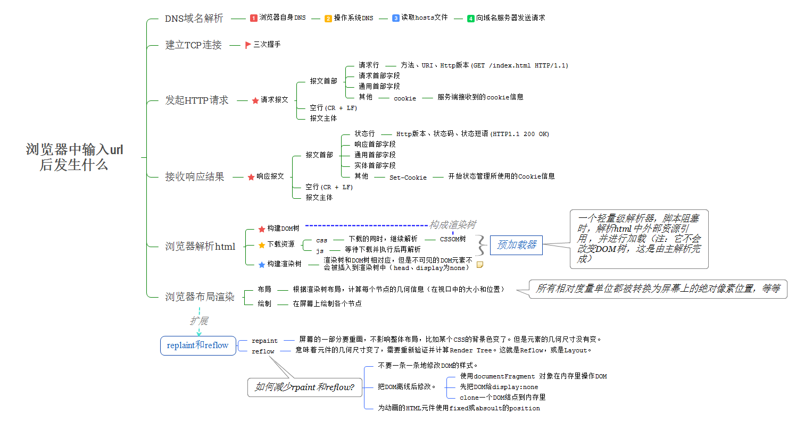</enlarge>

浏览器的地址栏输入URL并按下回车后： 

**1. DNS域名解析** 
（1）在浏览器DNS缓存中搜索 
（2）如果浏览器缓存中没有，操作系统会先检查自己本地的hosts文件是否有这个网址的映射关系，如果有，就先调用这个IP地址映射，完成域名解析。 
（3）如果hosts文件没有这个域名的映射，则查找本地的DNS解析器缓存是否有这个网址映射，如果有，直接返回，完成域名解析。 
（4）如果hosts与本地DNS解析器都没有相应的网址映射关系，则会找本地DNS服务器，如果要查找的域名包含在本地配置区域资源中，则返回解析结果给客户机，完成域名解析，此解析具有权威性。 
（5）如果查询的域名，不由本地DNS服务器区域解析，但该服务器已经缓存了此网址映射关系，则调用这个IP地址映射，完成域名解析，此解析不具有权威性。 
（6）如果上述方案都失效，由本地DNS服务器进行迭代查询，先向根域名DNS服务器发出请求，再查二级域、三级域，直到查询到要解析的地址或名字为止，本地DNS服务器收到应答后，先在缓存中存储，然后将解析结果返回客户机。 

**2. 建立TCL连接（三次握手）**

TCP协议采用了三次握手策略。客户端首先发送一个带SYN（synchronize）标志的数据包给服务器，服务器收到后，返回一个带有SYN/ACK(acknowledegment)标志的数据包给客户端，以示传达确认信息。最后客户端再向服务器发送一个带ACK标志的数据包，代表握手结束。
><enlarge>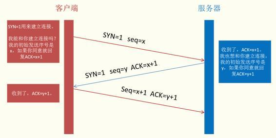</enlarge>

**3. HTTP发起请求**

完整的HTTP请求包含请求起始行、请求头部、请求主体三部分。请求方法：
* GET: 获取资源
* POST: 传输实体主体
* HEAD: 获取报文首部
* PUT: 传输文件
* DELETE: 删除文件
* OPTIONS: 询问支持的方法
* TRACE: 追踪路径

**4. 服务器处理请求，浏览器接收HTTP响应**

服务器在收到浏览器发送的HTTP请求之后，会将收到的HTTP报文封装成HTTP的Request对象，并通过不同的Web服务器进行处理，处理完的结果以HTTP的Response对象返回，主要包括状态码，响应头，响应报文三个部分。状态码：
* 1xx：代表请求已经被接收，需要继续处理。

* 2xx：成功状态码  
200---OK/请求已经正常处理完毕 
204---请求处理成功，但没有资源返回 
206---表示客户端进行了范围请求，而服务器成功执行了这部分的GET请求  

* 3xx：重定向状态码  
301---/请求永久重定向 被请求的资源已永久移动到新位置，并且将来任何对此资源的引用都应该使用本响应返回的若干个 URI 之一。如果可能，拥有链接编辑功能的客户端应当自动把请求的地址修改为从服务器反馈回来的地址。 
302---/请求临时重定向 由于这样的重定向是临时的，客户端应当继续向原有地址发送以后的请求。只有在Cache-Control或Expires中进行了指定的情况下，这个响应才是可缓存的。 
304---/表示客户端发送附带条件的请求（指采用GET方法的请求报文中包含If-Match，If-Modified-Since,If-None-Match,If-Range,If-Unmodified-Since中任一首部）时，服务端允许请求访问资源，但未满足条件的情况 
307---临时重定向，与302含义相同，但是307会遵照浏览器标准，不会从POST变成GET

* 4xx：客户端错误状态码 
400---/客户端请求存在语法错误 
401---/当前请求需要用户验证。 
403---/服务器已经理解请求，但是拒绝执行它。与401响应不同的是，身份验证并不能提供任何帮助 
404---/请求失败，请求所希望得到的资源未被在服务器上发现。 
405---/请求行中指定的请求方法不能被用于请求相应的资源。  

* 5xx：服务器错误状态码 
500---/服务器遇到了一个未曾预料的状况，导致了它无法完成对请求的处理。 
501---/服务器不支持当前请求所需要的某个功能。当服务器无法识别请求的方法，并且无法支持其对任何资源的请求。 
503---/由于临时的服务器维护或者过载，服务器当前无法处理请求。 
505---/服务器不支持，或者拒绝支持在请求中使用的 HTTP 版本。

**5. 浏览器解析渲染页面**

（1）构建文档对象模型（DOM） 
（2）构建CSS对象模型（CSSOM） 
（3）构建渲染树（Render Tree） 
（4）布局 
（5）绘制

**6. 连接结束（四次挥手）**

通过四次挥手关闭连接: 
（1）第一次挥手是浏览器发完数据后，发送FIN请求断开连接。 
（2）第二次挥手是服务器发送ACK表示同意。 
（3）第三次挥手是服务器发送FIN请求断开连接。（考虑到服务器可能还有数据要发送） 
（4）第四次挥手是浏览器需要返回ACK表示同意。

><enlarge>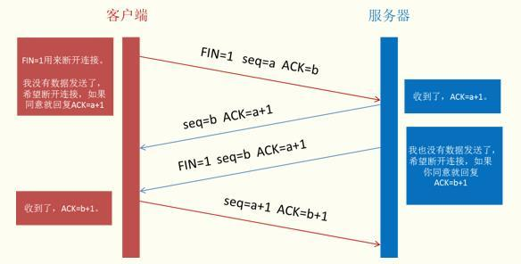</enlarge>

## 二、HTTP缓存

HTTP缓存有多种规则，根据是否需要重新向服务器发起请求来分类，将其分为强制缓存和对比缓存。

**（1）强制缓存**

判断HTTP首部字段：Cache-Control、Expires
><enlarge>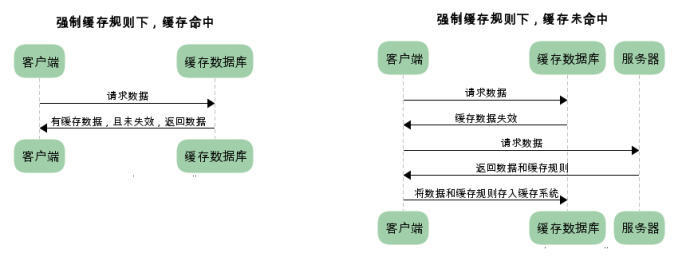</enlarge>

注：HTTP首部字段，各字段首字母大小写均可识别

* **Cache-Control**

cache-control中的max-age保存一个相对时间。例如Cache-Control: max-age = 484200，表示浏览器收到文件后，缓存在484200s内均有效。 如果同时存在cache-control和Expires，浏览器总是优先使用cache-control。
>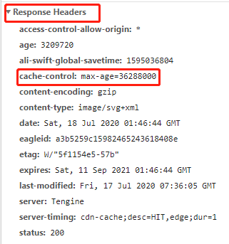

Cache-Control 是最重要的规则。

常见的取值有private、public、no-cache、max-age，no-store，`默认为private`。 
**private** -- 客户端可以缓存 
**public** -- 客户端和代理服务器都可缓存（前端的同学，可以认为public和private是一样的） 
**max-age=xxx** -- 缓存的内容将在 xxx 秒后失效 
**no-cache** -- 需要使用对比缓存来验证缓存数据（后面介绍） 
**no-store** -- 所有内容都不会缓存，强制缓存，对比缓存都不会触发（对于前端开发）

* **Expires**

Expires是一个绝对时间，即服务器时间。浏览器检查当前时间，如果还没到失效时间就直接使用缓存文件。但是该方法存在一个问题：服务器时间与客户端时间可能不一致。因此该字段已经很少使用。
>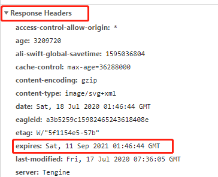

**（2）对比缓存**

通过HTTP的Last-Modified、Etag字段进行判断
><enlarge>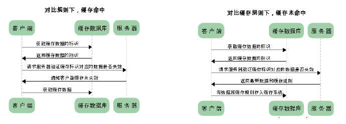</enlarge>

浏览器第一次请求数据时，服务器会将缓存标识与数据一起返回给客户端，客户端将二者备份至缓存数据库中。

* **Last-Modified**

Last-Modified是第一次请求资源时，服务器返回的字段，表示最后一次更新的时间。下一次浏览器请求资源时就发送if-modified-since字段。服务器用本地Last-Modified时间与if-modified-since时间比较，如果不一致则认为缓存已过期并返回新资源给浏览器；如果时间一致则发送304状态码，让浏览器继续使用缓存。
><enlarge>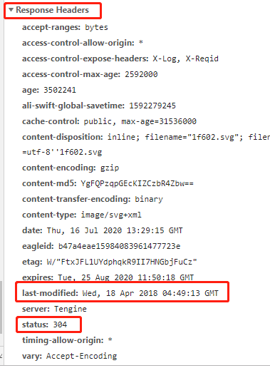</enlarge>

* **Etag**

资源的实体标识（哈希字符串），当资源内容更新时，Etag会改变。服务器会判断Etag是否发生变化，如果变化则返回新资源，否则返回304。
><enlarge>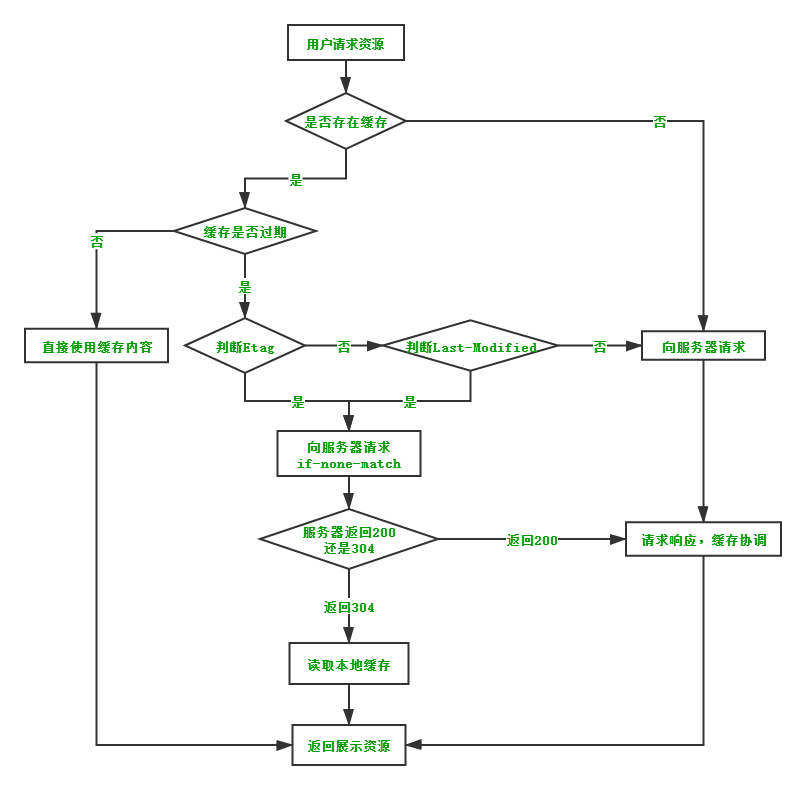</enlarge>

## 三、DNS服务器

**1、为什么需要DNS解析域名为IP地址**

网络通讯大部分是基于TCP/IP的，而TCP/IP是基于IP地址的，所以计算机在网络上进行通讯时只能识别IP地址而不能认识域名。

**2、DNS作用**

DNS是域名系统，它所提供的服务是用来将主机名和域名转换为IP地址的工作。

**3、DNS如何将主机名转换为IP地址**

假设运行在用户主机上的某些应用程序（如Web浏览器或者邮件阅读器）需要将主机名转换为IP地址。这些应用程序将调用DNS的客户机端，并指明需要被转换的主机名。用户主机的DNS客户端接收到后，向网络中发送一个DNS查询报文。所有DNS请求和回答报文使用的UDP数据报经过端口53发送经过若干ms到若干s的延时后，用户主机上的DNS客户端接收到一个提供所希望映射的DNS回答报文。

**4、DNS使用分布式集群工作方式的原因**

DNS不采用单点的集中式的设计方式，而是使用分布式集群的工作方式，是因为集中式设计或有单点故障、通信容量、远距离时间延迟、维护开销大。

**5、DNS查询的过程**
><enlarge>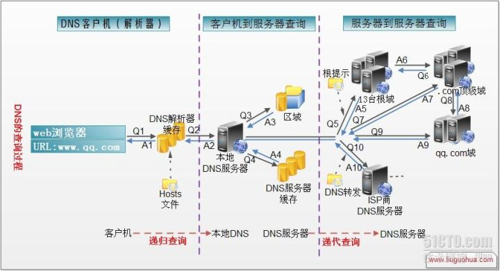</enlarge>

**6、DNS服务器的类型**

大致来说，有三种类型的DNS服务器：根DNS服务器、顶级域DNS服务器、权威DNS服务器
><enlarge>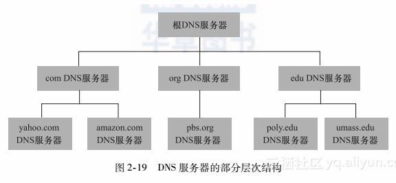</enlarge>

* 本地DNS服务器

还有另一类重要的DNS，称为本地DNS服务器，一台本地DNS服务器严格来说并不属于该服务器的层次结构，但他对DNS层次结构很重要。

当主机发出DNS请求时，该请求被发往本地DNS服务器，他起着代理的作用，并将该请求转发到DNS服务器层次结构中。
><enlarge>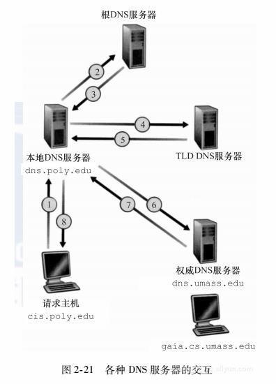</enlarge>

在上述中，从请求主机到本地DNS服务器的查询是递归的，其余查询是迭代的。

* DNS提供了两种查询过程

**（1）递归查询**

在该模式下DNS服务器接收客户请求，必须使用一个准确的查询结果回复客户机，如果DNS服务器没有存储DNS值，那么该服务器会询问其它服务器，并将返回一个查询结果给客户机。

**（2）迭代查询**

DNS服务器会向客户机提供其他能够解释查询请求的DNS服务器，当客户机发送查询时DNS并不直接回复查询结果，而是告诉客户机，另一台DNS服务器的地址，客户机再向这台DNS服务器提交请求，依次循环直接返回结果。
><enlarge>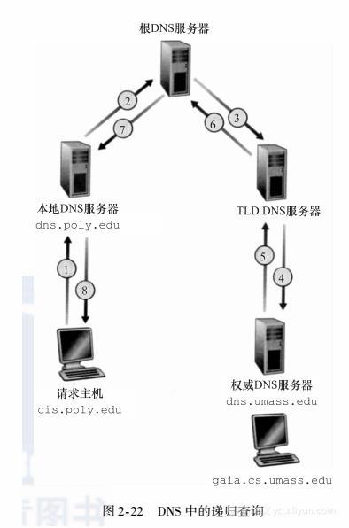</enlarge>

## 四、TCP与UDP的区别和优缺点

**1、TCP与UDP总结**

（1）TCP面向连接；UDP是无连接的，即发送数据之前不需要建立连接； 
（2）TCP提供可靠数据传输，通过使用流量控制、序号、确认和定时器，TCP确保正确的、按序的将数据从发送进程交付给接收进程；UDP尽最大努力交付，即不保证可靠交付； 
（3）UDP具有较好的实时性，工作效率比TCP高，适用于对高速传输和实时性比较高的通信或广播通信； 
（4）每一条TCP连接只能是点对点的，UDP支持一对一，一对多，多对一和多对多的交互通信 
（5）TCP对系统资源要求较多，UDP对系统资源要求较少。

**2、UDP应用场景**

（1）面向数据报方式 
（2）网络数据大多为短消息 
（3）拥有大量Client 
（4）对数据安全性无特殊要求 
（5）网络负担非常重，但对响应速度要求高

**3、TCP如何提供可靠数据传输**

通过使用流量控制、序号、确认和定时器，TCP确保正确的、按序的将数据从发送进程交付给接收进程。

## 五、TCP发送方有三个与发送和重传有关的事件

（1）从上层应用程序接收数据  
（2）TCP从应用程序接收数据，将数据封装在一个报文段中（含有第一个数据字节的流编号），然后交给IP。  
（3）定时器超时。超时后，TCP重传超时报文，然后，重启定时器。 
（4）收到ACK。收到ACK后，将确认报文中确认号与发送方的SendBase（最早未被确认的字节序号）比较。TCP采取累积确认，所以确认号之前的字节都被接收方收到。 
（6）当 确认号 > SendBase 时，则该ACK是在确认一个或多个先前未被确认的报文段，此时发送方更新SendBase的值
如果当前有未被确认的报文段，TCP重启定时器。

## 六、TCP协议在工作过程中的几种简单情况

**1、由于确认丢失而重传**

><enlarge></enlarge>

如上图所示，B发送给A的ACK丢失，引起了主机A的重传，B在接收到重传数据报后根据序号得知这是重传报文，于是丢弃该报文，向A发送ACK。

**2、连续发送的报文段的ACK延迟**

><enlarge></enlarge>

A连续向B发送了两个报文段，但是他们的ACK都延迟了，导致定时器超时，于是最早的未被确认的报文段92被重传，接着他们的ACK到达，它们就不会被再次重传，A收到确认后，就会将SendBase后移，并重启定时器。

**3、累积确认避免先前报文段重传**

><enlarge></enlarge>

A还是向B连续发送了两个报文段，但是第一个报文段的ACK丢失啦。但是好的是在定时器超时之前，第二个报文段的ACK到达，因为TCP采取了累计确认，第二个报文段ACK到达，说明了第一个报文段是被正确接收了哒。所以第一个报文段不会被重传。

## 七、快速重传

超时重传存在的问题之一就是超时周期可能较长。当一个报文段丢失时，通过超时重传来恢复报文，就会增加端到端的时延。Luckily,可以通过检测收到的冗余ACK来进行对丢失报文段的重传。
至于为啥可以通过这样的方式来确信此报文段丢失是因为：

（1）接送方接到丢失报文段后的报文（也就是失序报文段）会将失序报文段缓存，并向发送方发送最近接收的未失序报文段的最大编号。 
（2）如果接收方连续接收多个失序报文，那么发送方将会收到对一个报文段的多个ACK，由此发送方可知该ACK代表的报文段的后一个报文丢失了，于是，发送方重传丢失报文。

当发送方收到3个冗余ACK，就说明被确认过三次的报文段之后的那个报文段已经丢失，TCP就执行快重传（fast retransmit），在丢失报文段定时器超时之前重传丢失报文段。

><enlarge></enlarge>

## 八、TCP中是回退N步还是选择重传

.... -->

