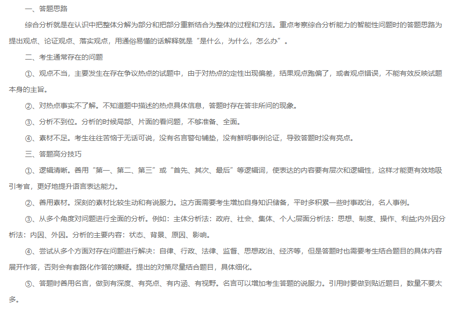
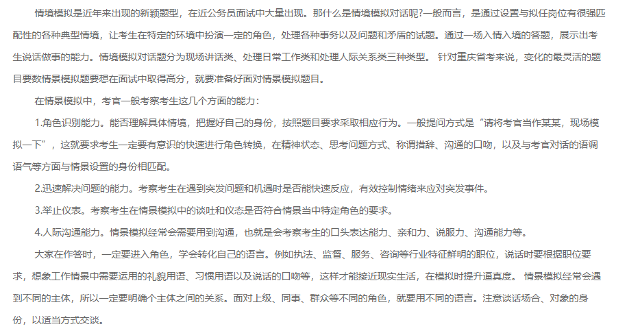
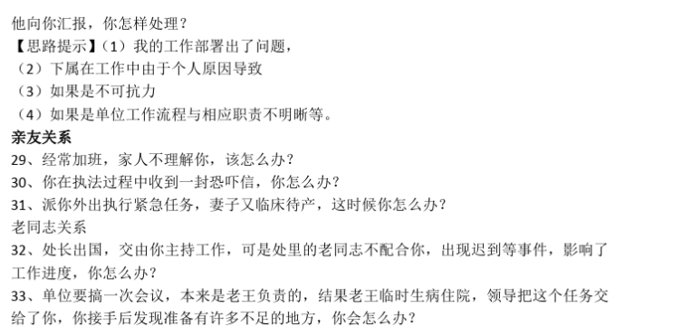
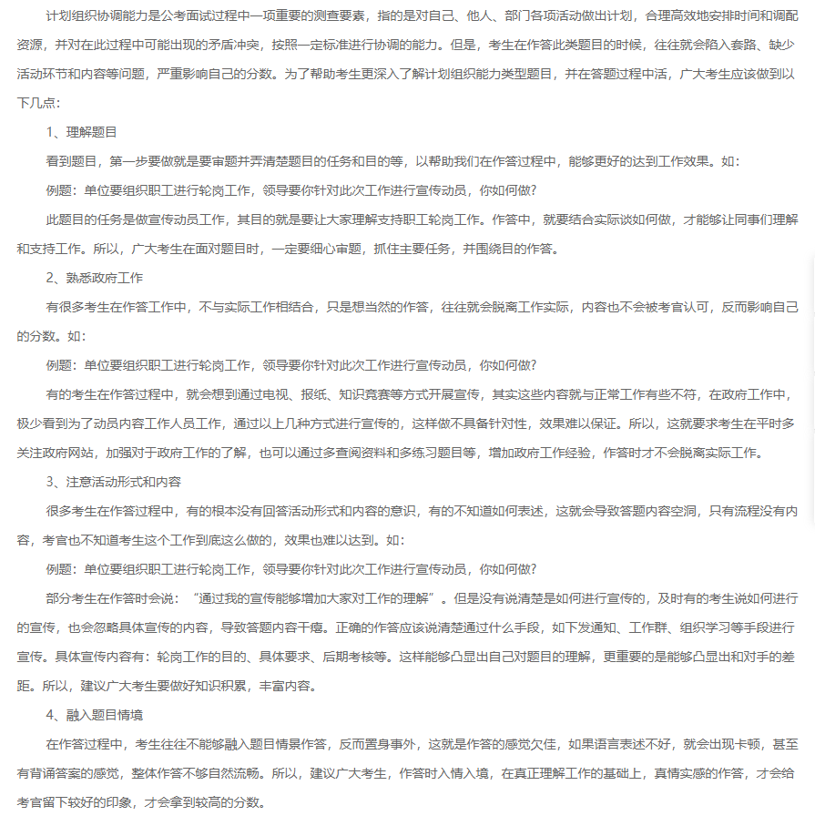
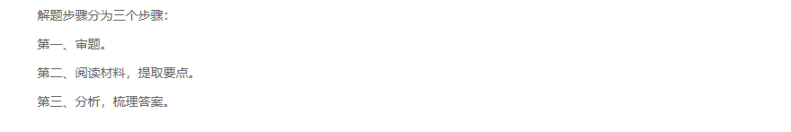

* [结构化面试问题与解析](http://www.xuezhangbb.com/news/tag/1149598)
* [参考一](https://wenku.baidu.com/view/7fd6a87b580216fc700afd9c.html)
* [参考二](https://www.wuyida.com/miyudaquan/2020/0425/498909.html)

## 什么是结构化ms

**ms结果化定义**

1、结构化ms，也称标准化ms，是相对于传统的经验型ms而言的。

2、之所以叫结构化ms，就是评分标准结构化，评分考官一致化，考场形式结构化，题目结构化。

3、按照事先制定好的ms提纲上面的问题一一发问，并按照标准格式记下ms者的回答和对他的评价的一种ms方式。

**考场实况**

**题量/时长**

**评分方式**

**公平性**

## 结构化ms考察能力

`结构化ms测评要素及考察能力有哪些?`

**综合能力分析**

>综合分析，是人们认识客观事物时的大脑思维活动，具有这种思考能力的人，在认识事物的过程中，更易透过现象看出本质、深入思考问题。综合分析是公务员所必需的能力，通过这项测评要素来考查考生能否对政府的政策有透彻的理解，能否对社会现象有深刻的分析，能否对工作中遇到的业务或人际上的困难有合理、客观的认识等等。

**计划组织协调能力**

>计划组织协调能力，是对考生实际工作能力的考查。顾名思义，该测评要素要求考生具备对自己、他人、部门各项活动能够做出计划，且能够合理高效地安排时间和调配资源，并对在此过程中可能出现的矛盾冲突，按照一定标准进行协调的能力。

**言语理解与表达能力**

>语言，是信息传递的重要媒介；良好的言语理解与表达能力，是人与人之间达成共识、实现合作和深入交流的基础和保障。工作环境中的言语理解与表达能力，不同于生活中的日常交流，它要求考生具备能够针对不同听众采取不同的语言方式和风格，将自己的思想明白无误、条理清晰地表达出来，并能让听众接受、产生共鸣的能力。

**举止仪表**

>指考生的穿着打扮和言行举止以及身体和精神状态的外在表现。
>
>考生需注意：穿着打扮是否端庄得体；言行举止是否符合一般礼节，是否有多余的动作；身体和精神状态是否良好（精神饱满、有朝气、有活力）。
>
>举止仪表主要通过观察考生在面试过程中的行为表现和着装礼仪进行考查。

**应变能力**

>应变能力，考查考生在具有压力的情况下随机应变、触类旁通，并做出正确决断的能力。
>
>应变能力要求考生做到以下四点：一是思维的敏捷性和情绪的稳定性；二是对突发事件的整体驾驭能力；三是对工作事物分轻重缓急，把握重点，按照一定顺序处置的协调能力；四是迅速处理工作中突然出现的疑难、棘手问题的随机处置能力。

**人际交往意识与技巧**

>人际关系的定义在不同的学科有不同的阐述，而对于公务员来说，人际关系是指人们在各种具体的公务活动中，通过人与人之间的交往建立起来的相互关系的总称。这些关系是有目的的、与工作相关的，包括与他人的沟通以及组织中的服从、合作、协调、指导、监督活动。
>
>具体来说，要求考生人际合作要有主动性；要有清晰的权属关系意识；要增强人际间的适应性；做到善于沟通、有效沟通；把握处理人际关系的灵活性与原则性。

**求职动机与拟任职位匹配性**

>求职动机是指在一定需要的刺激下，直接推动个体进行求职活动以达到求职目的的内部心理活动。个人的求职目的与拟任岗位所能提供的条件一致时，个体胜任该岗位工作并稳定地从事该工作的可能性较大。
>
>具体包括了解考生的现实性需要、兴趣、成就动机（认知需要、自我提升、自我实现、服务他人的需要、得到锻炼等）与岗位的匹配情况以及对组织文化的认同。

**自我情绪控制**

>在受到较强刺激或处于不利情景中时，能保持自己情绪的稳定，并约束自己行为反应的能力（主要是根据面试当时应试者对一定问题的反应，应试者日常生活中的表现）。
>
>具体在以下情境下考查：在较强刺激情境中，表情和语言自然；在受到有意挑衅甚至有意侮辱的场合，能保持冷静；为长远或更高目标，抑制自己当前的欲望。
>
>自我情绪控制能力主要是在面试过程中通过观察考生的行为进行考查。

**专业(创新)能力**

>专业能力是指完成岗位职责所需的技术性能力或具体的知识要求。考生在掌握基本专业知识的同时，更应注意在此基础上的拓展与创新，从答题内容上展示出思维及素养方面的创新意识。

## 结构化ms五大题型

* 综合分析题

* 情景应变题

* 人际交往技巧题

* 计划组织协调题

* 材料题

## 经典ms问题

* [经典ms问题](http://www.xuezhangbb.com/news/tag/1149598)

