## 1、HTTP——因特网的多媒体信使

`Web` 浏览器、服务器和相关的 `Web` 应用程序都是通过 `HTTP` 相互通信的。`HTTP` 是现代全球因特网中使用的公共语言。本章主要内容：

- Web 客户端与服务器是如何通信的；
- （表示 `Web` 内容的）资源来自何方；
- `Web` 事务是怎样工作的；
- `HTTP` 通信所使用的报文格式；
- 底层 `TCP` 网络传输；
- 不同的 `HTTP` 协议变体；
- 因特网上安装的大量 `HTTP` 架构组件中的一部分

`HTTP`协议可以从遍布全世界的`Web`服务器上将图片、`HTML`页面、文本文件、视频、音频等资源，迅速、便捷、可靠地搬移到人们桌面上的`Web`浏览器上。

`HTTP` 使用的是**可靠的数据传输协议**，因此即使数据来自地球的另一端，它也能够
确保数据在传输的过程中不会被损坏或产生混乱。

## 2、Web 客户端和服务器
`Web` 内容都是存储在 `Web` 服务器上的。`Web` 服务器所使用的是 `HTTP` 协议，因此经常会被称为 `HTTP` 服务器。

这些 `HTTP` 服务器存储了因特网中的数据，如果`HTTP` 客户端发出请求的话，它们会提供数据。客户端向服务器发送` HTTP` 请求，服务器会在 `HTTP` 响应中回送所请求的数据，如图 `1-1` 所示。`HTTP` 客户端和 `HTTP` 服务器共同构成了万维网的基本组件。
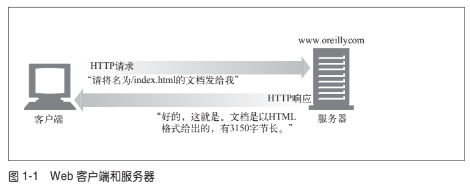

最常见的客户端就是 `Web` 浏览器，比如微软的`Internet Explorer` 或网景的 `Navigator`。`Web` 浏览器向服务器请求 `HTTP` 对象，并将这些对象显示在你的屏幕上。

浏 览 一 个 页 面 时（ 比 如 `http://www.oreilly.com/index.html`）， 浏 览 器 会 向 服 务 器
`www.oreilly.com` 发送一条 `HTTP` 请求（参见图 `1-1`）。服务器会去寻找所期望的对象（在这个例子中就是 `/index.html`），如果成功，就将对象、对象类型、对象长度以及其他一些信息放在 `HTTP` 响应中发送给客户端。

## 3、资源
`Web` 服务器是 `Web` 资源（`Web resource`）的宿主。`Web` 资源是 `Web` 内容的源头。最简单的 `Web` 资源就是 `Web` 服务器文件系统中的**静态文件**。这些文件可以包含任意内容：文本文件、`HTML` 文件、微软的 `Word` 文件、`Adobe` 的 `Acrobat` 文件、`JPEG` 图片文件、`AVI` 电影文件，或所有其他你能够想到的格式。

但资源不一定非得是静态文件。资源还可以是根据需要生成内容的软件程序。这些**动态内容资源**可以根据你的身份、所请求的信息或每天的不同时段来产生内容。它们可以为你显示照相机中活生生的照片，也可以帮你进行股票交易，搜索房产数据库，或者从在线商店中购买礼物（参见图 `1-2`）。
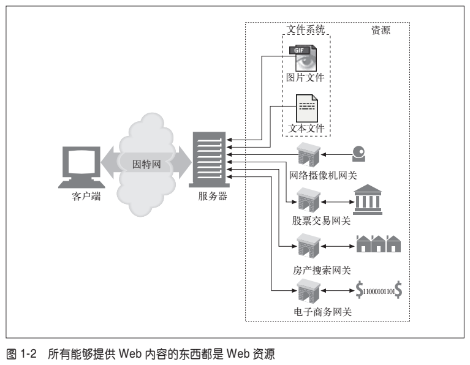

总之，**所有类型的内容来源都是资源**。包含公司销售预测电子表格的文件是一种资源。扫描本地公共图书馆书架的 `Web` 网关是一种资源。因特网搜索引擎也是一种资源。

### （1）媒体类型
因特网上有数千种不同的数据类型，`HTTP` 仔细地给每种要通过 Web 传输的对象都打上了名为 `MIME` 类型（`MIME type`，`Multipurpose Internet Mail Extension`，多用途因特网邮件扩展）的数据格式标签。最初设计 `MIME`是为了解决在不同的电子邮件系统之间搬移报文时存在的问题。`MIME` 在电子邮件系统中工作得非常好，因此 `HTTP` 也采纳了它，用它来描述并标记多媒体内容。

**`Web` 服务器会为所有 `HTTP` 对象数据附加一个 `MIME` 类型**（参见图 `1-3`）。当 `Web` 浏览器从服务器中取回一个对象时，会去查看相关的 `MIME` 类型，看看它是否知道应该如何处理这个对象。大多数浏览器都可以处理数百种常见的对象类型：显示图片文件、解析并格式化 `HTML` 文件、通过计算机声卡播放音频文件，或者运行外部插件软件来处理特殊格式的数据。
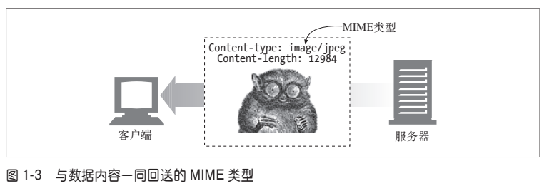

`MIME` 类型是一种文本标记，表示一种主要的对象类型和一个特定的子类型，中间由一条斜杠来分隔。
- `HTML` 格式的文本文档由 `text/html` 类型来标记。
- 普通的 `ASCII` 文本文档由 `text/plain` 类型来标记。
- `JPEG` 版本的图片为 `image/jpeg` 类型。
- `GIF` 格式的图片为 `image/gif` 类型。
- `Apple` 的 `QuickTime` 电影为 `video/quicktime` 类型。
- 微软的 `PowerPoint` 演示文件为 `application/vnd.ms-powerpoint` 类型。

常见的 `MIME` 类型有数百个，实验性或用途有限的 `MIME` 类型则更多。附录 `D` 提供了一个非常完整的 `MIME` 类型列表。

### （2）URI
每个 `Web` 服务器资源都有一个名字，称为**统一资源标识符**（`Uniform Resource Identifier，URI`）。`URI` 就像因特网上的邮政地址一样，在世界范围内唯一标识并定位信息资源。

图 `1-4` 显示了 `URI` 是怎样指示 `HTTP` 协议去访问 `Joe` 商店服务器上的图片资源的。给定了 `URI`，`HTTP` 就可以解析出对象。`URI` 有两种形式，分别称为 `URL` 和 `URN`。现在我们分别来看看这些资源标识符类型。

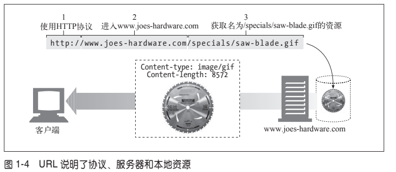

### （3）URL 
统一资源定位符（`URL`）是资源标识符最常见的形式。`URL`描述了一台特定服务器上某资源的特定位置。它们可以明确说明如何从一个精确、固定的位置获取资源。

图 `1-4` 显示了 `URL` 如何精确地说明某资源的位置以及如何去访问它。表 `1-1` 显示了几个 `URL` 实例。
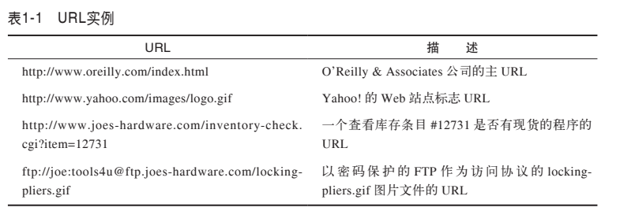

大部分 `URL` 都遵循一种标准格式，这种格式包含三个部分。

- `URL` 的第一部分被称为方案（`scheme`），说明了访问资源所使用的协议类型。这部分通常就是 `HTTP` 协议（`http://`）。
- 第二部分给出了服务器的因特网地址（比如，`www.joes-hardware.com`）。
- 其余部分指定了 `Web` 服务器上的某个资源（比如，`/specials/saw-blade.gif`）。

**现在，几乎所有的 `URI` 都是 `URL`。**

### （4）URN
`URI` 的第二种形式就是统一资源名（`URN`）。`URN` 是作为特定内容的唯一名称使用的，与目前的资源所在地无关。使用这些与位置无关的 `URN`，就可以将资源四处搬移。通过 `URN`，还可以用同一个名字通过多种网络访问协议来访问资源。

比如，不论因特网标准文档 `RFC 2141` 位于何处（甚至可以将其复制到多个地方），都可以用下列 `URN` 来命名它：

`urn:ietf:rfc:2141`

`URN` 仍然处于试验阶段，还未大范围使用。为了更有效地工作，`URN` 需要一个支撑架构来解析资源的位置。而此类架构的缺乏也延缓了其被采用的进度。但 `URN` 确实为未来发展作出了一些令人兴奋的承诺。我们将在第 `2` 章较为详细地讨论`URN`，而本书的其余部分讨论的基本上都是 `URL`。

除非特殊说明，否则本书的其余部分都会使用约定的术语，并且会不加区别地使用 `URI` 和 `URL`。

## 4、事务
我们来更仔细地看看客户端是怎样通过 `HTTP` 与 `Web` 服务器及其资源进行事务处理的。**一个 `HTTP` 事务由一条（从客户端发往服务器的）请求命令和一个（从服务器发回客户端的）响应结果组成**。这种通信是通过名为 `HTTP` 报文（`HTTP message`）的格式化数据块进行的，如图 `1-5` 所示。

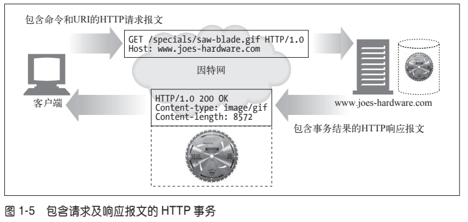

### （1）HTTP 请求方法
`HTTP` 支持几种不同的请求命令，这些命令被称为 `HTTP` 方法（`HTTP method`）。每条 `HTTP` 请求报文都包含一个方法。**这个方法会告诉服务器要执行什么动作**（获取一个 `Web` 页面、运行一个网关程序、删除一个文件等）。表 `1-2` 列出了五种常见的 `HTTP` 方法。

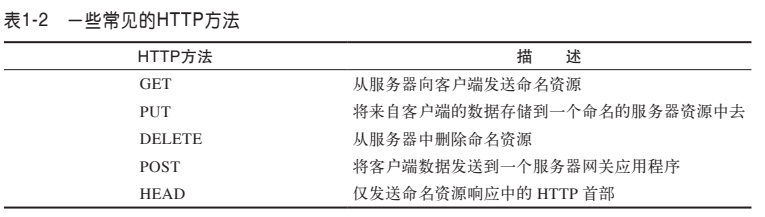

### (2) 状态码
每条 `HTTP` 响应报文返回时都会携带一个状态码。**状态码是一个三位数字的代码，告知客户端请求是否成功，或者是否需要采取其他动作**。表 `1-3` 显示了几种常见的状态码。

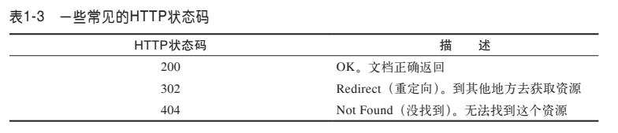

伴随着每个数字状态码，`HTTP` 还会发送一条解释性的“原因短语”文本（参见图`1-5` 中的响应报文）。包含文本短语主要是为了进行描述，所有的处理过程使用的都是数字码。

### (3) Web页面中可以包含多个对象
应用程序完成一项任务时通常会发布多个 `HTTP` 事务。比如，`Web` 浏览器会发布一系列 `HTTP` 事务来获取并显示一个包含了丰富图片的 `Web` 页面。浏览器会执行一个事务来获取描述页面布局的 `HTML` “框架”，然后发布另外的 `HTTP` 事务来获取每个嵌入式图片、图像面板、`Java` 小程序等。这些嵌入式资源甚至可能位于不同的服务器上，如图 `1-6` 所示。因此，**一个“`Web` 页面”通常并不是单个资源，而是一组资源的集合**。

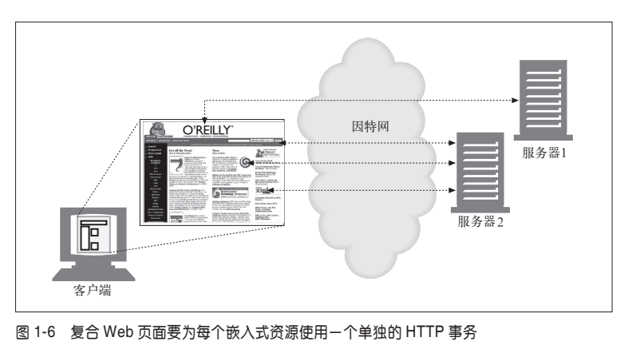

## 5、报文
**`HTTP` 报文是由一行一行的简单字符串组成的。`HTTP` 报文都是纯文本，不是二进制代码**，所以人们可以很方便地对其进行读写。图 `1-7` 显示了一个简单事务所使用的 `HTTP` 报文。

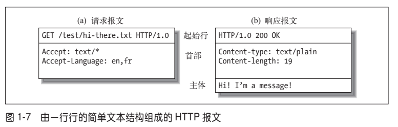

从 `Web` 客户端发往 `Web` 服务器的 `HTTP` 报文称为**请求报文**（`request message`）。从服务器发往客户端的报文称为**响应报文**（`response message`），此外没有其他类型的 `HTTP` 报文。`HTTP` 请求和响应报文的格式很类似。

`HTTP` 报文包括以下三个部分。
- **起始行** 报文的第一行就是起始行，在请求报文中用来说明要做些什么，在响应报文中说明出现了什么情况。

- **首部字段** 起始行后面有零个或多个首部字段。每个首部字段都包含一个名字和一个值，为了便于解析，两者之间用冒号（`:`）来分隔。首部以一个空行结束。添加一个首部字段和添加新行一样简单。

- **主体** 空行之后就是可选的报文主体了，其中包含了所有类型的数据。请求主体中包括了要发送给 `Web` 服务器的数据；响应主体中装载了要返回给客户端的数据。起始行和首部都是文本形式且都是结构化的，而主体则不同，主体中可以包含任意的二进制数据（比如图片、视频、音轨、软件程序）。当然，主体中也可以包含文本。

### 简单的报文实例
图 `1-8` 显示了可能会作为某个简单事务的一部分发送的 `HTTP` 报文。浏览器请求资源 `http://www.joes-hardware.com/tools.html`。

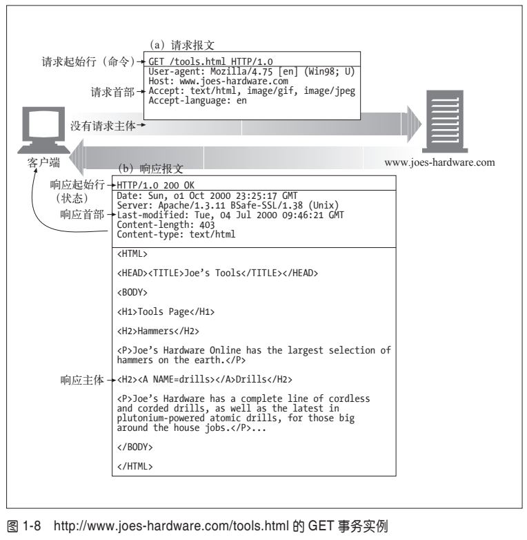

在图 `1-8` 中，浏览器发送了一条 `HTTP` 请求报文。这条请求的起始行中有一个 `GET` 命令，且本地资源为 `/tools.html`。这条请求说明它使用的是 `1.0` 版的 `HTTP` 协议。请求报文没有主体，因为从服务器上 `GET` 一个简单的文档不需要请求数据。

## 6、连接
概要介绍了 `HTTP` 报文的构成之后，我们来讨论一下**报文是如何通过传输控制协议（`Transmission Control Protocol，TCP`）连接从一个地方搬移到另一个地方去的**。

### (1) TCP/IP

`HTTP` 是个应用层协议。`HTTP` 无需操心网络通信的具体细节；它把联网的细节都交给了通用、可靠的因特网传输协议 `TCP/IP`。`TCP` 提供了：
- 无差错的数据传输；
- 按序传输（数据总是会按照发送的顺序到达）；
- 未分段的数据流（可以在任意时刻以任意尺寸将数据发送出去）。

因特网自身就是基于 `TCP/IP` 的，`TCP/IP` 是全世界的计算机和网络设备常用的层次化分组交换网络协议集。`TCP/IP` 隐藏了各种网络和硬件的特点及弱点，使各种类型的计算机和网络都能够进行可靠地通信。

**只要建立了 `TCP` 连接，客户端和服务器之间的报文交换就不会丢失、不会被破坏，也不会在接收时出现错序了。**

用网络术语来说，`HTTP` 协议位于 `TCP` 的上层。**`HTTP` 使用 `TCP` 来传输其报文数据**。与之类似，`TCP` 则位于 `IP` 的上层（参见图 `1-9`）。

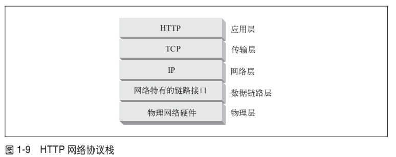

### (2) 连接、IP地址及端口号
**在 `HTTP` 客户端向服务器发送报文之前，需要用网际协议（`Internet Protocol，IP`）地址和端口号在客户端和服务器之间建立一条 `TCP/IP` 连接**。

建立一条 `TCP` 连接的过程与给公司办公室的某个人打电话的过程类似。首先，要拨打公司的电话号码。这样就能进入正确的机构了。其次，拨打要联系的那个人的分机号。

在 `TCP` 中，你需要知道**服务器的 `IP` 地址**，以及与**服务器上运行的特定软件相关的 `TCP` 端口号**。

这就行了，但最初怎么获得 `HTTP` 服务器的 `IP` 地址和端口号呢？当然是通过 `URL`了！我们前面曾提到过，**`URL` 就是资源的地址**，所以自然能够为我们提供存储资源的机器的 `IP` 地址。我们来看几个 `URL`：
- **http://207.200.83.29:80/index.html**：`URL` 使用了机器的 `IP` 地址，`207.200.83.29` 以及端口号 `80`

- **http://www.netscape.com:80/index.html**：`URL` 没有使用数字形式的 `IP` 地址，它使用的是文本形式的域名，或者称为主机名（`www.netscape.com`）。**主机名就是 `IP` 地址比较人性化的别称。可以通过一种称为域名服务（`Domain Name Service，DNS`）的机制方便地将主机名转换为 `IP` 地址**，这样所有问题就都解决了。第 `2` 章会介绍更多有关 `DNS` 和 `URL` 的内容。

- **http://www.netscape.com/index.html**：`URL` 没有端口号。`HTTP` 的 `URL` 中没有端口号时，可以假设默认端口号是 `80`。

有了 `IP` 地址和端口号，客户端就可以很方便地通过 `TCP/IP` 进行通信了。图 `1-10` 显示了浏览器是怎样通过 `HTTP` 显示位于远端服务器中的某个简单 `HTML` 资源的。

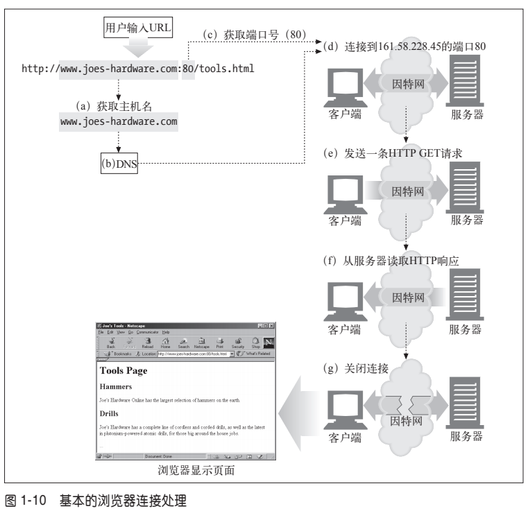

步骤如下：
- (a) 浏览器从 `URL` 中解析出服务器的主机名；
- (b) 浏览器将服务器的主机名转换成服务器的 `IP` 地址；
- (c) 浏览器将端口号（如果有的话）从 `URL` 中解析出来；
- (d) 浏览器建立一条与 `Web` 服务器的 `TCP` 连接；
- (e) 浏览器向服务器发送一条 `HTTP` 请求报文；
- (f) 服务器向浏览器回送一条 `HTTP` 响应报文；
- (g) 关闭连接，浏览器显示文档。

### (3) 使用 Telnet 实例
由于 `HTTP` 使用了 `TCP/IP` 传输协议，而且它是基于文本的，没有使用那些难以理解的二进制格式，因此很容易直接与 `Web` 服务器进行对话。

**`Telnet` 程序可以将键盘连接到某个目标 `TCP` 端口，并将此 `TCP` 端口的输出回送到显示屏上。`Telnet` 常用于远程终端会话，但它几乎可以连接所有的 `TCP` 服务器，包括 `HTTP` 服务器。**

可以通过 `Telnet` 程序直接与 `Web` 服务器进行对话。通过 `Telnet` 可以打开一条到某台机器上某个端口的 `TCP` 连接，然后直接向那个端口输入一些字符。`Web` 服务器会将 `Telnet` 程序作为一个 `Web` 客户端来处理，所有回送给 `TCP` 连接的数据都会显示在屏幕上。

我们用 `Telnet` 与一个实际的 `Web` 服务器进行交互。我们要用 `Telnet` 获取 `URL` `http://www.joes-hardware.com:80/tools.html` 所指向的文档（你可以自己尝试一下这个实例）。

我们来看看会发生什么情况：
- 首先，查找 `www.joes-hardware.com` 的 `IP` 地址，打开一条到那台机器端口 `80` 的 `TCP` 连接。`Telnet` 会为我们完成那些“跑腿儿”的工作。

- 一旦打开了 `TCP` 连接，就要输入 `HTTP` 请求了。

- 请求结束（由一个空行表示）之后，服务器会在一条 `HTTP` 响应中将内容回送并关闭连接。

例 `1-1` 显示了对 `http://www.joes-hardware.com:80/tools.html` 的 `HTTP` 请求实例。我
们输入的内容用粗体字表示。

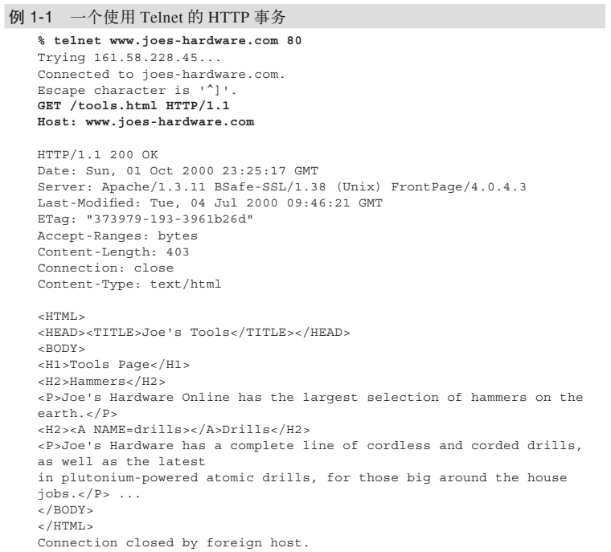

`Telnet` 会查找主机名并打开一条连接，连接到在 `www.joes-hardware.com` 的端口 `80` 上监听的 `Web` 服务器。这条命令之后的三行内容是 `Telnet` 的输出，告诉我们它已经建立了连接。

然后我们输入最基本的请求命令 `GET/tools.html HTTP/1.1`，发送一个提供了源端主机名的 `Host` 首部，后面跟上一个空行，请求从服务器 `www.joes-hardware.com` 上获取资源 `tools.html`。随后，服务器会以一个响应行、几个响应首部、一个空行和最后面的 `HTML` 文档主体来应答。

要明确的是，`Telnet` 可以很好地模拟 `HTTP` 客户端，但不能作为服务器使用。而且对 `Telnet` 做脚本自动化是很繁琐乏味的。如果想要更灵活的工具，可以去看看 `nc（netcat）`。通过 `nc` 可以很方便地操纵基于 `UDP` 和 `TCP` 的流量（包括 `HTTP`），还可以为其编写脚本。更多细节参见 `http://www.bgw.org/tutorials/utilities/nc.php`。

## 7、HTTP 协议版本

现在使用的 `HTTP` 协议有几个版本。`HTTP` 应用程序要尽量强健地处理各种不同的 `HTTP` 协议变体。目前仍在使用的版本如下。

### HTTP/0.9

`HTTP` 的 `1991` 原型版本称为 `HTTP/0.9`。这个协议有很多严重的设计缺陷，只应该用于与老客户端的交互。`HTTP/0.9` 只支持 `GET` 方法，不支持多媒体内容的 `MIME` 类型、各种 `HTTP` 首部，或者版本号。`HTTP/0.9` 定义的初衷是为了获取简单的 `HTML` 对象，它很快就被 `HTTP/1.0` 取代了。

### HTTP/1.0
`1.0` 是第一个得到广泛使用的 `HTTP` 版本。`HTTP/1.0` **添加了版本号、各种 `HTTP`首部、一些额外的方法**，以及**对多媒体对象的处理**。`HTTP/1.0` 使得包含**生动图片的 `Web` 页面和交互式表格**成为可能，而这些页面和表格促使万维网为人们广泛地接受。这个规范从未得到良好地说明。在这个 `HTTP` 协议的商业演进和学术研究都在快速进行的时代，它集合了一系列的最佳实践。

### HTTP/1.0+
在 `20` 世纪 `90` 年代中叶，很多流行的 `Web` 客户端和服务器都在飞快地向 `HTTP`中添加各种特性，以满足快速扩张且在商业上十分成功的万维网的需要。其中很多特性，包括**持久的 `keep-alive` 连接、虚拟主机支持**，以及**代理连接支持**都被加入到 `HTTP` 之中，并成为非官方的事实标准。这种非正式的 `HTTP` 扩展版本通常称为 `HTTP/1.0+`。

### HTTP/1.1
`HTTP/1.1` 重点关注的是**校正 `HTTP` 设计中的结构性缺陷，明确语义，引入重要的性能优化措施，并删除一些不好的特性**。`HTTP/1.1` 还包含了对 `20` 世纪 `90` 年代末正在发展中的更复杂的 `Web` 应用程序和部署方式的支持。**`HTTP/1.1` 是当前使用的 `HTTP` 版本**。

### HTTP-NG（又名 HTTP/2.0）
`HTTP-NG` 是 `HTTP/1.1` 后继结构的原型建议，它重点关注的是**性能的大幅优化，以及更强大的服务逻辑远程执行框架**。`HTTP-NG` 的研究工作终止于 `1998` 年，编写本书时，还没有任何要用此建议取代 `HTTP/1.1` 的推广计划。更多信息请参见第 `10` 章。

## 8、Web 的结构组件

除了Web 浏览器和 Web 服务器 两个Web应用程序，在因特网上，还有如下一些比较重要的应用程序：
- **代理**
  >位于客户端和服务器之间的 HTTP 中间实体
- **缓存**
  >HTTP 的仓库，使常用页面的副本可以保存在离客户端更近的地方
- **网关**
  >连接其他应用程序的特殊 Web 服务器
- **隧道**
  >对 HTTP 通信报文进行盲转发的特殊代理。
- **Agent 代理**
  >发起自动 HTTP 请求的半智能 Web 客户端。

### (1) 代理
**HTTP 代理服务器是 Web 安全、应用集成以及性能优化的重要组成模块**。

如图 `1-11` 所示，**代理位于客户端和服务器之间，接收所有客户端的 HTTP 请求，并将这些请求转发给服务器（可能会对请求进行修改之后转发）**。对用户来说，这些应用程序就是一个代理，代表用户访问服务器。

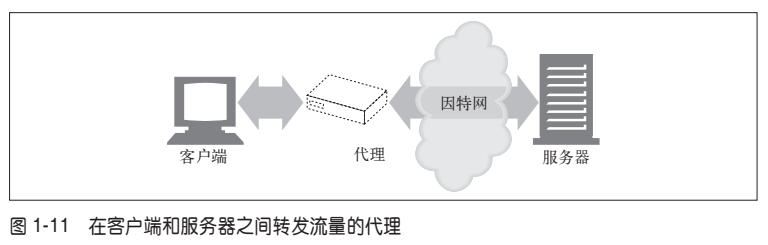

出于安全考虑，通常会将代理作为转发所有 Web 流量的可信任中间节点使用。代理还可以**对请求和响应进行过滤**。比如，在企业中对下载的应用程序进行病毒检测，或者对小学生屏蔽一些成人才能看的内容。我们将在第 6 章详细介绍代理。
### (2) 缓存
**Web 缓存（Web cache）或代理缓存（proxy cache）是一种特殊的 HTTP 代理服务器**，可以将经过代理传送的常用文档复制保存起来。下一个请求同一文档的客户端就可以享受缓存的私有副本所提供的服务了（参见图 `1-12`）。

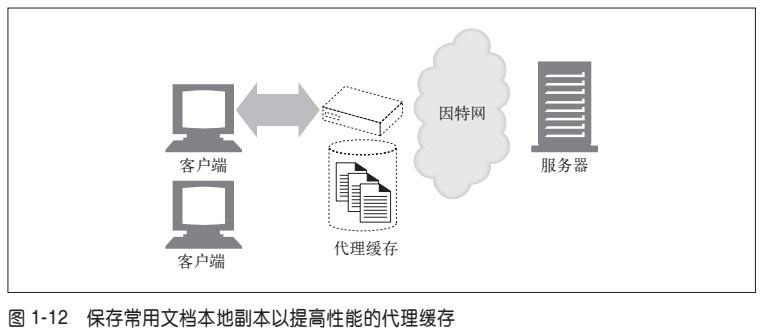

**客户端从附近的缓存下载文档会比从远程 Web 服务器下载快得多。HTTP 定义了很多功能，使得缓存更加高效，并规范了文档的新鲜度和缓存内容的隐私性**。第 7 章介绍了缓存技术。

### (3) 网关

**网关（gateway）是一种特殊的服务器，作为其他服务器的中间实体使用**。通常用于将 HTTP 流量转换成其他的协议。网关接受请求时就好像自己是资源的源端服务器一样。客户端可能并不知道自己正在与一个网关进行通信。

例如，一个 HTTP/FTP 网关会通过 HTTP 请求接收对 FTP URI 的请求，但通过 FTP协议来获取文档（参见图 `1-13`）。得到的文档会被封装成一条 HTTP 报文，发送给客户端。第 8 章将探讨网关。

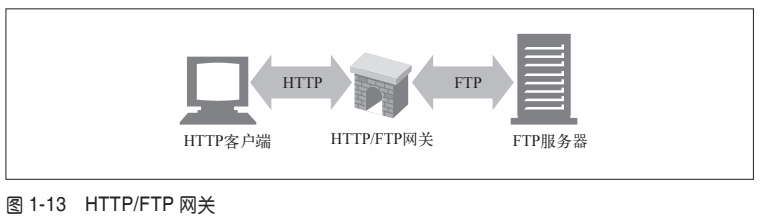

### (4) 隧道

隧道（tunnel）是建立起来之后，就会在两条连接之间对原始数据进行盲转发的HTTP 应用程序。**HTTP 隧道通常用来在一条或多条 HTTP 连接上转发非 HTTP 数据，转发时不会窥探数据**。

HTTP 隧道的一种常见用途是通过 HTTP 连接承载加密的安全套接字层（SSL，Secure Sockets Layer）流量，这样 SSL 流量就可以穿过只允许 Web 流量通过的防火墙了。如图 `1-14` 所示，HTTP/SSL 隧道收到一条 HTTP 请求，要求建立一条到目的地址和端口的输出连接，然后在 HTTP 信道上通过隧道传输加密的 SSL 流量，这样就可以将其盲转发到目的服务器上去了。

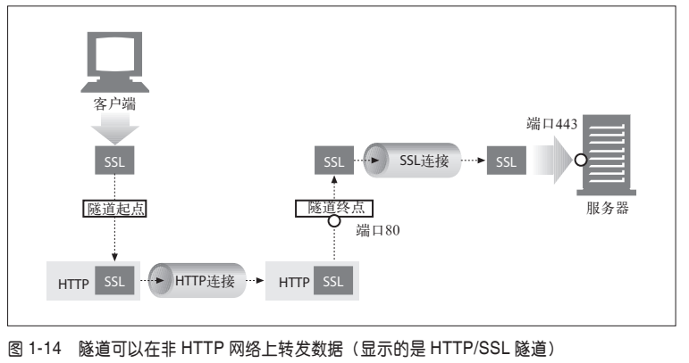

### (5) Agent代理

**用户 Agent 代理（或者简称为 Agent 代理）是代表用户发起 HTTP 请求的客户端程序**。所有发布 Web 请求的应用程序都是 HTTP Agent 代理。到目前为止，我们只提到过一种 HTTP Agent 代理：Web 浏览器，但用户 Agent 代理还有很多其他类型。

比如，有些自己会在 Web 上闲逛的自动用户 Agent 代理，可以在无人监视的情况下发布 HTTP 事务并获取内容。这些自动代理的名字通常都很生动，比如“网络蜘蛛”（spiders）或者“Web 机器人”（Web robots）（参见图 `1-15`）。网络蜘蛛会在 Web 上闲逛，搜集信息以构建有效的 Web 内容档案，比如一个搜索引擎的数据库或者为比较购物机器人生成的产品目录。更多信息请参见第 9 章。

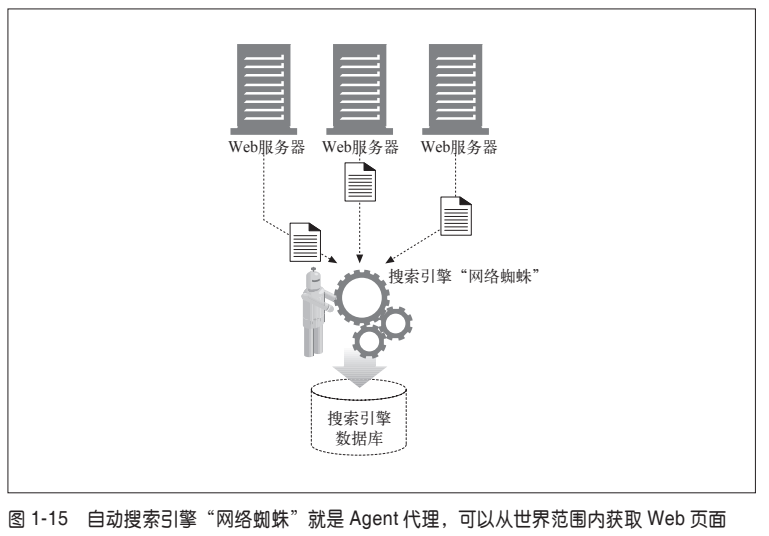

## 9、HTTP 协议文档信息
- `HTTP Pocket Reference（《HTTP 口袋书》）`
>Clinton Wong 著，O’Reilly & Associates 出版公司。这本书详细介绍了 HTTP，
可以作为构成 HTTP 事务的首部和状态码的快速参考手册。
- `http://www.w3.org/Protocols/`
>这个 W3C 的 Web 页面中包含了很多与 HTTP 协议有关的重要链接。
- `http://www.ietf.org/rfc/rfc2616.txt`
>RFC2616“超文本传输协议——HTTP/1.1”是当前 HTTP 协议版本 HTTP/1.1 的官方规范。这个规范是一本编写流畅、组织良好而且非常详细的 HTTP 参考手册，但并不适于那些希望了解 HTTP 底层概念和动因，或者原理与实际应用之间区别的读者阅读。希望本书能够对这些底层概念进行补充，以便读者更好地使用这个规范。
- `http://www.ietf.org/rfc/rfc1945.txt`
>RFC1945“超文本传输协议——HTTP/1.0”是一个描述了 HTTP 现代基础的知识性 RFC。它详细描述了编写此规范时已得到官方认可，且具有“最佳实践”行为的 Web 应用程序。还讨论了一些虽被 HTTP/1.1 所摒弃，但在一些老旧的应用程序中仍在广泛使用的行为。
- `http://www.w3.org/Protocols/HTTP/AsImplemented.html`
>这个 Web 页面介绍了 1991 年的 HTTP/0.9 协议，这个协议只实现了 GET 请求，而且不包含内容类型。

## 10、其他万维网信息
- `http://www.w3.org`
>W3C 是 Web 的科技驱动团队。W3C 致力于促进 Web 演化的互操作性技术（规范、准则、软件及工具）研究。W3C 站点是一个包含了 Web 技术简介和详细文档的宝库。
- `http://www.ietf.org/rfc/rfc2396.txt`
>RFC 2396“Uniform Resource Identifiers（URI）：Generic Syntax”，（“统一资源标识符（URI）：通用语法”）是 URI 和 URL 的详细参考。
- `http://www.ieft.ofg/rfc/rfc2141.txt`
>RFC2141“URN Syntax”（“URN 的语法”）是一个写于 1997 年的描述 URN 语法的规范。
- `http://www.ietf.org/rfc/rfc2046.txt`
RFC2046“MIME Part 2：Media Types”（“MIME 第 II 部分：媒体类型”）是为进行多媒体内容管理而定义的多用途因特网邮件扩展标准的五部因特网规范中的第二部。
- `http://www.wrec.org/Drafts/draft-ietf-wrec-taxonomy-06.txt`
>这个因特网草案“Internet Web Replication and Caching Taxonomy”（“因特网22 Web 复制和缓存分类法”）解释了 Web 结构组件中的标准术语。