HTTP 连接是 HTTP 报文传输的关键通道。编写 HTTP 应用程序的程序员需要理解 HTTP 连接的来龙去脉以及如何使用这些连接。
- HTTP 是如何使用 TCP 连接的；
- TCP 连接的时延、瓶颈以及存在的障碍；
- HTTP 的优化，包括并行连接、keep-alive（持久连接）和管道化连接；
- 管理连接时应该以及不应该做的事情。

## 1、TCP 连接

客户端应用程序可以打开一条 TCP/IP 连接，连接到可能运行在世界任何地方的服务器应用程序。一旦连接建立起来了，在客户端和服务器的计算机之间交换的报文就永远不会丢失、受损或失序

比如，你想获取 Joe 的五金商店最新的电动工具价目表：
`http://www.joes-hardware.com:80/power-tools.html`

浏览器收到这个 URL 时，会执行图 `4-1` 所示的步骤。
- 第 (1) ～ (3) 步会将服务器的IP 地址和端口号从 URL 中分离出来。
- 在第 (4) 步中建立到 Web 服务器的 TCP 连接，
- 并在第 (5) 步通过这条连接发送一条请求报文。
- 在第 (6) 步读取响应，并在第(7) 步关闭连接。

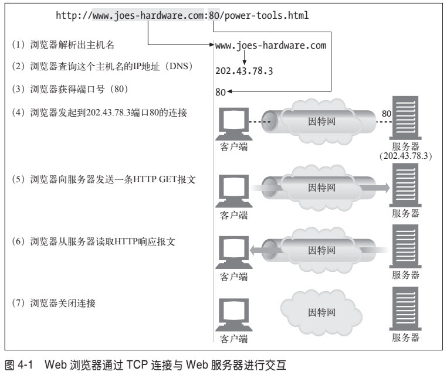

### （1）TCP 的可靠数据管道
HTTP 连接实际上就是 TCP 连接和一些使用连接的规则。TCP 连接是因特网上的可靠连接。要想正确、快速地发送数据，就需要了解 TCP 的一些基本知识

TCP 为 HTTP 提供了一条可靠的比特传输管道。从 TCP 连接一端填入的字节会从另一端以原有的顺序、正确地传送出来（参见图 `4-2`）。

### (2) TCP 流是分段的、由 IP 分组传送
TCP 的数据是通过名为 IP 分组（或 IP 数据报）的小数据块来发送的。这样的话，如图 `4-3a` 所示，HTTP 就是“HTTP over TCP over IP”这个“协议栈”中的最顶层了。其安全版本 HTTPS 就是在 HTTP 和 TCP 之间插入了一个（称为 TLS 或 SSL）密码加密层（图 `4-3b`）。

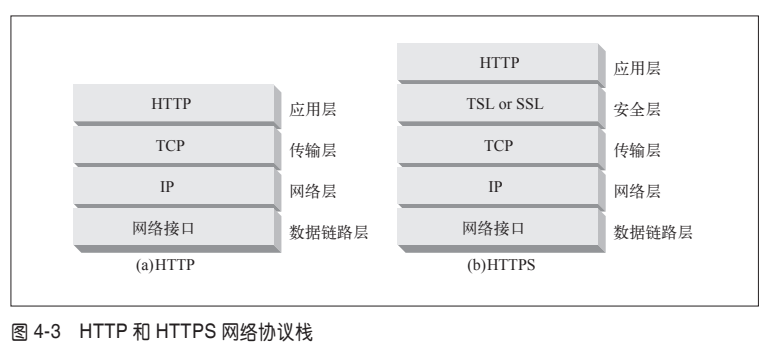

HTTP 要传送一条报文时，会以**流的形式**将报文数据的内容通过一条打开的 TCP 连接按序传输。TCP 收到数据流之后，会将数据流砍成被称作段的小数据块，并将段封装在 IP 分组中，通过因特网进行传输（参见图 `4-4`）。所有这些工作都是由 TCP/IP 软件来处理的，HTTP 程序员什么都看不到。

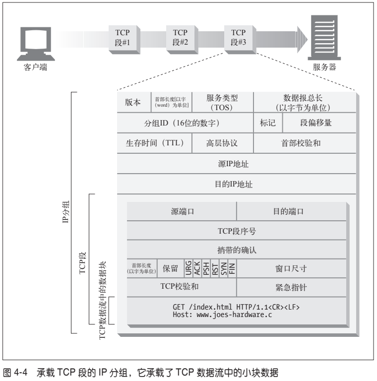

每个 TCP 段都是由 IP 分组承载，从一个 IP 地址发送到另一个 IP 地址的。每个 IP 分组中都包括：
- 一个 IP 分组首部（通常为 20 字节）；
- 一个 TCP 段首部（通常为 20 字节）；
- 一个 TCP 数据块（0 个或多个字节）。

**IP 首部**包含了源和目的 IP 地址、长度和其他一些标记。**TCP 段的首部**包含了 TCP 端口号、TCP 控制标记，以及用于数据排序和完整性检查的一些数字值。

### (3) 保持 TCP 连接的正确运行

在任意时刻计算机都可以有几条 TCP 连接处于打开状态。TCP 是通过端口号来保持所有这些连接的正确运行的。

端口号和雇员使用的电话分机号很类似。就像公司的总机号码能将你接到前台，而分机号可以将你接到正确的雇员位置一样，IP 地址可以将你连接到正确的计算机，而端口号则可以将你连接到正确的应用程序上去。TCP 连接是通过 4 个值来识别的：

`< 源 IP 地址、源端口号、目的 IP 地址、目的端口号 >`

这 4 个值一起唯一地定义了一条连接。两条不同的 TCP 连接不能拥有 4 个完全相同的地址组件值（但不同连接的部分组件可以拥有相同的值）。

在图 `4-5` 中，有 4 条连接：A、B、C 和 D。

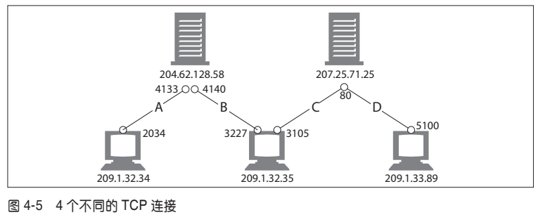

表 `4-1` 列出了每个端口的相关信息。

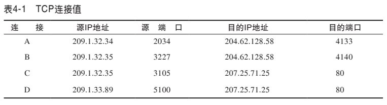

注意，有些连接共享了相同的目的端口号（C 和 D 都使用目的端口号 80）。有些连接使用了相同的源 IP 地址（B 和 C）。有些使用了相同的目的 IP 地址（A 和 B，C 和 D）。但没有两个不同连接所有的 4 个值都一样。

### (4) 用 TCP 套接字编程

操作系统提供了一些操纵其 TCP 连接的工具。为了更具体地说明问题，我们来看一个 TCP 编程接口。表 `4-2` 显示了套接字 API 提供的一些主要接口。这个套接字 API向 HTTP 程序员隐藏了 TCP 和 IP 的所有细节。套接字 API 最初是为 Unix 操作系统开发的，但现在几乎所有的操作系统和语言中都有其变体存在。

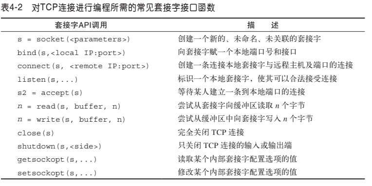

套接字 API 允许用户创建 TCP 的端点数据结构，将这些端点与远程服务器的 TCP 端点进行连接，并对数据流进行读写。TCP API 隐藏了所有底层网络协议的握手细节，以及 TCP 数据流与 IP 分组之间的分段和重装细节。

图 `4-1` 显示了 Web 浏览器是如何用 HTTP 从 Joe 的五金商店下载 power-tools.html 页面的。图 `4-6` 中的伪代码说明了可以怎样通过套接字 API 来凸显客户端和服务器在实现 HTTP 事务时所应执行的步骤。

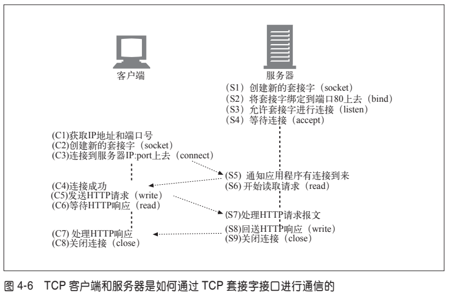

我们从 Web 服务器等待连接（参见图 `4-6`，S4）开始。客户端根据 URL 判定出 IP 地址和端口号，并建立一条到服务器的 TCP 连接（参见图 `4-6`，C3）。建立连接可能要花费一些时间，时间长短取决于服务器距离的远近、服务器的负载情况，以及因特网的拥挤程度。

一旦建立了连接，客户端就会发送 HTTP 请求（参见图 `4-6`，C5），服务器则会读取请求（参见图 `4-6`，S6）。一旦服务器获取了整条请求报文，就会对请求进行处理，执行所请求的动作（参见图 `4-6`，S7），并将数据写回客户端。客户端读取数据（参见图 `4-6`，C6），并对响应数据进行处理（参见图 `4-6`，C7）。

## 2、对 TCP 性能的考虑 - ♥

HTTP 紧挨着 TCP，位于其上层，所以 HTTP 事务的性能在很大程度上取决于底层 TCP 通道的性能。本节重点介绍了一些很重要的、对这些 TCP 连接的性能考虑。理解了 TCP 的某些基本性能特点之后，就可以更好地理解 HTTP 的连接优化特性，这样就能设计实现一些更高性能的 HTTP 应用程序了。

本节要求大家对 TCP 协议的内部细节有一定的了解。如果对 TCP 性能考虑的细节不感兴趣（或者很熟悉这些细节），可以直接跳到 4.3 节。TCP 是个很复杂的话题，所以这里我们只能提供对 TCP 性能的简要概述。本章末尾的 4.8 节列出了一些很好的 TCP 参考书，以供参考。

### （1）HTTP 事务的时延
在 HTTP 请求的过程中会出现哪些网络时延？ 图 4-7 描绘了 HTTP 事务主要的连接、传输以及处理时延。

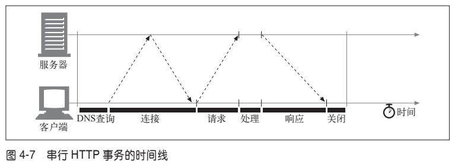

注意，与建立 TCP 连接，以及传输请求和响应报文的时间相比，事务处理时间可能是很短的。**除非客户端或服务器超载，或正在处理复杂的动态资源，否则 HTTP 时延就是由 TCP 网络时延构成的。**

HTTP 事务的时延有以下几种主要原因。

(1) **DNS查询**。客户端首先需要根据 URI 确定 Web 服务器的 IP 地址和端口号。如果最近没有对 URI 中的主机名进行访问，通过 DNS 解析系统将 URI 中的主机名转换成一个 IP 地址可能要花费数十秒的时间。
>幸运的是，大多数 HTTP 客户端都有一个小的 DNS 缓存，用来保存近期所访问站点的 IP 地址。如果已经在本地“缓存”（记录）了 IP 地址，查询就可以立即完成。因为大多数 Web 浏览器浏览的都是少数常用站点，所以通常都可以很快地将主机名解析出来。

(2) **TCP 链接**。接下来，客户端会向服务器发送一条 TCP 连接请求，并等待服务器回送一个请求接受应答。每条新的 TCP 连接都会有连接建立时延。这个值通常最多只有一两秒钟，但如果有数百个 HTTP 事务的话，这个值会快速地叠加上去。

(3) **HTTP 请求**。一旦连接建立起来了，客户端就会通过新建立的 TCP 管道来发送 HTTP 请求。数据到达时，Web 服务器会从 TCP 连接中读取请求报文，并对请求进行处理。因特网传输请求报文，以及服务器处理请求报文都需要时间。

(4) **HTTP 响应**。Web 服务器回送 HTTP 响应，也需要花费时间。

这些 TCP 网络时延的大小取决于**硬件速度、网络和服务器的负载，请求和响应报文的尺寸，以及客户端和服务器之间的距离**。TCP 协议的技术复杂性也会对时延产生巨大的影响。

### （2）性能聚焦区域

本节其余部分列出了一些会**对 HTTP 程序员产生影响的、最常见的 TCP 相关时延**，其中包括：
- TCP 连接建立握手；
- TCP 慢启动拥塞控制；
- 数据聚集的 Nagle 算法；
- 用于捎带确认的 TCP 延迟确认算法；
- TIME_WAIT 时延和端口耗尽。
### （3）TCP 连接的握手时延

建立一条新的 TCP 连接时，甚至是在发送任意数据之前，TCP 软件之间会交换一系列的 IP 分组，对连接的有关参数进行沟通（参见图 `4-8`）。如果连接只用来传送少量数据，这些交换过程就会严重降低 HTTP 的性能。

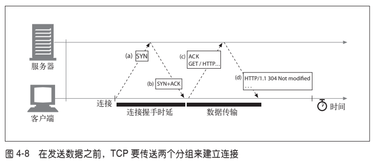

TCP 连接握手需要经过以下几个步骤。

(1) **第一次握手**。请求新的 TCP 连接时，客户端要向服务器发送一个小的 TCP 分组（通常是 40 ～ 60 个字节）。这个分组中设置了一个特殊的 **SYN 标记**，说明这是一个**连接请求**。（参见图 `4-8a`）。

(2) **第二次握手**。如果服务器接受了连接，就会对一些连接参数进行计算，并向客户端回送一个 TCP 分组，这个分组中的 **SYN 和 ACK 标记都被置位**，说明**连接请求已被接受**（参见图 `4-8b`）。

(3) **第三次握手**。最后，客户端向服务器回送一条确认信息，通知它**连接已成功建立**（参见图 `4-8c`）。现代的 TCP 栈都允许客户端在这个确认分组中发送数据。

HTTP 程序员永远不会看到这些分组——这些分组都由 TCP/IP 软件管理，对其是不可见的。HTTP 程序员看到的只是创建 TCP 连接时存在的时延。

通常 HTTP 事务都不会交换太多数据，此时，SYN/SYN+ACK 握手（参见图 `4-8a`和图 `4-8b`）会产生一个可测量的时延。TCP 连接的 ACK 分组（参见图 `4-8c`）通常都足够大，可以承载整个 HTTP 请求报文（因特网流量中的 IP 分组通常是几百字节，本地流量中的 IP 分组为 1500 字节左右。）。而且很多 HTTP 服务器响应报文都可以放入一个 IP 分组中去（比如，响应是包含了装饰性图片的小型 HTML 文件，或者是对浏览器高速缓存请求产生的 304 Not Modified 响应）。

最后的结果是，小的 HTTP 事务可能会在 TCP 建立上花费 50%，或更多的时间。后面的小节会讨论 HTTP 是**如何通过重用现存连接，来减小这种 TCP 建立时延所造成的影响**的。

### （4）延迟确认
由于因特网自身无法确保可靠的分组传输（因特网路由器超负荷的话，可以随意丢弃分组），所以 TCP 实现了自己的确认机制来确保数据的成功传输。

**每个 TCP 段都有一个序列号和数据完整性校验和**。每个段的接收者收到完好的段时，都会向发送者回送小的确认分组。如果发送者没有在指定的窗口时间内收到确认信息，发送者就认为分组已被破坏或损毁，并重发数据。

由于确认报文很小，所以 TCP 允许在发往相同方向的输出数据分组中对其进行“捎带”。TCP 将返回的确认信息与输出的数据分组结合在一起，可以更有效地利用网络。为了增加确认报文找到同向传输数据分组的可能性，很多 TCP 栈都实现了一种“延迟确认”算法。**延迟确认算法**会在一个特定的窗口时间（通常是 100 ～ 200 毫秒）内将输出确认存放在缓冲区中，以寻找能够捎带它的输出数据分组。如果在那个时间段内没有输出数据分组，就将确认信息放在单独的分组中传送。

但是，**HTTP 具有双峰特征的请求** - 应答行为降低了捎带信息的可能。当希望有相反方向回传分组的时候，偏偏没有那么多。通常，延迟确认算法会引入相当大的时延。根据所使用操作系统的不同，可以调整或禁止延迟确认算法。

在对 TCP 栈的任何参数进行修改之前，一定要对自己在做什么有清醒的认识。TCP 中引入这些算法的目的是防止设计欠佳的应用程序对因特网造成破坏。对 TCP 配置进行的任意修改，都要绝对确保应用程序不会引发这些算法所要避免的问题。

### （5）TCP 慢启动

**TCP 数据传输的性能还取决于 TCP 连接的使用期（age）**。TCP 连接会随着时间进行自我“调谐”，起初会限制连接的最大速度，如果数据成功传输，会随着时间的推移提高传输的速度。这种调谐被称为 **TCP 慢启动（slow start），用于防止因特网的突然过载和拥塞**。

**TCP 慢启动**限制了一个 TCP 端点在任意时刻可以传输的分组数。简单来说，每成功接收一个分组，发送端就有了发送另外两个分组的权限。如果某个 HTTP 事务有大量数据要发送，是不能一次将所有分组都发送出去的。必须发送一个分组，等待确认；然后可以发送两个分组，每个分组都必须被确认，这样就可以发送四个分组了，以此类推。这种方式被称为“**打开拥塞窗口**”。

由于存在这种拥塞控制特性，所以新连接的传输速度会比已经交换过一定量数据的、“已调谐”连接慢一些。由于已调谐连接要更快一些，所以 HTTP 中有一些可以重用现存连接的工具。本章稍后会介绍这些 HTTP“持久连接”。

### （6）Nagle算法与TCP_NODELAY
TCP 有一个**数据流接口**，应用程序可以通过它将任意尺寸的数据放入 TCP 栈中——即使一次只放一个字节也可以！但是，每个 TCP 段中都至少装载了 40 个字节的标记和首部，所以**如果 TCP 发送了大量包含少量数据的分组，网络的性能就会严重下降**。
>发送大量单字节分组的行为称为“**发送端傻窗口综合症**”。这种行为效率很低、违反社会道德，而且可能会影响其他的因特网流量。

**Nagle 算法**（根据其发明者 John Nagle 命名）试图在发送一个分组之前，将大量TCP 数据绑定在一起，以提高网络效率。RFC 896“IP/TCP 互连网络中的拥塞控制”对此算法进行了描述。

**Nagle 算法**鼓励发送全尺寸（LAN 上最大尺寸的分组大约是 1500 字节，在因特网上是几百字节）的段。只有当所有其他分组都被确认之后，Nagle 算法才允许发送非全尺寸的分组。如果其他分组仍然在传输过程中，就将那部分数据缓存起来。只有当挂起分组被确认，或者缓存中积累了足够发送一个全尺寸分组的数据时，才会将缓存的数据发送出去。
>这个算法有几种变体，包括对超时和确认逻辑的修改，但基本算法会使数据的缓存比一个TCP段小一些。

**Nagle 算法会引发几种 HTTP 性能问题**。
- 首先，小的 HTTP 报文可能无法填满一个分组，可能会因为等待那些永远不会到来的额外数据而产生时延。
- 其次，Nagle 算法与延迟确认之间的交互存在问题——Nagle 算法会阻止数据的发送，直到有确认分组抵达为止，但确认分组自身会被延迟确认算法延迟 100 ～ 200 毫秒。7
>使用管道化连接（本章稍后介绍）时这些问题可能会更加严重，因为客户端可能会有多条报文要发送给同一个服务器，而且不希望有时延存在

**HTTP 应用程序常常会在自己的栈中设置参数 TCP_NODELAY，禁用 Nagle 算法，提高性能**。如果要这么做的话，一定要确保会向 TCP 写入大块的数据，这样就不会产生一堆小分组了。
### （7）TIME_WAIT累积与端口耗尽
**TIME_WAIT 端口耗尽**是很严重的性能问题，会影响到性能基准，但在现实中相对较少出现。大多数遇到性能基准问题的人最终都会碰到这个问题，而且性能都会变得出乎意料地差，所以这个问题值得特别关注。

当某个 TCP 端点关闭 TCP 连接时，会在内存中维护一个小的控制块，用来记录最近所关闭连接的 IP 地址和端口号。**这类信息只会维持一小段时间，通常是所估计的最大分段使用期的两倍**（称为 2MSL，通常为 2 分钟 ）左右，以确保在这段时间内不会创建具有相同地址和端口号的新连接。实际上，这个算法可以防止在两分钟内创建、关闭并重新创建两个具有相同 IP 地址和端口号的连接。
>将 2MSL 的值取为 2 分钟是有历史原因的。很早以前，路由器的速度还很慢，人们估计，在将一个分组的复制副本丢弃之前，它可以在因特网队列中保留最多一分钟的时间。现在，最大分段生存期要小得多了。

现在高速路由器的使用，使得重复分组几乎不可能在连接关闭的几分钟之后，出现在服务器上。有些操作系统会将 2MSL 设置为一个较小的值，但超过此值时要特别小心。分组确实会被复制，如果来自之前连接的复制分组插入了具有相同连接值的新 TCP 流，会破坏 TCP 数据。

**2MSL 的连接关闭延迟**通常不是什么问题，但在性能基准环境下就可能会成为一个问题。进行性能基准测试时，通常只有一台或几台用来产生流量的计算机连接到某系统中去，这样就限制了连接到服务器的客户端 IP 地址数。而且，服务器通常会在HTTP 的默认 TCP 端口 80 上进行监听。用 TIME_WAIT 防止端口号重用时，这些情况也限制了可用的连接值组合。

在只有一个客户端和一台 Web 服务器的异常情况下，构建一条 TCP 连接的 4 个值：

`<source-IP-address, source-port, destination-IP-address, destination-port>`

其中的 3 个都是固定的——只有源端口号可以随意改变：

`<client-IP, source-port, server-IP, 80>`

**客户端每次连接到服务器上去时，都会获得一个新的源端口，以实现连接的唯一性**。但由于可用源端口的数量有限（比如，60 000 个），而且在 2MSL 秒（比如，120秒）内连接是无法重用的，连接率就被限制在了 60 000/120=500 次 / 秒。如果再不断进行优化，并且服务器的连接率不高于 500 次 / 秒，就可确保不会遇到 TIME_WAIT 端口耗尽问题。要修正这个问题，可以增加客户端负载生成机器的数量，或者确保客户端和服务器在循环使用几个虚拟 IP 地址以增加更多的连接组合。

即使没有遇到端口耗尽问题，也要特别小心有大量连接处于打开状态的情况，或为处于等待状态的连接分配了大量控制块的情况。在有大量打开连接或控制块的情况下，有些操作系统的速度会严重减缓。

## 3、HTTP 连接的处理

### （1）常被误解的Connection首部
HTTP 允许在客户端和最终的源端服务器之间存在一串 HTTP 中间实体（代理、高速缓存等）。可以从客户端开始，逐跳地将 HTTP 报文经过这些中间设备，转发到源端服务器上去（或者进行反向传输）。

在某些情况下，两个相邻的 HTTP 应用程序会为它们共享的连接应用一组选项。HTTP 的 Connection 首部字段中有一个由逗号分隔的连接标签列表，这些标签为此连接指定了一些不会传播到其他连接中去的选项。比如，可以用 Connection:close 来说明发送完下一条报文之后必须关闭的连接。

Connection 首部可以承载 3 种不同类型的标签，因此有时会很令人费解：
- HTTP 首部字段名，列出了只与此连接有关的首部；
- 任意标签值，用于描述此连接的非标准选项；
- 值 close，说明操作完成之后需关闭这条持久连接。

如果连接标签中包含了一个 HTTP 首部字段的名称，那么这个首部字段就包含了与一些连接有关的信息，不能将其转发出去。在将报文转发出去之前，必须删除Connection 首部列出的所有首部字段。由于 Connection 首部可以防止无意中对本地首部的转发，因此将逐跳首部名放入 Connection 首部被称为“对首部的保护”。图 `4-9` 显示了一个这样的例子。

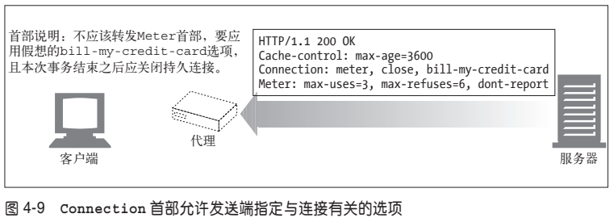

HTTP 应用程序收到一条带有 Connection 首部的报文时，接收端会解析发送端请求的所有选项，并将其应用。然后会在将此报文转发给下一跳地址之前，删除Connection 首部以及 Connection 中列出的所有首部。而且，可能还会有少量没有作为 Connection 首部值列出，但一定不能被代理转发的逐跳首部。其中包括
Prxoy-Authenticate、Proxy-Connection、Transfer-Encoding 和 Upgrade。更多有关 Connection 首部的内容请参见附录 C。

### (2) 串行事务处理时延

**如果只对连接进行简单的管理，TCP 的性能时延可能会叠加起来**。比如，假设有一个包含了 3 个嵌入图的 Web 页面。浏览器需要发起 4 个 HTTP 事务来显示此页面：1 个用于顶层的 HTML 页面，3 个用于嵌入的图片。如果每个事务都需要（串行地建立）一条新的连接，那么连接时延和慢启动时延就会叠加起来（参见图 `4-10`）。
>根据举此例的目的，假设所有对象的长度基本上都一样，并且是从同一台服务器发出的，而且 DNS 条目被缓存了，排除了 DNS 的查找时间。

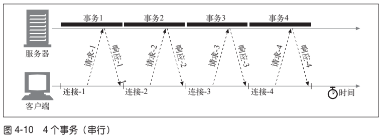

除了串行加载引入的实际时延之外，加载一幅图片时，页面上其他地方都没有动静也会让人觉得速度很慢。用户更希望能够同时加载多幅图片。
>即使同时加载多幅图片比一次加载一幅图片要慢，人们也会有同样的感觉！用户通常会认为多幅图片同时加载要快一些。

**串行加载的另一个缺点是**，有些浏览器在对象加载完毕之前无法获知对象的尺寸，而且它们可能需要尺寸信息来决定将对象放在屏幕的什么位置上，所以在加载了足够多的对象之前，无法在屏幕上显示任何内容。在这种情况下，可能浏览器串行装载对象的进度很正常，但用户面对的却是一个空白的屏幕，对装载的进度一无所知。
>HTML 的设计者可以在图片等嵌入式对象的 HTML 标签中显式地添加宽高属性，以消除这种“布局时延”。显式地提供了嵌入图片的宽度和高度，浏览器就可以在从服务器收到对象之前确定图形的布局了。

还有**几种现存和新兴的方法可以提高 HTTP 的连接性能**。后面几节讨论了四种此类技术。
- **并行连接** 
通过多条 TCP 连接发起并发的 HTTP 请求。
- **持久连接** 
重用 TCP 连接，以消除连接及关闭时延。
- **管道化连接** 
通过共享的 TCP 连接发起并发的 HTTP 请求。
- **复用的连接** 
交替传送请求和响应报文（实验阶段）。

## 4、并行连接
如前所述，浏览器可以先完整地请求原始的 HTML 页面，然后请求第一个嵌入对象，然后请求第二个嵌入对象等，以这种简单的方式对每个嵌入式对象进行串行处理。但这样实在是太慢了！

如图 `4-11` 所示，HTTP 允许客户端打开多条连接，并行地执行多个 HTTP 事务。在这个例子中，并行加载了四幅嵌入式图片，每个事务都有自己的 TCP 连接。
>嵌入的组件不一定都在同一台 Web 服务器上，可以同多台服务器建立并行的连接。

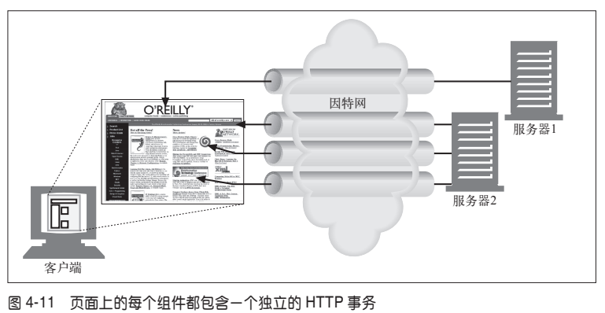

### (1) 并行连接可能会提高页面的加载速度

包含嵌入对象的组合页面如果能（通过并行连接）克服单条连接的空载时间和带宽限制，加载速度也会有所提高。时延可以重叠起来，而且如果单条连接没有充分利用客户端的因特网带宽，可以将未用带宽分配来装载其他对象。

图 `4-12` 显示了并行连接的时间线，比图 `4-10` 要快得多。首先装载的是封闭的 `HTML` 页面，然后并行处理其余的 3 个事务，每个事务都有自己的连接。**图片的装载是并行的，连接的时延也是重叠的**。
>由于软件开销的存在，每个连接请求之间总是会有一些小的时延，但连接请求和传输时间基本上都是重叠起来的。

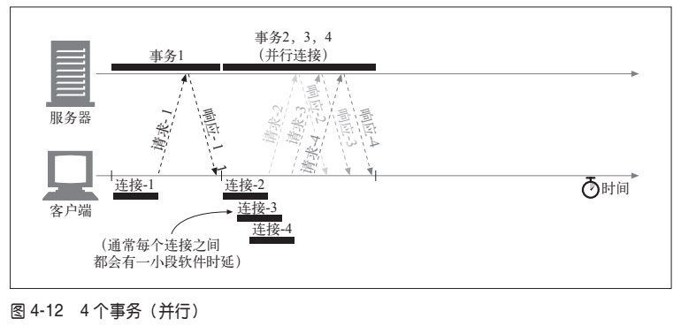

### (2) 并行连接不一定更快
即使并行连接的速度可能会更快，但并不一定总是更快。客户端的网络带宽不足（比如，浏览器是通过一个 28.8kbps 的 Modem 连接到因特网上去的）时，大部分的时间可能都是用来传送数据的。在这种情况下，一个连接到速度较快服务器上的HTTP 事务就会很容易地耗尽所有可用的 Modem 带宽。如果并行加载多个对象，每个对象都会去竞争这有限的带宽，每个对象都会以较慢的速度按比例加载，这样带来的性能提升就很小，甚至没什么提升。
>实际上，多条连接会产生一些额外的开销，使用并行连接装载整个页面所需的时间很可能比串行下载的时间更长。

而且，打开大量连接会消耗很多内存资源，从而引发自身的性能问题。复杂的 Web页面可能会有数十或数百个内嵌对象。客户端可能可以打开数百个连接，但 Web 服务器通常要同时处理很多其他用户的请求，所以很少有 Web 服务器希望出现这样的情况。一百个用户同时发出申请，每个用户打开 100 个连接，服务器就要负责处理10 000 个连接。这会造成服务器性能的严重下降。对高负荷的代理来说也同样如此。

实际上，浏览器确实使用了并行连接，但它们会将并行连接的总数限制为一个较小的值（通常是 4 个）。服务器可以随意关闭来自特定客户端的超量连接。