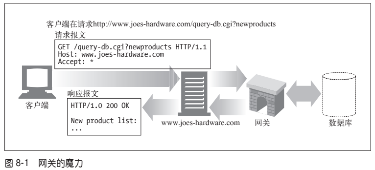
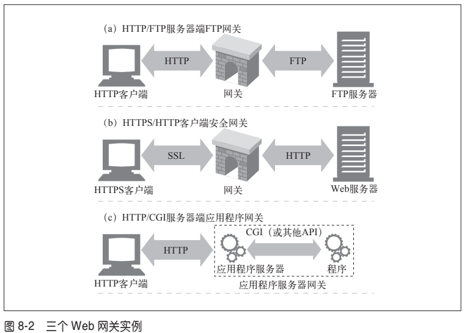
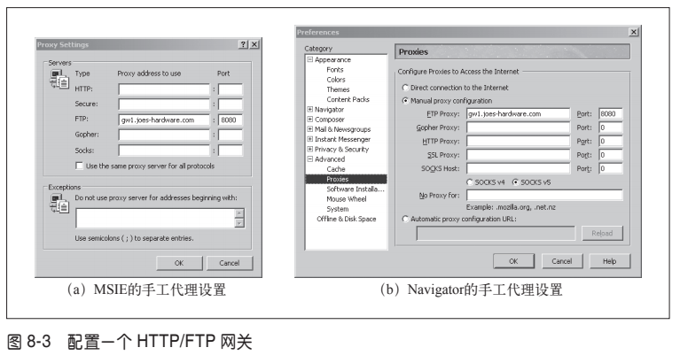
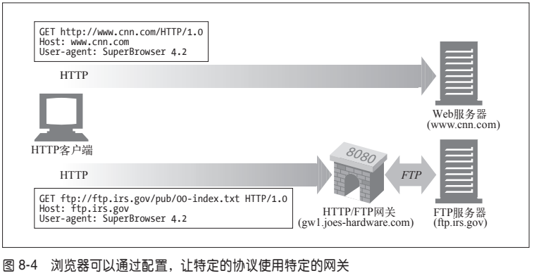
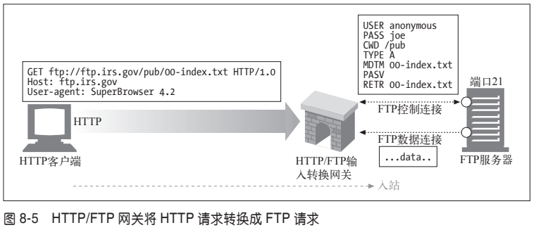
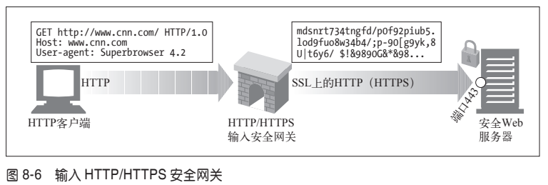
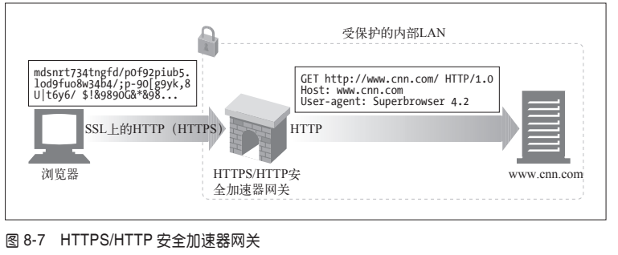
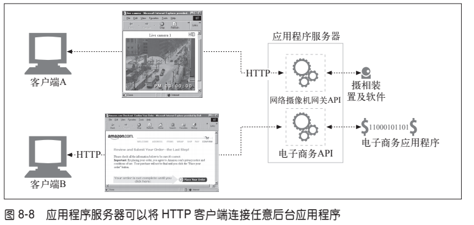
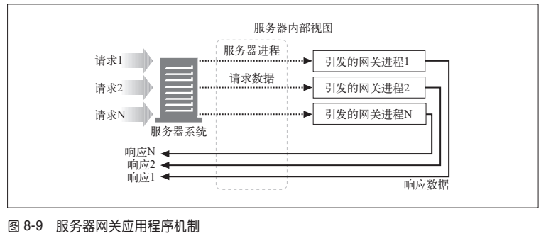

主要内容：
- 在 HTTP 和其他协议及应用程序之间起到接口作用的网关；
- 允许不同类型的 Web 应用程序互相通信的应用程序接口；
- 允许用户在 HTTP 连接上发送非 HTTP 流量的隧道；
- 作为一种简化的 HTTP 代理，一次将数据转发一跳的中继。

## 1、网关
HTTP 扩展和接口的发展是由用户需求驱动的。

**网关可以作为某种翻译器使用，它抽象出了一种能够到达资源的方法**。网关是资源和应用程序之间的粘合
剂。应用程序可以（通过 HTTP 或其他已定义的接口）请求网关来处理某条请求，网关可以提供一条响应。网关可以向数据库发送查询语句，或者生成动态的内容，就像一个门一样：进去一条请求，出来一个响应。

图 `8-1` 显示的是一种资源网关。在这里，Joe 的五金商店服务器就是作为连接数据库内容的网关使用的——注意，客户端只是在通过 HTTP 请求资源，而 Joe 的五金商店的服务器在与网关进行交互以获取资源。

有些网关会自动将 HTTP 流量转换为其他协议，这样 HTTP 客户端无需了解其他协议，就可以与其他应用程序进行交互了（参见图 `8-2`）。

图 `8-2` 显示了三个网关的示例。
- 在图 `8-2a` 中，网关收到了对 FTP URL 的 HTTP 请求。然后网关打开 FTP 连接，并向 FTP 服务器发布适当的命令。然后将文档和正确的 HTTP 首部通过 HTTP 回送。
- 在图 `8-2b` 中，网关通过 SSL 收到了一条加密的 Web 请求，网关会对请求进行解密（网关上要安装适当的服务器证书），然后向目标服务器转发一条普通的 HTTP 请求。可以将这些安全加速器直接放在（通常处于同一场所的）Web 服务器前面，以便为原始服务器提供高性能的加密机制。
- 在图 `8-2c` 中，网关通过应用程序服务器网关 API，将 HTTP 客户端连接到服务器端的应用程序上去。在网上的电子商店购物、查看天气预报，或者获取股票报价时，访问的就是应用程序服务器网关。

### 客户端和服务器端网关

Web 网关在一侧使用 HTTP 协议，在另一侧使用另一种协议。
>在不同 HTTP 版本之间进行转换的 Web 代理就像网关一样，它们会执行复杂的逻辑，以便在各个端点之间进行沟通。但因为它们在两侧使用的都是 HTTP，所以从技术上来讲，它们还是代理。

可以用一个斜杠来分隔客户端和服务器端协议，并以此对网关进行描述：

`< 客户端协议 >/< 服务器端协议 >`

因此，将 HTTP 客户端连接到 NNTP 新闻服务器的网关就是一个 HTTP/NNTP 网关。我们用术语服务器端网关和客户端网关来说明对话是在网关的哪一侧进行的。
- **服务器端网关**（server-side gateway）通过 HTTP 与客户端对话，通过其他协议与服务器通信（HTTP/*）。
- **客户端网关**（client-side gateway）通过其他协议与客户端对话，通过 HTTP 与服务器通信（*/HTTP）。

## 2、协议网关

将 HTTP 流量导向网关时所使用的方式与将流量导向代理的方式相同。最常见的方式是，显式地配置浏览器使用网关，对流量进行透明的拦截，或者将网关配置为替代者（**反向代理**）。

图 `8-3` 显示了配置浏览器使用服务器端 FTP 网关的对话框。在图中显示的配置中，配置浏览器将 `gw1.joes-hardware.com` 作为所有 FTP URL 的 HTTP/FTP 网关。浏览器没有将 FTP 命令发送给 FTP 服务器，而是将 HTTP 命令发送给端口 8080 上的 HTTP/FTP 网关 `gw1.joes-hardware.com`。

<enlarge></enlarge>

图 `8-4` 给出了这种网关配置的结果。一般的 HTTP 流量不受影响，会继续流入原始服务器。但对 FTP URL 的请求则被放在 HTTP 请求中发送给网关 `gw1.joeshardware.com`。网关代表客户端执行 FTP 事务，并通过 HTTP 将结果回送给客户端。

常见网关类型：服务器协议转换器、服务器端安全网关、客户端安全网关以及应用程序服务器。

### (1) HTTP/*：服务器端 Web 网关

请求流入原始服务器时，服务器端 Web 网关会将客户端 HTTP 请求转换为其他协议（参见图 `8-5`）。

在图 `8-5` 中，网关收到了一条对 FTP 资源的 HTTP 请求：

`ftp://ftp.irs.gov/pub/00-index.txt`

网关会打开一条到原始服务器 FTP 端口（端口 21）的 FTP 连接，通过 FTP 协议获取对象。网关会做下列事情：
- 发送 USER 和 PASS 命令登录到服务器上去；
- 发布 CWD 命令，转移到服务器上合适的目录中去；
- 将下载类型设置为 ASCII；
- 用 MDTM 获取文档的最后修改时间；
- 用 PASV 告诉服务器将有被动数据获取请求到达；
- 用 RETR 请求进行对象获取；
- 打开到 FTP 服务器的数据连接，服务器端口由控制信道返回；一旦数据信道打开了，就将对象内容回送给网关。

完成获取之后，会将对象放在一条 `HTTP` 响应中回送给客户端。

### (2) HTTP/HTTPS：服务器端安全网关
一个组织可以通过网关对所有的输入 Web 请求加密，以提供额外的隐私和安全性保护。客户端可以用普通的 HTTP 浏览 Web 内容，但网关会自动加密用户的对话（参见图 `8-6`）。

### (3) HTTPS/HTTP客户端安全加速器网关

最近，将 HTTPS/HTTP 网关作为安全加速器使用的情况是越来越多了。这些 HTTPS/HTTP 网关位于 Web 服务器之前，通常作为不可见的拦截网关或反向代理使用。它们接收安全的 HTTPS 流量，对安全流量进行解密，并向 Web 服务器发送普通的 HTTP 请求（参见图 `8-7`）。

这些网关中通常都包含专用的解密硬件，以比原始服务器有效得多的方式来解密安全流量，以减轻原始服务器的负荷。这些网关在网关和原始服务器之间发送的是未加密的流量，所以，要谨慎使用，确保网关和原始服务器之间的网络是安全的。

## 3、资源网关

到目前为止，我们一直在讨论通过网络连接客户端和服务器的网关。但最常见的网关，应用程序服务器，会将目标服务器与网关结合在一个服务器中实现。应用程序服务器是服务器端网关，与客户端通过 HTTP 进行通信，并与服务器端的应用程序相连（参见图 `8-8`）。

在图 `8-8` 中，两个客户端是通过 HTTP 连接到应用程序服务器的。但应用程序服务器并没有回送文件，而是将请求通过一个网关应用编程接口（Application Programming Interface，API）发送给运行在服务器上的应用程序。
- 收到客户端 A 的请求，根据 URI 将其通过 API 发送给一个数码摄相机应用程序。将得到的图片绑定到一条 HTTP 响应报文中，再回送给客户端，在客户端的浏览器中显示。
- 客户端 B 的 URI 请求的是一个电子商务应用程序。客户端 B 的请求是通过服务器网关 API 发送给电子商务软件的，结果会被回送给浏览器。电子商务软件与客户端进行交互，引导用户通过一系列 HTML 页面来完成购物。

第一个流行的应用程序网关 API 就是通用网关接口（Common Gateway Interface，CGI）。CGI 是一个标准接口集，Web 服务器可以用它来装载程序以响应对特定 URL 的 HTTP 请求，并收集程序的输出数据，将其放在 HTTP 响应中回送。在过去的几年中，商业 Web 服务器提供了一些更复杂的接口，以便将 Web 服务器连接到应用程序上去。

早期的 Web 服务器是相当简单的，在网关接口的实现过程中采用的简单方式一直持续到了今天。\

请求需要使用网关的资源时，服务器会请辅助应用程序来处理请求。服务器会将辅助应用程序所需的数据传送给它。通常就是整条请求，或者用户想在数据库上运行的请求（来自 URL 的请求字符串，参见第 2 章）之类的东西。然后，它会向服务器返回一条响应或响应数据，服务器则会将其转发给客户端。服务器和网关是相互独立的应用程序，因此，它们的责任是分得很清楚的。图 8-9 显示了服务器与网关应用程序之间交互的基本运行机制。这个简单的协议（输入请求，转交，响应）就是最古老，也最常用的服务器扩展接口 CGI 的本质。

### (1) CGI

CGI 是第一个，可能仍然是得到最广泛使用的服务器扩展。在 Web 上广泛用于动态HTML、信用卡处理以及数据库查询等任务。

CGI 应用程序是独立于服务器的，所以，几乎可以用任意语言来实现，包括 Perl、Tcl、C 和各种 shell 语言。CGI 很简单，几乎所有的 HTTP 服务器都支持它。图 `8-9` 显示了 CGI 模型的基本运行机制。

CGI 的处理对用户来说是不可见的。从客户端的角度来看，就像发起一个普通请求一样。它完全不清楚服务器和 CGI 应用程序之间的转接过程。URL 中出现字符 cgi 和可能出现的“?”是客户端发现使用了 CGI 应用程序的唯一线索。

看来 CGI 是很棒的，对吧？嗯，好吧，既是也不是。它在服务器和众多的资源类型之间提供了一种简单的、函数形式的粘合方式，用来处理各种需要的转换。这个接口还能很好地保护服务器，防止一些糟糕的扩展对它造成的破坏（如果这些扩展直接与服务器相连，造成的错误可能会引发服务器崩溃）。

但是，这种分离会造成性能的耗费。为每条 CGI 请求引发一个新进程的开销是很高的，会限制那些使用 CGI 的服务器的性能，并且会加重服务端机器资源的负担。为了解决这个问题，人们开发了一种新型 CGI——并将其恰当地称为快速 CGI。这个接口模拟了 CGI，但它是作为持久守护进程运行的，消除了为每个请求建立或拆除新进程所带来的性能损耗。

### (2) 服务器扩展API

CGI 协议为外部翻译器与现有的 HTTP 服务器提供了一种简洁的接口方式，但如果想要改变服务器自身的行为，或者只是想尽可能地提升能从服务器上获得的性能呢？服务器开发者为这两种需求提供了几种服务器扩展 API，为 Web 开发者提供了强大的接口，以便他们将自己的模块与 HTTP 服务器直接相连。扩展 API 允许程序员将自己的代码嫁接到服务器上，或者用自己的代码将服务器的一个组件完整地替换出来。

大多数流行的服务器都会为开发者提供一个或多个扩展 API。这些扩展通常都会绑定在服务器自身的结构上，所以，大多数都是某种服务器类型特有的。微软、网景、Apache 和其他服务器都提供了一些 API 接口，允许开发者通过这些接口改变服务器的行为，或者为不同的资源提供一些定制的接口。这些定制接口为开发者提供了强大的接口方式。

微软的 FPSE（FrontPage 服务器端扩展）就是服务器扩展的一个实例，它为使用FrontPage 的作者进行 Web 发布提供支持。FPSE 能够对 FrontPage 客户端发送的RPC（remote procedure call，远程过程调用）命令进行解释。这些命令会在 HTTP 中（具体来说，就是在 HTTP POST 方法上）捎回。细节请参见 19.1 节。

## 4、应用程序接口和Web服务

我们已经讨论过可以将资源网关作为 Web 服务器与应用程序的通信方式使用。更广泛地说，随着 Web 应用程序提供的服务类型越来越多，有一点变得越来越清晰了：HTTP 可以作为一种连接应用程序的基础软件来使用。在将应用程序连接起来的过程中，一个更为棘手的问题是在两个应用程序之间进行协议接口的协商，以便这些应用程序可以进行数据的交换——这通常都是针对具体应用程序的个案进行的。

应用程序之间要配合工作，所要交互的信息比 HTTP 首部所能表达的信息要复杂得多。第 19 章描述了几个用于交换定制信息的扩展 HTTP 或 HTTP 上层协议实例。19.1 节介绍的是在 HTTP POST 报文之上建立 RPC 层，19.2 节介绍的是向 HTTP 首部添加 XML 的问题。

因特网委员会开发了一组允许 Web 应用程序之间相互通信的标准和协议。尽管 Web服务（Web service）可以用来表示独立的 Web 应用程序（构造模块），这里我们还是宽松地用这个术语来表示这些标准。Web 服务的引入并不新鲜，但这是应用程序共享信息的一种新机制。Web 服务是构建在标准的 Web 技术（比如 HTTP）之上的。

Web 服务可以用 XML 通过 SOAP 来交换信息。XML（Extensible Markup Language，扩展标记语言）提供了一种创建数据对象的定制信息，并对其进行解释的方法。SOAP（Simple Object Access Protocol，简单对象访问协议）是向 HTTP 报文中添加 XML 信息的标准方式。
>更多信息，请参见 http://www.w3.org/TR/2001/WD-soap12-part0-20011217/。Doug Tidwell、James Snell 和 Pavel Kulchenko 编写的 Programming Web Services with SOAP（SOAP Web 服务开发）一书（O’Reilly）也是非常好的 SOAP 协议信息资源。

## 5、隧道
我们已经讨论了几种不同的方式，通过这些方式可以用 HTTP 对不同类型的资源进行访问（通过网关），或者是用 HTTP 来启动应用程序到应用程序的通信。在本节中，我们要看看 HTTP 的另一种用法——Web 隧道（Web tunnel），这种方式可以通过 HTTP 应用程序访问使用非 HTTP 协议的应用程序。

Web 隧道允许用户通过 HTTP 连接发送非 HTTP 流量，这样就可以在 HTTP 上捎带其他协议数据了。使用 Web 隧道最常见的原因就是要在 HTTP 连接中嵌入非 HTTP 流量，这样，这类流量就可以穿过只允许 Web 流量通过的防火墙了。

### （1）用CONNECT建立HTTP隧道