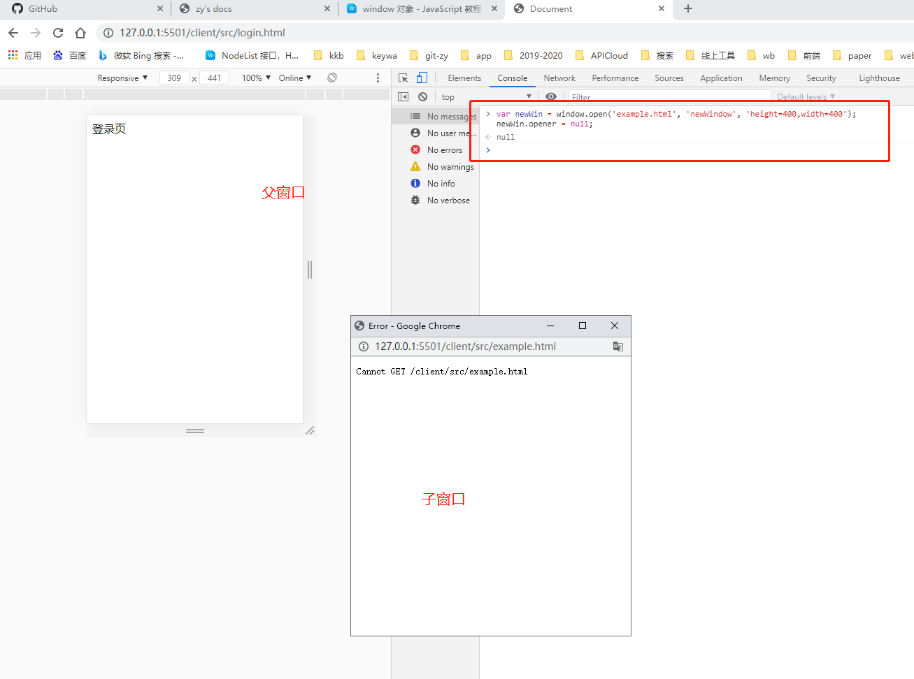
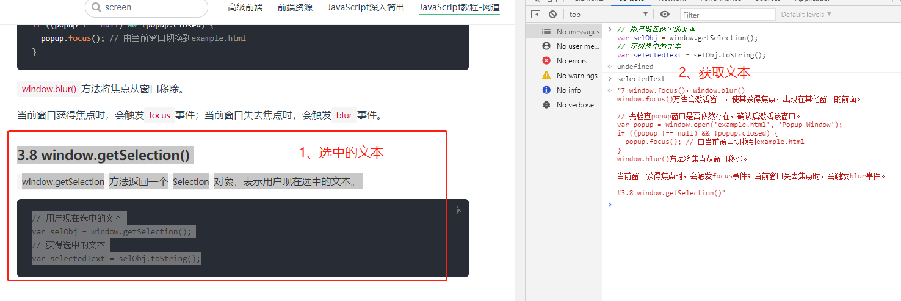

window对象-网道：[链接](https://www.wangdoc.com/javascript/bom/window.html)

## 1、概述

浏览器里面，`window`对象指当前的浏览器窗口。它也是当前页面的顶层对象，所有其他对象都是它的下属。

一个变量如果未声明，那么默认就是顶层对象的属性。
```js
// a是一个没有声明就直接赋值的变量，它自动成为顶层对象的属性。
a = 1;
window.a // 1
```

### 未声明变量默认为顶层对象属性 - 原因

window有自己的实体含义，其实不适合当作最高一层的顶层对象，这是一个语言的设计失误。

最早，设计这门语言的时候，原始设想是语言内置的对象越少越好，这样可以提高浏览器的性能。因此，语言设计者 `Brendan Eich` 就把`window`对象当作顶层对象，所有未声明就赋值的变量都自动变成`window`对象的属性。**这种设计使得编译阶段无法检测出未声明变量，但到了今天已经没有办法纠正了。**

## 2、window 对象的属性
- window.name：[link](./2-window.html#_2-1-window-name)
- window.closed，window.opener：[link](./2-window.html#_2-2-window-closed，window-opener) - 只读
- window.self，window.window：[link](./2-window.html#_2-3-window-self，window-window) - 只读
- window.frames，window.length：[link](./2-window.html#_2-4-window-frames，window-length)
- window.frameElement：[link](./2-window.html#_2-5-window-frameelement)
- window.top，window.parent：[link](./2-window.html#_2-6-window-top，window-parent)
- window.status：[link](./2-window.html#_2-7-window-status)
- window.devicePixelRatio：[link](./2-window.html#_2-8-window-devicepixelratio)
- **位置大小属性**：[link](./2-window.html#_2-9-位置大小属性)
  - window.screenX，window.screenY - 只读: [link](./2-window.html#（1）window-screenx，window-screeny)
  - window.innerHeight，window.innerWidth - 只读: [link](./2-window.html#（2）-window-innerheight，window-innerwidth)
  - window.outerHeight，window.outerWidth - 只读: [link](./2-window.html#（3）window-outerheight，window-outerwidth)
  - window.scrollX，window.scrollY - 只读: [link](./2-window.html#（4）window-scrollx，window-scrolly)
  - window.pageXOffset，window.pageYOffset : [link](./2-window.html#（5）window-pagexoffset，window-pageyoffset)
- 组件属性：[link](./2-window.html#_2-10-组件属性)
- 全局对象属性：[link](./2-window.html#_2-11-全局对象属性)
- window.isSecureContext：[link](./2-window.html#_2-12-window-issecurecontext)

### 2.1 window.name

`window.name`属性是一个字符串，表示当前浏览器窗口的名字。窗口不一定需要名字，这个属性主要配合超链接和表单的target属性使用。
```js
// 该属性只能保存字符串，如果写入的值不是字符串，会自动转成字符串。
window.name = 'Hello World!';
console.log(window.name)
```
- 该属性只能保存字符串，如果写入的值不是字符串，会自动转成字符串。
- 各个浏览器对这个值的储存容量有所不同，但是一般来说，可以高达几MB。
- 只要浏览器窗口不关闭，这个属性是不会消失的。

#### 举例 - 同一窗口访问不同的页面

例如，访问`a.com`时，该页面的脚本设置了`window.name`，接下来在同一个窗口里面载入了`b.com`，新页面的脚本可以读到上一个网页设置的`window.name`。页面刷新也是这种情况。一旦浏览器窗口关闭后，该属性保存的值就会消失，因为这时窗口已经不存在了。
- 同一窗口共享同一个`window.name`
- 窗口关闭后`window.name`失效

### 2.2 window.closed，window.opener

#### window.closed属性
`window.closed`属性返回一个布尔值，表示窗口是否关闭。
```js
// 检查当前窗口是否关闭, 意义不大。
window.closed // false
```
- 只要能运行代码，当前窗口肯定没有关闭。
- 此属性一般用来检查，使用脚本打开的新窗口是否关闭。
```js
var popup = window.open();

if ((popup !== null) && !popup.closed) {
  // 窗口仍然打开着
}
```
#### window.opener属性
`window.opener`属性表示打开当前窗口的父窗口。如果当前窗口没有父窗口（即直接在地址栏输入打开），则返回null。
```js
// 打开一个新窗口，然后返回true。
window.open().opener === window // true
```

如果两个窗口之间不需要通信，建议将子窗口的opener属性显式设为null，这样可以减少一些安全隐患。
```js
// 子窗口的opener属性设为null，两个窗口之间就没办法再联系了。
var newWin = window.open('example.html', 'newWindow', 'height=400,width=400');
newWin.opener = null;
```


- 通过`opener`属性，可以获得父窗口的全局属性和方法，但只限于两个窗口同源的情况，且其中一个窗口由另一个打开。
- `<a>`元素添加`rel="noopener"`属性，可以防止新打开的窗口获取父窗口，减轻被恶意网站修改父窗口 `URL` 的风险。
```html
<!-- 添加`rel="noopener"`属性, 减轻被被恶意网站修改父窗口 URL 的风险。 -->
<a href="https://an.evil.site" target="_blank" rel="noopener">
恶意网站
</a>
```

### 2.3 window.self，window.window
`window.self`和`window.window`属性都指向窗口本身。这两个属性只读。
```js
window.self === window // true
window.window === window // true
```
### 2.4 window.frames，window.length

#### window.frames 属性
`window.frames`属性返回一个类似数组的对象，成员为页面内所有框架窗口，包括`frame`元素和`iframe`元素。`window.frames[0]`表示页面中第一个框架窗口。`frames`属性实际上是`window`对象的别名。
```js
// `frames`属性实际上是`window`对象的别名
window.frames === window // true
```
-  `frames`属性实际上是`window`对象的别名;
- `frames[0]`也可以用`window[0]`表示;
- 从语义上看，`frames`更清晰，而且考虑到`window`还是全局对象，因此推荐表示多窗口时，总是使用`frames[0]`的写法。

如果`iframe`元素设置了`id`或`name`属性，那么就可以用属性值，引用这个`iframe`窗口。比如`<iframe name="myIFrame">`可以用`frames['myIFrame']`或者`frames.myIFrame`来引用。
```html
<!-- 用frames['myIFrame']或者frames.myIFrame来引用 -->
<iframe src="http://www.baidu.com" frameborder="0" name="myIFrame"></iframe>
```

#### window.length 属性
`window.length`属性返回当前网页包含的框架总数。如果当前网页不包含`frame`和`iframe`元素，那么`window.length`就返回`0`。
```js
// window.frames.length与window.length应该是相等的
window.frames.length === window.length // true
```

### 2.5 window.frameElement
`window.frameElement`属性主要用于**当前窗口嵌在另一个网页的情况**（嵌入`<object>`、`<iframe>`或`<embed>`元素），**返回当前窗口所在的那个元素节点**。如果当前窗口是顶层窗口，或者所嵌入的那个网页不是同源的，该属性返回`null`。
```html
<!--当前窗口是顶层窗口 -->
<body>
  <iframe src="about.html"></iframe>
  <script>
    var frameEl = window.frameElement;
    console.log(frameEl); // null
    if (frameEl) {
      frameEl.src = 'other.html';
    }
  </script>
</body>
```

```js
// 当前窗口为 about.html 
var frameEl = window.frameElement;
console.log(frameEl); // 顶层窗口中的<iframe>元素
if (frameEl) {
  frameEl.src = 'other.html';
}
```
### 2.6 window.top，window.parent
- `window.top`属性指向最顶层窗口，主要用于在框架窗口（`frame`）里面获取顶层窗口。
- `window.parent`属性指向父窗口。如果当前窗口没有父窗口，`window.parent`指向自身。
```js
if (window.parent !== window.top) {
  // 表明当前窗口嵌入不止一层
}
```
- 对于不包含框架的网页，这两个属性等同于`window`对象。

### 2.7 window.status
`window.status`属性用于读写浏览器状态栏的文本。但是，现在很多浏览器都不允许改写状态栏文本，所以使用这个方法不一定有效。

### 2.8 window.devicePixelRatio

`window.devicePixelRatio`属性返回一个数值，表示一个 `CSS` 像素的大小与一个物理像素的大小之间的比率。
- 它表示一个 `CSS` 像素由多少个物理像素组成;
- 它可以用于判断用户的显示环境;
- 如果这个比率较大，就表示用户正在使用高清屏幕，因此可以显示较大像素的图片。

```js
window.devicePixelRatio // 1 pc端
window.devicePixelRatio // 2 移动端
```

### 2.9 位置大小属性

以下属性返回`window`对象的**位置信息**和**大小信息**。
- window.screenX，window.screenY - 只读
- window.innerHeight，window.innerWidth - 只读
- window.outerHeight，window.outerWidth - 只读
- window.scrollX，window.scrollY - 只读
- window.pageXOffset，window.pageYOffset - window.screenX，window.screenY的别名
#### （1）window.screenX，window.screenY
`window.screenX`和`window.screenY`属性，返回浏览器窗口左上角相对于当前屏幕左上角的水平距离和垂直距离（单位像素）。这两个属性只读。
```js
// 浏览器窗口左上角 相对于 当前屏幕左上角
console.log(window.screenX) // -1920 - 水平距离 - 双屏副屏幕
console.log(window.screenX) // 0 - 水平距离 - 单屏幕 或者 双屏主屏幕
console.log(window.screenY) // 0 - 垂直距离
```
#### （2） window.innerHeight，window.innerWidth
`window.innerHeight`和`window.innerWidth`属性，返回网页在当前窗口中**可见部分**的高度和宽度，即“视口”（`viewport`）的大小（单位像素）。这两个属性只读。
```js
console.log(window.innerHeight) // 937 - 视口高度，包括滚动条高度
console.log(window.innerHeight) // 1321 - 视口宽度, 包括滚动条宽度
```
- 用户放大网页的时候（比如将网页从`100%`的大小放大为`200%`），这两个属性会变小，反之变大。
  因为这时网页的像素大小不变（比如宽度还是`960`像素），只是每个像素占据的屏幕空间变大了，因此可见部分（视口）就变小了。
- 注意，这两个属性值包括滚动条的高度和宽度。
#### （3）window.outerHeight，window.outerWidth
`window.outerHeight`和`window.outerWidth`属性返回**浏览器窗口**的高度和宽度，包括浏览器菜单和边框（单位像素）。这两个属性只读。
```js
console.log(window.outerHeight) // 1040 - 浏览器窗口的高度
console.log(window.outerWidth) // 1920 - 浏览器窗口的高度
```
#### （4）window.scrollX，window.scrollY
`window.scrollX`属性返回页面的**水平滚动距离**，`window.scrollY`属性返回页面的**垂直滚动距离**，单位都为像素。这两个属性只读。
- 这两个属性的返回值不是整数，而是双精度浮点数
- 如果页面没有滚动，它们的值就是`0`。
- 如果用户向下拉动了垂直滚动条`75`像素，那么`window.scrollY`就是`75`左右。
- 如果用户水平向右拉动水平滚动条`200`像素，那么`window.scrollX`就是`200`左右。
```js
// 页面向下滚动的距离小于75像素，那么页面向下滚动75像素。
if (window.scrollY < 75) {
  window.scroll(0, 75);
}
```

#### （5）window.pageXOffset，window.pageYOffset

`window.pageXOffset`属性和`window.pageYOffset`属性，是`window.scrollX`和`window.scrollY`别名。
```js
window.pageXOffset === window.scrollX // true
window.pageYOffset === window.scrollY // true
```

### 2.10 组件属性

组件属性返回浏览器的`BarProp`组件对象：
- window.locationbar：地址栏对象
- window.menubar：菜单栏对象
- window.scrollbars：窗口的滚动条对象
- window.toolbar：工具栏对象
- window.statusbar：状态栏对象
- window.personalbar：用户安装的个人工具栏对象

这些对象的`visible`属性是一个布尔值，表示这些组件是否可见，**这些属性只读**。

### 2.11 全局对象属性
全局对象属性指向一些**浏览器原生的全局对象**：
- window.document：指向`document`对象，这个属性有同源限制。只有来自同源的脚本才能读取这个属性。
- window.location：指向`Location`对象，用于获取当前窗口的 `URL` 信息，等同于document.location属性。
- window.navigator：指向`Navigator`对象，用于获取环境信息。
- window.history：指向`History`对象，表示浏览器的浏览历史。
- window.localStorage：指向本地储存的 `localStorage` 数据。
- window.sessionStorage：指向本地储存的 `sessionStorage` 数据。
- window.console：指向`console`对象，用于操作控制台。
- window.screen：指向`Screen`对象，表示屏幕信息。

### 2.12 window.isSecureContext
`window.isSecureContext`属性返回一个布尔值，表示**当前窗口是否处在加密环境**。
如果是 `HTTPS` 协议，就是`true`，否则就是`false`。
```js
// 使用 HTTPS 协议
console.log(window.isSecureContext) // true
```
## 3、window 对象的方法 - ♥
- window.alert()，window.prompt()，window.confirm()：[link](./2-window.html#_3-1-window-alert-，window-prompt-，window-confirm)
- window.open(), window.close()，window.stop()：[link](./2-window.html#_3-2-window-open-window-close-，window-stop)
- window.moveTo()，window.moveBy() - **无效**：[link](./2-window.html#_3-3-window-moveto-，window-moveby)
- window.resizeTo()，window.resizeBy()：[link](./2-window.html#_3-4-window-resizeto-，window-resizeby)
- window.scrollTo()，window.scroll()，window.scrollBy()：[link](./2-window.html#_3-5-window-scrollto-，window-scroll-，window-scrollby)
- window.print()：[link](./2-window.html#_3-6-window-print)
- window.focus()，window.blur()：[link](./2-window.html#_3-7-window-focus-，window-blur)
- window.getSelection()：[link](./2-window.html#_3-8-window-getselection)
- window.getComputedStyle()，window.matchMedia()：[link](./2-window.html#_3-9-window-getcomputedstyle-，window-matchmedia)
- window.requestAnimationFrame()-♥：[link](./2-window.html#_3-10-window-requestanimationframe-♥)
- window.requestIdleCallback()-♥：[link](./2-window.html#_3-11-window-requestidlecallback-♥)

### 3.1 window.alert()，window.prompt()，window.confirm()
`window.alert()`、`window.prompt()`、`window.confirm()`都是浏览器与用户互动的全局方法。它们会弹出不同的对话框，要求用户做出回应。注意，这三个方法弹出的对话框，都是浏览器统一规定的式样，无法定制。

三个方法都具有堵塞效应，一旦弹出对话框，整个页面就是暂停执行，等待用户做出反应。
#### （1）window.alert()
`window.alert()`方法弹出的警示对话框，只有一个“确定”按钮，往往用来通知用户某些信息。
```js
// 参数只能是字符串, 没法使用 CSS 样式, 可以用\n指定换行。
window.alert('Hello World');
alert('本条提示\n分成两行');
```
用户只有点击“确定”按钮，对话框才会消失。对话框弹出期间，浏览器窗口处于冻结状态，如果不点“确定”按钮，用户什么也干不了。

#### （2）window.prompt()
`window.prompt()`方法弹出的敏捷对话框，提示文字的下方，还有一个输入框，要求用户输入信息，并有“确定”和“取消”两个按钮。它往往用来获取用户输入的数据。
```js
// 参数一：文字提示；参数二（可选，最好提供）：输入框默认值
// 返回值 - 字符串类型：确定--输入框的值；取消--null
var result = prompt('您的年龄？', 25)
```
`window.prompt()`的返回值有两种情况，可能是字符串（有可能是空字符串），也有可能是null。具体分成三种情况：
- 用户输入信息，并点击“确定”，则用户输入的信息就是返回值;
- 用户没有输入信息，直接点击“确定”，则输入框的默认值就是返回值;
- 用户点击了“取消”（或者按了 `ESC` 按钮），则返回值是`null`。

#### （3）window.confirm()
`window.confirm()`方法弹出的确定对话框，除了提示信息之外，只有“确定”和“取消”两个按钮，往往用来征询用户是否同意。
```js
// 返回值result - 布尔值：确定-true；取消-false
var okay = confirm('Please confirm this message.');
if (okay) {
  // 用户按下“确定”
} else {
  // 用户按下“取消”
}
```
`confirm`的一个用途是，用户离开当前页面时，弹出一个对话框，问用户是否真的要离开。即进行**二次确认**。
```js
window.onunload = function () {
  return window.confirm('你确定要离开当面页面吗？');
}
```

### 3.2 window.open(), window.close()，window.stop()
- window.open()：[link](./2-window.html#（1）window-open)
- window.close()：[link](./2-window.html#（2）window-close)
- window.stop()：[link](./2-window.html#（3）window-stop)
#### （1）window.open()
`window.open`方法用于新建另一个浏览器窗口，类似于浏览器菜单的新建窗口选项。它会返回新窗口的引用，如果无法新建窗口，则返回`null`。
```js
// 浏览器弹出一个新建窗口，网址是当前域名下的example.html; 返回新窗口的引用：popup
var popup = window.open('example.html');
```

`open`方法一共可以接受三个参数`url`, `windowName`, `[windowFeatures]`：
```js
// url：新窗口的网址 windowName：新窗口的名字。windowFeatures：内容为逗号分隔的键值对
window.open(url, windowName, [windowFeatures])

// 打开的新窗口高度和宽度都为200像素, 没有地址栏，但有状态栏和滚动条，允许用户调整大小。
var popup = window.open(
  'example.html',
  'DefinitionsWindows',
  'height=200,width=200,location=no,status=yes,resizable=yes,scrollbars=yes'
);
```
- `url`：**字符串，表示新窗口的网址。**
  - 如果省略，默认网址就是`about:blank`。
- `windowName`：**字符串，表示新窗口的名字。**
  - 如果该名字的窗口已经存在，则占用该窗口，不再新建窗口。
  - 省略则使用默认值，也可以使用几个预设值:
    - `_blank`(默认)表示新建一个没有名字的窗口。
    - `_self`表示当前窗口，
    - `_top`表示顶层窗口，
    - `_parent`表示上一层窗口。
- `windowFeatures`：**字符串，内容为逗号分隔的键值对（详见下文），表示新窗口的参数，比如有没有提示栏、工具条等等。**
  - 如果省略，则默认打开一个完整 `UI` 的新窗口。
  - 如果新建的是一个已经存在的窗口，则该参数不起作用，浏览器沿用以前窗口的参数。
  
**第三个参数可以设定如下属性：**
```js
// 属性名与属性值之间用等号连接，属性与属性之间用逗号分隔。

// 可以打开和关闭的属性，设为yes或1或不设任何值就表示打开，
// 比如status=yes、status=1、status都会得到同样的结果。
// 如果想设为关闭，不用写no，而是直接省略这个属性即可。

// 如果在第三个参数中设置了一部分属性，其他没有被设置的yes/no属性都会被设成no，
// 只有titlebar和关闭按钮除外（它们的值默认为yes）
'height=200,width=200,location=no,status=yes,resizable=yes,scrollbars=yes'
```
- `left`：新窗口距离屏幕最左边的距离（单位像素）。注意，新窗口必须是可见的，不能设置在屏幕以外的位置。
- `top`：新窗口距离屏幕最顶部的距离（单位像素）。
- `height`：新窗口内容区域的高度（单位像素），不得小于`100`。
- `width`：新窗口内容区域的宽度（单位像素），不得小于`100`。
- `outerHeight`：整个浏览器窗口的高度（单位像素），不得小于`100`。
- `outerWidth`：整个浏览器窗口的宽度（单位像素），不得小于`100`。
- `menubar`：是否显示菜单栏。
- `toolbar`：是否显示工具栏。
- `location`：是否显示地址栏。
- `personalbar`：是否显示用户自己安装的工具栏。
- `status`：是否显示状态栏。
- `dependent`：是否依赖父窗口。如果依赖，那么父窗口最小化，该窗口也最小化；父窗口关闭，该窗口也关闭。
- `minimizable`：是否有最小化按钮，前提是`dialog=yes`。
- `noopener`：新窗口将与父窗口切断联系，即新窗口的`window.opener`属性返回`null`，父窗口的`window.open()`方法也返回`null`。
- `resizable`：新窗口是否可以调节大小。
- `scrollbars`：是否允许新窗口出现滚动条。
- `dialog`：新窗口标题栏是否出现最大化、最小化、恢复原始大小的控件。
- `titlebar`：新窗口是否显示标题栏。
- `alwaysRaised`：是否显示在所有窗口的顶部。
- `alwaysLowered`：是否显示在父窗口的底下。
- `close`：新窗口是否显示关闭按钮。

`open()`方法的第二个参数虽然可以指定已经存在的窗口，但是不等于可以任意控制其他窗口。为了防止被不相干的窗口控制，浏览器只有在两个窗口同源，或者目标窗口被当前网页打开的情况下，才允许`open`方法指向该窗口。
```js
// 返回新窗口的引用
// 如果新窗口和父窗口不是同源的，它们彼此不能获取对方窗口对象的内部属性。
var windowB = window.open('example.html', 'WindowB');
windowB.window.name // "WindowB"
```

```js
// 先打开一个新窗口，然后在该窗口弹出一个对话框，再将网址导向example.com。
var w = window.open();
console.log('已经打开新窗口');
w.location = 'http://example.com';
```

由于`open`这个方法很容易被滥用，许多浏览器默认都不允许脚本自动新建窗口。只允许在用户点击链接或按钮时，脚本做出反应，弹出新窗口。因此，有必要检查一下打开新窗口是否成功。
```js
// 检查打开新窗口是否成功
var popup = window.open();
if (popup === null) {
  // 新建窗口失败
}
```
#### （2）window.close()
`window.close`方法用于关闭当前窗口，一般只用来关闭`window.open`方法新建的窗口。
```js
// 关闭popup
// 只对顶层窗口有效，iframe框架之中的窗口使用该方法无效。
var popup = window.open('example.html');
popup.close()
```
#### （3）window.stop()
`window.stop()`方法完全等同于单击浏览器的停止按钮，会停止加载图像、视频等正在或等待加载的对象。
```js
window.sopt()
```

### 3.3 window.moveTo()，window.moveBy()

为了防止有人滥用这两个方法，随意移动用户的窗口，**目前只有一种情况，浏览器允许用脚本移动窗口：该窗口是用`window.open()`方法新建的，并且窗口里只有它一个 `Tab` 页**。除此以外的情况，使用上面两个方法都是无效的。
#### window.moveTo()
`window.moveTo()`方法用于移动浏览器窗口到指定位置。它接受两个参数，分别是窗口左上角距离屏幕左上角的水平距离和垂直距离，单位为像素。
```js
// 窗口左上角 距离 屏幕左上角
// 将窗口移动到屏幕(100, 200)的位置。
window.moveTo(100, 200) // 水平距离, 垂直距离
```
#### window.moveBy()
`window.moveBy()`方法将窗口移动到一个相对位置。它接受两个参数，分别是窗口左上角向右移动的水平距离和向下移动的垂直距离，单位为像素。
```js
// 窗口左上角
// 将窗口向右移动25像素、向下移动50像素
window.moveBy(25, 50) // 向右移动的水平距离, 向下移动的垂直距离
```
### 3.4 window.resizeTo()，window.resizeBy()

为了防止有人滥用这两个方法，随意缩放用户的窗口，**目前只有一种情况，浏览器允许用脚本缩放窗口：该窗口是用`window.open()`方法新建的，并且窗口里只有它一个 `Tab` 页。**除此以外的情况，使用上面两个方法都是无效的。
#### window.resizeTo()
`window.resizeTo()`方法用于缩放窗口到指定大小。它接受两个参数：
- 第一个是缩放后的窗口宽度（`outerWidth`属性，包含滚动条、标题栏等等）
- 第二个是缩放后的窗口高度（`outerHeight`属性）
```js
// 将当前窗口缩放到，屏幕可用区域的一半宽度和高度。
// window.screen.availWidth === window.outerWidth 
// swindow.screen.availHeight === window.outerHeight
window.resizeTo(
  window.screen.availWidth / 2, // 缩放后的窗口宽度 
  window.screen.availHeight / 2 // 缩放后的窗口高度
)
```
#### window.resizeBy()
`window.resizeBy()`方法用于缩放窗口。它与`window.resizeTo()`的区别是，它按照相对的量缩放，`window.resizeTo()`需要给出缩放后的绝对大小。它接受两个参数：
- 第一个是水平缩放的量
- 第二个是垂直缩放的量
```js
// 将当前窗口的宽度和高度，都缩小200像素。
window.resizeBy(-200, -200)
```

### 3.5 window.scrollTo()，window.scroll()，window.scrollBy()
#### window.scrollTo() - window.scroll的别名
`window.scrollTo`方法用于将文档滚动到指定位置。它接受两个参数，表示滚动后位于窗口左上角的页面坐标。
```js
// 将文档滚动到指定位置
window.scrollTo(x-coord, y-coord) // 水平距离 垂直距离
```
它也可以接受一个配置对象作为参数，配置对象`options`有三个属性：
```js
window.scrollTo(options)

window.scrollTo({
  top: 1000, // 正数-向下滚，0-回到顶部
  left: 50, // 0 回到最左边
  behavior: 'smooth'
});
```
- `top`：滚动后页面左上角的垂直坐标，即 `y` 坐标。
- `left`：滚动后页面左上角的水平坐标，即 `x` 坐标。
- `behavior`：字符串，表示滚动的方式，有三个可能值（`smooth`、`instant`、`auto`），默认值为`auto`。
#### window.scrollBy()
`window.scrollBy()`方法用于将网页滚动指定距离（单位像素）。它接受两个参数：水平向右滚动的像素，垂直向下滚动的像素。
```js
// 将网页向下滚动一屏
window.scrollBy(0, window.innerHeight)
```
如果不是要滚动整个文档，而是要滚动某个元素，可以使用下面三个属性和方法。
- `Element.scrollTop`
- `Element.scrollLeft`
- `Element.scrollIntoView()`
### 3.6 window.print()
`window.print`方法会跳出打印对话框，与用户点击菜单里面的“打印”命令效果相同。
```js
// 打印按钮
document.getElementById('printLink').onclick = function () {
  window.print();
}
```
非桌面设备（比如手机）可能没有打印功能，这时可以这样判断。
```js
if (typeof window.print === 'function') {
  // 支持打印功能
}
```
### 3.7 window.focus()，window.blur()
`window.focus()`方法会激活窗口，使其获得焦点，出现在其他窗口的前面。
```js
// 先检查popup窗口是否依然存在，确认后激活该窗口。
var popup = window.open('example.html', 'Popup Window');
if ((popup !== null) && !popup.closed) {
  popup.focus(); // 由当前窗口切换到example.html
}
```
`window.blur()`方法将焦点从窗口移除。

当前窗口获得焦点时，会触发`focus`事件；当前窗口失去焦点时，会触发`blur`事件。
### 3.8 window.getSelection()
`window.getSelection`方法返回一个`Selection`对象，表示用户现在选中的文本。
```js
// 用户现在选中的文本
var selObj = window.getSelection();
// 获得选中的文本
var selectedText = selObj.toString();
```
<enlarge></enlarge>

### 3.9 window.getComputedStyle()，window.matchMedia()
- `window.getComputedStyle()`方法接受一个元素节点作为参数，返回一个包含该元素的最终样式信息的对象。
- `window.matchMedia()`方法用来检查 `CSS` 的`mediaQuery`语句。

### 3.10 window.requestAnimationFrame() - ♥

`tag - 性能优化`

**如果某个函数会改变网页的布局，一般就放在`window.requestAnimationFrame()`里面执行**，这样可以节省系统资源，使得网页效果更加平滑。因为慢速设备会用较慢的速率重流和重绘，而速度更快的设备会有更快的速率。
- [Performance](https://developer.mozilla.org/zh-CN/docs/Web/API/Performance) 接口可以获取到当前页面中与性能相关的信息
- `Performance.now()`返回一个表示从性能测量时刻开始经过的毫秒数
```js
// 接受一个回调函数作为参数
// callback执行时，它的参数就是系统传入的一个高精度时间戳（performance.now()的返回值），
// 单位是毫秒，表示距离网页加载的时间。
window.requestAnimationFrame(callback)

// 返回值是一个整数，这个整数可以传入window.cancelAnimationFrame()，
// 用来取消回调函数的执行。
```
- `window.requestAnimationFrame()`方法跟`setTimeout`类似，都是推迟某个函数的执行。
- 不同之处在于，`setTimeout`必须指定推迟的时间，`window.requestAnimationFrame()`则是推迟到浏览器下一次重流时执行，执行完才会进行下一次重绘。
- 重绘通常是 `16ms` 执行一次，不过浏览器会自动调节这个速率，比如网页切换到后台 `Tab` 页时，`requestAnimationFrame()`会暂停执行。

**下面是一个`window.requestAnimationFrame()`执行网页动画的例子。**
```html
<!-- 定义了一个网页动画，持续时间是2秒，会让元素向右移动。 -->
<!-- 移动距离，不能超过`200px` -->
<!-- 移动时间，不能超过 `2` 秒 -->
<div id='animate'></div>
<script>
  let element = document.querySelector('#animate')
  element.style.position = 'absolute'
  let start = null
  function step(timestamp) {
    // timestamp: 系统传入的一个高精度时间戳（performance.now()的返回值，毫秒数）
    if(!start) start = timestamp
    let progress = timestamp - start
    // 元素不断向左移，最大不超过200像素
    element.style.left = Math.min(progress/10,200) + 'px';
    // 如果距离第一次执行不超过 2 秒，继续执行动画
    if(progress<2000) {
      // step执行时，它的参数就是系统传入的一个高精度时间戳（performance.now()的返回值），
      window.requestAnimationFrame(step)
    }
  }
  window.requestAnimationFrame(step)
</script>
```

### 3.11 window.requestIdleCallback() - ♥

`tag - 性能优化`

`window.requestIdleCallback()`跟`setTimeout`类似，也是将某个函数推迟执行，但是它**保证将回调函数推迟到系统资源空闲时执行**，如果某个任务不是很关键，就可以使用`window.requestIdleCallback()`将其推迟执行，以保证网页性能。

该方法接受一个回调函数和一个配置对象作为参数。配置对象可以指定一个推迟执行的最长时间，如果过了这个时间，回调函数不管系统资源有无空闲，都会执行。

```js
// callback执行时，系统会传入一个IdleDeadline对象作为参数
window.requestIdleCallback(callback[, options])

// 返回一个整数, 该整数可以传入`window.cancelIdleCallback()`取消回调函数
```
- `callback`参数是一个回调函数。该回调函数执行时，系统会传入一个`IdleDeadline`对象作为参数。
- `IdleDeadline`对象有一个`didTimeout`属性（布尔值，表示是否为超时调用）和一个`timeRemaining()`方法（返回该空闲时段剩余的毫秒数）。
- `options`参数是一个配置对象，目前只有`timeout`一个属性，用来指定回调函数推迟执行的最大毫秒数。该参数可选。
- `window.requestIdleCallback()`方法返回一个整数。该整数可以传入`window.cancelIdleCallback()`取消回调函数。


#### 跟 window.requestAnimationFrame() 的区别
- 后者指定回调函数在下一次浏览器重排时执行；
- 问题在于下一次重排时，系统资源未必空闲，不一定能保证在`16`毫秒之内完成；
- `window.requestIdleCallback()`可以保证回调函数在系统资源空闲时执行。

#### 例子
```js
// requestIdleCallback()用来执行非关键任务myNonEssentialWork
// 该任务先确认本次空闲时段有剩余时间，然后才真正开始执行任务。
requestIdleCallback(myNonEssentialWork);
function myNonEssentialWork(deadline) {
  // 如果由于超时导致回调函数执行，则deadline.timeRemaining()返回0，
  // deadline.didTimeout返回true
  while (deadline.timeRemaining() > 0) {
    doWorkIfNeeded();
  }
}

// processPendingAnalyticsEvents必须在未来2秒之内执行。
requestIdleCallback(processPendingAnalyticsEvents, { timeout: 2000 });
```

如果多次执行`window.requestIdleCallback()`，指定多个回调函数，那么这些回调函数将排成一个队列，按照先进先出的顺序执行。

## 4、事件
- load 事件和 onload 属性：[link](2-window.html#_4-1-load-事件和-onload-属性)
- error 事件和 onerror 属性：[link](2-window.html#_4-2-error-事件和-onerror-属性)
- window 对象的事件监听属性：[link](2-window.html#_4-3-window-对象的事件监听属性)

### 4.1 load 事件和 onload 属性
`load`事件发生在文档在浏览器窗口加载完毕时。`window.onload`属性可以指定这个事件的回调函数。
```js
// 在网页加载完毕后，获取指定元素并进行处理。
window.onload = function() {
  var elements = document.querySelector('.example');
  for (var i = 0; i < elements.length; i++) {
    var elt = elements[i];
    // ...
  }
};
```
### 4.2 error 事件和 onerror 属性
浏览器脚本发生错误时，会触发`window`对象的`error`事件。我们可以通过`window.onerror`属性对该事件指定回调函数。
```js
// 脚本报错时触发
window.onerror = function (message, filename, lineno, colno, error) {
  
  console.log("出错了！--> %s", error.stack);
};
```
由于历史原因，`window`的`error`事件的回调函数不接受错误对象作为参数，而是一共可以接受五个参数，它们的含义依次如下。老式浏览器只支持前三个参数。
- `message`: 出错信息
- `filename`: 出错脚本的网址
- `lineno`: 行号
- `colno`: 列号
- `error`: 错误对象

并不是所有的错误，都会触发 `JavaScript` 的`error`事件（即让 `JavaScript` 报错）。一般来说，只有 `JavaScript` 脚本的错误，才会触发这个事件，而像资源文件不存在之类的错误，都不会触发。
```js
// 如果整个页面未捕获错误超过3个，就显示警告。
window.onerror = function(msg, url, line) {
  if (onerror.num++ > onerror.max) {
    alert('ERROR: ' + msg + '\n' + url + ':' + line);
    return true;
  }
}
onerror.max = 3;
onerror.num = 0;
```

如果脚本网址与网页网址不在同一个域（比如使用了 `CDN`），浏览器根本不会提供详细的出错信息，只会提示出错，错误类型是“`Script error.`”，行号为`0`，其他信息都没有。这是浏览器防止向外部脚本泄漏信息。一个解决方法是在脚本所在的服务器，设置`Access-Control-Allow-Origin`的 `HTTP` 头信息：
```json
Access-Control-Allow-Origin: *
```
然后，在网页的`<script>`标签中设置`crossorigin`属性。
```html
<!-- crossorigin="anonymous"表示，读取文件不需要身份信息，即不需要 cookie 和 HTTP 认证信息 -->
<script crossorigin="anonymous" src="//example.com/file.js"></script>

<!-- 浏览器会上传 cookie 和 HTTP 认证信息，同时还需要服务器端打开 
HTTP 头信息Access-Control-Allow-Credentials -->
<script crossorigin="use-credentials" src="//example.com/file.js"></script>
```
### 4.3 window 对象的事件监听属性
除了具备元素节点都有的 `GlobalEventHandlers` 接口，`window`对象还具有以下的事件监听函数属性。
- `window.onafterprint`：afterprint事件的监听函数。
- `window.onbeforeprint`：beforeprint事件的监听函数。
- `window.onbeforeunload`：beforeunload事件的监听函数。
- `window.onhashchange`：hashchange事件的监听函数。
- `window.onlanguagechange`: languagechange的监听函数。
- `window.onmessage`：message事件的监听函数。
- `window.onmessageerror`：MessageError事件的监听函数。
- `window.onoffline`：offline事件的监听函数。
- `window.ononline`：online事件的监听函数。
- `window.onpagehide`：pagehide事件的监听函数。
- `window.onpageshow`：pageshow事件的监听函数。
- `window.onpopstate`：popstate事件的监听函数。
- `window.onstorage`：storage事件的监听函数。
- `window.onunhandledrejection`：未处理的 Promise 对象的reject事件的监听函数。
- `window.onunload`：unload事件的监听函数。
## 5、多窗口操作
- 窗口的引用：[link](2-window.html#_5-1-窗口的引用)
- iframe 元素：[link](2-window.html#_5-2-iframe-元素)
- window.frames 属性：[link](2-window.html#_5-3-window-frames-属性)

由于网页可以使用`iframe`元素，嵌入其他网页，因此一个网页之中会形成多个窗口。如果子窗口之中又嵌入别的网页，就会形成多级窗口。

### 5.1 窗口的引用
各个窗口之中的脚本，可以引用其他窗口，多窗口之间的脚本是共享的。浏览器提供了一些特殊变量，用来返回其他窗口。
- `top`：顶层窗口，即最上层的那个窗口
- `parent`：父窗口
- `self`：当前窗口，即自身
```js
// 判断当前窗口是否为顶层窗口。
if(window.top === window.self) {
  // 当前窗口是顶层窗口
} else {
  // 当前窗口是子窗口
}

// 让父窗口的访问历史后退一次
window.parent.history.back();
```

```html
<!-- 在顶层窗口打开链接。 -->
<a href="example.html" target="_top">Link</a>
```
- `_top`：顶层窗口
- `_parent`：父窗口
- `_blank`：新窗口
### 5.2 iframe 元素
对于`iframe`嵌入的窗口，拿到该窗口的 `DOM` 节点，然后使用`contentWindow`属性获得`iframe`节点包含的`window`对象和`document`对象。
```js
// frame.contentWindow可以拿到子窗口的window对象
var frame = document.querySelector('#theFrame');
var frameWindow = frame.contentWindow;

// 拿到子窗口的document对象
var frameDoc = frame.contentDocument; 
// 等同于
var frameDoc = frame.contentWindow.document;

// 同源情况下, 读取子窗口内部的属性，比如子窗口标题
frameWindow.title

// 判断当前窗口是否为iframe窗口
if(window.parent !== window.self) {
  // 当前窗口是子窗口
}
```
- `<iframe>`元素遵守同源政策，只有当父窗口与子窗口在同一个域时，两者之间才可以用脚本通信，否则只有使用`window.postMessage`方法。
- `<iframe>`窗口的`window`对象，有一个`frameElement`属性，返回`<iframe>`在父窗口中的 `DOM` 节点。对于非嵌入的窗口，该属性等于`null`。
```js
var f1Element = document.getElementById('f1');
var f1Window = f1Element.contentWindow;

f1Window.frameElement === f1Element // true
window.frameElement === null // true

var frameEl = window.frameElement;
console.log(11, frameEl);
console.log(window.top, window.parent)
if (frameEl) {
  frameEl.src = 'other.html';
}
```

### 5.3 window.frames 属性

`window.frames`属性返回一个类似数组的对象，成员是所有子窗口的`window`对象。可以使用这个属性，实现窗口之间的互相引用。比如，`frames[0]`返回第一个子窗口，`frames[1].frames[2]`返回第二个子窗口内部的第三个子窗口，`parent.frames[1]`返回父窗口的第二个子窗口。

-`window.frames`每个成员的值，是框架内的窗口（即框架的`window`对象），而不是`iframe`标签在父窗口的 `DOM` 节点。如果要获取每个框架内部的 `DOM` 树，需要使用`window.frames[0].document`的写法。
- 如果`<iframe>`元素设置了`name`或`id`属性，那么属性值会自动成为全局变量，并且可以通过`window.frames`属性引用，返回子窗口的`window`对象。
- `name`属性的值会自动成为子窗口的名称，可以用在`window.open`方法的第二个参数，或者`<a>`和`<frame>`标签的`target`属性。
```js
// HTML 代码为 <iframe id="myFrame">
window.myFrame // [HTMLIFrameElement]
frames.myframe === myFrame // true
```