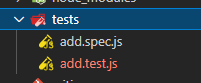
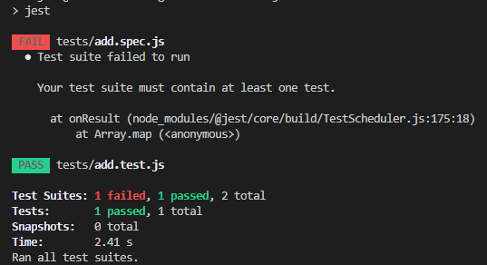

### 目标
- 掌握使用 vue-cli 
- 掌握使用 jest
- 掌握使用 vue-test-uitls
- 掌握测试组件的思想
- 掌握写测试的三部曲

## 1、单文件组件 SFC

以`.vue`结尾的文件，称为单文件组件（SFC，Single File Component）
### 优点
- 完整语法高亮
- 组件作用域的 `CSS`
- `vscode`插件：`vetur`

## 2、vue-cli

官方地址: [https://cli.vuejs.org/zh/](https://cli.vuejs.org/zh/)

Vue CLI 是一个基于 Vue.js 进行快速开发的完整系统

- 通过 @vue/cli 实现的交互式的项目脚手架。
- 通过 @vue/cli + @vue/cli-service-global 实现的零配置原型开发。
- 一个运行时依赖 (@vue/cli-service)，该依赖：
  - 可升级；
  - 基于 webpack 构建，并带有合理的默认配置；
  - 可以通过项目内的配置文件进行配置；
  - 可以通过插件进行扩展。
- 一个丰富的官方插件集合，集成了前端生态中最好的工具。
- 一套完全图形化的创建和管理 Vue.js 项目的用户界面。

### 优点
- **功能丰富**：集成了所有前端生态里最优秀的工具
- **易于扩展**：插件系统
- **CLI 之上的图形化界面**：可以使用可视化页面创建项目
- **面向未来**：为现代浏览器轻松产出原生的 ES2015 代码，或将你的 Vue 组件构建为原生的 Web Components 组件
- **无需 eject**：Vue CLI 完全是可配置的，无需 eject。这样你的项目就可以长期保持更新了。

### 安装

`npm i @vue/cli -g` 或者 `npm i -g '@vue/cli'`

- 查看vue指令 `vue`
- 查看安装版本  `vue -V`

<enlarge>

</enlarge>

### 使用

创建、开发、构建项目级别

- 创建: `vue create [projectName]`
- 开发： `yarn serve | npm run serve`
- 构建: `yarn build | npm run serve`

### 插件

安装：`vue add [pluginName]`
- `vue add @vue/eslint`
- `vue add @vue/unit-jest`

### 可视化 GUI

通过可视化界面配置创建项目：`vue ui`

### 入口文件`main.js`

完成模板编译、模板渲染、创建虚拟节点、完成挂载：

```js
import Vue from 'vue'
import App from './App.vue'

// tip
Vue.config.productionTip = false

// template -> render(h) -> createVnode()
new Vue({
  render: h => h(App),
}).$mount('#app')

// $mount() -> api
// el: '#app' -> config
```

## 3、案例 TodoList

`todo-list`: [http://todomvc.com/examples/vue/#/active](http://todomvc.com/examples/vue/#/active)
	
### 开发思想

- 迭代思想
 - 先开发最基础的功能，然后逐步扩展其功能
- tasking
	- 输入一个 todo ，按下回车可以添加一个 todo
	- 删除一个 todo
	- 完成一个 todo
- 步骤
  - 构建视图
  - 确定数据结构
  - 编写交互逻辑

```html
<!-- TodoList.vue -->
<template>
  <div>
    <h3>todo-list</h3>
    <input type="text" @keyup.enter="addTodo" v-model="newTodo">
    <ul>
      <li v-for="todo in todoList" :key="todo.id">
        <todo-item :todo='todo' @remove="removeTodo" @complete="completeTodo"></todo-item>
      </li>
    </ul>
  </div>
</template>
<script>
import TodoItem from './TodoItem.vue'
export default {
  components: {
    TodoItem
  },
  data() {
    return {
      id: 1,
      newTodo: '',
      todoList: []
    }
  },
  methods: {
    addTodo() {
      // 添加 todo 的逻辑实现
      this.todoList.push({
        id: this.id++,
        text: this.newTodo,
        state: 'active'
      })
      this.newTodo = ''
    },
    removeTodo(id) {
      console.log(id)
      this.todoList = this.todoList.filter(todo => todo.id !== id)
    },
    completeTodo(id) {
      // mvvm
      const todo = this.todoList.find(todo => todo.id === id)
      if(todo) {
        todo.state = 'completed'
      }
    }
  },
}
</script>
<style lang="">
  
</style>
```

```html
<!-- TodoItem.vue -->
<template>
  <div>
    <p :class='{completed: todo.state === "completed"}'>{{todo.text}}</p>
    <button @click="removeTodo">remove</button>
    <button @click="completeTodo">completed</button>
  </div>
</template>
<script>
export default {
  props: ['todo'],
  methods: {
    removeTodo() {
      this.$emit('remove', this.todo.id)
    },
    completeTodo() {
      this.$emit('complete', this.todo.id)
    }
  },
}
</script>
<style>
  .completed{
    text-decoration: line-through;
  }
</style>
```

## 4、单元测试

### 定义

- 指对软件中的最小可测试单元进行检查和验证
- 单元
	- 可以是一个函数
	- 可以是一个类
	- 可以是一个模块
- 快

```html
<!-- Button.vue -->
<template>
  <div>
    <button @click="handleClick"><slot></slot></button>
  </div>
</template>

<script>
export default {
  props: {
    disabled: {
      type: Boolean,
      default: false,
    },
  },
  methods: {
    handleClick() {
      if (this.disabled) return;
      this.$emit("click");
    },
  },
};
</script>

<style></style>

```

```js
// Button.spec.js
describe("Button", () => {
  it("button slot 显示的内容", () => {});

  it("测试 button 点击的时候发出 click 自定义事件", () => {});

  it("测试设置 disabled 属性后，click 事件不能发出", () => {
    // click emit
  });
});
```

### 好处
- 自动化
- 重构： 增加自信心
- 减少调试时间
- 活文档：一个单元测试可以运用在多个同类功能上

### 三部曲
- given：准备数据
- when：触发测试动作
- then：验证结果

```js
  test(" 1+1=2 ", () => {
    // given -> 准备数据
    const a = 1;
    const b = 1;

    // when -> 触发动作
    const result = add(a, b);

    // toBe -> 匹配器
    // then -> 验证
    expect(result).toBe(2);
  });
```

## 5、Jest

官网：[https://jestjs.io/docs/zh-Hans/using-matchers](https://jestjs.io/docs/zh-Hans/using-matchers)

- **安装**<br>
与`TypeScript`配套安装： `npm i jest  @types/jest  -D`

- 全局配置

将以下代码配置到`package.json`
```js
"scripts": {
  "test": "jest"
}
```

- 测试文件夹

文件后缀名为`.spec.js`或`.test.js`



### 执行测试文件

`npm run test | yarn test`

执行通过、执行失败的结果显示：



### 基础知识
- describe: 描述块
- test | it 测试主体
- [匹配器](https://jestjs.io/zh-Hans/docs/expect)
  - toBe 是
  - toEqual 等于
  - not.toBe 不是
  - toContain 包含
- setup | Teardown
  - beforeEach
  - afterEach
  - beforeAll
  - afterAll

## 6、vue-test-utils

`vue-test-utils`是 Vue.js 官方的单元测试实用工具库。

- 官网：[https://vue-test-utils.vuejs.org/zh/](https://vue-test-utils.vuejs.org/zh/)

- 安装：`vue add @vue/unit-jest`

### 原理
- `Vue Test Utils` 通过将组件隔离挂载，然后模拟必要的输入 (prop、注入和用户事件) 和对输出 (渲染结果、触发的自定义事件) 的断言来测试 Vue 组件。
- 被挂载的组件会返回到一个包裹器内，而包裹器会暴露很多封装、遍历和查询其内部的 Vue 组件实例的便捷的方法。

### 测试组件的思想
- 确定 input(输入) 以及 output(输出)
- input(输入)
  - props
  - 用户交互：click事件
  - slots
- output(输出)
	-	vue events
	-	rendered output 
	-	function calls
- 不要测试细节！！！

### 事件测试依赖
- `sinon`: 对事件的测试

- vtu测试组件事件的方法：[setMethods](https://vue-test-utils.vuejs.org/zh/api/wrapper/#setmethods)
- vtu测试组件事件的[emitted](https://vue-test-utils.vuejs.org/zh/api/wrapper/#emitted)属性：

```js
// 测试button的点击事件
import { mount } from '@vue/test-utils'
import sinon from 'sinon'
import Foo from './Foo.vue'

const wrapper = mount(Foo)
const clickMethodStub = sinon.stub()

wrapper.setMethods({ clickMethod: clickMethodStub })
wrapper.find('button').trigger('click')
expect(clickMethodStub.called).toBe(true)
```

### [匹配器](https://jestjs.io/zh-Hans/docs/expect)

vue-test-utils使用的匹配器由jest提供

## 7、练习

- 给 Button 组件添加测试
  - 使用 vue-cli 创建项目
  - 测试 button slot 显示的内容
  - 测试 button 点击的时候发出 click 自定义事件
  - 测试设置 disabled 属性后，click 事件不能发出

```js
import { mount, shallowMount } from '@vue/test-utils'
import sinon from 'sinon'
import Button from '@/components/Button.vue'

describe('Button.vue', () => {
  it('测试 button slot 显示的内容', () => {
    const msg = '点击'
    const wrapper = shallowMount(Button, {
      slots: {
        default: msg
      }
    })
    expect(wrapper.text()).toContain(msg)
  })

  it('测试 button 点击的时候发出 click 自定义事件', async () => {
    // Return an object containing custom events emitted by the Wrapper vm
    const wrapper = mount(Button)

    wrapper.vm.$emit('click')
    await wrapper.vm.$nextTick() // Wait until $emits have been handled
    expect(wrapper.emitted().click).toBeTruthy() // assert event has been emitted
  })

  it('测试设置 disabled 属性后，click 事件不能发出', async () => {
    const clickHandler = sinon.stub()
    const disabled = true
    const wrapper = mount(Button, {
      propsData: {
        disabled: disabled
      }
    })    
    
    await wrapper.find('button').trigger('click')

    expect(wrapper.props().disabled).toBe(disabled)
    expect(clickHandler.called).toBe(false)
  })
  
})
```
