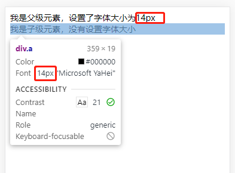
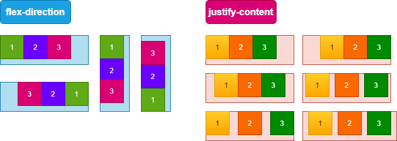
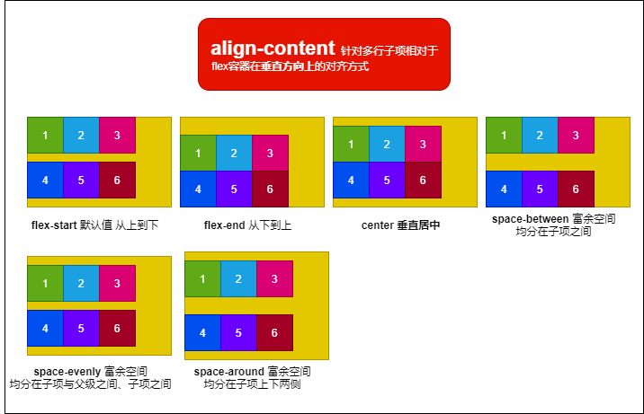
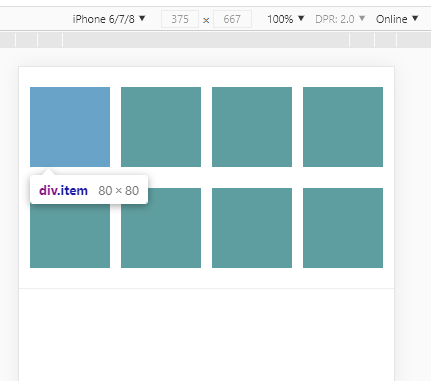

## 1、视口
视口用于调整移动端页面的展示效果。在浏览器范畴里，它代表的是浏览器中网站可见内容的部分。视口当前可见的部分叫做**可视视口**（`visual viewport`）。可视视口可能会比**布局视口**（`layout viewport` ）更小，因为当用户缩小浏览器缩放比例时，布局视口不变，而可视视口变小了。
```html
<!-- meta元素：表示元数据信息，
设置了name属性，作为元数据的名称，设置content属性，作为元数据的值
-->

<meta name="viewport" content="width=device-width, initial-scale=1.0">
<meta name="viewport" content="width=device-width, initial-scale=1.0, user-scale=no">

<!--
  width
  设置的是 layoutviewport 的宽度：width=device-width则设置视口宽度为设备宽度

  initial-scale
  设置页面的初始缩放值，并且这个初始缩放值是相对于 idealviewport 缩放的，
  最终得到的结果不仅会决定 visualviewport，还会影响到 layoutviewpor
  initial-scale=1.0初始化缩放比例为1.0，即不不放大或者缩小视口

  user-scale
  设置是否允许用户进行缩放，user-scale=no不予许用户缩放屏幕
 -->
```
手机浏览器，如果不做任何调整，所有手机得到的默认宽度都是`980px`。
```html
<!-- 打开浏览器模拟器，任何设备的都得到宽度默认为980px -->
<html>
<html lang="en">
<head>
  <meta charset="UTF-8">
  <title>Document</title>
</head>
<!-- body样式
chrome默认width=964px;margin:8px; -->
<body>
  <div>12312</div>
</body>
</html>
````
<enlarge></enlarge>

只有设置了视口，移动端页面的宽度才是适配的。
```html
<!DOCTYPE html>
<html lang="en">
<head>
  <meta charset="UTF-8">
  <meta http-equiv="X-UA-Compatible" content="IE=edge">
  <!-- 
    viewport
    对pc没有影响；
    如果不设置，移动端页面默认为980px；
    媒体查询 @media 响应式布局中，会根据媒体查询功能来适配多端布局；
    为产出高保真页面，一般给出750px设计稿，通过设置viewport进行整体换算
   -->
  <meta name="viewport" content="width=device-width, initial-scale=1.0">
  <title>Document</title>
</head>
<body>
  设置了视口
</body>
</html>
```
<enlarge></enlarge>

### 为什么要设置视口
`viewport` 的设置不会对 `PC` 页面产生影响，但对于移动页面却很重要
- 媒体查询 `@media` 响应式布局中，会根据媒体查询功能来适配多端布局，必须对 `viewport` 进行设置，否则根据查询到的尺寸无法正确匹配视觉宽度而导致布局混乱。如不设置 `viewport` 参数，那么移动端媒体查询的结果将是 `980px` 这个节点布局的参数，而非我们通常设置的 `768px` 范围内的这个布局参数
- 由于目前多数手机的 `dpr`(`devicePixelRadio`，设备像素比，一个 `CSS` 像素的大小与一个物理像素的大小之间的比率) 都不再是 `1`，为了产出高保真页面，我们一般会给出 `750px` 的设计稿，那么就需要通过设置 `viewport` 的参数来进行整体换算，而不是在每次设置尺寸时进行长度的换算。
## 2、适配 - ♥
### 1、如何在移动端实现一个宽度`50%`的元素?
- (1)使用`vw`单位，相对于视口的宽度的`1%`：`width:50vw;`
- (2)使用`rem`单位，相对于根元素的字体大小，比如`750px`宽度的像素：`(html)font-size:1vw;(其他元素)width:50rem;`
### 2、如何保证某个元素在任何地方任何位置都是`50%`?
- 1、设置视口
- 2、设置页面拆分比例：比例由自己定
    - 比如设计稿宽度为`750px`，分成`100`分，那么每一份的宽度为 (`750px/100=7.5px`)
    - 当设计稿中某个元素宽度为`80px`时，则该元素占 (`80px/7.5=10.66666666667份`)
    - 一份等于`1rem`
    - 这时候`html`元素的`font-size`也要设置为屏幕宽度的`100`分之一（即`100vw/100=1vw`）
- 3、去设计稿量元素的宽度，然后换算成分数 
```html
<!-- 元素在任何位置宽度都是屏幕的50%：宽度和高度 -->
<!DOCTYPE html>
<html lang="en">
<head>
  <meta charset="UTF-8">
  <meta http-equiv="X-UA-Compatible" content="IE=edge">
  <meta name="viewport" content="width=device-width, initial-scale=1.0">
  <title>Document</title>
  <style>
    body{
      margin: 0;
    }
    .main{
      width: 300px;
    }
    .box{
      /* width: 50%; 不靠谱*/
      width: 50vw;
      height: 100px;
      background-color: blue;
    }
  </style>
</head>
<body>
  <div class="main">
  <!-- 
    直接设置元素为百分比不靠谱，因为元素宽度是相对于父元素的宽度，而不是相对根元素的宽度

    vw: viewport width, 相对于根元素（视口）宽度的比例
    1vw: 1%的视口宽度
    比如视口宽度为750px，1vw = 750 * 1% = 7.5px; 100vw = 750 * 100% = 750px

    vh: 高度的1%，由于每个设备的高度都不一样，不好处理高度
   -->
    <div class="box"></div>
  </div>
</body>
</html>
```
```html
<!DOCTYPE html>
<html lang="en">
<head>
  <meta charset="UTF-8">
  <meta http-equiv="X-UA-Compatible" content="IE=edge">
  <meta name="viewport" content="width=device-width, initial-scale=1.0">
  <title>Document</title>
  <style>
    html{
      font-size: 10vw; /*字体大小设为视口大小的1/10*/
    }
    body{
      margin: 0;
    }
    .box{
      width: 5rem; /*如何使此宽度为屏幕50%？1rem=2vm*/
      height: 300px;
      background-color: blue;
    }
  </style>
</head>
<body>
  <!-- 
    已知box宽度为5rem,如何调整根元素的font-size使其宽度为50%
    解决方法：将根元素字体大小设置为视口宽度的1/10
   -->
  <div class="box"></div>
</body>
</html>
```
```html
<!-- 
  适配所有手机：
  1、设置视口
  2、设置页面拆分比例：比例由自己定
     比如设计稿宽度为750，分成100分，那么每一份的宽度为 (750px/100=7.5px)
     当设计稿中某个元素宽度为80px时，则该元素占 (80px/7.5=10.66666666667份)
     一份等于1rem
     这时候html元素的font-size也要设置为屏幕宽度的100分之一（即100vw/100=1vw）
  3、去设计稿量元素的宽度，然后换算成分数
 -->
<!DOCTYPE html>
<html lang="en">
<head>
  <meta charset="UTF-8">
  <meta http-equiv="X-UA-Compatible" content="IE=edge">
  <meta name="viewport" content="width=device-width, initial-scale=1.0">
  <title>Document</title>
  <style>
    html{
      /* 
        设备宽度 100vw
        320px 32px = 1rem = 10vw
        360px 36px = 1rem = 10vw
       */
      /* font-size: 10vw; */
      font-size: 1vw;
    }
    body{
      margin: 0;
    }
    .box{
      /* width: 5rem; 使5rem为宽度50%，即为视口宽度/2 */
      width: 50rem;
      height: 300px;
      background-color: blue;
    }
  </style>
</head>
<body>
  <!-- 
    已知box宽度为5rem,如何调整根元素的font-size使其宽度为50%
    解决方法：将根元素字体大小设置为视口宽度的1/10
   -->
  <div class="box">666</div>
</body>
</html>
```
## 3、单位 - ♥

>

**不同系统默认字体大小不一样，chrome默认文字大小为`16px`，默认元素的字体大小继承于父级元素**

> 

**默认元素字体大小继承于父级元素字体大小**

>

### em - 不建议
**1、元素字体使用em为单位**

比如元素字体大小为`font-size: 10em;`
- 当前字体大小为父元素字体大小的`10`倍
- 若父元素字体大小为`16px`，则当前字体大小为`160px`
- 若父元素字体大小为`12px`，则当前字体大小为`120px`
```html
<!-- 下面每个元素的字体大小分别为多少 -->
<body>
  <div>没有样式元素</div>
  <div class="main">
    我是父级元素，分别设置了字体大小为14px、1em
    <div class="a">我是子级元素，分别没有设置字体大小、设置字体为10em</div>
  </div>
</body>
```

**2、元素宽度使用em为单位**

比如元素宽度为`width:2em;`，先转换为当前字体大小，然后再乘以`2`倍

**总结**
由于`em`是相对于当前元素的字体大小的单位，所以不同元素字体不同，也不好维护，所以不建议使用。
### rem - root em
`rem`为相对于根元素的文字大小，不管元素有没有默认值，或者父元素有没有设置，使用了`rem`单位的当前元素的宽度或者字体大小都是相对于根元素计算的。

## 4、案例
```html
<!DOCTYPE html>
<html lang="en">
<head>
  <meta charset="UTF-8">
  <meta http-equiv="X-UA-Compatible" content="IE=edge">
  <meta name="viewport" content="width=device-width, initial-scale=1.0">
  <title>Document</title>
  <style>
    /* 假设设计稿宽度为750px */
    body{
      margin: 0;
    }
    html{
      /* 
        1、设置视口
          750(px)/25(rem) =30(px)
       */
      font-size: 4vw; /* 30px */
    }
    .box{
      width: 8.3333334rem; /*250px*/
      height: 100px;
      background-color: #899;
    }
  </style>
</head>
<body>
  <div class="box"></div>
  <!-- <script>
    // js解决vw的兼容性问题 - 切换虚拟设备需要刷新页面才能生效
    let RootEl = document.documentElement
    let Vwidth = window.innerWidth
    RootEl.style.fontSize = Vwidth/100*4 + 'px'
  </script> -->
</body>
</html>
```
## 5、像素

### 像素

- **物理像素**（`physical pixel`）：手机屏幕上显示的最小单元，该最小单元具有颜色及亮度的属性可供设置。（屏幕上有多少个发光二极管）
- **设备独立像素**（`density-indenpendent pixel`）：此为**逻辑像素**，计算机设备中的一个点，`css` 中设置的像素指的就是该像素。老早在没有 `retina` 屏之前，设备独立像素与物理像素是相等的。
- **设备像素比**（`dpr, device pixel ratio`）：**设备像素比(`dpr`) = 物理像素/设备独立像素**。如 `iphone 6、7、8` 的 `dpr` 为 `2`，那么`1`个设备独立像素便为 `4 `个物理像素，因此在 `css` 上设置的 `1px` 在其屏幕上占据的是 `2`个物理像素，`0.5px` 对应的才是其所能展示的最小单位。这就是 `1px` 在 `retina` 屏上变粗的原因，目前有很多办法来解决这一问题。

```html
<!DOCTYPE html>
<html lang="en">
<head>
    <meta charset="UTF-8">
    <title>Title</title>
  <style>
    .box{
      height: 1px;
      background: #0a0a0a;
    }
  </style>

</head>
<body>

<div class="box" id="box"></div>

<script>
  box.style.transform = 'scale(1,'+ 1/window.devicePixelRatio +')';
  document.write('<meta name="viewport" content="width=device-width,initial-scale='+ 1/window.devicePixelRatio +'">')
</script>

一个物理像素就是一个发光二极管

像素比：1  用一个物理像素显示一个逻辑像素
       2  用4个物理像素显示一个逻辑像素
       3  用9个物理像素显示一个逻辑像素
       4  用16个物理像素显示一个逻辑像素

为什么在手机上 1像素的线看起来会比较粗
解决这个问题的思路：
  1，让一个物理像素显示一个逻辑像素
      性能问题：页面要操作的像素点更多了，如果要做动画的话，性能会受到影响
  2，让线缩小
      用js去操作dom,进行缩小
      缺点就是如果要缩小的地方太多，那么可能会需要过多的操作dom
  3，用图片（svg）

</body>
</html>

```

## 6、flex 布局 - ♥
- `flex`属性是`flex-grow`，`flex-shrink`和`flex-basis`的缩写
- `flex`让所有弹性盒模型对象的子元素都有相同的长度，且忽略它们内部的内容，用于设置或检索弹性盒模型对象的子元素如何分配空间。
- 在`Flex`布局中，`flex`子元素的设置`float`，`clear`以及`vertical-align`属性都是没有用的。
### 作用在父级身上的属性
- 当子项多行显示时，`align-items`失效，因为其只针对单行
- 用`flex-wrap`可以控制子项单行或多行显示
```js
/*用来控制子项整体布局方向，是从左往右还是从右往左，是从上往下还是从下往上。*/
`flex-direction`: row | row-reverse | column | column-reverse;

/*用来控制子项整体单行显示还是换行显示，如果换行，则下面一行是否反方向显示。*/
`flex-wrap`: nowrap | wrap | wrap-reverse;

/*是flex-direction和flex-wrap的缩写*/
`flex-flow`: <‘flex-direction’> || <‘flex-wrap’>

/*属性决定了水平方向子项的对齐和分布方式*/
`justify-content`: flex-start | flex-end | center | space-between | 
                   space-around | space-evenly;

/*子项们相对于flex容器在垂直方向上的对齐方式*/
`align-items`: stretch | flex-start | flex-end | center | baseline;

/*针对多行子项们相对于flex容器在垂直方向上的对齐方式*/
`align-content`: stretch | flex-start | flex-end | center | 
                 space-between | space-around | space-evenly;
```




**单行子项水平垂直都居中**
```css
.box{
  display: flex;
  justity-content: space-evenly|space-between|center;
  align-items: center
}
```
### 作用在子级身上的属性
```js
/* 数值，默认值是 1 */
`order: <integer>;`

/*
  数值，默认值是 1
  flex-grow属性中的grow是扩展的意思，扩展的就是flex子项所占据的宽度，
  扩展所侵占的空间就是除去元素外的剩余的空白间隙。
*/
`flex-grow: <number>;` 

/*
  数值，默认值是 1
  shrink是“收缩”的意思，flex-shrink主要处理当flex容器空间不足时候，
  单个元素的收缩比例。
*/
`flex-shrink: <number>;` 

/*
  默认值是 auto
  定义了在分配剩余空间之前元素的默认大小。
  相当于对浏览器提前告知我要占据这么大的空间，提前帮我预留好。
*/
`flex-basis: <length> | auto;` 

/*
  flex属性是flex-grow，flex-shrink和flex-basis的缩写。
*/
`flex`: none | auto | [ <'flex-grow'> <'flex-shrink'>? || <'flex-basis'> ]

`align-self`: auto | flex-start | flex-end | center | baseline | stretch;
```

## 7、flex案例

```html
<!DOCTYPE html>
<html lang="en">
<head>
  <meta charset="UTF-8">
  <meta http-equiv="X-UA-Compatible" content="IE=edge">
  <meta name="viewport" content="width=device-width, initial-scale=1.0">
  <title>Document</title>
  <style>
    * {
      margin: 0;
    }
    html {
      font-size: 4vw;
      /*750/@rem 30/@rem*/
    }
    html .box {
      width: 25rem;
      height: 18.46666667rem;
      display: flex;
      flex-wrap: wrap;
      justify-content: space-around;
      align-content: space-around;
      border-bottom: 0.06666667rem solid #eee;
    }
    html .box .item {
      width: 5.33333333rem;
      height: 5.33333333rem;
    }
  </style>
</head>
<body>
  <div class="box">
    <div class="item"></div>
    <div class="item"></div>
    <div class="item"></div>
    <div class="item"></div>
    <div class="item"></div>
    <div class="item"></div>
    <div class="item"></div>
    <div class="item"></div>
  </div>
</body>
</html>
````

```less
*{
  margin: 0;
}
@rem: 30rem/2; // dpr:2.0
html{
  font-size: 4vw; /*750/@rem 30/@rem*/
  .box{
    width: 25rem;
    height: (277/@rem);
    display: flex;
    flex-wrap: wrap;
    justify-content: space-around;
    align-content: space-around;
    border-bottom: (1/@rem) solid #eee;
    .item{
      width: (80/@rem);
      height: (80/@rem);
    }
  }
}
```