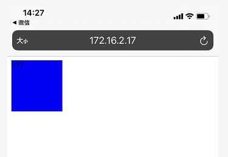

## 0、手机访问电脑本地页面

### anywhere
 - 提供了一个 `node` 服务器 
 - 安装：`npm i anywhere -g` 
 - 使用，在当前目录下，使用命令行 `anywhere`

### 手机如何访问电脑本地localhost网页, 以调试项目?

- （1）`vscode`安装`live server`插件，打开`demo.html`文件，右键选择`Open with Live Server`访问页面，地址为`http://127.0.0.1:5500/demo.html`
- （2）电脑连接无线局域网，打开`cmd`输入`ipconfig`查找 `IPv4`地址`176.16.2.17`
- （3）用手机浏览器访问`http://176.16.2.17:5500/demo.html`即可，**注意要关闭电脑防火墙，否则无法访问**
>
>
>

## 1、touch事件
- 移动端使用`touch`事件和`mouse`事件，以兼容非移动端页面的事件，`pc`端只能使用`mouse`事件
- 移动端的`touch`事件会立即执行，`mouse`事件会延迟执行
- 会让某个元素在`touch`事件下消失

**注意**，`display:inline`的内联标签绑定`touch`事件无效

### touch事件
- `touchstart` 在元素身上按下
- `touchmove`  手指在元素身上按下之后，在屏幕中移动
- `touchend`   手指在元素身上按下之后，在屏幕中任意位置抬起
### mouse中相对应的事件
- `mousedown`  在元素身上按下鼠标
- `mousemove`  在元素身上移动鼠标（抚摸事件）鼠标是否按下都不影响
- `mouseup`    在元素身上按下之后鼠标抬起

```js
let box = document.querySelector('.box')

// 触屏事件
box.addEventListener('touchstart', function(){
  // 手指在元素身上按下
  console.log('start');
})
box.addEventListener('touchend', function(){
  // 手指在元素身上按下之后，在屏幕中任意位置抬起
  console.log('end');
})
box.addEventListener('touchmove', function(){
  // 手指在元素身上按下之后，在屏幕中移动
  console.log('move');
})

// 鼠标事件
// click事件在移动端执行会有延迟
// box.addEventListener('click', function() {
//   console.log('click');
// })
// box.addEventListener('mouseover', function() {
//   console.log('over');
// })
// box.addEventListener('mousemove', function() {
  // 在元素身上移动鼠标（抚摸事件）鼠标是否按下都不影响
//   console.log('move');
// })
// box.addEventListener('mousedown', function() {
  // 在元素身上按下鼠标
//   console.log('down');
// })
// box.addEventListener('mouseup', function() {
  // 在元素身上按下之后鼠标抬起
//   console.log('up');
// })
// box.addEventListener('mouseleave', function() {
//   console.log('leave');
// })
```

## 2、事件穿透
- 在移动端点击元素的时候，会立即执行元素身上的`touch`事件，同时记录点击坐标
- 等`touch`事件执行完成之后，会在此坐标中，查找元素，并且执行元素身上的`mouse`事件
- `mouse`事件和`touch`事件可以不在同一个元素身上，只在乎这两个元素是否在同一个坐标

```html
<!DOCTYPE html>
<html lang="en">
<head>
  <meta charset="UTF-8">
  <meta http-equiv="X-UA-Compatible" content="IE=edge">
  <meta name="viewport" content="width=device-width, initial-scale=1.0">
  <title>Document</title>
  <style>
    .box{
      width: 200px;
      height: 200px;
      background-color: rgba(0, 0, 0, 0.3);
      position: absolute;
      top: 0;
      left: 0;
    }
  </style>
</head>
<body>
  <div class="box">这是一段文字</div>
  <!-- href（一个默认的鼠标事件） -->
  <a href="https://www.kaikebai.com">开课吧</a>
  <div class="text">text文本</div>
  <script>
    let box = document.querySelector('.box')
    let text = document.querySelector('.text')
    box.addEventListener('touchstart', function(){
      console.log('手指开始按下');
    })
    box.addEventListener('touchmove',function(){
      console.log('手指移动');
    })
    box.addEventListener('touchend',function(){
      console.log('手指抬起');
      this.style.display = 'none'
    })

    text.onclick = function() {
      console.log('执行了text的点击事件');
    }
    /* 
    事件穿透：
    在移动端触碰元素时候，会立即执行元素的touch事情
    然后记录触碰的坐标，延迟一段时间再从这个坐标上查找元素，
    找到元素之后，如果元素有mouse事件，则执行mouse事件

    解决方法：
    1、不要在移动端使用mouse、click事件，包括a便签的href(一个默认的鼠标事件)
    2、延迟执行mouse事件
    3、阻止默认事件`e.preventDefault()`- 用的比较多
    */

  </script>
</body>
</html>
```
## 3、解决事件穿透

### 如何解决事件穿透的问题？
- 1、不要在移动端使用任何的鼠标事件，包括`a`标签的`href`(就是一个默认的鼠标事件)
- 2、延迟执行`touch`事件的执行内容
- 3、阻止默认事件`ev.preventDefault()` - 使用比较多
```html
<!DOCTYPE html>
<html lang="en">
<head>
  <meta charset="UTF-8">
  <meta http-equiv="X-UA-Compatible" content="IE=edge">
  <meta name="viewport" content="width=device-width, initial-scale=1.0">
  <title>Document</title>
  <style>
    .box{
      width: 200px;
      height: 200px;
      background-color: rgba(0, 0, 0, 0.3);
      position: absolute;
      top: 0;
      left: 0;
    }
  </style>
</head>
<body>
  <div class="box">这是一段文字</div>
  <!-- href（一个默认的鼠标事件） -->
  <a href="https://www.kaikebai.com">开课吧</a>
  <div class="text">text文本</div>
  <script>
    let box = document.querySelector('.box')
    let text = document.querySelector('.text')
    box.addEventListener('touchstart', function(){
      console.log('手指开始按下');
    })
    box.addEventListener('touchmove',function(){
      console.log('手指移动');
    })
    box.addEventListener('touchend',function(e){
      console.log('手指抬起');
      this.style.display = 'none'
      e.preventDefault() // 阻止默认事件
      // 延迟执行mouse事件 - 解决事件穿透
      // setTimeout(() => {
      //   this.style.display = 'none'
      // }, 100)
    })

    text.onclick = function() {
      console.log('执行了text的点击事件');
    }
    /* 
    事件穿透：
    在移动端触碰元素时候，会立即执行元素的touch事情
    然后记录触碰的坐标，延迟一段时间再从这个坐标上查找元素，
    找到元素之后，如果元素有mouse事件，则执行mouse事件

    解决方法：
    1、不要在移动端使用mouse、click事件，包括a便签的href(一个默认的鼠标事件)
    2、延迟执行mouse事件
    3、阻止默认事件`e.preventDefault()`- 用的比较多
    */
  </script>
</body>
</html>
```

## 4、阻止默认事件
- `touch`事件不允许在`document`、`documentElement`、`body`、`window`等这些全局元素身上阻止默认事件
- `Adeventlistener` 其实有第三个参数 ： `{passive:true}` 值默认为`true`意为不允许，设为`false`则是允许阻止默认事件
- 当属性`passive`的值为`true`的时候，代表该监听器内部不会调用`preventDefault`函数来阻止默认滑动行为，`Chrome`浏览器称这类型的监听器为被动（`passive`）监听器。
### 阻止touchstart全局默认事件带来的影响
- 阻止所有的`mouse`事件
- 阻止多指缩放
- 阻止系统菜单
- 阻止元素获得焦点
- 阻止滚动条
- 阻止内容选中

### 阻止touchmove全局默认事件带来的影响
- 阻止多指缩放
- 阻止滚动条

### 阻止touchend全局默认事件带来的影响
- 阻止部分`mouse`事件
- 阻止元素获得或者失去焦点

```html
<!DOCTYPE html>
<html lang="en">
<head>
  <meta charset="UTF-8">
  <meta http-equiv="X-UA-Compatible" content="IE=edge">
  <meta name="viewport" content="width=device-width, initial-scale=1.0">
  <title>Document</title>
</head>
<body>
  <input type="text">
  <!-- 模拟a标签的跳转 -->
  <span data-href="http://www.kaikeba.com" data-add="3" >开课吧</span>
  <!-- <a href="http://www.kaikeba.com">开课吧</a> -->
  <script>
    // 谨慎使用阻止默认事件
    // document.addEventListener('touchend',function(e){
    //   /*
    //     阻止了document的默认事件的影响:
    //     input标签无法输入文本
    //     a标签无法跳转    
    //   */
    //   e.preventDefault()
    // }, {
    //   passive: false
    // })
    // 模拟a标签的跳转
    document.addEventListener('touchend', function(e){
      let dataset = e.target.dataset
      for(let key in dataset) {
        if(events[key]) {
          events[key](dataset[key])
        }
      }
    })
    let events = {
      href: function(value) {
        console.log(value);
        window.location.href = value
      },
      add: function(value) {
        return value * 3
      }
    }
  </script>
</body>
</html>
```

## 5、TouchEvent 对象详解
- `changedTouches` 触发当前事件的手指列表（一个手指或者多个手指同时操作）
- `targetTouches` 当前元素上的手指列表（一个手指或者多个手指同时操作）
- `touches` 当前屏幕中的手指列表（一个手指或者多个手指同时操作）

## 6、案例一：模拟屏幕滑动效果
```html
<!DOCTYPE html>
<html lang="en">
<head>
  <meta charset="UTF-8">
  <meta http-equiv="X-UA-Compatible" content="IE=edge">
  <meta name="viewport" content="width=device-width, initial-scale=1.0">
  <title>Document</title>
  <style>
    *{
      margin: 0;
    }
    body{
      overflow: hidden;
    }
    .item{
      line-height: 36px;
    }
    .item:nth-child(odd) {
      background-color: #eee;
    }
  </style>
</head>
<body>
  <div class="list"></div>
  <script>
    // 滑屏效果 - 模拟scroll事件
    let list = document.querySelector('.list')
    list.innerHTML = [...('.'.repeat(100))].map((item,index)=>{
      return `<div class="item">这是第${index}个元素</div>`
    }).join('')
    

    let startPoint = 0 // 手指摁下的位置
    let transY = 0 // 手指移动的距离
    let startY = 0 // 手指摁下时，元素的位置
    let lastTransY = 0 // 上一次手指移动的距离

    list.style.transform = 'translateY('+ lastTransY +'px)'

    list.addEventListener('touchstart', function(e){
      startPoint = e.changedTouches[0].pageY
      startY = lastTransY
    })
    list.addEventListener('touchmove', function(e){
      transY = e.changedTouches[0].pageY - startPoint
      lastTransY = transY + startY // 上一次手指移动的距离=手指移动距离+手指摁下时，元素的位置
      list.style.transform = 'translateY('+ lastTransY +'px)'
    })
  </script>
</body>
</html>
```

## 7、案例二：幻灯片
```html
<!DOCTYPE html>
<html lang="en">
<head>
  <meta charset="UTF-8">
  <meta http-equiv="X-UA-Compatible" content="IE=edge">
  <meta name="viewport" content="width=device-width, initial-scale=1.0">
  <title>Document</title>
  <style>
    *{
      margin: 0;
    }
    .box{
      overflow: hidden;
    }
    .list{
      display: flex;
      transition: 0.5s; /*过渡*/ 
    }
    img{
      width: 100vw;
    }
  </style>
</head>
<body>
  <div class="box">
    <div class="list">
      <div></div>
      <div></div>
      <div></div>
      <div></div>
      <div></div>
    </div>
  </div>
  <script>
    let list = document.querySelector('.list')

    let startPoint = 0 // 手指按下的位置
    let transX = 0 // 手指移动的距离
    let startX = 0 // 手指按下时，元素的位置
    let lastTransX = 0 // 上一次手指移动的距离

    let winWidth = window.innerWidth // 获取屏幕宽度
    let percent = 0.3 // 拖动比例超过1/3, 则自动切换
    let cur = 0 // 当前切换的图片张数

    list.addEventListener('touchstart',function(e){
      startPoit = e.changedTouches[0].pageX // 手指摁下的位置
      startX = lastTransX // 手指按下时，元素的位置 = 上一次手指移动的距离
    })
    list.addEventListener('touchmove',function(e){
      transX = e.changedTouches[0].pageX - startPoit
      lastTransX = startX + transX
      list.style.transition = 'none' // 拖动时候不需要过渡
      list.style.transform = `translateX(${lastTransX}px)`
      e.preventDefault(); // 阻止默认事件
    })
    // 手指抬起，拖动距离超过1/3，则自动切换
    list.addEventListener('touchend',function(e){
      if(Math.abs(transX) > winWidth * percent) {
        cur -= transX/Math.abs(transX)
      }
      console.log(cur);
      lastTransX = -cur * winWidth
      list.style.transition = '0.5s' // 结束拖动需要过渡
      list.style.transform = `translateX(${lastTransX}px)`
    })
  </script>
</body>
</html>
```

## 8、案例三：无缝切换幻灯片
```html
<!DOCTYPE html>
<html lang="en">
<head>
  <meta charset="UTF-8">
  <meta http-equiv="X-UA-Compatible" content="IE=edge">
  <meta name="viewport" content="width=device-width, initial-scale=1.0">
  <title>Document</title>
  <style>
    *{
      margin: 0;
    }
    .box{
      overflow: hidden;
    }
    .list{
      display: flex;
      transition: 0.5s; /*过渡*/ 
    }
    img{
      width: 100vw;
    }
  </style>
</head>
<body>
  <div class="box">
    <div class="list">
      <div></div>
      <div></div>
      <div></div>
      <div></div>
      <div></div>
    </div>
  </div>
  <script>
    let list = document.querySelector('.list')
    list.innerHTML += list.innerHTML // 复制图片，实现无缝切换
    let num = 5 // 当前图片为第一张时，图片张数恢复到第五张图片，实现图片的无缝切换

    let startPoint = 0 // 手指按下的位置
    let transX = 0 // 手指移动的距离
    let startX = 0 // 手指按下时，元素的位置
    let lastTransX = 0 // 上一次手指移动的距离

    let winWidth = window.innerWidth // 获取屏幕宽度
    let percent = 0.3 // 拖动比例超过1/3, 则自动切换
    let cur = 0 // 当前切换的图片张数

    list.addEventListener('touchstart',function(e){
      startPoit = e.changedTouches[0].pageX // 手指摁下的位置      

      if(cur === 0) {
        // 当前图片为第一张时，当前图片恢复到第五张，因为它们是同一张相片
        cur = num
      } else if(cur === num * 2 - 1) { 
        // 图片为最后一张图片时候，当前图片恢复到第四张，因为它们是同一张相片
        cur = num - 1
      }
      // 图片张数发生变化时候，移动距离随之改变
      lastTransX = -cur * winWidth
      list.style.transition = '0.5s' // 结束拖动需要过渡
      list.style.transform = `translateX(${lastTransX}px)`
      startX = lastTransX // 手指按下时，元素的位置 = 上一次手指移动的距离
    })
    list.addEventListener('touchmove',function(e){
      transX = e.changedTouches[0].pageX - startPoit
      lastTransX = startX + transX
      list.style.transition = 'none' // 拖动时候不需要过渡
      list.style.transform = `translateX(${lastTransX}px)`
      e.preventDefault(); // 阻止默认事件
    })
    // 手指抬起，拖动距离超过1/3，则自动切换
    list.addEventListener('touchend',function(e){
      if(Math.abs(transX) > winWidth * percent) {
        cur -= transX/Math.abs(transX)
      }
      transX = 0 // 手指拖动的距离需要清空
      lastTransX = -cur * winWidth
      list.style.transition = '0.5s' // 结束拖动需要过渡
      list.style.transform = `translateX(${lastTransX}px)`
    })
  </script>
</body>
</html>
```

## 9、swiper的使用
[swiper](https://www.swiper.com.cn/)

```html
<!DOCTYPE html>
<html lang="en">
<head>
  <meta charset="UTF-8">
  <meta http-equiv="X-UA-Compatible" content="IE=edge">
  <meta name="viewport" content="width=device-width, initial-scale=1.0">
  <title>Document</title>
  <style>
    body{
      margin: 0;
    }
    
    .box{
      overflow: hidden;
      position: relative;
      height: 545px;
    }

    .list{
      display: flex;
      transition: 0.5s;
    }

    .list img{
      width: 100vw;
    }
  </style>
</head>
<body>
  <div class="box swiper-container">
    <div class="list swiper-wrapper">
      <div class="swiper-slide"></div>
      <div class="swiper-slide"></div>
      <div class="swiper-slide"></div>
      <div class="swiper-slide"></div>
      <div class="swiper-slide"></div>
    </div>
  </div>
  <script src="js/swiper.min.js"></script>
  <script>

    var swiper = new Swiper('.swiper-container',{
      loop : true, // 无缝切换
      direcrion: 'vertical' // 垂直切换
    });

  </script>
</body>
</html>
```


## 8、better-scroll - 更强大效果更好

- [BetterScroll 2.0 - 官网](https://better-scroll.gitee.io/docs/zh-CN/)
- [better-scroll 详解](https://blog.csdn.net/feifanzhuli/article/details/90489488)

## 9、scroll-snap-type - 纯样式实现滚动

[scroll-snap-type](https://developer.mozilla.org/zh-CN/docs/Web/CSS/scroll-snap-type)属性定义在滚动容器中的一个临时点（snap point）如何被严格的执行。此属性不能用来指定任何精确的动画或者物理运动效果来执行临时点，而是交给用户代理来处理。
```html
<!DOCTYPE html>
<html lang="en">
<head>
    <meta charset="UTF-8">
    <title>Title</title>
    <style>
        body{
            margin: 0;
        }
        .box{
            width: 100vw;
            height: 100vh;
            border: 1px solid #0a8cd2;
            /*display: flex;*/
            /*white-space: nowrap;*/
            overflow: auto;
            scroll-snap-type: y mandatory;
            -webkit-overflow-scrolling: touch;
        }
        .item{
            width: 100vw;
            height: 100vh;
            margin: 10px 0;
            scroll-snap-align: start;
            scroll-snap-stop: always;
            background: #899;
            display: inline-block;
            font: 80px/100vh '';
            text-align: center;
            color: #fff;
        }
    </style>
</head>
<body>

<div class="box">
    <div class="item">第一个</div>
    <div class="item">two</div>
    <div class="item">3333</div>
    <div class="item">四</div>
    <div class="item">this is five</div>
</div>

</body>
</html>
```