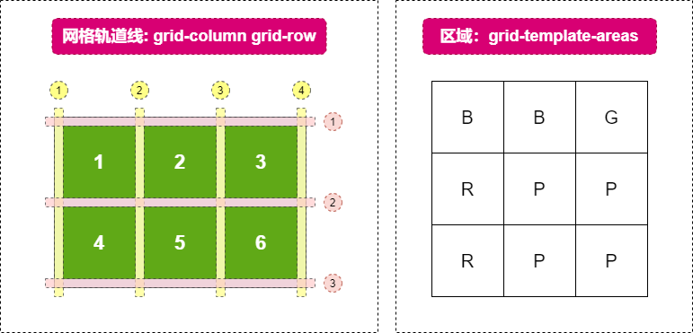
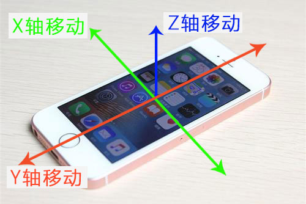

## 1、网格属性 - display: grid

使用`gird`的基本理念是在一个容器元素上创建虚拟的网络，子级自动填充网格，所以`grid`更多的属性都是用在父级容器元素身上。
- `grid-template-columns`: 创建列，用于定义每一列的宽度以及列数
- `grid-template-rows`: 创建行，用于定义每一行的高度以及行数
- `grid-template`：创建行和列，`grid-template-rows`和`grid-template-columns`的缩写
- `grid-gap`: 设置行和列之间的空隙，可以拆分为`grid-row-gap`和`grid-column-gap`
- `minmax(x, y)`函数：定义行或者列的最小高度和最大高度
- `grid-auto-columns`：列出超出时，
```js
// 可以给多个值，如100px 200px 300px 这里定义了三列 宽度分别为100 200 300
`grid-template-columns`: 100px 200px 300px;

// 可以给多个值，如100px 200px 300px 这里定义了三行 高度分别为100 200 300
`grid-template-rows`: 100px 200px 300px;

// minmax(100px, auto)用minmax函数定义一行的最小高度和最大高度
`grid-template-rows`: minmax(100px, auto);

// 接受两组值，第一个值用于定义每一行的高度以及行数，第二个值用于用于定义每一列的宽度和列数
// 两组数值，用'/'分开，第一组数值设置行，第二组数值设置列
`grid-template`: 100px 200px/100px 100px;

// 接受两个值，第一个是行与行之间的间距，第二个是列与列之间的间距
// 如果只给一个值，那么行与列之间的间距是一样
`grid-gap`: 10px 20px;
`grid-gap`: 10px; // 行与列之间间距一样

// 拆分样式
`grid-row-gap`: 10px; // 行与行之间的间距
`grid-column-gap`: 20px; // 列与列之间的间距
```

```html
<!DOCTYPE html>
<html lang="en">
<head>
  <meta charset="UTF-8">
  <meta http-equiv="X-UA-Compatible" content="IE=edge">
  <meta name="viewport" content="width=device-width, initial-scale=1.0">
  <title>Document</title>
  <style>
    .box{
      width: 700px;
      height: 400px;
      background-color: #eee;
      display: grid; /*将整个页面划分为若干行和列，可以任意地设置单元格，比table强大*/
      grid-template-columns: 200px 100px 300px; /*设置三列 每列宽分别为200px 100px 300px*/
      grid-template-rows: 100px 200px; /*设置两行 高度分别为100px 200px*/
    }
    .item{
      background-color: blue;
    }
  </style>
</head>
<body>
  <!-- 从左到右，从上到下 -->
  <div class="box">
    <!-- 第一个单元格 -->
    <div class="item"></div>
    <!-- 第二个单元格 -->
    <div class="item"></div>
  </div>
</body>
</html>
```

## 2、重复创建列（行） - repeat函数
`repeat(x,y)`函数用来创建多个重复的列（行），第一个参数为列（行）数，第二个参数为每一列（行）的宽度（高度）
- 单位`fr`: `fr`是相对单位，相当于弹性盒模式里的一份
- 关键字`auto`：设置`auto`关键字可以让浏览器自己决定单元格的宽高度
- `repeat(auto-fill,100px)`：当子级确定宽度时，在父级容器中尽量多的划分格子以放下更多的子级
```js
`grid-template-columns`: repeat(4, 1fr); // 重复创建4列宽度一样的单元格
`grid-template-rows`: repeat(5,1fr); /*重复创建5行高度一样的单元格*/
`grid-template-rows`: repeat(2,100px); /*重复创建2行高度为100px的单元格*/
`grid-template-columns`: repeat(auto-fill,100px); /*尽量多地划分列，每一列宽度为100px*/
```

## 3、grid 布局 - ♥
`grid`布局比`flex`布局强大，可以轻松地实现各种类型地布局
```js
// 决定了水平方向子项的对齐和分布方式, 和flex一样
`justify-content`: start | end | center | space-between | 
                   space-around | space-evenly;

// 决定了垂直方向上子项的对齐和分布方式
`align-content`: start | end | center | space-between | 
                   space-around | space-evenly;          
```
```html
<!-- 水平和垂直方向上均居中布局 -->
<!DOCTYPE html>
<html lang="en">
<head>
  <meta charset="UTF-8">
  <meta http-equiv="X-UA-Compatible" content="IE=edge">
  <meta name="viewport" content="width=device-width, initial-scale=1.0">
  <title>Document</title>
  <style>
    *{
      margin: 0;
    }
    .box{
      width: 100vw;
      height: 100vh;
      display: grid; /*网格布局*/
      grid-template-rows: repeat(2,100px); /*两行单元格高度为100px*/
      grid-template-columns: repeat(3,100px); /*两列单元格宽度为100px*/
      grid-gap: 20px; /*行与行，列与列之间间距为20px*/
      justify-content: center; /*水平方向上居中*/
      align-content: center; /*垂直方向上居中*/
    }
    .item{
      background-color: blue;
    }
  </style>
</head>
<body>
  <div class="box">
    <div class="item">1</div>
    <div class="item">2</div>
    <div class="item">3</div>
    <div class="item">4</div>
    <div class="item">5</div>
    <div class="item">6</div>
  </div>
</body>
</html>
```

## 4、合并单元格
- #### 单元格的合并需要了解网格的轨道线，其分布情况如下：



```js
// 从父级最左边开始算，如果有四列子元素，那么父级的最右边是5
// 1~3合并第1到第2列
`grid-column-start`: 1; // 开始合并的列
`grid-column-end`: 3; // 结束合并的列

// 综合
`grid-column`: 1/3; // 开始合并的列和结束合并的列

// 合并行
`grid-row-start`: 1; // 开始合并的行轨道线
`grid-row-end`: 3; // 结束合并的行轨道线

// 用区域来合并单元格
// 此属性设置给父级，把对应的每个单元格的名字都写好
`grid-template-areas`: 
'b b g' 
'r p p' 
'r p p'

// 这个属性设置给子级，子级想要放在那个位置，就写上对应的名字
`grid-area`: r
```
### 使用grid-column和grid-rows合并单元格
```html
<!DOCTYPE html>
<html lang="en">
<head>
  <meta charset="UTF-8">
  <meta http-equiv="X-UA-Compatible" content="IE=edge">
  <meta name="viewport" content="width=device-width, initial-scale=1.0">
  <title>Document</title>
  <style>
    *{
      margin: 0;
    }
    .box{
      width: 100vw;
      height: 100vh;
      display: grid; /*网格布局*/
      /* grid-template: repeat(2,100px)/repeat(3,100px); */
      grid-template-rows: repeat(2,100px); /*两行单元格高度为100px*/
      grid-template-columns: repeat(3,100px); /*两列单元格宽度为100px*/
      grid-gap: 20px; /*行与行，列与列之间间距为20px*/
      justify-content: center; /*水平方向上居中*/
      align-content: center; /*垂直方向上居中*/      
    }
    .item{
      background-color: blue;
    }
    .item:nth-child(1) {
      /* 合并列，初始化合并行首为当前的合并列 */
      /* grid-column: 1/3; 相当于grid-column-start: 1;和grid-column-end: 3;*/
      grid-column-start: 1;
      grid-column-end: 3;
      grid-row-start: 1;
    }
    .item:nth-child(2){
      /* 合并行 */
      grid-row-start: 1;
      grid-row-end: 3;
    }
  </style>
</head>
<body>
  <div class="box">
    <div class="item">1</div>
    <div class="item">2</div>
    <div class="item">3</div>
    <div class="item">4</div>
    <!-- <div class="item">5</div> -->
    <!-- <div class="item">6</div> -->
  </div>
</body>
</html>
```
### 使用grid-template-areas和grid-area合并单元格
```html
<!DOCTYPE html>
<html lang="en">
<head>
  <meta charset="UTF-8">
  <meta http-equiv="X-UA-Compatible" content="IE=edge">
  <meta name="viewport" content="width=device-width, initial-scale=1.0">
  <title>Document</title>
  <style>
    .box{
      display: grid;
      grid-template: repeat(2,100px)/repeat(2,100px); /*行/列*/
      grid-gap: 10px;
      /* 给每个区域取名字 */
      grid-template-areas: 
      'a a b b b'
      'a a c d d'
      'e e c f f'
    }
    .item{
      background-color: yellowgreen;
    }
    .item:nth-child(1) {
      grid-area: a;
    }
    .item:nth-child(2) {
      grid-area: b;
    }
    .item:nth-child(3) {
      grid-area: d;
    }
    .item:nth-child(4) {
      grid-area: e;
    }
  </style>
</head>
<body>
  <div class="box">
    <div class="item">1</div>
    <div class="item">2</div>
    <div class="item">3</div>
    <div class="item">4</div>
  </div>
</body>
</html>
```
## 5、Css 横竖屏检测
- `orientation: portrait`: 默认值，指定输出设备中的页面可见区域高度大于或等于宽度，即**竖屏**
- `orientation: landscape`:  除`portrait`值情况外，都是`landscape`，即**横屏**
```html
<!-- 横竖屏切换 -->
<style>
  * {
    margin: 0;
  }
  .box{
    /* width: 300px;
    height: 500px; */
    width: 100vw;
    height: 100vh;
    line-height: 100vh;
    text-align: center;
    color: #fff;
    font-size: 60px;
    background-color: coral;
    transition: opacity 0.5s 0.2s;
    opacity: 0;
  }
  @media screen and (orientation: landscape) {
    /* 横屏 */
    .box{
      transition: opacity 0.5s 0.2s;
      opacity: 1;
      /* width: 500px;
      height: 300px; */
    }
  }
</style>
```
## 6、Js横竖屏检测
- `orientationchange `: 监听横竖屏切换事件
- `window.orientation`: 检测手机横竖屏属性，值为`0`代表竖屏，为`90`、`-90`为横屏
```html
<!DOCTYPE html>
<html lang="en">
<head>
  <meta charset="UTF-8">
  <meta http-equiv="X-UA-Compatible" content="IE=edge">
  <meta name="viewport" content="width=device-width, initial-scale=1.0">
  <title>Document</title>
  <style>
    *{
      margin: 0;
    }
    .box{
      width: 100vw;
      height: 100vh;
      background-color: coral;
      line-height: 100vh;
      text-align: center;
      color: #fff;
      opacity: 0;
    }
    .active{
      transition:opacity 0.5s 0.2s;
      opacity: 1;
      z-index: 9;
    }
  </style>
</head>
<body>
  <div class="box">
    当前页面不支持横竖屏观看
  </div>
  <script>
    const box = document.querySelector('.box')
    window.addEventListener('orientationchange', () => {
      console.log(window.orientation); // 0 - 竖屏 90 - 横屏
      switch(window.orientation) {
        case 90:
        case -90:
          box.classList.add('active')
          break
        default:
          box.classList.remove('active')
      }
    })
  </script>
</body>
</html>
```
## 7、手机加速度变化
[DeviceMotionEvent对象](https://developer.mozilla.org/zh-CN/docs/Web/API/DeviceMotionEvent)提供了关于设备的位置和方向的改变速度的信息
- `devicemotion`: 监听手机加速度发生变化的**事件**
- `acceleration `: 手机加速度检测
- `accelerationIncludingGravity`: 手机重力加速度检测(加速度 + 重力-地心引力)
  
```js
// 安卓
const box = document.querySelector('.box')
window.addEventListener('devicemotion',function(ev){
  let motion = ev.acceleration;
  let {x,y,z} = motion;
  box.innerHTML = `
      x轴：${x.toFixed(0)}<br>
      y轴：${y.toFixed(0)}<br>
      z轴：${z.toFixed(0)}<br>
  `
})

// 安卓 - 晃动的方块
window.addEventListener('devicemotion',function(ev){
  let motion = ev.acceleration;
  let {x,y,z} = motion;
  box.style.transform = `translate3d(${x*3}px,${y*3}px,${z*3}px)`;
})
```

```js
// IOS 下动作与方向的访问权限
(function () {
  if(!window.DeviceMotionEvent){
    alert("您的设备不支持动作与方向的访问");  
    return ;
  }
  // 检测用户是否关闭动作与方向的访问权限
  let timer = setTimeout(() => {
    alert("请开启动作与方向的访问权限");
  }, 300);
  window.addEventListener("devicemotion", () => {
    clearTimeout(timer);
  }, { once: true });
})();

function isAndroid() {
  const {userAgent} = window.navigator;
  return userAgent.indexOf("Android") > -1|| userAgent.indexOf("Adr") > -1;
}
//设置 devicemotion 事件
function setMotion(fn) {
// 区分 IOS 13
if(typeof fn !== "function"){
  return ;
}
const eventFn = (e)=>{
   if(isAndroid()){
      e.acceleration.x = -e.acceleration.x;
      e.acceleration.y = -e.acceleration.y;
      e.acceleration.z = -e.acceleration.z;
      e.accelerationIncludingGravity.x = -e.accelerationIncludingGravity.x;
      e.accelerationIncludingGravity.y = -e.accelerationIncludingGravity.y;
      e.accelerationIncludingGravity.z = -e.accelerationIncludingGravity.z; 
   }
   fn(e);
};
if(typeof DeviceMotionEvent.requestPermission === "function"){
    // ios 13 以后
    DeviceMotionEvent.requestPermission().then(()=>{
      window.addEventListener("devicemotion",eventFn);
    },()=>{
        alert("请允许动作与方向方向的访问权限，否则无法使用本应用")
    })
} else {
    // ios 13 之前,或 安卓
    window.addEventListener("devicemotion",eventFn);
}
return ()=>{
  window.removeEventListener("devicemotion",eventFn);
}
}
```

## 8、案例：方块移动
- `IOS` 和 安卓的兼容处理
  ```js
  function getIos(){ 
    var u = window.navigator.userAgent; 
    return !!u.match(/\(i[^;]+;( U;)? CPU.+Mac OS X/);
  }
  ```
- `IOS` 各个版本: 
  - 一般版本 `https`;
  - `12.2` 在 `safari` 设置;
  - 13 (`IOS13.3` 需要手动触发)
    ```js
    function permissionForShake() {
      // ios最新系统请求允许摇一摇 判断DeviceMotionEvent.requestPermission是否为函数
      if (typeof DeviceMotionEvent.requestPermission === 'function') {
          DeviceMotionEvent.requestPermission()
              .then(permissionState => {
                  if (permissionState === 'granted') {
                      // 权限允许
                      window.addEventListener("devicemotion", () => {
                          alert(2);
                      },{once:true})
                  }
              })
              .catch();
      } else {
          // 非ios系统或安卓
          window.addEventListener("devicemotion", () => {
              alert(3);
          },{once:true})
      }
    }
    ```
```html
<script>
  let tx = 0;
  let ty = 0;
  // 安卓
  window.addEventListener('devicemotion',function(ev){
      let motion = ev.acceleration;
      let {x,y,z} = motion;
      let gravity = ev.accelerationIncludingGravity;
      let {x:a,y:b,z:c} = gravity;

      a -= x;
      b -= y;

      tx -= a;
      ty += b;


      box.style.transform = `translate(${tx*2}px,${ty*2}px)`;

  })
</script>
```

## 9、重力加速度变化
- `accelerationIncludingGravity`: 手机重力加速度检测(加速度 + 重力-地心引力)
```js
// 安卓
const box = document.querySelector('.box')
window.addEventListener('devicemotion',function(ev){
  let motion = ev.acceleration;
  let gravity = ev.accelerationIncludingGravity;
  let {x,y,z} = motion;
  let {x:a,y:b,z:c} = gravity;
  box.innerHTML = `
    加速度：<br>
    x轴：${x.toFixed(0)}<br>
    y轴：${y.toFixed(0)}<br>
    z轴：${z.toFixed(0)}<br>
    重力加速度：<br>
    x轴：${a.toFixed(0)}<br>
    y轴：${b.toFixed(0)}<br>
    z轴：${c.toFixed(2)}<br>
  `
})
```

## 10、函数防抖和函数节流 - ♥

### 函数防抖[debounce]
- 事件频繁触发，函数在限定时间呢只执行一次, 适用于执行频率高的事件
```js
function debounce(fn,delay=200,isStart = false){
  if(typeof fn !== "function"){
    return console.error("请传入一个函数");
  }
  let timer = 0;
  let isFirst = true; // 是不是第一次执行这个函数
  return function(...arg){
    let _this = this;
    if(isFirst&&isStart){ // 如果isStart 为 true 就在第一次执行时触发
      fn.apply(_this,arg);
    }
    isFirst = false;
    clearTimeout(timer);
    timer = setTimeout(()=>{
      if(!isStart){
        fn.apply(_this,arg);
      }
      isFirst = true;
    },delay);
  }
}
```
```js
// 防抖：事件连续频繁发生时，函数只执行一次
const box = document.querySelector('.box')
box.onclick = debounce(fn(1231), 2000)
function fn(...args) {
  console.log(1, this, ...args)
}
function debounce(fn ,delay) {
  let timer = null
  return function(...args) {
    const _this = this
    if (timer) {
      clearTimeout(timer)
    }
    timer = setTimeout(() => {
      fn.call(_this, ...args)
    }, delay)
  }
}
```
### 函数节流[throttle]
- 如果短时间内大量触发同一事件，那么在函数执行一次之后，该函数在指定的时间期限内不再工作，直至过了这段时间才重新生效。
```js
function throttle(fn,interval=200,start = true){
  if(typeof fn !== "function"){
    return console.error("请传入一个函数");
  }
  let timer = 0;
  return function(...arg){
    let _this = this;
    if(timer){
      return ;
    }
    start&&fn.apply(_this,arg); 
    timer = setTimeout(() => {
      (!start)&&fn.apply(_this,arg); 
      timer = 0;
    }, interval);
  }
}
```

```js
const box = document.querySelector('.box')
box.onclick = throttle(fn, 2000)
function fn(...args) {
  console.log(1, this, ...args);
}
function throttle(fn, delay) {
  let timer = null
  let valid = true
  return function(...args) {
    if(!valid) {
      return false
    } else {
      fn.call(this, ...args)
      clearTimeout(timer)
    }
    valid = false
    timer = setTimeout(() => {
      valid = true
    }, delay)
  }
}
```

## 11、案例：摇一摇功能实现
```html
...
```