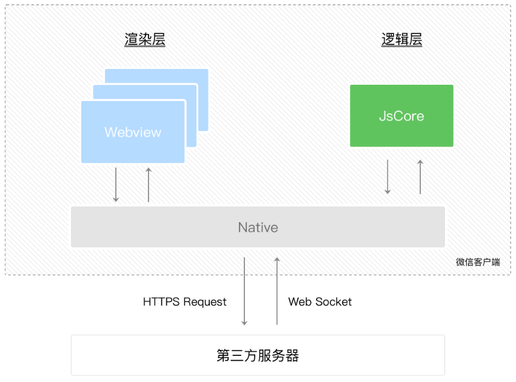
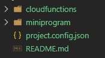
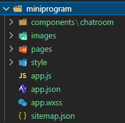
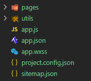
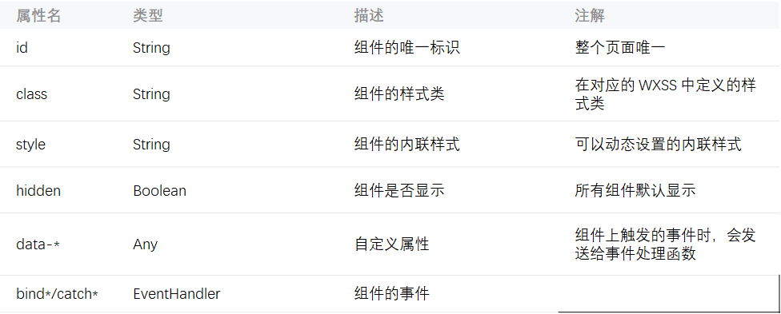

[微信小程序官网](https://developers.weixin.qq.com/doc/)

### 准备
- 注册自己的微信小程序账号
- 安装小程序开发工具

### 目标
- 知道微信小程序是什么
- 学会建立微信小程序
- 理解微信小程序的代码组成
- 掌握各种代码文件的书写规则

### 知识点
- 小程序介绍
- 小程序特色
- 小程序的建立
- 渲染层和逻辑层、程序、页面、组件、API、事件

## 1、微信小程序简介
- 微信小程序是什么？
  - 一种全新的用户与服务连接的方式
  - 可以在微信内便捷地获取和传播
  - 具有出色的用户体验
- 为什么要学习小程序？
  - 开发成本低、使用方便、用户量大、营销便捷
  - 简单易学、好就业，可以提高自己的综合实力
### 小程序与普通网页的区别
- (1) 线程
  - 网页开发是单线程的，js线程和渲染线程是互斥的
  - 小程序有一条js逻辑线和多条渲染线程两种线程
  
- (2) DOM
  - 网页开发可以操作DOM
  - 小程序开发不能操作DOM
- (3) 运行环境
  - 网页是在PC端和移动端的浏览器上运行
  - 小程序是在Android、ios、小程序开发者工具上运行

### 小程序的特色
- 用户
  - 触手可及：可以通过扫描二维码、搜索、朋友的分享等方式打开
  - 体验优秀：小程序使得服务提供者的触达能力变得更强
- 开发者
  - 加载速度快
  - 渲染速度快
  - 开发速度快（云能力、运维能力和数据汇总能力）
  - 用户资源丰富

### 小程序使用场景
- 业务逻辑简单
- 使用频率低
- 性能要求低

### 小程序建立的步骤
- 申请AppID
- 安装开发者工具
- 新建项目

## 2、小程序-目录结构

|云开发|普通开发|
|:----:|:----:|
||

## 3、JSON文件

|JSON配置：JSON是一种静态配置数据格式|
|:----|
|- 小程序配置`app.json`：做全局配置<br>- 页面配置`page.json`<br>- 工具配置`project.config.json`：对开发者工具的个性化配置，如域名校验、代码上传时自动压缩
|注：小程序无法在运行过程中动态更新JSON|
|- JSON需要包裹在一个大括号`{}`中<br>- JSON不能使用注解<br>- 键名需要用双引号`""`包裹<br>- 键值之间有冒号`:`分隔<br>- 键值对之间用逗号`,`分隔<br>- JSON值数据格式包括数字、字符串、布尔值、数组、对象、NUll|

## 4、WXML文件
|WXML模板：WeiXin Markup Language，微信标记语言|
|:----|
|创建WXML文件：在`app.json`中的`"pages/index/index"`上新增一行`"pages/login/login"`,便会自动创建WXML文件|
|- WXML通过大胡子语法来映射`js`里的`data`数据<br>- 变量名大小写敏感，变量名`name`和`NAME`是两个不同的变量名<br>- `undefined`的变量不会被同步到`wxml`中|

## 5、大胡子语法
```html
<!-- 大胡子{{}}中的语法逻辑：实现数据绑定 -->
<!-- 1、{{}}具有两种功能：动态渲染、逻辑运算 -->
<!-- 2、{{}}中除了变量名，还可以放置数字、字符串，并且做一些逻辑运算 -->
<!-- 3、常见逻辑运算语法：算数运算、字符串运算、三元运算 -->

<!-- 示例： -->
<text id="{{id}}">{{msg}}</text>

<!-- 脚本 -->
data: {
  id: 1,
  msg: '开课吧'
}
```
## 6、条件渲染
```html
<!-- WXML中的条件逻辑 -->
<!-- 在WXML里有一套if、elif、else组合 -->

<!-- 示例 -->
<text wx:if="{{name==='呷哺}}">...</text>
<text wx:elif="{{name==='肯德基}}">...</text>
<text wx:else>...</text>

<!-- <block>可以一次性判断多个组件标签 -->
<block wx:if="{{true}}">
  <view>...</view>
  <view>...</view>
</block>
```
## 7、列表渲染
WXML使用`wx:for`渲染列表，默认数组的当前项的变量名为`item`，下标名为`index`
- `wx:key`是列表中每一个项目的唯一标识符
  - 此标识符可以提高`wxml`动态渲染的效率。
  - 比如列表数据中的某一项数据发生改变时，微信会根据唯一标识符，找到`wxml`列表中与此条数据对应的项目，然后只对此项目进行渲染。
  - 这和vue、react中的diff算法是一个原理。
- 2、`wx:key`的赋值方式
  - 列表项目的属性：``
```html 
<!-- wx:key的赋值方式 -->
<!-- 1、列表项目的属性 -->
<view wx:for="{{food}}" wx:key="id">
  <text>{{item.name}}</text>
</view>
<!-- 2、列表项目的索引 -->
<view wx:for="{{food}}" wx:key="index">
  <text>{{item.name}}</text>
</view>

<!-- data数据 -->
food: [
  {
    id: 1,
    name: '西红柿鸡蛋面'
  },
  {
    id: 2,
    name: '香菜蛋花汤'
  },
  {
    id: 3,
    name: '白菜炖粉条'
  },
]
```

## 8、template模板
`wxml`中的重复性元素，可以制作成模板，从而方便批量修改。
```html
<!-- <template>模板需要设置name -->
<template name="hotel">
  <text>{{name}}:</text>
  <text wx:for="{{food}}" wx:key="id">{{index?'、':''}}{{item.name}}:</text>
</template>

<!-- 使用模板时，is指定其使用的模板，data指定模板数据 -->
<template is="hotel" data="{{name:'呷哺',food}}"></template>
```

## 9、共同属性
所有`wxml`标签都支持的属性称之为共同属性：



## 10、wxss文件
`WXSS（WeiXin Style Sheets）`是小程序的样式语言，用于描述`WXML`的组件的视觉效果。`WXSS` 就相当于网页里的`css`
|WXSS样式|
|:----|
|- 项目公共文件：`app.wxss`，作用到每个页面中<br>- 页面文件:`index.wxss`，与`app.json`注册过的页面同名且位置同级<br/>- 内联样式:写在标签的`style`属性里的样式<br>- 其它样式：可以被项目公共文件和页面样式文件引用的样式文件，比如模板文件里的样式|
|注：小程序不需要考虑样式文件的请求数量，不用像前段那样合并`css`文件|
### wxss和css的区别
- `wxss`拥有相对的尺寸单位`rpx`，一个单位的`rpx`是手机宽度的`1/750`。
- 外联样式可用`@import`导入。
- `background-image`里的图片为网络图片，其图片所在网络的域名需要经过微信许可。
- `position`为`absolute`的元素，需要`position`为`fixed`的容器
  - 这是由于小程序的文档流中不存在window、document对象导致的

### 选择器
**选择器是选择WXML元素的一种方式**


**选择器的优先级**


## 11、WeUI.wxss
[WeUI](https://developers.weixin.qq.com/miniprogram/dev/extended/weui/) 是一套与微信原生视觉体验一致的基础样式库。

WeUI 由微信官方设计团队为微信内网页和微信小程序量身设计，令用户的使用感知更加统一。

WeUI 包含`button`、`cell`、`dialog`、`progress`、`toast`、`article`、`actionsheet`、`icon`等各式原生组件的样式。

### weui小程序


## 12、作用域

- 小程序的作用域同 NodeJS 比较相似。
- 在一个文件中声明的变量和函数只在该文件中有效。
- 在不同的文件中可以声明相同名字的变量和函数，不会互相影响。

## 13、模块化

`es6` 中模块化语法可以应用于小程序中。

**A.js 中建立A 模块**
```js
export default class A{
	constructor(name){
		this.name = name
	}
}
```
在index.js 中引入A 模块
```js
import A from './A.js'
Page({
	data: {
		fruit:new A('苹果')
	},
})
```

## 14、canvas组件

[canvas](https://developers.weixin.qq.com/miniprogram/dev/component/canvas.html)组件是在`canvas`基础上包裹的一层容器。`2.9.0` 起支持一套新 `Canvas 2D` 接口（需指定 `type` 属性），同时支持[同层渲染](https://developers.weixin.qq.com/miniprogram/dev/component/native-component.html#%E5%8E%9F%E7%94%9F%E7%BB%84%E4%BB%B6%E5%90%8C%E5%B1%82%E6%B8%B2%E6%9F%93)，原有接口不再维护。相关api：[获取 canvas 实例](https://developers.weixin.qq.com/miniprogram/dev/api/canvas/Canvas.html)。


### Bug & Tip
1. tip：canvas 标签默认宽度300px、高度150px
2. tip：同一页面中的 canvas-id 不可重复，如果使用一个已经出现过的 canvas-id，该 canvas 标签对应的画布将被隐藏并不再正常工作
3. tip：请注意[原生组件使用限制](https://developers.weixin.qq.com/miniprogram/dev/component/native-component.html#%E5%8E%9F%E7%94%9F%E7%BB%84%E4%BB%B6%E7%9A%84%E4%BD%BF%E7%94%A8%E9%99%90%E5%88%B6)
4. tip：开发者工具中默认关闭了 GPU 硬件加速，可在开发者工具的设置中开启“硬件加速”提高 WebGL 的渲染性能
5. tip: WebGL 支持通过 getContext('webgl', { alpha: true }) 获取透明背景的画布
6. tip: Canvas 2D（新接口）需要显式设置画布宽高 (默认为 300x150)
7. bug: 避免设置过大的宽高，在安卓下会有crash的问题
### Canvas 2D/WebGL 示例代码
1. 获取组件用[SelectorQuery](https://developers.weixin.qq.com/miniprogram/dev/api/wxml/SelectorQuery.html)对象：`const query = wx.createSelectorQuery()`
2. `SelectorQuery.select(string selector)`方法获取匹配选择器的节点信息对象[NodeRef](https://developers.weixin.qq.com/miniprogram/dev/api/wxml/NodesRef.html)
- `NodesRef.fields(Object field, function callback)`可获取指定特征的节点信息对象`SelectorQuery`。其参数的常用属性：
  - `node`: 是否返回节点对应的Node实例，默认为`false`
  - `size`: 是否返回节点尺寸（`width height`）
4. `SelectorQuery.exec(function callback)`执行所有的请求，请求结果是一个数组，由回调函数返回。
5. 通过请求结果可以获取`canvas`节点（`fields`参数中`node=true`），还可以获取节点的以像素为单位的尺寸`width`和`height`(`fields`中`size=true`)
6. 由`node`可以获取真正的`canvas`画布：绘图，适配设备的像素比`DPR`（从系统信息获取）<br>`const dpr = wx.getSystemInfoSync().pixelRadio`
7. 用这个`dpr`将`canvas`画布放大，然而因为`canvas`画布的视觉尺寸已被限制，只能压缩像素密度，让画布中的图形看起来更清晰
```js
canvas.width = res[0].width * dpr
canvas.height = res[0].height * dpr
```
8. 获取画笔上下文对象：`const ctx = canvas.getContext('2d')`
9. 上下文对象的`scale`方法让`canvas`坐标基底放大，这样绘图时为设备的物理像素，而非`canvas`画布放大后的像素单位`ctx.scale(dpr, dpr)`
10. 使用画布和画笔建立一个小球模块：
```js
const ball = new ball(20)
ball.x=150
ball.y=50
ball.draw(ctx)
```
```html
<canvas type="2d" id="myCanvas"></canvas>
<canvas type="webgl" id="myCanvas"></canvas>
```
```js
// 2d
Page({
  onReady() {
    const query = wx.createSelectorQuery()
    query.select('#myCanvas')
      .fields({ node: true, size: true })
      .exec((res) => {
        const canvas = res[0].node
        const ctx = canvas.getContext('2d')

        const dpr = wx.getSystemInfoSync().pixelRatio
        canvas.width = res[0].width * dpr
        canvas.height = res[0].height * dpr
        ctx.scale(dpr, dpr)

        ctx.fillRect(0, 0, 100, 100)
      })
  }
})

// webgl
Page({
  onReady() {
    const query = wx.createSelectorQuery()
    query.select('#myCanvas').node().exec((res) => {
      const canvas = res[0].node
      const gl = canvas.getContext('webgl')
      gl.clearColor(1, 0, 1, 1)
      gl.clear(gl.COLOR_BUFFER_BIT)
    })
  }
})
```
### 旧版本接口
```html
<!-- canvas.wxml -->
<canvas style="width: 300px; height: 200px;" canvas-id="firstCanvas"></canvas>
<!-- 当使用绝对定位时，文档流后边的 canvas 的显示层级高于前边的 canvas -->
<canvas style="width: 400px; height: 500px;" canvas-id="secondCanvas"></canvas>
<!-- 因为 canvas-id 与前一个 canvas 重复，该 canvas 不会显示，并会发送一个错误事件到 AppService -->
<canvas style="width: 400px; height: 500px;" canvas-id="secondCanvas" binderror="canvasIdErrorCallback"></canvas>
```
```js
Page({
  canvasIdErrorCallback: function (e) {
    console.error(e.detail.errMsg)
  },
  onReady: function (e) {
    // 使用 wx.createContext 获取绘图上下文 context
    var context = wx.createCanvasContext('firstCanvas')

    context.setStrokeStyle("#00ff00")
    context.setLineWidth(5)
    context.rect(0, 0, 200, 200)
    context.stroke()
    context.setStrokeStyle("#ff0000")
    context.setLineWidth(2)
    context.moveTo(160, 100)
    context.arc(100, 100, 60, 0, 2 * Math.PI, true)
    context.moveTo(140, 100)
    context.arc(100, 100, 40, 0, Math.PI, false)
    context.moveTo(85, 80)
    context.arc(80, 80, 5, 0, 2 * Math.PI, true)
    context.moveTo(125, 80)
    context.arc(120, 80, 5, 0, 2 * Math.PI, true)
    context.stroke()
    context.draw()
  }
})
```
## 14、案例：弹动的小球
```js
// canvas小球组件
export default class Ball{
  constructor(r=20,color='#00acec'){
    this.r = r
    this.color = color
    this.x = 0
    this.y = 0
  }
  draw(ctx) {
    const {x,y,r,color} = this
    ctx.save()
    ctx.fillStyle = color
    ctx.beginPath()
    ctx.arc(x,y,r,0,Math.PI*2)
    ctx.fill()
    ctx.restore()
  }
}
```
```js
const app = getApp()

import Ball from './common/ball'

Page({
  data: {

  },
  onReady() {
    const query = wx.createSelectorQuery()
    console.log(666, query)
    query.select('#myCanvas')
      .fields({ node: true, size: true })
      .exec((res) => {
        const canvas = res[0].node
        const ctx = canvas.getContext('2d')

        const dpr = wx.getSystemInfoSync().pixelRatio
        canvas.width = res[0].width * dpr
        canvas.height = res[0].height * dpr
        ctx.scale(dpr, dpr)

        // ctx.fillRect(0, 0, 100, 100)
        const ball = new Ball(20)
        ball.x=150
        ball.y=50
        ball.draw(ctx)

        const {width, height} = res[0]
        let vy=1
        let ay=0.1
        let bounce = 0.9

        setInterval(function(){
          ctx.clearRect(0,0,width,height)
          vy+=ay
          ball.y+=vy
          if(ball.y>height-ball.r){
            ball.y=height-ball.r
            vy*=bounce
          }
          ball.draw(ctx)
        },17)
      })
  },
  onLoad() {
    console.log('代码片段是一种迷你、可分享的小程序或小游戏项目，可用于分享小程序和小游戏的开发经验、展示组件和 API 的使用、复现开发问题和 Bug 等。可点击以下链接查看代码片段的详细文档：')
    console.log('https://mp.weixin.qq.com/debug/wxadoc/dev/devtools/devtools.html')
  },
})
```
