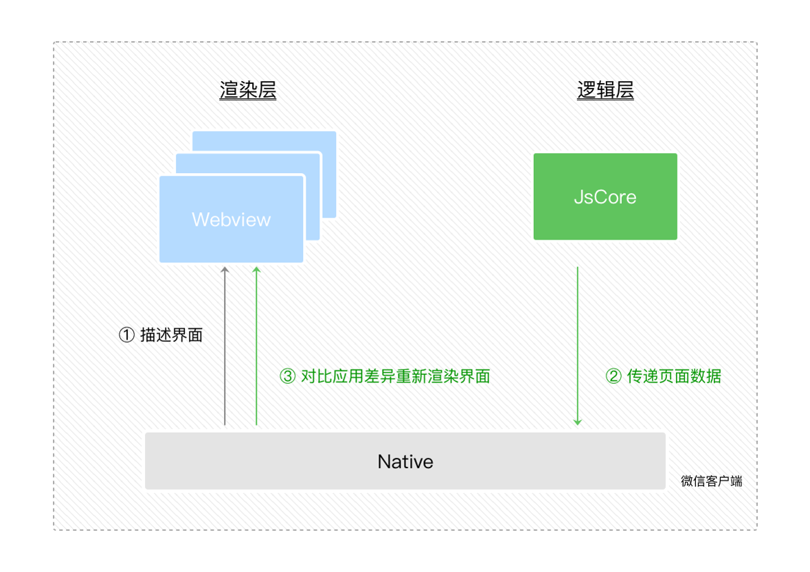
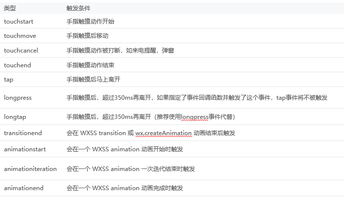

## 1、宿主环境概述

- 宿主环境是微信客户端给小程序提供的一种环境
- 宿主指的是微信客户端，即官方`API`中的`wx`对象

## 2、宿主环境的作用
- 宿主环境把`wxml、wxss、json、js`等各种文件整合到一起，进行解析，然后在微信`APP` 里显示
- 宿主环境可以为小程序提供微信客户端的能力，比如微信扫码


## 3、双线程下的界面渲染原理
1. 在渲染层，宿主环境会把`WXML`转化成对应的`JS`对象，也就是虚拟`Dom`。
2. 在逻辑层发生数据变更的时候，我们可以用`setData`方法把数据从逻辑层传递到渲染层。
3. 在渲染层对比虚拟`Dom`的前后差异，把差异应用在真实`Dom`上，渲染出正确的`UI`界面。



## 4、WXML转化为虚拟DOM

1. `WXML`结构实际上等价于一棵`Dom`树，即真实`Dom`。
2. `JS`对象也可以来表达`Dom`树的结构，即虚拟`Dom`。
3. 一棵`DOM` 树，可以用真实`Dom` 来描述，也可以用虚拟`Dom` 来描述。


## 5、App构造器
`App` 是宿主环境提供的一个 `App()` 构造器，用于注册一个程序`App`
1. `App()` 构造器必须写在项目根目录的`app.js`里。如：`App({…})`
2. `App`实例是单例对象，也是一个全局对象，就像网页里的`window`一样
3. 在其他`JS`脚本中可以使用宿主环境提供的 `getApp()` 方法来获取`App` 实例。利用`getApp()` 我们可以将数据写入全局，或者从全局读取数据
```js
const app = getApp()
app.globalData.motto = '好好学习'
```

## 5、点开微信小程序的一瞬间，微信客户端做了些什么？


## 6、小程序的后台状态和前台状态
- **后台状态**：用户点击小程序右上角关闭按钮，或手机的`home` 键时，会离开小程序，但小程序并不会被销毁，而是进入后台状态。此时，`APP`构造器参数里的`onHide` 方法会被调用。
- **前台状态**：用户再次进入小程序时，微信用户端会唤醒后台状态的微信小程序，微信小程序就进入了前台状态，`onShow` 方法会被调用。

**注意：App的生命周期是由用户操作主动触发的，开发者不能在代码里主动调用**

## 6、页面构造器Page()

- 页面的`js` 里的所有代码都是写在`Page()`构造器里的。
- `Page`构造器接受一个`Object`参数，在`Object`中可以绑定数据，监听页面事件
```js
Page({
  data: { text: "This is page data." },
  onLoad: function(options) { },
  onReady: function() { },
  onShow: function() { },
  onHide: function() { },
  onUnload: function() { },
  onPullDownRefresh: function() { },
  onReachBottom: function() { },
  onShareAppMessage: function () { },
  onPageScroll: function() { }
})
```

## 7、页面的生命周期 - ♥
页面的生命周期首先要考虑三个事件：
1. `onLoad`：页面初次加载时，在页面没被销毁之前只会触发`1`次
2. `onShow`: 页面显示时，从别的页面返回到当前页面时，都会被调用
3. `onReady`: 页面初次渲染完成时，在页面没被销毁前只会触发`1`次，在逻辑层可以和视图层进行交互

页面显示后，随着用户的操作，还会触发其它的事件：
1. `onHide`: 页面不可见时，`wx.navigateTo`切换到其他页面、底部`tab`切换时触发
2. `onUnload`：返回到其它页时，`wx.redirectTo`或`wx.navigateBack`使当前页面会被微信客户端销毁回收时触发

## 8、页面的用户行为
1. `onPullDownRefresh`: 下拉刷新，监听用户下拉刷新事件，需要在全局或具体页面的`json` 文件中配置`enablePullDownRefresh`为`true`
2. `onReachBottom`: 上拉触底，监听用户上拉触底事件。可以在`app.json`的`window`选项中或页面配置`page.json`中设置触发距离`onReachBottomDistance`。在触发距离内滑动期间，本事件只会被触发一次。
3. `onPageScroll`: 页面滚动，监听用户滑动页面事件，参数为 `Object`，包含 `scrollTop` 字段，表示页面在垂直方向已滚动的距离（单位`px`）。
4. `onShareAppMessage`: 用户转发，只有定义了此事件处理函数，右上角菜单才会显示“转发”按钮，在用户点击转发按钮的时候会调用，此事件需要`return`一个`Object`，包含`title`和`path`两个字段，用于自定义转发内容

## 9、页面数据的注意事项
- 用数据驱动视图渲染要用`this.setData()`，因为用`this.data`，不仅无法驱动视图，还会造成数据不一致。
- 由于`setData`是两个线程间的通信，为了提高性能，每次设置的数据不应超过`1024KB` 。
- 不要把`data`中的任意一项的`value`设为`undefined`，否则可能会有引起一些不可预料的`bug`。

## 10、页面跳转
页面跳转的方式有很多种
- 在`app.json` 中用`tabBar` 属性设置跳转方式
- 在`wxml` 页使用导航组件 `<navigator>` 跳转页面
- 在`js` 中用路由`API`跳转

## 11、运行js时要留心异步事件
- 小程序只有一个`JSCode` 线程，页面有多个。
- 小程序切换页面时，小程序的逻辑层依旧运行在同一个`JsCore`线程中。
- 页面使用了`setTimeout`或者`setInterval`的定时器后，跳转到其他页面时，这些定时器并没有被清除，需要开发者自己在页面离开的时候进行清理。

## 12、组件 & 自定义组件
- 一个小程序的页面是由多个组件组成的。
- 小程序的宿主环境提供了一系列基础组件，如`view`、`text`。
- 但有的时候，我们还需要自定义组件。
- 自定义组件的名称要小写：`<kkb-image></kkb-image>`

### 自定义组件的方法
1. 在主项目下建立`components` 文件夹，在其中建立`floatball` 文件夹，在此文件夹上右击“新建 `Component`”，这样就可以建立出`json、wxml、wxss、js` 四个文件
2. 组件的`json`中设置 `"component": true`
3. 组件的`wxml、wxss`可以正常写
4. 组件的`js`中的`properties` 可以接受父组件属性
5. 父组件在调用子组件时要在其`json` 文件中设置`usingComponents`，如：
```json
"usingComponents": {
  "floatball": "/components/floatball/floatball"
}
```
## 13、父子组件的数据传递
1. 父组件向子组件传递数据：属性
```html
<!-- 父组件 wxml -->
<floatball text="开课吧"></floatball>
```
```js
// 子组件 js
properties: {
 text: { type: 'string', value: '悬浮球' }
},
```
2. 子组件向父组件传递数据：事件
```html
<!-- 在父组件调用子组件时，为其绑定事件 -->
<floatball bind:tapBall="tapBall"></floatball>
```
建议`onClickBall` 的属性名和属性值都写成一样，免得把“在父组件中使用属性值，在子组件中触发属性名”记混了。
在子组件中触发事件的方法是  `triggerEvent(eventName, detail)`，如`this.triggerEvent('tapBall',{tap:true})`

## 14、API & API的常见规律
- 宿主环境提供了丰富的API，几乎所有小程序的`API`都挂载在`wx`对象底下（除了`App/Page`等特殊的构造器）
- 小程序提供的`API`按照功能主要分为：网络、媒体、文件、数据缓存、位置、设备、界面、界面节点信息、特殊的开放接口
### API的常见规律
1. `wx.on*`开头的 `API` 是监听某个事件发生的`API`接口，接受一个 `Callback` 函数作为参数。当该事件触发时，会调用 `Callback` 函数。如`wx.onError()`
2. 后缀带`Sync` 的方法是同步的方法。如`wx.getSystemInfoSync()`
3. 如未特殊约定，多数 `API` 接口为异步接口 ，都接受一个`Object`作为参数。如`wx.getSystemInfo()`
4. `API`的`Object`参数一般由`success`、`fail`、`complete` 来接收请求结果的。如`request` 接口
5. `wx.get*` 开头的`API`是获取宿主环境数据的接口。如`wx.getSystemInfo()`
6. `wx.set*` 开头的`API`是写入数据到宿主环境的接口。如`wx.setNavigationBarTitle(Object object)`


## 15、用户在渲染层的行为反馈事件


## 16、事件捕捉和事件冒泡
- `bind`前加上`capture-` 表示事件捕捉，如`capture-bind:tap`
- 若不加前缀，`bind:tap` 和`bindtap`是一回事。


### 事件冒泡和事件捕捉的差异
在`wxml` 里建立两个容器对象，里面分别包裹着两个子元素。为容器和子元素添加触摸方法：
```html
<view bindtap="tabWrapper">
  <view bindtap="tabText">事件冒泡</view>
</view>
<view capture-bind:tap="tabWrapper">
  <view bindtap="tabText">事件捕捉</view>
</view>
```
`js` 中的触摸方法
```js
tabWrapper(){
  console.log('wrapper');
},
tabText(){
  console.log('text');
},
```