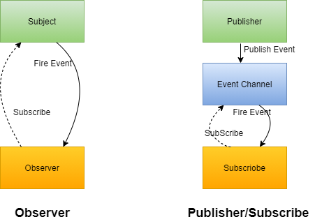

### 主题

- 1.利用defineProperty实现数据劫持
- 2.利用ES6中proxy实现数据劫持
- 3.实现数据驱动视图更新，实现数据响应
- 4.发布订阅模式
- 5.AMD模块化require.js介绍

### 知识点

- defineProperty；
- Proxy代理
- 数据劫持
- 发布订阅
- 观察者模式与发布订阅
- 数据响应式

## 1、vue中数据响应式原理

### 核心: 数据响应式怎么实现？
- 1. **初次渲染** ：把data里的数据根据表达式渲染到视图？
  - 先在视图里找大胡子语法  -->message -->message 在data里查找 ---> 将找到数据替换视图
- 2. **数据响应**？？
  - 1、知道数据改变了，数据劫持。
  - 2、拿到最新的值渲染视图  （观察者模式/发布订阅）


```html
<!DOCTYPE html>
<html lang="en">
<head>
  <meta charset="UTF-8">
  <meta http-equiv="X-UA-Compatible" content="IE=edge">
  <meta name="viewport" content="width=device-width, initial-scale=1.0">
  <title>Document</title>
  <script src="./vue.js"></script>
</head>
<body>
  <div id='app'>
    {{message}}
    <div>
     safas {{message}}asdfas
     <div>sdfsdfsd</div>
    </div>
  </div>
  <script>
    let vm = new Vue({
      el: '#app',
      data: {
        message: '我的信息'
      }
    })
    console.log(vm);
    setTimeout(() => {
      vm._data.message = '改变了'
    }, 1000);
    // 核心：数据响应式怎么实现？
    // 1.初次渲染 ：把data里的数据根据表达式渲染到视图？
      // 先在视图里找大胡子语法  -->message -->message 在data里查找 ---> 将找到数据替换视图
    // 2.数据响应？？
      /*
        1、知道数据改变了，数据劫持。
        2、拿到最新的值渲染视图  （观察者模式/发布订阅）
      */
  </script>
</body>
</html>
```

## 2、数据劫持 - defineProperty

### Object.defineProperty()

[Object.defineProperty()](https://developer.mozilla.org/zh-CN/docs/Web/JavaScript/Reference/Global_Objects/Object/defineProperty)方法会直接在一个对象上定义一个新属性，或者修改一个对象的现有属性，并返回此对象。

- 创建对象
- 修改对象属性

```js
// 创建对象-在对象上定义新属性
value = '张三'
let obj = Object.defineProperty({}, 'name', {
  configurable: true, // 设置后可删除属性
  enumerable: true, // 设置后可删除属性
  get() {
    console.log('get');
    return value
  },
  set(newValue) {
    console.log('set');
    value = newValue
  }
})

// 修改对象属性
let data = {
  name: '张三',
  age: 20
}
let val = data.name
Object.defineProperty(data, 'name', {
  configurable: true,
  enumerable: true,
  get() {
    console.log('get');
    return val
  },
  set(newValue) {
    console.log('set');
    val = newValue
  }
})
```

### 监听数据变化 - 数据劫持

```js
let obj1 = {
  name: '张三',
  age: 20
}
// 数据观察 ，数据劫持；
function Observer(data) {
  let keys = Object.keys(data) 
  keys.forEach(key => {
    let value = data[key]
    Object.defineProperty(data, key, {
      configurable: true,
      enumerable: true,
      get() {
        console.log('get');
        return value
      },
      set(newValue) {
        console.log('set');
        value = newValue
      }
    })
  })
}
Observer(obj1)
```

## 3、数据劫持（vue3） - Proxy

[Proxy](https://developer.mozilla.org/zh-CN/docs/Web/JavaScript/Reference/Global_Objects/Proxy)对象用于创建一个对象的代理，从而实现基本操作的拦截和自定义（如属性查找、赋值、枚举、函数调用等）。

- 写法简单
- 功能强大
  - 拦截的参数更多
  - 可以拦截defineProperty
  - 直接拦截对象，不需要向defineProperty一样循环拦截属性
- 非常灵活
  - 可以拦截 for in 操作
  - 可以拦截defineProperty劫持的参数
  - 拦截has - 是否有哪个属性
- 性能更好

### 语法
```
const p = new Proxy(target, handler)
```

- [Reflect](https://developer.mozilla.org/zh-CN/docs/Web/JavaScript/Reference/Global_Objects/Reflect)是一个内置的对象，它提供拦截 JavaScript 操作的方法。

```js
// proxy
let obj = {
  name: '张三',
  age: 20
}
obj = new Proxy(obj, {
  get(target, key) {
    // target -> obj
    console.log('get');
    // return target[key] // 严格模式会报错
    // Reflect类提供get set方法
    return Reflect.set(...arguments)
  },
  set(target,key,newValue){
    console.log('set');
    // target[key] = newValue // 严格模式会报错
    Reflect.set(...arguments)
  }
})
console.log(obj.name);
```

## 4、观察者模式 - 渲染新数据

定义一个对象与其他对象之间的一种依赖关系，当对象发生某种变化的时候，依赖它的其它对象都会得到更新，一对多的关系。

- 通过自定义事件触发更新
```js
observer(data) {
  let keys = Object.keys(data)
  let _this = this
  keys.forEach(key => {
    let value = data[key]
    Object.defineProperty(data, key, {
      configurable: true,
      enumerable: true,
      get() {
        console.log('get');
        return value
      },
      set(newValue) {
        console.log('set');
        // 触发自定义事件
        _this.dispatchEvent(new CustomEvent(key, {
          detail: newValue
        }))
        value = newValue
      }
    })
  })
}

if(regRep.test(textContent)) {
  let $1 = RegExp.$1
  node.textContent = textContent.replace(regRep, this._data[$1])
  // 变量添加自定义事件
  this.addEventListener($1,({detail}) => {
    let oldVal = this._data[$1]
    node.textContent = node.textContent.replace(oldVal, detail)
  })
}
```

## 5、发布订阅模式 - 渲染新数据
**发布-订阅**是一种[消息](https://zh.wikipedia.org/wiki/消息)[范式](https://zh.wikipedia.org/wiki/范式)，消息的发送者（称为发布者）不会将消息**直接**发送给特定的接收者（称为订阅者）。而是将发布的消息分为不同的类别，无需了解哪些订阅者（如果有的话）可能存在。同样的，订阅者可以表达对一个或多个类别的兴趣，只接收感兴趣的消息，无需了解哪些发布者（如果有的话）存在。
```JS
// 收集事件 - 触发更新
class Dep {
  constructor() {
    this.subs = [];
  }
  addSub(sub) {
    this.subs.push(sub);
  }
  notify(newValue) {
    this.subs.forEach(sub => {
      sub.update(newValue);
    })
  }
}

// 观察者
class Watcher {
  constructor(data,key,cb) {
    this.cb = cb;
    Dep.target  =  this;
    data[key]; //触发get
    Dep.target  = null;

  }
  update(newValue) {
    this.cb(newValue);
  }
}
```

## 6、二者关系
观察者模式观察者与订阅者之间有直接联系。发布订阅中发布者和订阅者无直接依赖关系。观察者模式属于紧解耦，发布订阅模式属于松解耦。发布订阅广义上是观察者模式。



## 7、完整代码（观察者模式）

- [EventTarget](https://developer.mozilla.org/zh-CN/docs/Web/API/EventTarget)是一个 DOM 接口，由可以接收事件、并且可以创建侦听器的对象实现。
- [CustomEvent](https://developer.mozilla.org/zh-CN/docs/Web/API/CustomEvent/CustomEvent) 用于创建自定义事件，继承自Event接口
- [Event](https://developer.mozilla.org/zh-CN/docs/Web/API/Event) DOM接口, 表示在 DOM 中出现的事件。

```js
// 观察者模式
class Vue extends EventTarget{
  constructor(opts) {
    super()
    this.opts = opts
    this._data = opts.data
    this.observer(this._data)
    this.compile() // 初次渲染
  }
  observer(data) {
    let keys = Object.keys(data)
    let _this = this
    keys.forEach(key => {
      let value = data[key]
      Object.defineProperty(data, key, {
        configurable: true,
        enumerable: true,
        get() {
          console.log('get');
          return value
        },
        set(newValue) {
          console.log('set');
          // 触发自定义事件
          _this.dispatchEvent(new CustomEvent(key, {
            detail: newValue
          }))
          value = newValue
        }
      })
    })
  }
  compile() {
    let el = document.querySelector(this.opts.el)
    this.compileNode(el)
  }
  compileNode(el) {
    el.childNodes.forEach(node => {
      let {nodeType} = node
      if(nodeType === 3) {
        // 文本
        let {textContent} = node
        let regRep = /\{\{s*([^\{\}\s]+)\s*\}\}/g
        if(regRep.test(textContent)) {
          let $1 = RegExp.$1
          node.textContent = textContent.replace(regRep, this._data[$1])
          // 变量添加自定义事件
          this.addEventListener($1,({detail}) => {
            let oldVal = this._data[$1]
            node.textContent = node.textContent.replace(oldVal, detail)
          })
        }
      } else if (nodeType === 1) {
        if(node.childNodes.length > 0) {
          this.compileNode(node)
        }
      }
    })
  }
}
```

## 8、完整代码（发布订阅模式）
```js
class Vue{
  constructor(opts){
    this.opts = opts;
    this._data = opts.data;
    this.Observer(this._data);
    this.compile();
  }
  Observer(data) {
    let keys = Object.keys(data);
    keys.forEach(key => {
      let value = data[key];
      let dep = new Dep();
      Object.defineProperty(data, key, {
        configurable: true,
        enumerable: true,
        get() {
          console.log("get..");
          if(Dep.target){
            dep.addSub(Dep.target);
          }
          return value;
        },
        set(newValue) {
          dep.notify(newValue);
          value = newValue
        }
      })
    })
  }
  compile(){
    let el = document.querySelector(this.opts.el);
    this.compileNodes(el);
  }
  compileNodes(el){
    let childNodes = el.childNodes;
    childNodes.forEach(node=>{
      // 是文本还是标签区分开；
      if(node.nodeType===3){
        console.log("文本");
        let textContent = node.textContent;
        let reg = /\{\{\s*([^\{\}\s]+)\s*\}\}/g;
        if(reg.test(textContent)){
          let $1 = RegExp.$1;
          node.textContent = textContent.replace(reg,this._data[$1]);
          new Watcher(this._data,$1,(newValue)=>{
            let oldValue = this._data[$1];
            node.textContent =  node.textContent.replace(oldValue,newValue)
          })
        }
      }else if(node.nodeType===1){
        let attrs = node.attributes;
        [...attrs].forEach(attr=>{
          let attrName = attr.name;
          let attrValue = attr.value;
          console.log(attrValue);
          if(attrName==="v-model"){
            node.value = this._data[attrValue] ;
            node.addEventListener("input",e=>{
              let newValue = e.target.value;
              // 触发了set
              this._data[attrValue] = newValue
            })
          }
        })
        if(node.childNodes.length>0){
          this.compileNodes(node);
        }
      }
    })
  }
}

class Dep {
  constructor() {
    this.subs = [];
  }
  addSub(sub) {
    this.subs.push(sub);
  }
  notify(newValue) {
    this.subs.forEach(sub => {
      sub.update(newValue);
    })
  }
}

// 订阅者；
class Watcher {
  constructor(data,key,cb) {
    this.cb = cb;
    Dep.target  =  this;
    data[key]; //触发get
    Dep.target  = null;

  }
  update(newValue) {
    this.cb(newValue);
  }
}
```