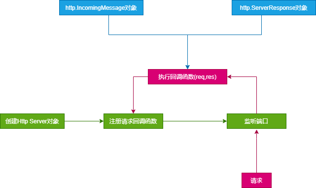
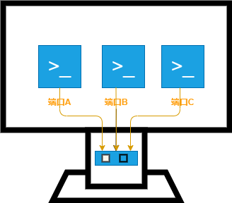

github代码：[https://github.com/zy13/node-note](https://github.com/zy13/node-note)<br>

## 1、为什么要搭建webServer?
一切的一切都是为了：共享资源。让所有人都能访问页面、图片、文档等资源。比如，如何让别人访问自己电脑上的图片

webServer 将电脑上的资源通过某种方式提供给别人访问。

## 2、webServer核心工作流程


## 3、如何搭建一个webServer?
原则上使用任何语言都能够编写一个webServer，只要该语言提供了针对网络进行编程的接口，实际上也存在很多通过各种语言编写的功能强大的，稳定的webServer应用程序，如：
* Nginx（https://github.com/nginx/nginx）
* Apache HTTP Server（）
* Apache Tomcat（）
* IIS
* ...

## 4、为什么选择Node.js?
Node官方文档：https://nodejs.org/dist/latest-v15.x/docs<br>
Node的源码：https://github.com/nodejs/node
* Node.js有着与JavaScript相同的语法特性，对熟悉JavaScript的前端同学比较友好
* Node.js内置了Net模块，使得我们可以针对网络进行编程，实现一个webServer
* Node.js还可以编写各种工具（webpack、各种框架的CLI工具等等）

## 5、使用Node.js构建一个基础的webServer

### 5-1、Node.js中的http模块
使用Node.js构建一个WebServer，需要使用Node.js中的http模块提供的接口来完成。

http模块文档：https://nodejs.org/dist/latest-v15.x/docs/api/http.html


- **Agent类**

http.Agent: 负责管理http客户端的连接持久性和重用。

- **ClientRequest类**

http.ClientRequest(): 该对象在内部创建，由http.request()返回。它表示一个正在进行的请求，其请求头等待处理。请求头可通过API`setHeader(name,value)`,`getHeader(name)`,`removeHeader(name)`来修改。实际的报头将与第一个数据块一起发送，或者在调用request.end()时发送。

- **Server类**

该类用于创建TCP或者IPC服务，监听数据，处理请求

- **ServerResponse类**

该对象有HTTP服务器内部创建，而不是由用户创建。该类用于提供响应的方法，方法用于处理响应的数据。

- **IncomingMessage类**

该对象由http.Server或者http.ClientRequest创建，用于提供请求的细节，并分别作为第一个参数传递给'request'和'response'事件

#### 基于Node.js的http模块的服务端基本工作流




### 5-2、创建一个WebServer对象
```js
// 引入http模块
const htpp = require('http')

// 创建http.Server对象
// 1.通过http.Server类创建
const server = http.server()
const server = new http.Server()

// 2.通过createServer函数创建
const server = http.createServer()
```

### 5-3、注册请求回调函数

通过http.Server对象的request事件来监听每一次请求。
```js
server.on('request', callback)
```
或者在创建http.Server对象的时候通过requestListener参数传入
```js
const server = http.createServer(callback)
```
- 回调函数，就是每次接收到请求以后要完成的任务逻辑
- request事件，每次请求都会调用


### 5-4、监听网络端口

系统中每一个需要通过网络交换数据的应用程序（如：QQ、微信、浏览器...）都需要监听指定的网卡（IP）和对应端口


```js
// 0.0.0.0 统配所有IP
server.listen(8888, '0.0.0.0')
```
- 端口，就是用来区分不同应用程序数据的标准
- 发送请求时，指定IP和端口，以确保数据的唯一性，点对点，一对一
- 应用程序发送数据时，会带上IP和端口号
- 不同的应用程序发送数据时，都要指定接受方的IP地址以及对应的端口


### 5-5、处理响应数据

**http.ServerResponse**

`HTTP`模块封装提供了一个`http.ServerResponce`类来完成数据的响应，它会在请求回调函数执行过程中实例化，并通过请求回调函数的第二个参数来进行调用
```js
server.on('request',(req, res) => {
  // res => new http.ServerResponse()
  // chunk => 要写入的数据块
  res.write(chunk); 
  // 完成数据写入
  res.end(chunk?)
})
```
- `end()`调用以后，不可在`write()`写入数据


### 5-6、解析请求数据

通常服务端提供的资源特别丰富，如果html页面、图片、视频、音频等数据，为了定位和标识互联网中的资源，就定义了一套规范：URI，其中包括两个子集：URL、URN

- URL
统一资源定位系统（uniform resource locator）

URI: [https://baike.baidu.com/item/URI/2901761](https://baike.baidu.com/item/URI/2901761)

- 常见格式


- http.IncomingMessage

`HTTP`模块封装提供了一个`http.IncomingMessage`用来解析和获取请求相关信息，如果我们想获取当前请求相关的一些信息，就可以通过这个对象来完成
```js
server.on('request',(req,res) => {
  // req => new IncomingMessage()
  // req.url: 当前请求的url(路径部分)
  // req.url 默认为 / , 表示根路径
  console.log(req.url)
})
```

### 5-7、代码

[https://github.com/zy13/node-note/blob/dev-webServer/1-app-http模块.js](https://github.com/zy13/node-note/blob/dev-webServer/1-app-http%E6%A8%A1%E5%9D%97.js)


## 6、静态资源VS动态资源

根据请求的不同，资源又划分为：
- **静态资源**：内容是不可变
- **动态资源**：内容是可变的

### 6-1、静态资源解析和响应

静态资源时相对不变的内容（除非有修改），类似程序中的变量和常量

- **url表示网络资源的虚拟路径，与实际返回的资源存放的路径并不完全等同**，如：

访问http://localhost:8888/index.html经过对应的webServer应用程序进行解析，返回了webServer服务器在硬盘上存放的相应文件的内容。

所以一个url不能简单的与某个文件关联起来，要看对应的webServer的处理逻辑。

### 6-2、规范高效的静态资源解析与响应

通常，我们的webServer会提供各种静态资源（html代码、css代码、js代码、图片、视频、音频...），而这些资源我们又通常会通过文件的方式存储在某个地方。为了批量处理这种资源与URL的对应关系，我们会根据某种规则（规则自己定义，或者说由实现webServer的各种软件和框架）来自动映射。

### 6-3、代码
[https://github.com/zy13/node-note/blob/dev-webServer/4-app-区分动静态资源访问规则.js](https://github.com/zy13/node-note/blob/dev-webServer/4-app-%E5%8C%BA%E5%88%86%E5%8A%A8%E9%9D%99%E6%80%81%E8%B5%84%E6%BA%90%E8%AE%BF%E9%97%AE%E8%A7%84%E5%88%99.js)


## 7、HTTP协议

超文本传输协议（英文：HyperText Transfer Protocol，缩写：HTTP）是一种用于分布式、协作式和超媒体信息系统的应用层协议。HTTP是万维网的数据通信的基础。

客户端 <=> 服务端 数据通信规范

参考：[https://developer.mozilla.org/zh-CN/docs/Web/HTTP/Overview](https://developer.mozilla.org/zh-CN/docs/Web/HTTP/Overview)<br>
或者：[http://www.ruanyifeng.com/blog/2016/08/http.html](http://www.ruanyifeng.com/blog/2016/08/http.html)

### 7-1、HTTP报文

报文：发送和响应的数据，HTTP协议会在数据传输过程中对数据进行一定格式的组织。报文又分为：
- [请求报文](https://developer.mozilla.org/zh-CN/docs/Web/HTTP/Overview#%E8%AF%B7%E6%B1%82)

1、请求行，包括三部分：请求方法、请求路径、请求协议的版本

2、请求头，对数据的额外描述，如数据类型、大小、来源

- [响应报文](https://developer.mozilla.org/zh-CN/docs/Web/HTTP/Overview#%E5%93%8D%E5%BA%94)

1、响应行：协议版本、状态码、状态码描述文本

2、响应头：响应时间、服务器类型等

默认情况下，返回的二进制数据流没有做标记的话（如没有标记图片），浏览器会启用下载

返回图片数据，如需要浏览器显示而非下载，需要在请求头设置`Content-Type`的[MIME](https://baike.baidu.com/item/MIME/2900607)

### 7-2、请求方式

[https://developer.mozilla.org/zh-CN/docs/Web/HTTP/Methods](https://developer.mozilla.org/zh-CN/docs/Web/HTTP/Methods)

[get和post请求的区别](https://www.w3school.com.cn/tags/html_ref_httpmethods.asp)

### 7-3、响应状态码

HTTP 状态码用来表示特定的 HTTP 请求是否已成功完成。响应分为五类：消息/信息响应(1xx)，成功响应(2xx)，重定向(3xx)，客户端错误(4xx)和服务器错误(5xx)。<br>
[https://developer.mozilla.org/zh-CN/docs/Web/HTTP/Status](https://developer.mozilla.org/zh-CN/docs/Web/HTTP/Status)

- 200 请求成功
- 400 Bad Request
- 401 Unauthorized
- 403 Forbidden
- 404 Not Found
- 405 Method Not Allowed
- 414 URI Too Long
- 500 Internal Server Error
- 502 Bad Gateway
- 503 Service Unavailable
- 505 HTTP Version Not Supported
### 7-4、头信息
HTTP 消息头用于描述资源或服务器或客户端的行为。可以使用 X- 前缀添加自定义专有头<br>
[https://developer.mozilla.org/zh-CN/docs/Web/HTTP/Headers](https://developer.mozilla.org/zh-CN/docs/Web/HTTP/Headers)

### 7-5、MIME

[https://baike.baidu.com/item/MIME/2900607](https://baike.baidu.com/item/MIME/2900607)<br>
[https://www.iana.org/assignments/media-types/media-types.xhtml](https://www.iana.org/assignments/media-types/media-types.xhtml)


### 7-6、代码

[https://github.com/zy13/node-note/blob/dev-webServer/3-app-http协议.js](https://github.com/zy13/node-note/blob/dev-webServer/3-app-http%E5%8D%8F%E8%AE%AE.js)


## 8、数据与视图结构分离

许多时候，动态资源的处理相对复杂，有时候会根据业务需求产生一些数据，同时又会对数据进行包装再呈现，如果只通过字符串拼接的方式进行处理，会导致工作量庞大以及代码难以维护。

### 8-1、模板引擎

把数据与某个模板文件（通常是类似HTML，但是又包含一些特殊定义的语法）进行结合，利用引擎（写好的方法）去对模板文件中的特殊语法进行解析，得到最终的HTML字符串。

与vue、react一样，将数据和表现分离开。


**Nunjucks**

官方文档：[https://mozilla.github.io/nunjucks/](https://mozilla.github.io/nunjucks/)


### 8-2、代码

[https://github.com/zy13/node-note/blob/dev-webServer/5-app-nunjucks模板引擎.js](https://github.com/zy13/node-note/blob/dev-webServer/5-app-nunjucks%E6%A8%A1%E6%9D%BF%E5%BC%95%E6%93%8E.js)


## 9、练习

### 9-1、要求

* **1、使用node.js的http模块搭建一个webServer项目**
  * 1-1、端口号为8888
* **2、访问http://localhost:8888/public/index.html返回public目录下的index.html内容**
  * 2-1、项目目录下创建一个public目录
  * 2-2、public下创建一个index.html文件（文件内容不限）
* **3、访问http://localhost:8888/quote随机返回一句毒鸡汤**

### 9-2、毒鸡汤

const quotes = [

'虽然我个子矮，但我发际线高啊！',

'有些事情做不完，就留到明天做吧。运气好的话，明天死了就不用做了。',

'善良没用，你得漂亮。',

'好好活下去 每天都有新打击。',

'活着的时候把自己搞得好看一点，这样你就不会死得太难看。',

'世上无难事 只要肯放弃。',

'加油，你是最胖的！' ];

### 9-3、代码

github地址：[https://github.com/zy13/node-note/blob/dev-webServer/app.js](https://github.com/zy13/node-note/blob/dev-webServer/app.js)


## 10、直播课件

有道云笔记：[基于nodejs的webServer搭建](https://note.youdao.com/web/#/file/WEB06724c98e41217392803777b72b1e0d2/markdown/WEB04532a6499c9186ba2b3be09bab8c097/)