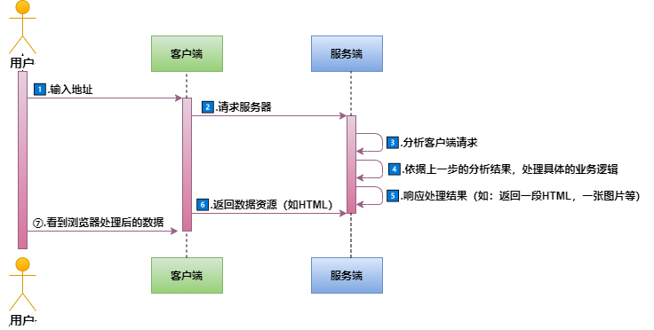

github代码：[https://github.com/zy13/koa-demo/tree/1-server-by-koa](https://github.com/zy13/koa-demo/tree/1-server-by-koa)

## 1、NPM

官网：[https://www.npmjs.com/](https://www.npmjs.com/)

NPM: Node Package Manager，Node（应用程序）包管理器 ，类似AppStore

>可以下载node有关的包或者第三方库，也可以将上传自己开发的包，供自己和别人使用。<br>

如何创建一个node包：[https://docs.npmjs.com/creating-node-js-modules](https://docs.npmjs.com/creating-node-js-modules)

npm相关命令：[https://docs.npmjs.com/cli/v7/commands](https://docs.npmjs.com/cli/v7/commands)

### 1-1、package.json文件

官网地址：[https://docs.npmjs.com/creating-a-package-json-file](https://docs.npmjs.com/creating-a-package-json-file)

该文件的作用是对项目进行说明，以及罗列项目的配置信息

* 两个必填项

name: 包名称，必须小写，一个单词
version: 包版本号，格式要求x.x.x（主版本号.次版本号.修正版本号）

* 命令行初始化文件

`npm init`

`npm init`说明：[https://docs.npmjs.com/cli/v7/commands/npm-init](https://docs.npmjs.com/cli/v7/commands/npm-init)

### 1-2、nodemon工具

[https://www.npmjs.com/package/nodemon](https://www.npmjs.com/package/nodemon)

用于开发node.js的工具，node文件发生变化时，它可以自动地重启node应用。推荐安装到项目本地。


### 1-3、npm命令

官网：[https://docs.npmjs.com/cli/v7/commands](https://docs.npmjs.com/cli/v7/commands)

- npm install

说明：[https://docs.npmjs.com/cli/v7/commands/npm-install](https://docs.npmjs.com/cli/v7/commands/npm-install)

简写：`npm i`

可选项：
```
[-P|--save-prod|-D|--save-dev|-O|--save-optional|--save-peer] [-E|--save-exact] [-B|--save-bundle] [--no-save] [--dry-run]
```

- npm i -D|--save-dev

开发依赖，开发过程中用到的依赖，项目完成后可以丢弃不用的依赖。

- npm i |-S|--save

生产依赖，项目整个过程都需要的依赖。

### 1-4、scripts

[https://docs.npmjs.com/cli/v7/configuring-npm/package-json#scripts](https://docs.npmjs.com/cli/v7/configuring-npm/package-json#scripts)


## 2、思考：从浏览器输入URL到页面展现的过程中发生了什么？

通过第一节的学习，我们了解到基于web的应用基本流程：



通过上图不难发现，无论具体应用功能如何变化，`服务端`处理任务的三个核心步骤中：<br>
3️⃣、4️⃣、5️⃣中，3️⃣和5️⃣的模式基本是固定的（因为HTTP协议规范了），而4️⃣是最大的变量

如果我们每次开发一个新应用，都要把3️⃣和5️⃣的逻辑重新实现一遍，会特别麻烦。所以，我们可以封装一个框架（库），把3️⃣和5️⃣的逻辑进行统一处理，然后通过某种方式，把4️⃣的处理暴露给框架使用者。

- 框架：完成业务场景当中经常会出现的内容，一些代码；不同框架解决的问题不一样，它是针对同一种类型的解决方案及编码实现。

## 3、koa介绍

源码：[https://github.com/koajs/koa](https://github.com/koajs/koa)
官网：[https://koajs.com/](https://koajs.com/)
中文平台：[https://koa.bootcss.com/](https://koa.bootcss.com/)

- 基于Node.js的web框架，致力于web应用开发和API开发
- 由Express原班人马打造
- 支持异步async
- 更小、更灵活、更优雅

### 3-1、安装

简介：[https://koajs.com/#introduction](https://koajs.com/#introduction)

## 4、koa核心

Koa对NodeJS原生IncomingMessage和ServerResponce对象和解析响应通用流程进行了包装，并提供了几个核心类（对象）用于其他各种用户业务调用。


```js
const Koa = require('koa')
const app = new Koa()
app.listen(888)
```

- Application
```js
// Emitter是事件机制，比如on、use等
module.exports = class Application extends Emitter {
  ...
  listen(...args) {
    const server = http.createServer(this.callback());
    return server.listen(...args);
  }
  ...
  callback() {
    // this.middleware = []
    // const compose = require('koa-compose');
    const fn = compose(this.middleware);
    ...
    return this.handleRequest(ctx, fn)
  }
  ...
  handleRequest(ctx, fnMiddleware){
    ...
    const handleResponse = () => respond(ctx);
    return fnMiddleware(ctx).then(handleResponse).catch(onerror);
  }
}

respond(ctx) {
  ...
  res.end(body)
}

```

- compose
```js
module.exports = compose
function compose (middleware) {
  ...
  let fn = middleware[i]
  try {
    return Promise.resolve(fn(context, dispatch.bind(null, i + 1)));
  } catch (err) {
    return Promise.reject(err)
  }
}
```

- Application对象
- Context对象
- Request对象
- Response对象

### 洋葱模型


## 5、中间件

### 5-1、自定义中间件

自定义中间件处理静态资源
```js
// 中间件1-处理静态资源和路由
app.use(async(ctx, next) => {
  if(ctx.url.startsWith('/public')) {
    ctx.body = fs.readFileSync(`.${ctx.url}`).toString()
  } else {
    await next()
  }
})
// use()方法接受的是一个异步函数，返回一个Promise对象
```

### 5-2、第三方中间件

第三方中间件代理静态资源和路由
```js
const Koa = require('koa')
const koaStaticCache = require('koa-static-cache')
const KoaRouter = require('koa-router')

const app = new Koa()
const router = new KoaRouter()

const quotes = [
  '虽然我个子矮，但我发际线高啊！',
  '有些事情做不完，就留到明天做吧。运气好的话，明天死了就不用做了。',  
  '善良没用，你得漂亮。',  
  '好好活下去 每天都有新打击。',  
  '活着的时候把自己搞得好看一点，这样你就不会死得太难看。',  
  '世上无难事 只要肯放弃。',  
  '加油，你是最胖的！' 
]

app.use(koaStaticCache({
  prefix: '/public',
  dir: './public',
  gzip: true,
  dynamic: true
}))

router.get('/quote', async ctx=> {
  ctx.body = quotes[Math.floor(Math.random()*quotes.length)]
})

app.use(router.routes())
app.listen(8888)
```

## 6、直播课件

- 有道云笔记：[直播课件1-上课课件](https://note.youdao.com/web/#/file/WEB624c465530da7690b7974a1d4f65933f/markdown/WEB68753789aaeca2c2e679770f752b2983/)

- 有道云笔记：[直播课件2-koa框架介绍](https://note.youdao.com/web/#/file/WEB624c465530da7690b7974a1d4f65933f/markdown/WEB9d898e99808390b58fada774a6f1e242/)


