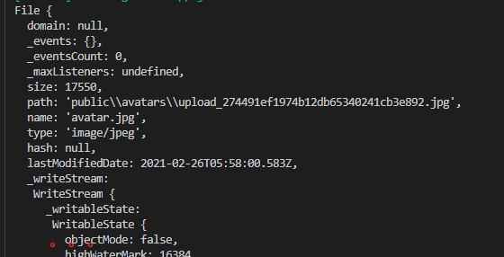

github代码：[https://github.com/zy13/koa-demo/tree/3-koa-fileupload-authorization](https://github.com/zy13/koa-demo/tree/3-koa-fileupload-authorization)

## 1、dayjs-日期处理插件

处理日期插件：[https://www.npmjs.com/package/dayjs](https://www.npmjs.com/package/dayjs)

moment插件的精简版。

## 2、数据库操作

- **排序**
  - `order by 字段 排序方式`，`order by 字段1 排序方式, 字段2 排序方式`
  - 排序方式：desc => 降序，asc => 升序
- **限制显示条数**
  - `limit 条数`，限制查询多少条
  - `offset 条数`，从第几条开始，默认从0
```js
  let page = 1
  let limit = 5
  // 第一页：offset=0；第二页：offset = 5; 
  // 第page页：offset = limit * (page-1)
  let offset = limit * (page-1)
  let [comments] = await ctx.connection.query(
    'select * from comments where detail_id=? order by id desc limit ? offset ?',
    [detailId,limit,offset]
  )
```
- **总页码数**
  - 获取数据库总条数：通过解构`count`字段获得
  - 计算页数：Math.ceil(count/limit)
  ```js
    // 总的页码数
    let pages = 0
    let [[{ count }]] = await ctx.connection.query(
      'select count(*) as count from comments where detail_id=?',
      [detailId]
    )
    pages = Math.ceil( count/limit )
  ```
- **客户端页码渲染**
```js
<div class="pagination">
  <a href="">首页</a>
  <a href="">&lt;</a>
  <!-- <a href="" class="current">1</a> -->
  
    <a href="/detail/{{detailId}}?page={{p}}" class="current">{{p}}</a>
  
  <a href="">&gt;</a>
  <a href="">尾页</a>
</div>
```
- **字段更新**
```js
// 改一条
update kkb.comments set uid=1 where (id=1)
// 改全部
update kkb.comments set uid=1
```
- **获取url后的参数**

url后的参数挂载在ctx.request.query对象上

```js
// http://localhost:8888/detail/2?page=2
const { page } = ctx.request.query
// 通过客户端传过来的page值显示数据
```


## 3、用户鉴权

### 3-1、鉴权

问题：http协议是一个无状态协议，无状态：客户端和服务端连接以后，无法自动存储各自的状态（即使是同一个客户端，多次请求，服务器是无法进行关联的）

我们需要提供一个验证的接口（/login），通过这个接口验证成功以后，返回前端一个标识（给它发一张vip卡），让这个人（客户端）以后每次请求把vip卡带上（客户端一定要保存好这张卡）

服务端可以通过正文请求、响应头信息把这张卡的数据发送给客户端，客户端存储起来，以后每次请求携带过来。但是如果通过程序一点点实现比较麻烦。客户端存储以后，浏览器的请求有时候我们不能做任何处理，比如点击a发送请求的时候。

所以浏览器为了解决这个问题（存vip卡，每次请求发送vip信息卡），http定义了一个头信息：cookie

当客户端（浏览器）接收的数据头信息中有 set-cookie这个字段，那么就主动存储起来。

当浏览器后续每次发送请求的时候，会首先去存储cookie的位置看一下有没有与当前这次请求的域有关的cookie。（cookie是不会串，不同的域有自己cookie存储的空间），如果有，则把cookie数据通过请求头：cookies 发送给服务端。

服务端就可以每次在接收到请求的时候，看下请求头中是否存在cookie，如果有，验证合法性。……

### 3-2、头信息Cookie

请求头Cookie：[https://developer.mozilla.org/zh-CN/docs/Web/HTTP/Headers/Cookie](https://developer.mozilla.org/zh-CN/docs/Web/HTTP/Headers/Cookie)

响应头Set-Cookie: [https://developer.mozilla.org/zh-CN/docs/Web/HTTP/Headers/Set-Cookie](https://developer.mozilla.org/zh-CN/docs/Web/HTTP/Headers/Set-Cookie)

cookie可以通过浏览器相关的域里查询到`Application => Cookies => 相关的域 => cookie字段`,同个域下的所有页面均可访问

- 请求头`cookie`由客户端向服务端发送时，会自动携带当前域下的所有的cookie字段，服务端可以

- 响应头`set-cookie`，由服务器端向客户端发送，浏览器当前域获取时会自动保存起来

- 服务端向客户端发送cookie方式

```js
 // 服务端向客户端客户端发送set-cookie: 浏览器在响应头获得Set-Cookie,并存储在当前域的cookie中
ctx.set('Set-Cookie', `uid=${user.id};max-age=100`)
// or
ctx.cookies.set('uid', user.id, {
  maxAge: 100
})
// or 设置多个
ctx.cookies.set('user', JSON.stringify({
  uid: user.id,
  username: user.username
}), {
  maxAge: 100
})
```

- 服务端获取客户端发送的cookie

浏览器向服务端发送请求时，请求头cookie会自动携带上当前域的所有cookie给服务端
```js
// 获取所有cookie
ctx.get('cookie') // cookie字符串：key=value;key=value;...;...

// 获取指定cookie
ctx.cookies.get('user')
```

### 3-3、cookie中间件：处理当前用户信息

```js
// cookie中间件：处理当前用户信息
app.use(async (ctx, next) => {
  if(ctx.cookies.get('user')) {
    ctx.state.user = JSON.parse(ctx.cookies.get('user'))
  }
  await next()
})
// cookie统一在ctx.render时候获取
ctx.render = (tplName, data) => {        
  ctx.body = nunjucks.render(`${viewDir}/${tplName}.html`, {
    ...data,
    user: ctx.state.user// 统一挂载用户信息
  })
}
```

### 3-4、cookie添加签名，用于加密

设置signed:true，当前域的cookie会自动增加签名user.sig，user.sig会和一起cookie信息一起发给后端，
后端拿到签名做合法性验证，得到的信息一直则通过

```js
// 后端存储，不要泄露：主要用来生产加密的签名
app.keys = ['kkb']

ctx.cookies.set('user', JSON.stringify({
  uid: user.id,
  username: user.username
}), {
  signed: true // 增加签名，用于加密
})
```

## 4、文件上传

### 4-1、原生JavaScript和form表单实现文件上传

- **文件数据结构**



- 前端代码
```html
<script>
  // 创建文件类型的input框
  const inputUpload = document.createElement('input')
  inputUpload.type = 'file'
  inputUpload.name = 'avatar'
  
  // 创建form表单
  const form = document.createElement('form') 
  form.action = '/avatar' 
  form.method = 'post'
  form.enctype = 'multipart/form-data' // 二进制数据
  form.appendChild(inputUpload)

  // 点击头像-触发文件选择事件
  document.querySelector('.avatar-area').onclick = () => {
    inputUpload.click()
  }

  // 选择文件
  inputUpload.onchange = function(e) {
    document.body.appendChild(form)
    form.submit()
  }
</script>
```

- 后端代码
```js
// 处理文件上传业务逻辑
router.post('/avatar', koaVerify, koaBody({
  // 处理formdata格式数据
  multipart: true, // 处理二进制数据
  // 普通字符串数据也可以通过formdata格式提交
  // 如果提交的数据特殊数据，如文件二进制，需要另外设置
  formidable: { // 上传文件支持
    uploadDir: './public/avatars', // 上传到指定目录
    keepExtensions: true // 保留后缀
  }
}), async ctx => {
  // 经过koaBody处理，文件数据挂载到ctx.request.files
  const { avatar } = ctx.request.files
  const filePath = avatar.path

  // 头像路径更新到users表格中
  await ctx.connection.query(
    'update users set avatar=? where id=?',
    [filePath, ctx.state.user.uid]
  )
  // 重定向
  ctx.redirect(`/user/${ctx.state.user.uid}`)
})
```
文件路径处理
```js
avatar: avatar.replace(/\\/g,'/') // avatar.split('\\').join('/')
```

## 5、练习

```
1、创建一个数据库kkb
2、在kkb数据库中创建一个表attachments
3、在attachments表中添加至少下四个字段：
        id(int)，filename(varchar)，type(varchar)，size(int)
4、通过koa、koa-router构建一个webserver，端口8888
5、提供一个get方式接口localhost:8888/upload访问上传页面（form表单）
6、提供一个post方式接口localhost:8888/upload处理提交的数据，并返回操作结果（上传失败 or 上传成功）
7、上传后的文件保存在attachments目录下
8、上传的文件信息数据保存到数据库attachments表中
```

## 6、直播课件

有道云笔记：[文件上传/鉴权/jwt/koa-jwt](https://note.youdao.com/web/#/file/WEBbcb2a7af18a723ff7d37fd20e1de2e26/markdown/WEBf417f434fa7a5fa3b583645a414c1e88/)