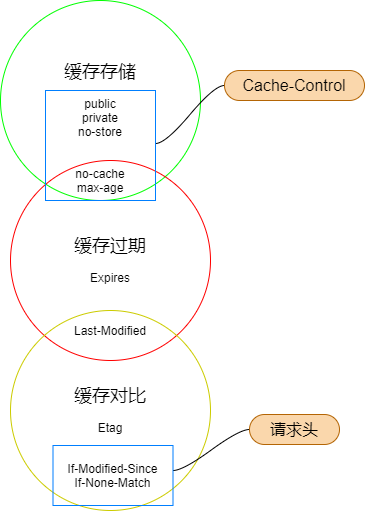

## 1、案例

从缓存策略来学习HTTP缓存：[HTTP基于缓存策略三要素分解法](https://mp.weixin.qq.com/s/uWPls0qrqJKHkHfNLmaenQ)

有如下的`page.html`页面：
```html
<!-- page.html -->
<!DOCTYPE html>
<html lang="en">
<head>
  <meta charset="UTF-8">
  <meta http-equiv="X-UA-Compatible" content="IE=edge">
  <meta name="viewport" content="width=device-width, initial-scale=1.0">
  <title>Page</title>
</head>
<body>
  
  <a href="page.html">重新访问page页</a>
</body>
</html>
```
首次访问该页面，页面中的图片资源 **avatar.jpg** 的响应头：
```json
HTTP/1.1 200 OK
Vary: Accept-Encoding
Last-Modified: Wed, 02 Sep 2020 02:42:32 GMT
ETag: "Xd/uSsLYtxW1AWTIX0ABpg=="
Content-Type: image/jpeg
Content-Length: 17550
cache-control: public, max-age=0
content-md5: Xd/uSsLYtxW1AWTIX0ABpg==
Date: Mon, 12 Apr 2021 07:34:01 GMT
Connection: keep-alive
Keep-Alive: timeout=5
```
- **问题1**：请问当点击 “重新访问 page 页” 链接重新加载该页面后， `head.png` 如何二次加载？
- **问题2**：如果将上述信息中的 `Cache-Control `设置为 `private`，那么结果又会如何呢？

## 2、HTTP的缓存体系
HTTP的缓存体系，包括缓存存储、缓存过期和缓存对比。


## 3、缓存存储策略

此策略用于决定HTTP的响应内容是否可缓存到客户端。

响应头Cache-Control就是用来指明响应内容是否可以被客户端存储。其包public、private、no-cache、max-age 可以缓存数据，no-store则不会在客户端缓存任何响应数据。

-  `Cache-Control：public` 可以被所有的用户缓存，包括终端用户和 CDN 等中间代理服务器。
- `Cache-Control：private` 只能被终端用户的浏览器缓存，不能被 CDN 等中间代理服务器缓存。
- `Cache-Control：no-cache` 不使用本地缓存，使用缓存协商。先与服务器确认返回的响应是否被更改，如果之前的响应中存在 ETag ，那么请求的时候会与服务端验证，如果资源未被更改，则可以避免重新下载。
- `Cache-Control：no-store` 禁止游览器缓存数据。每次用户请求该资源，都会向服务器发送一个请求，每次都会下载完整的资源。
- `Cache-Control：max-age=3600` 资源缓存的有效期。超过有效期，缓存失效。

服务器响应头决定了客户端的缓存存储，但是后续浏览器会不会直接从存储的数据中获取数据，还需要一套验证机制来确定，也就是下面讲到的缓存过期策略。

## 4、缓存过期策略

缓存过期策略，决定客户端是否直接从本地缓存的数据中加载数据并展示，否则就发送请求到服务器获取。

响应头中的 Expires（HTTP/1.0） 指明了缓存到本地数据的有效期，它告诉客户端本地数据在这个时间点内，本地数据是有效可用的，否则就失效不可用了。

- 如果响应头中设置同时设置了`Cache-Control：max-age=3600`和`Expires`，那么`Expires`就会被忽略，因为`Cache-Control：max-age`优先级比`Expires`高；
- 如果`Cache-Control：max-age=0`，相当于`Cache-Control：no-cache`，那么就会采用`Expires`的有效期。
- 缓存过期不代表本地缓存的数据没用了，而是需要再向服务端发送请求进行确认。因为在某些情况下，过去的本地缓存数据还会被用到。

## 5、缓存对比策略

客户端将缓存数据的标识`If-Modified-Since`、`If-None-Match`，通过请求头发送给服务端，服务端通过标识判断客户端缓存的数据是否有效，如有效则不返回数据，无效则返回响应数据。

客户端检测到数据过期或浏览器刷新后，往往会重新发起一个 HTTP 请求到服务器，服务器此时并不急于返回数据，而是先判断请求头是否带标识`If-Modified-Since`、`If-None-Match`过来：
- 若通过判断命中缓存，则返回 304，服务端不返回数据，而是告诉客户端使用本地缓存的数据。
- `Last-Modified` 可能会影响到缓存过期策略。

## 6、三种策略之间的关系

由下图可知，各缓存项分别属于哪个缓存策略范畴，这其中有部分重叠，它表明这些缓存项具有多重缓存策略，所以实际在分析缓存头的时候，除了常规的头外，我们还需要将这些具有双重缓存策略的项分解开来。



## 7、问题1 - 通过页面链接访问当前页面，页面的图片如何加载？
首次访问页面的响应头:
```json
HTTP/1.1 200 OK
Vary: Accept-Encoding
Last-Modified: Wed, 02 Sep 2020 02:42:32 GMT
ETag: "Xd/uSsLYtxW1AWTIX0ABpg=="
Content-Type: image/jpeg
Content-Length: 17550
cache-control: public, max-age=0
content-md5: Xd/uSsLYtxW1AWTIX0ABpg==
Date: Mon, 12 Apr 2021 07:34:01 GMT
Connection: keep-alive
Keep-Alive: timeout=5
```
以上HTTP响应头种有两项与缓存相关:
```
Last-Modified: Wed, 02 Sep 2020 02:42:32 GMT
cache-control: public, max-age=0
```
缓存策略三要素：
|缓存策略类型|缓存策略值|结果|备注
|--------|----|----|----|
|缓存存储策略|cache-control: public/private|响应数据会被缓存到<br>客户端|由Cache-Control<br>拆解而来|
|缓存过期策略|Expires: 当前时间|立马过期，非首次访问<br>资源，浏览器会<br>重新发起HTTP请求|由Cache-Control<br>拆解而来|
|缓存对比策略|Last-Modified: Tue,13 Apri 2021 <br>11:00:00 GMT|浏览器会携带该值去<br>服务器端比对，比对<br>成功则返回304，<br>服务端提示浏览器从<br>本地加载数据，否则<br>返回200并响应数据|

最终结果：浏览器再次请求服务端，并携带上`Last-Modified`指定的时间去跟服务器比对：
- 比对失败：服务器返回200并重发数据，客户端接收到数据后展示，并刷新本地缓存
- 比对成功：服务器返回304且不重发数据，客户端收到304状态码后从本地读取缓存数据。

## 8、问题2 - 响应头Cache-Control由public改为private，结果又会如何？

响应头由`Public`改为`Private`：浏览器后续请求都直接取的本地缓存。

启发式缓存过期策略：根据响应头中2个时间字段 `Date` 和 `Last-Modified` 之间的时间差值，取其值的10%作为缓存时间周期

浏览器会根据 `Date` 和 `Last-Modified` 之间的时间差值缓存一段时间，这段时间内会直接使用本地缓存数据而不会再去请求服务器（强制请求除外），缓存过期后，会再次请求服务端，并携带上 Last-Modified 指定的时间去服务器对比并根据服务端的响应状态决定是否要从本地加载缓存数据。

`HTTP` 缓存机制实际上是 `HTTP` 缓存策略三个要素（纬度）相互作用的集合，所以在分析和设置 `HTTP` 报文缓存头时，只要能从中精准的分解出缓存三要素，我们就能非常准确的预判到缓存设置最终能达到的效果。