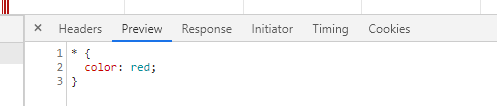
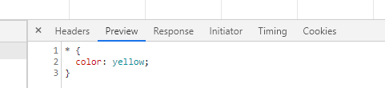
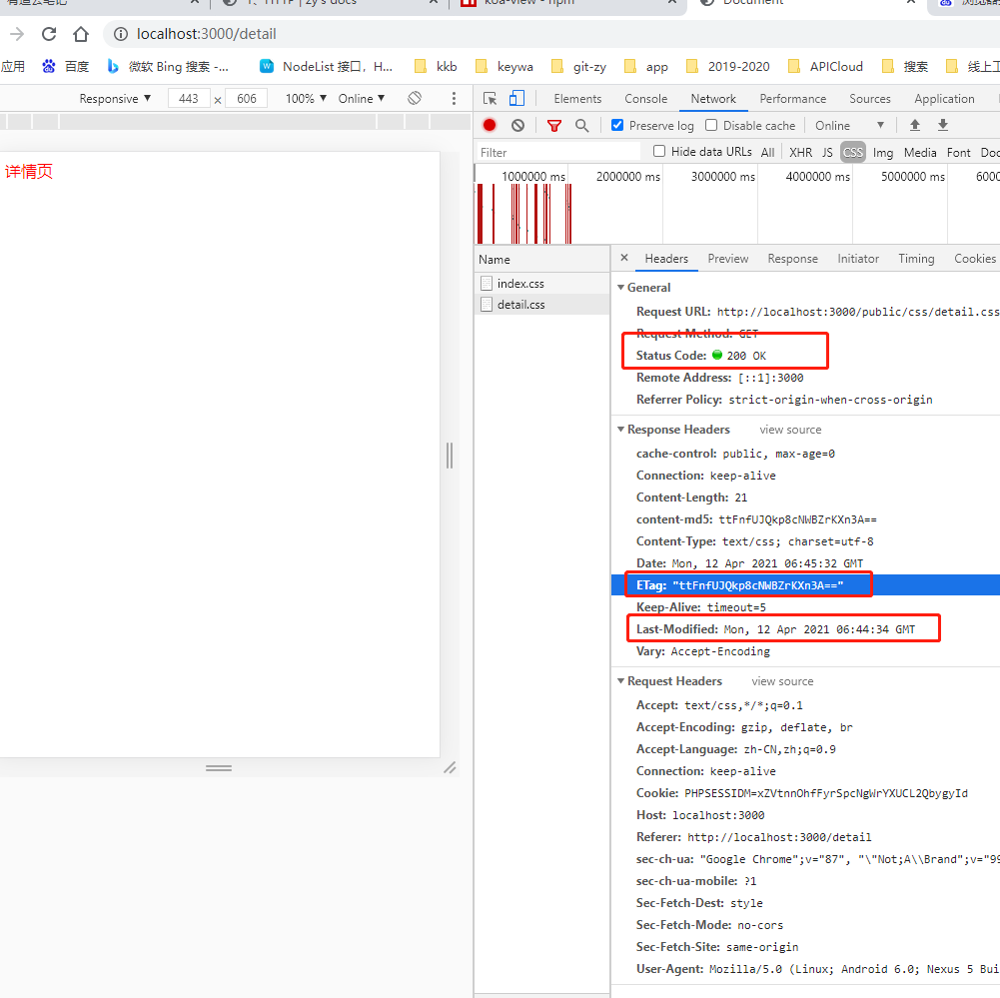
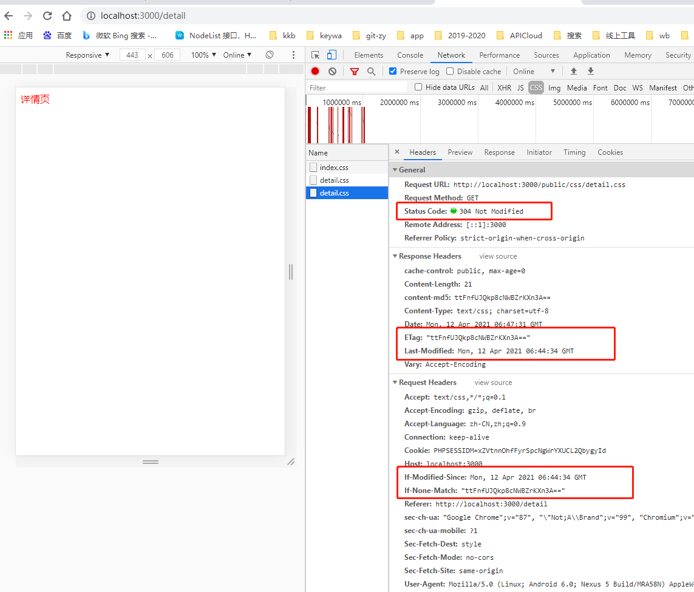
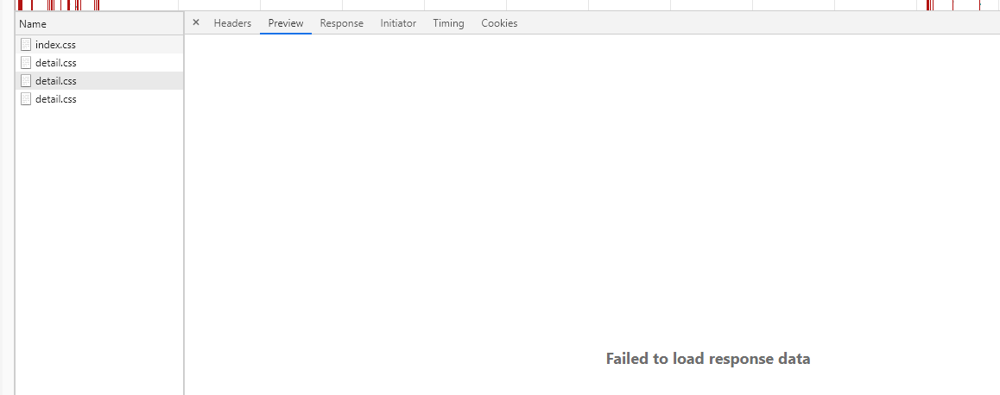
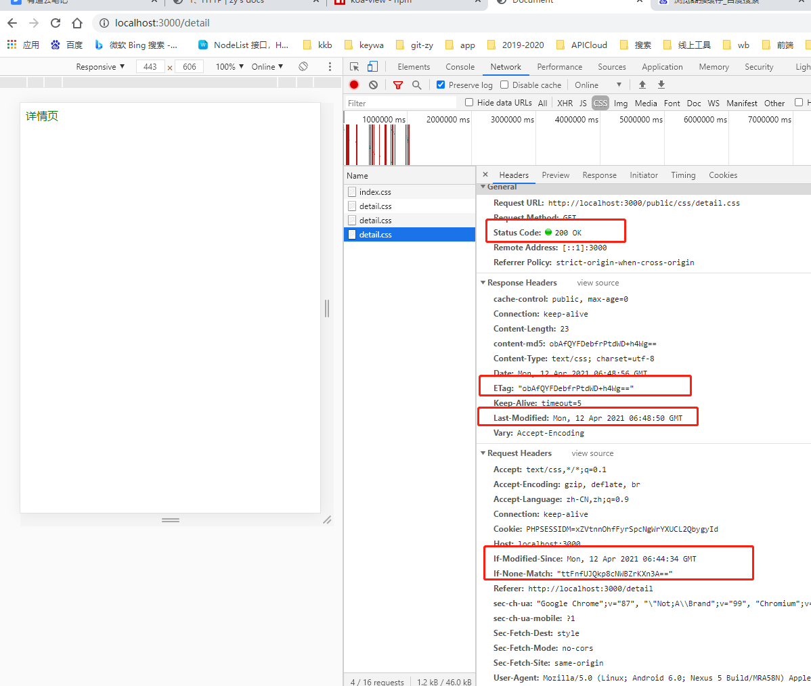

## 1、HTTP

[HTTP](https://developer.mozilla.org/zh-CN/docs/Web/HTTP)超文本传输​​协议，是一个用于传输超媒体文档（例如 HTML）的应用层协议。它是为 Web 浏览器与 Web 服务器之间的通信而设计的，但也可以用于其他目的。

HTTP 遵循经典的**客户端-服务端模型**：客户端打开一个连接以发出请求，然后等待直到收到服务器端响应。

HTTP 是无状态协议，这意味着服务器不会在两个请求之间保留任何数据（状态）。尽管通常基于 TCP/IP 层，但它可以在任何可靠的传输层上使用，也就是说，该协议不会像 UDP 那样静默的丢失消息。RUDP——作为 UDP 的可靠化升级版本——是一种合适的替代选择。

### HTTP概述

[HTTP](https://developer.mozilla.org/zh-CN/docs/Web/HTTP/Overview)是一种能够获取如 HTML 这样的网络资源的 protocol(通讯协议)。它是在 Web 上进行数据交换的基础，是一种 client-server 协议，也就是说，请求通常是由像浏览器这样的接受方发起的。一个完整的Web文档通常是由不同的子文档拼接而成的，像是文本、布局描述、图片、视频、脚本等等。


### HTTP常用请求头

[HTTP 消息头](https://developer.mozilla.org/zh-CN/docs/Web/HTTP/Headers)允许客户端和服务器通过 request和 response传递附加信息。一个请求头由名称（不区分大小写）后跟一个冒号“：”，冒号后跟具体的值（不带换行符）组成。该值前面的引导空白会被忽略。

#### 根据不同上下文，可将消息头分为：
- General headers: 通用首部同时适用于请求和响应消息，但与最终消息主体中传输的数据无关的消息头。
- [Request headers](https://developer.mozilla.org/zh-CN/docs/Glossary/Request_header): 包含更多有关要获取的资源或客户端本身信息的消息头。
- [Response headers](https://developer.mozilla.org/zh-CN/docs/Glossary/Response_header): 包含有关响应的补充信息，如其位置或服务器本身（名称和版本等）的消息头。
- [Entity headers](https://developer.mozilla.org/zh-CN/docs/Glossary/Entity_header): 包含有关实体主体的更多信息，比如主体长(Content-Length)度或其MIME类型。

#### 常用请求头
<!-- - [Accept](https://developer.mozilla.org/zh-CN/docs/Web/HTTP/Content_negotiation) - 内容协商 -->
- [Access-Control-Allow-Origin](https://developer.mozilla.org/zh-CN/docs/Web/HTTP/CORS) - 跨资源共享是一种基于HTTP 头的机制，该机制通过允许服务器标示除了它自己以外的其它origin（域，协议和端口），这样浏览器可以访问加载这些资源
- [Content-Type](https://developer.mozilla.org/zh-CN/docs/Web/HTTP/Headers/Content-Type) - 内容类型 
- [Cookie](https://developer.mozilla.org/zh-CN/docs/Web/HTTP/Headers/Cookie) - 请求首部，其中含有先前由服务器通过 Set-Cookie  首部投放并存储到客户端的[HTTP Cookie](https://developer.mozilla.org/zh-CN/docs/Web/HTTP/Cookies)。
- [Cache-Control](https://developer.mozilla.org/zh-CN/docs/Web/HTTP/Headers/Cache-Control) - 缓存请求指令。通用消息头字段，被用于在http请求和响应中，通过指定指令来实现缓存机制.
- [ETag](https://developer.mozilla.org/zh-CN/docs/Web/HTTP/Headers/ETag) - 资源的特定版本的标识符
- [Expires](https://developer.mozilla.org/zh-CN/docs/Web/HTTP/Headers/Expires) - Expires响应头包含日期/时间， 即在此时候之后，响应过期。
- [If-Modified-Since](https://developer.mozilla.org/zh-CN/docs/Web/HTTP/Headers/If-Modified-Since) - 条件式请求首部。服务器只在所请求的资源在给定的日期时间之后对内容进行过修改的情况下才会将资源返回，状态码为 200  
- [If-None-Match](https://developer.mozilla.org/zh-CN/docs/Web/HTTP/Headers/If-None-Match) - 条件式请求首部。当且仅当服务器上没有任何资源的 ETag 属性值与这个首部中列出的相匹配的时候，服务器端会才返回所请求的资源，响应码为  200
- [Set-Cookie](https://developer.mozilla.org/zh-CN/docs/Web/HTTP/Headers/Set-Cookie) - 响应首部 Set-Cookie 被用来由服务器端向客户端发送 cookie。

### HTTP支持的方法

- GET
- POST
- HEAD
- OPTIONS
- PUT
- DELETE
- TRACE
- CONNECT

## 2、HTTP 和 HTTPS

### (1) HTTP 和 HTTPS 的基本概念

- **HTTP**

[HTTP](https://www.cnblogs.com/TankXiao/archive/2012/02/13/2342672.html)是超文本传输协议，是互联网上应用最为广泛的一种网络协议，是一个客户端和服务器端进行数据请求和应答的标准（`TCP`），用于从 `WWW` 服务器传输超文本到本地浏览器的传输协议，它可以使浏览器更加高效，使网络传输减少。

- **https**

是以安全为目标的超文本传输协议，也就是`HTTP`的安全版本，即`HTTP`下加入`SSL`（安全套接字）层。`HTTPS`的安全基础是`SSL`，因此`HTTPS`的加密由`SSL`完成。`HTTPS`协议的主要作用是: **建立一个信息安全通道，来确保数据的传输，确保网站的真实性。**

### (2) HTTP 和 HTTPS 的区别？

`HTTP`传输的数据都是未加密的，也就是明文的，网景公司设置了`SSL`协议来对`HTTP`协议传输的数据进行加密处理，简单来说`HTTPS`协议是由`HTTP`和`SSL`协议构建的可进行加密传输和身份认证的网络协议，比`HTTP`协议的安全性更高。主要的区别如下：

- **`HTTPS`协议需要到`CA`申请证书，一般免费证书很少，需要交费。**
  - CA（Certificate Authority）证书颁发机构
  - 不同年限不同等级费用不一样，几千几万的都有
- **`HTTP`是超文本传输协议，信息是明文传输，`HTTPS`则是具有安全性的`SSL`加密传输协议。**
  - SSL(Secure Socket Layer)，安全套接字层
  - SSL可以使用非对称加密算法、对称加密算法、HASH算法
    - 非对称加密算法：RSA，DSA/DSS
    - 对称加密算法：AES，RC4，3DES
    - HASH算法： MD5，SHA1，SHA256
- **链接方式不同，端口也不同，`HTTP`协议的端口为`80`，`HTTPS`的端口为`443`。**
- `HTTP`的连接是简单的无状态的；`HTTPS`协议是由`SSL+HTTP`协议构建的可进行加密传输、身份认证的网络协议，比`HTTP`协议安全。

### (3) HTTPS 协议的工作原理

`HTTPS`在传输数据之前需要客户端（浏览器）与服务端（网站）之间进行一次握手，在握手过程中将确立双方加密传输数据的密码信息。`SSL`协议一套加密传输的协议，使用了非对称加密，对称加密以及`HASH`算法。握手过程的具体描述如下：


- **1.客户端（浏览器）将自己支持的一套加密规则发送给服务端（网站）**，开始进行 `HTTPS` 请求。
- **2.网站从中选出一组加密算法与`HASH`算法，并将自己的身份信息以证书的形式发回给浏览器**。证书里面包含了网站地址，加密公钥，以及证书的`CA`（颁发机构）等信息。
- **3.浏览器获得网站证书**之后要做以下工作：
  - **验证证书的合法性**（颁发证书的机构是否合法，证书中包含的网站地址是否与正在访问的地址一致等），如果证书受信任，则浏览器地址栏前面会显示一个小锁头，否则会给出证书不受信的提示。
  - 如果证书受信任，或者是用户接受了不受信的证书，**浏览器会生成一串随机数的密码，并用证书中提供的公钥加密**。
  - 使用约定好的`HASH`算法**计算握手消息**，并使用生成的随机数**对消息进行加密**，最后将之前生成的所有信息发送给网站。
- **4.网站接收浏览器发来的数据**之后要做以下的操作：
  - 使用自己的**私钥**将信息解密取出**密码**，使用密码解密浏览器发来的**握手消息**，并验证`HASH`是否与浏览器发来的一致。
  - 使**用密码加密一段握手消息**，发送给浏览器。
- **5.浏览器解密并计算握手消息的`HASH`**，如果与服务端发来的`HASH`一致，此时握手过程结束，之后所有的通信数据将由之前浏览器生成的随机密码并利用对称加密算法进行加密。


### (4) https协议的优点

- 使用HTTPS协议可认证用户和服务器，确保数据发送到正确的客户机和服务器；
- HTTPS协议是由SSL+HTTP协议构建的可进行加密传输、身份认证的网络协议，要比http协议安全，可防止数据在传输过程中不被窃取、改变，确保数据的完整性。
- HTTPS是现行架构下最安全的解决方案，虽然不是绝对安全，但它大幅增加黑客攻击的难度。
- 谷歌曾在2014年8月份调整搜索引擎算法，并称“比起同等HTTP网站，采用HTTPS加密的网站在搜索结果中的排名将会更高”

### (5) https协议的缺点
- https握手阶段比较费时，会使页面加载时间延长50%，增加10%~20%的耗电。
- https缓存不如http高效，会增加数据开销。
- SSL证书也需要钱，功能越强大的证书费用越高。
- SSL证书需要绑定IP，不能在同一个ip上绑定多个域名，ipv4资源支持不了这种消耗。

## 3、HTTP状态码

### 200 - 请求已经成功

状态码 [200](https://developer.mozilla.org/zh-CN/docs/Web/HTTP/Status/200) - OK 表明请求已经成功. 默认情况下状态码为 **200** 的响应可以被缓存。

响应会带有头部 [Cache-Control](https://developer.mozilla.org/zh-CN/docs/Web/HTTP/Headers/Cache-Control), [Content-Location](https://developer.mozilla.org/zh-CN/docs/Web/HTTP/Headers/Content-Location), [Date](https://developer.mozilla.org/zh-CN/docs/Web/HTTP/Headers/Date), [ETag](https://developer.mozilla.org/zh-CN/docs/Web/HTTP/Headers/ETag), [Expires](https://developer.mozilla.org/zh-CN/docs/Web/HTTP/Headers/Expires)，和 [Vary](https://developer.mozilla.org/zh-CN/docs/Web/HTTP/Headers/Vary).

### 304 - Not Modified未修改

HTTP [304](https://developer.mozilla.org/zh-CN/docs/Web/HTTP/Status/304) - 未改变说明无需再次传输请求的内容，也就是说可以使用缓存的内容。这通常是在一些安全的方法（safe），例如 **GET** 或 **HEAD** 或在请求中附带了头部信息： [If-None-Match](https://developer.mozilla.org/zh-CN/docs/Web/HTTP/Headers/If-None-Match) 或[If-Modified-Since](https://developer.mozilla.org/zh-CN/docs/Web/HTTP/Headers/If-Modified-Since)。

所请求的资源未修改，服务器返回此状态码时，不会返回任何资源。客户端通常会缓存访问过的资源，通过提供一个头信息指出客户端希望只返回在指定日期之后修改的资源

如果客户端发送了一个带条件的 **GET** 请求且该请求已被允许，而文档的内容（自上次访问以来或者根据请求的条件）并没有改变，则服务器应当返回这个 **304** 状态码。
## 4、301 和 302 的区别

- **301 Moved Permanently** <br>
被请求的资源已永久移动到新位置，并且将来任何对此资源的引用都应该使用本响应返回的若干个URI之一。如果可能，拥有链接编辑功能的客户端应当自动把请求的地址修改为从服务器反馈回来的地址。除非额外指定，否则这个响应也是可缓存的。

- **302 Found**<br>
请求的资源现在临时从不同的URI响应请求。由于这样的重定向是临时的，客户端应当继续向原有地址发送以后的请求。只有在 **Cache-Control** 或 **Expires** 中进行了指定的情况下，这个响应才是可缓存的。

- 字面上的区别就是**301是永久重定向**，而 **302是临时重定向**。

- **301** 比较常用的场景是使用域名跳转。<br>
  **302** 用来做临时跳转，比如未登陆的用户访问用户中心重定向到登录页面。

## 5、状态码 304 和 200

- **状态码 200** - 请求已成功<br>
  请求所希望的响应头或数据体将随此响应返回。即返回的数据为全量的数据，如果文件不通过GZIP压缩的话，文件是多大，则要有多大传输量。

- **状态码304** - Not Modified 未修改<br>
  如果客户端发送了一个带条件的 **GET** 请求且该请求已被允许，而文档的内容（自上次访问以来或者根据请求的条件）并没有改变，则服务器应当返回这个状态码。即客户端和服务器端只需要传输很少的数据量来做文件的校验，如果文件没有修改过，则不需要返回全量的数据。

## 6、GET和POST的区别

- 请求参数<br>
  get参数通过url传递，post放在request body中。

- 参数长度<br>
  get请求在url中传递的参数是有长度限制的，而post没有。

- 安全<br>
  get比post更不安全，因为参数直接暴露在url中，所以不能用来传递敏感信息。

- 编码<br>
  get请求只能进行url编码，而post支持多种编码方式

- 缓存<br>
  get请求浏览器会主动cache，而post需要设置请求头才会缓存。<br>
  get请求参数会被完整保留在浏览历史记录里，而post中的参数不会被保留。

- GET和POST本质上就是TCP链接，并无差别。但是由于HTTP的规定和浏览器/服务器的限制，导致他们在应用过程中体现出一些不同。

- TCP包个数<br>
  GET产生一个TCP数据包；POST产生两个TCP数据包。

## 7、TCP三次握手，四次挥手

### 为什么需要“三次握手”

`client`发出的第一个连接请求报文段并没有丢失，而是在某个网络结点长时间的滞留了，以致延误到连接释放以后的某个时间才到达`server`。本来这是一个早已失效的报文段。但`server`收到此失效的连接请求报文段后，就误认为是`client`再次发出的一个新的连接请求。于是就向`client`发出确认报文段，同意建立连接。假设不采用“三次握手”，那么只要`server`发出确认，新的连接就建立了。(谢希仁版《计算机网络》)

由于现在`client`并没有发出建立连接的请求，因此不会理睬`server`的确认，也不会向`server`发送数据。但`server`却以为新的运输连接已经建立，并一直等待`client`发来数据。这样，`server`的很多资源就白白浪费掉了。

采用“三次握手”的办法可以防止上述现象发生。例如刚才那种情况，client不会向server的确认发出确认。server由于收不到确认，就知道client并没有要求建立连接。


### 三次握手的目的
- 实现可靠的数据传输
- 防止**已失效的连接请求报文段**突然又传送到了服务端，因而产生错误。
- 解决**网络中存在延迟的重复分组**的问题。
- 防止`server`端一直等待，浪费资源。

### TCP - 建立连接协议（三次握手）

TCP是传输控制协议，用于建立通信连接，是客户端和服务端之间进行通信的桥梁。

TCP协议的通信双方，都必须维护一个序列号，以标识发送出去的数据包中，哪些是已经被对方收到的。

三次握手的过程即是通信双方相互告知序列号起始值，并确认对方已经收到了序列号起始值的必经步骤。


- （1）第一次握手，客户端发送一个连接标识码`SYN=1`，随机序号`Seq=X`的数据包给服务端。服务端由`SYN=1`得知，客户端要求建立连接。
  - `SYN = 1（建立连接）, Seq = x （随机序号1~7）`
- （2）第二次握手，服务端收到请求后，要确认连接信息，向客户端发送确认码为`ACK = X + 1`（客户端的序号Seq+1），连接标识码、随机序号`Seq = Y`的数据包。
  - `SYN = 1, ACK = X + 1, Seq = Y `
  - 它表示对刚才客户端SYN报文的回应；
  - 同时又标志SYN给客户端，询问客户端是否准备好进行数据通讯。
- （3）第三次握手，客户端检验随机码、连接标识码、确认码，通过后，再次向服务端发送的确认码`ACK=Y+1`、随机序号`Seq = Z`的数据包。 服务端收到数据包后进行确认，则连接建立成功。
  - `ACK = Y + 1, Seq = Z `

### 说明
- Seq：表示客户端，数据包的数据部分的第一位应该在数据流中所占的位置。下一个实际有数据的传输，会从上一次发送的ACK数据包的Seq开始。
- ACK：表示期望的接收方的下一次Seq是多少

```bash
# syn - sync 同步
# Seq - sequence 序列号
# ACK - acknowledge 应答；确认帧
```

## 8、TCP 和 UDP 的区别
- （1）TCP是面向连接的，UDP是无连接的，即发送数据前不需要先建立链接。
- （2）TCP提供可靠的服务。也就是说，通过TCP连接传送的数据，无差错，不丢失，不重复，且按序到达；UDP尽最大努力交付，即不保证可靠交付。 并且因为TCP可靠，面向连接，不会丢失数据因此适合大数据量的交换。
- （3）TCP是面向字节流，UDP面向报文，并且网络出现拥塞不会使得发送速率降低（因此会出现丢包，对实时的应用比如IP电话和视频会议等）。
- （4）TCP只能是1对1的，UDP支持1对1,1对多。
- （5）TCP的首部较大为20字节，而UDP只有8字节。
- （6）TCP是面向连接的可靠性传输，而UDP是不可靠的。

## 9、在地址栏里输入一个URL,到这个页面呈现出来，中间会发生什么？


- **1、输入 `url` 后，首先需要找到这个 `url` 域名的服务器 `ip`**,
   - **ip** 查找过程：缓存 -> **hosts** -> **DNS**
      - 为了寻找这个 **ip** ，浏览器首先会寻找 **缓存**，查看缓存中是否有记录，缓存的查找记录为：浏览器缓存 -》 系统缓存 -》 路由器缓存，
      - 缓存中没有则查找系统的 **hosts** 文件中是否有记录，
      - 如果没有则查询 **DNS** 服务器，
- **2、得到服务器的`ip`地址后，浏览器根据这个`ip`以及相应的端口号，构造一个 `http` 请求，**
  - 这个**请求报文**会包括这次请求的信息，
    - 主要是请求方法，请求说明和请求附带的数据，
  - 并将这个 **http** 请求封装在一个 **tcp** 包中，
    - 这个 **tcp** 包会依次经过传输层，网络层，数据链路层，物理层到达服务器，
- **3、服务器解析这个请求来作出响应，返回相应的 `html` 给浏览器，**
  - 分析客户端请求
  - 根据分析结果处理业务逻辑
  - 响应处理结果，如返回相应的html
- **4、因为`html`是一个树形结构，浏览器根据这个`html`来构建 `DOM` 树，**
  - 在 **dom** 树的构建过程中如果遇到 **JS** 脚本和外部 **JS** 连接，则会停止构建 **DOM** 树来执行和下载相应的代码，这会造成阻塞，
  - 这就是为什么推荐 **JS** 代码应该放在 **html** 代码的后面，
- **5、之后根据外部样式，内部样式，内联样式构建一个`CSS`对象模型树 `CSSOM` 树，构建完成后和`DOM`树合并为渲染树，**
  - 这里主要做的是排除非视觉节点，比如 **script**， **meta** 标签和排除 **display** 为 **none** 的节点，之后进行布局，
  - 布局主要是确定各个元素的位置和尺寸，
- **6、之后是渲染页面，**
  - 因为 **html** 文件中会含有图片，视频，音频等资源，
  - 在解析 **DOM** 的过程中，遇到这些都会进行并行下载，
  - 浏览器对每个域的并行下载数量有一定的限制，一般是 **4-6** 个，

- **7、当然在这些所有的请求中我们还需要关注的就是缓存，缓存一般通过 `Cache-Control`、`Last-Modify`、`Expires` 等首部字段控制。** 
  - **Cache-Control** 和 **Expires** 的区别在于 
    - **Cache-Control** 使用相对时间，
    - **Expires** 使用的是基于服务器端的绝对时间，
  - 因为存在时差问题，一般采用 **Cache-Control**，
- **8、在请求这些有设置了缓存的数据时，会先查看是否过期，**
  - 如果没有过期则直接使用本地缓存，
  - 过期则请求并在服务器校验文件是否修改，
    - 如果上一次响应设置了 **ETag** 值，会在这次请求的时候作为 **If-None-Match** 的值交给服务器校验，
    - 如果一致，继续校验 **Last-Modified**，没有设置 **ETag** 则直接验证 **Last-Modified**，再决定是否返回 **304**
    
     -->

<!--  -->

## 10、一个图片url访问后直接下载怎样实现？

**响应头**设置供**浏览器解析**OSS的API**参数**，它们的值决定浏览器是否进行图片下载：

下载的情况下：
- 1. x-oss-object-type: Normal
- 2. x-oss-request-id: 598D5ED34F29D01FE2925F41
- 3. x-oss-storage-class: Standard

## 11、浏览器缓存 - 强缓存与协商缓存
因为服务器上的资源不是一直固定不变的，大多数情况下它会更新，这个时候如果我们还访问本地缓存，那么对用户来说，那就相当于资源没有更新，用户看到的还是旧的资源；所以我们希望服务器上的资源更新了浏览器就请求新的资源，没有更新就使用本地的缓存，以最大程度的减少因网络请求而产生的资源浪费。

### 浏览器缓存

浏览器缓存是浏览器在本地磁盘对用户最近请求过的文档进行存储，当访问者再次访问同一页面时，浏览器就可以直接从本地磁盘加载文档。**浏览器缓存是Web性能优化的重要方式**，主要分为**强缓存（也称本地缓存）和协商缓存（也称弱缓存）**，根据响应的 **header** 内容来决定。

#### 基本原理

- 浏览器在加载资源时，根据请求头的`expires`和`cache-control`判断是否命中**强缓存**，是则直接从**强缓存**读取资源，否则向服务器发送请求获取获取资源。
- 若没有命中**强缓存**，浏览器向服务器发送请求，通过`last-modified`和`etag`验证资源是否命中`协商缓存`，如果命中，服务器会将这个请求返回，但是不会返回这个资源的数据，依然是从缓存中读取资源。
#### 浏览器缓存的优点
良好的缓存策略可以：
- 降低资源的重复加载
- 减少服务器负担
- 提高客户端加载网页的速度
### 强缓存

强缓存是利用`http`头中的`Expires`和`Cache-Control`两个字段来控制的，用来表示资源的缓存时间。强缓存中，普通刷新会忽略它，但不会清除它，需要强制刷新。浏览器强制刷新，请求会带上`Cache-Control:no-cache`和`Pragma:no-cache`。
#### Expires - 资源缓存的绝对时间

`Expires`是`http1.0`的规范，是一个表示资源的缓存过期时间的头部，它的值是一个绝对时间的`GMT`（ `Greenwich Mean Time`, 格林威治标准时间，即世界标准时间 ）格式的时间字符串。它描述的是一个绝对时间，由服务器返回。

```json
// 绝对时间
expires: Fri, 14 Apr 2017 10:47:02 GMT
```
这个时间代表这个资源的失效时间，只要发送请求时间是在`Expires`之前，那么本地缓存始终有效，则在本地缓存中读取数据。

- 缺点

- `Expires` 表示资源缓存失效的时间。它受限于本地时间，如果修改了本地时间，造成服务器与客户端时间偏差较大时，会导致缓存混乱，可能会造成缓存失效。

- 优先级

如果同时出现`Cache-Control: max-age`和`Expires`，那么`Cache-Control`优先级更高。如`response headers`部分如：
```json
cache-control: max-age=691200
expires: Fri, 14 Apr 2017 10:47:02 GMT
```
那么表示资源可以被缓存的最长时间为`691200`秒，会优先考虑`max-age`。

#### Cache-Control - 资源缓存的相对时间

`Cache-Control`是在`http1.1`中出现的，优先级高于 `Expires`，表示资源缓存的相对时间。

主要是利用该字段的`max-age`值来进行判断，例如`Cache-Control:max-age=3600`，代表资源的有效期是`3600`秒。`cache-control`除了该字段外，还有下面几个比较常用的设置值：

- `no-cache`：不使用本地缓存。<br>
需要使用缓存协商，先与服务器确认返回的响应是否被更改，如果之前的响应中存在`ETag`，那么请求的时候会与服务端验证，如果资源未被更改，则可以避免重新下载。

- `no-store`：直接禁止游览器缓存数据。<br>
每次用户请求该资源，都会向服务器发送一个请求，每次都会下载完整的资源。

- `public`：可以被所有的用户缓存。<br>
包括终端用户和`CDN`等中间代理服务器。
- `private`：只能被终端用户的浏览器缓存<br>
不允许`CDN`等中继缓存服务器对其缓存。`Cache-Control`与`Expires`可以在服务端配置同时启用，同时启用的时候`Cache-Control`优先级高。


### 协商缓存

协商缓存就是由服务器来确定缓存资源是否可用，主要涉及到两组`header`字段：`Last-Modified`和`If-Modified-Since`，`Etag`和`If-None-Match`：
- 若可用，服务器返回状态码304，不返回资源内容，用浏览器缓存的内容；
- 若不可用，服务器返回200，更新`Last-Modified`和`Etag`，并返回资源内容；
- `Last-Modified`注重文件变化，如果文件内容为修改，文件保存时间修改了，`Last-Modified`值跟新，`Etag`值不变，缓存未命中，返回200，返回资源内容；`If-Modified-Since`
- `Etag`注重文件内容变化，如果文件内容修改了，`Etag`和`Last-Modified`值都更新，缓存未命中，返回200，返回资源内容。
- `Etag`值更新， `Last-Modified`值一定更新； `Last-Modified`值更新，`Etag`不一定更新。

普通刷新会启用弱缓存，忽略强缓存。只有在地址栏或收藏夹输入网址、通过链接引用资源等情况下，浏览器才会启用强缓存，这也是为什么有时候我们更新一张图片、一个js文件，页面内容依然是旧的，但是直接浏览器访问那个图片或文件，看到的内容却是新的。

#### **Last-Modified 和 If-Modify-Since**

- Last-Modified - 资源的最后修改时间 - 响应头

浏览器首次请求资源时，服务器返回的`header`中会加上`Last-Modified`。`Last-Modified`是一个时间标识，表示该资源的最后修改时间，例如`Last-Modified: Thu,31 Dec 2037 23:59:59 GMT`。

- If-Modify-Since - 资源的最后修改时间 - 请求头

当浏览器再次请求该资源时，`request`的请求头中会包含`If-Modify-Since`，该值为缓存之前返回的`Last-Modified`。服务器收到`If-Modify-Since`后，根据资源的最后修改时间判断是否命中缓存。如果命中缓存，则返回`304`，并且不会返回资源内容，并且不会返回新的`Last-Modified`。

- 案例

例如，浏览器访问首页时候，会同时请求首页的资源。

（1）浏览器首次请求首页样式`index.css`时，服务返回的响应头加上`Last-Modified`，状态码为200，并返回资源内容：
<enlarge></enlarge>


（2）浏览器再次请求`index.css`时，若`index.css`没有修改，请求头包含`If-Modify-Since`，值与`Last-Modified`一致，服务器返回状态码为304，无资源的内容返回：
<enlarge></enlarge>

（3）浏览器再次请求`index.css`时，若`index.css`修改，请求头包含`If-Modify-Since`值为旧的`Last-Modified`，服务器响应头返回新的`Last-Modified`，状态码为200，病返回新的资源内容：
<enlarge></enlarge>


#### **Etag 和 If-None-Match**

`Etag / If-None-Match`返回的是一个校验码。
- `ETag`-响应头字段，可以保证每一个资源是唯一的，资源变化都会导致ETag变化。
- `If-None-Match`-请求头字段，服务器根据浏览器发送的`If-None-Match`值来判断是否命中缓存。

与`Last-Modified`不一样的是，当服务器返回`304 Not Modified`的响应时，由于`ETag`重新生成过，响应头中还会把这个`ETag`返回，即使这个`ETag`跟之前的没有变化。

- 案例

**（1）首次请求**
<enlarge></enlarge>

**（2）未修改，再次请求**
<enlarge></enlarge>


**（3）已修改，再次请求**
<enlarge></enlarge>


### 为什么要有Etag?

你可能会觉得使用`Last-Modified`已经足以让浏览器知道本地的缓存副本是否足够新，为什么还需要`Etag`呢？
`HTTP1.1`中`Etag`的出现主要是为了解决几个`Last-Modified`比较难解决的问题：

 - 一些文件也许会周期性的更改，但是他的内容并不改变(仅仅改变的修改时间)，这个时候我们并不希望客户端认为这个文件被修改了，而重新`GET`；

 - 某些文件修改非常频繁，比如在秒以下的时间内进行修改，(比方说1s内修改了N次)，`If-Modified-Since`能检查到的粒度是`s`级的，这种修改无法判断(或者说`UNIX`记录`MTIME`只能精确到秒)；

- 某些服务器不能精确的得到文件的最后修改时间。

`Last-Modified`与`ETag`是可以一起使用的，服务器会优先验证`ETag`，一致的情况下，才会继续比对`Last-Modified`，最后才决定是否返回`304`。

另外觉得一篇很好的文章，

### 浏览器缓存的过程究竟是怎么样的呢？

#### 1、浏览器首次发送请求时
- 在浏览器首次向web服务器发送请求时，本地无缓存，服务器端响应成功请求后，浏览器端缓存。
- 在首次请求时，服务器会将页面最后修改时间通过`Last-Modified`标识由服务器发送给客户端，客户端记录修改时间；服务器还会生成一个`Etag`，并发送给客户端。
- 比如某图片资源的响应头
  ```json
  HTTP/1.1 200 OK
  Vary: Accept-Encoding
  Last-Modified: Wed, 02 Sep 2020 02:42:32 GMT  //---文件最新更改时间
  ETag: "Xd/uSsLYtxW1AWTIX0ABpg=="  //---文件内容更改标识
  Content-Type: image/jpeg
  Content-Length: 17550
  cache-control: public, max-age=0  //--是否缓存，缓存时长
  content-md5: Xd/uSsLYtxW1AWTIX0ABpg==
  Date: Mon, 12 Apr 2021 07:34:01 GMT
  Connection: keep-alive
  Keep-Alive: timeout=5
  ```


#### 2、浏览器再次发送请求时

强缓存、协商缓存什么时候用哪个？


## 12、cookie与session、sessionStorage与localStorage

### cookie特点

[Cookie](https://developer.mozilla.org/zh-CN/docs/Glossary/Cookie) 就是访问者在访问网站后留下的一个信息片段。Cookie 可以在服务器级别设置和修改，使用 [Set-Cookie HTTP header](https://developer.mozilla.org/zh-CN/docs/Web/HTTP/Cookies), 或者在 JavaScript 中用 [document.cookie](https://developer.mozilla.org/zh-CN/docs/Web/API/Document/cookie)

cookie

[](https://developer.mozilla.org/zh-CN/docs/Web/API/Document/cookie)

`cookie`可以在服务器端响应的时候设置，也可以在客户端通过`JavaScript`设置`cookie`，它会在请求时在http首部发送给客户端。`cookie`一般在客户端有大小限制，一般为`4K`，很多浏览器都限制一个站点最多保存`20`个`cookie`。

- `cookie`数据始终在同源的`http`请求中携带(即使不需要)，即`cookie`在浏览器和服务器间来回传递。
- `cookie`数据还有路径（`path`）的概念，可以限制。`cookie`只属于某个路径下。
- 存储大小限制也不同，`cookie`数据不能超过`4K`，同时因为每次`http`请求都会携带`cookie`，所以`cookie`只适合保存很小的数据，如回话标识。
### cookie 和 session 的区别

`cookie`和`session`都可用来存储用户信息。

- **1. cookie 数据存放在客户的浏览器上，session 数据放在服务器上。**
  - 因为`cookie`存放于客户端有可能被窃取，所以`cookie`一般用来存放不敏感的信息，比如用户设置的网站主题;
  - 敏感的信息用`session`存储，比如用户的登陆信息，`session`可以存放于文件，数据库，内存中都可以;
- **2. cookie不是很安全，别人可以分析存放在本地的cookie并进行cookie欺骗，考虑到安全应当使用session。**
- **3.session会在一定时间内保存在服务器上。当访问增多，会比较占用你服务器的性能考虑到减轻服务器性能方面，应当使用cookie。**
- **4.单个cookie保存的数据不能超过4K，很多浏览器都限制一个站点最多保存20个cookie。**

### sessionStorage 与 localStorage的区别

webStorage虽然也有存储大小的限制，但是比cookie大得多，可以达到`5M`或更大

**数据的有效期不同**
- sessionStorage：仅在当前的浏览器窗口关闭前有效；
- localStorage：始终有效，窗口或浏览器关闭也一直保存，因此用作持久数据；
- cookie：只在设置的cookie过期时间之前一直有效，即使窗口和浏览器关闭

**作用域不同**
- sessionStorage：不在不同的浏览器窗口中共享，即使是同一个页面；
- localStorage：在所有同源窗口都是共享的；
- cookie：也是在所有同源窗口中共享的


### cookie 与 sessionstorage、localstorage的区别

在此sessionstorage、localstorage统称为webStorage，保存在浏览器,不参与服务器通信,大小为5M。localStorage永久保存, sessionStorage当前会话, 都可手动清除。

- **1、生命周期**

Cookie：可设置失效时间，否则默认为关闭浏览器后失效

Localstorage：除非被手动清除，否则永久保存

Sessionstorage：仅在当前网页会话下有效，关闭页面或浏览器后就会被清除

- **2、存放数据大小**

Cookie：4k左右

WebStorage：可以保存5M的信息

- **3、HTTP请求**

Cookie：每次都会携带在http头中，如果使用cookie保存过多数据会带来性能问题

WebStorage：仅在客户端即浏览器中保存，不参与和服务器的通信

- **4、易用性**

Cookie：需要程序员自己封装，原生的cookie接口不友好

WebStorage：即可采用原生接口，亦可再次封装

- **5、应用场景**

从安全性来说，因为每次http请求都会携带cookie信息，这样子浪费了带宽，所以cookie应该尽可能的少用。

此外cookie还需要指定作用域，不可以跨域调用，限制很多。

但是用户识别用户登陆来说，cookie还是比webStorage好用，其他情况下可以用webStorage。

localstorage可以用来在页面传递参数，sessionstorage可以用来保存一些临时的数据，防止用户刷新页面后丢失了一些参数。


### 总结
- localStorage 与 sessionStorage 与cookie共同点：都保存在浏览器端, 且同源
- localStorage 与 sessionStorage 统称webStorage：保存在浏览器,不参与服务器通信,大小为5M
- 生命周期不同: localStorage永久保存, sessionStorage当前会话, 都可手动清除
- 作用域不同: 不同浏览器不共享local和session, 不同会话不共享session
- Cookie：设置的过期时间前一直有效, 大小4K。有个数限制, 各浏览器不同, 一般为20个.携带在HTTP头中, 过多会有性能问题。可自己封装, 也可用原生。

## TCP的三次握手和四次挥手

### 三次握手

- 第一次握手：客户端发送一个**SYN**码给服务器，要求建立数据连接；
- 第二次握手：服务器**SYN**和自己处理一个**SYN**（标志）；叫**SYN+ACK**（确认包）；发送给客户端，可以建立连接
- 第三次握手：客户端再次发送**ACK**向服务器，服务器验证**ACK**没有问题，则建立起连接；

### 四次挥手
- 第一次挥手：客户端发送**FIN**(结束)报文，通知服务器数据已经传输完毕；
- 第二次挥手: 服务器接收到之后，通知客户端我收到了**SYN**,发送**ACK**(确认)给客户端，数据还没有传输完成
- 第三次挥手：服务器已经传输完毕，再次发送**FIN**通知客户端，数据已经传输完毕
- 第四次挥手：客户端再次发送**ACK**,进入**TIME_WAIT**状态；服务器和客户端关闭连接；
