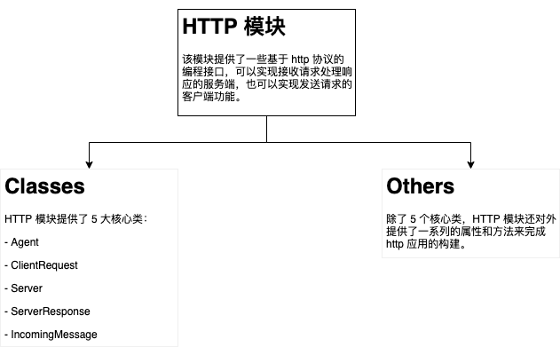
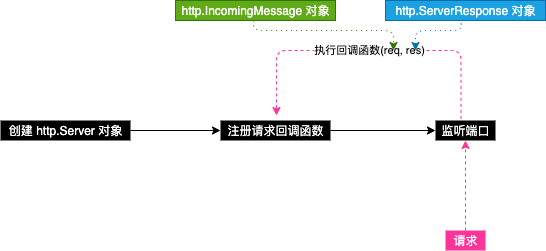
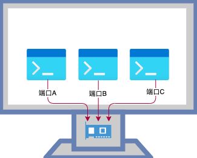
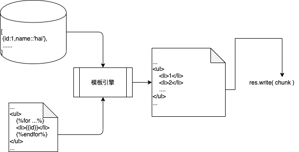

# 使用 Node.js 构建一个 Web 服务端程序

[toc]

## 1、为什么要搭建 WebServer？

> 一切的一切就是为了：共享资源

## 2、WebServer 核心工作流程


## 3、如何搭建一个 WebServer？

原则使用任何语言都能够编写一个 WebServer，只要该语言提供了针对网络进行编程的接口，实际上也存在很多通过各种语言编写的功能强大、稳定的 WebServer 应用程序，如：

- Nginx (https://github.com/nginx/nginx)
- Apache HTTP Server (https://github.com/apache/httpd)
- Apache Tomcat (https://github.com/apache/tomcat)
- IIS
- ……


## 4、为什么要选择 Node.js

- Node.js 有着与 JavaScript 相同的语法特性，对熟悉 JavaScript 的前端同学比较友好
- Node.js 内置了 Net 模块，使得我们可以针对网络进行编程，实现一个 WebServer
- Node.js 还可以编写各种工具（Webpack、各种框架的CLI工具、等等等等）


## 5、使用 Node.js 构建一个基础的 WebServer

首先，我们需要在运行 Node.js 代码的机器上安装 Node.js 的解析运行工具（也就是搭建 Node.js 运行时环境）。正如我们通过浏览器去运行 HTML 代码一样。

在实现 WebServer 的过程中，我们会使用到 Node.js 提供的各种内置功能模块，学习查看、参考文档能够帮助我们更好的提高学习能力。

Node.js 官方文档：https://nodejs.org/en/docs/

### 5-1、Node.js 中的 http 模块

要是用 Node.js 构架一个 WebServer，需要使用 Node.js 中的 http 模块提供的接口来完成。

http 模块文档：https://nodejs.org/dist/latest-v14.x/docs/api/http.html



**基于 Node.js 的 http 模块的服务端基本工作流**



### 5-2、创建一个 WebServer 对象

```js
// 引入 http 模块
const http = require('http');

// 创建 http.Server 对象
// 1、通过 http.Server 类创建
const server = new http.Server();
// 2、通过 createServer 函数创建
const server = http.createServer();
```

### 5-3、注册请求回调函数

通过 `http.Server` 对象的 `request` 事件来监听每一次请求。

```js
server.on('request', callback);
```

或者在创建 `http.Server` 对象的时候通过 `requestListener` 参数传入。

```js
const server = http.createServer(callback);
```

### 5-4、监听网络端口

系统中每一个需要通过网络交换数据的应用程序（如：QQ、微信、浏览器……）都需要监听指定的网卡（IP）和对应端口。



```js
// 0.0.0.0 通配所有IP
server.listen(8888, '0.0.0.0');
```

### 5-5、处理响应数据

**http.ServerResponse**

`HTTP` 模块封装提供了一个 `http.ServerResponse` 类来完成数据的响应，它会在请求回调函数执行过程中实例化，并通过请求回调函数的第二个参数来进行调用。

```js
server.on('request', (req, res) => {
  // res => new http.ServerResponse()
  // chunk => 要写入的数据
  res.write(chunk);
  // 完成数据写入
  res.end(chunk?);
});
```

> end() 调用以后，不可在 write() 写入数据。

### 5-6、解析请求数据

通常服务端提供的资源特别丰富，为了定位和标识互联网中资源，就定义一套规范：URI，其中包含了两个子集：URL、URN

**URL**

统一资源定位系统（uniform resource locator;URL）

**参考**

- URI : https://baike.baidu.com/item/URI/2901761

常见格式：


**http.IncomingMessage**

`HTTP` 模块封装提供了一个 `http.IncomingMessage` 用来解析和获取请求相关信息，如果我们想获取当前请求相关的一些信息，就可以通过这个对象来完成。

```js
server.on('request', (req, res) => {
  // req => new IncomingMessage();
  // req.url: 当前请求的 url（路径部分）
  // req.url 默认为 / ，表示根路径
  console.log(req.url)
})
```

## 6、静态资源 VS 动态资源

许多时候，我们会把资源简单的划分成：

- 静态资源
- 动态资源

### 6-1、静态资源解析与响应

相对不变的内容（除非你修改了它的内容），类似程序中的 变量与常量。

> url 是表示网络资源的虚拟路径，与实际返回的资源存放的路径并不完全等同，如：
>
> 访问 http://localhost:8888/hello 经过对应的 WebServer 应用程序进行解析，返回了 WebServer 服务器的 D://kkb/1.html 文件的内容。
>
> 所以一个 url 不能简单的与某个文件关联起来，需要看对应的 WebServer 的具体逻辑。

### 6-2、规范高效的静态资源解析与响应

通常，我们的 WebServer 会提供各种静态资源（html代码、css代码、js代码、图片……），而这些资源我们又通常会通过文件的方式存储在某个地方。为了批量处理这种资源与 URL 的对应关系，我们会根据某种规则（规则自己定义，或者说由实现WebServer的各种软件和框架）来自动映射。


## 7、HTTP 协议

超文本传输协议（英文：**H**yper**T**ext **T**ransfer **P**rotocol，缩写：HTTP）是一种用于分布式、协作式和超媒体信息系统的应用层协议。HTTP是万维网的数据通信的基础。

客户端 <=> 服务端 数据通信规范。

**参考**

https://developer.mozilla.org/zh-CN/docs/Web/HTTP/Overview

### 7-1、HTTP 报文

报文：发送和响应的数据，HTTP 协议会在数据传输过程中对数据进行一定格式的组织。报文又分为两种类型：

- 请求报文
- 响应报文

### 7-2、请求方式

https://developer.mozilla.org/zh-CN/docs/Web/HTTP/Methods

### 7-3、响应状态码

https://developer.mozilla.org/zh-CN/docs/Web/HTTP/Status

### 7-4、头信息

https://developer.mozilla.org/zh-CN/docs/Web/HTTP/Headers

### 7-5、MIME

https://baike.baidu.com/item/MIME/2900607

http://www.iana.org/assignments/media-types/media-types.xhtml


## 8、动态资源解析与响应

与静态资源不同，同一个 URL 返回的内容并不固定，比如访问 /now 这个 URL，即使不做任何修改，你就有可能得到不一样的结果，这就是动态资源。

## 9、数据与视图结构的分离

许多时候，动态资源会相对复杂一些，有的时候需要根据业务产生一些数据，同时又会把这个数据进行一些包装（嵌入到HTML代码）中，如果每次都字符串拼接去做会比较麻烦：

- 拼接数据和html字符串毕竟麻烦，且容易出错。
- 逻辑处理很繁琐，同样也容易出错。
- 不容易维护，前端页面处理（html、css等）和后端（Node.js）代码混合。
- ……


### 8-1、模板引擎

把数据与某个模板文件（通常是类似HTML，但是又包含了一些特殊定义的语法的字符串/文件），进行结合，利用引擎（写好的方法）去对模板文件中的特殊语法（模板引擎定义语法 - 语法取决于具体模板引擎）进行解析，得到最终的 HTML 字符串。



#### Nunjucks

参考：

https://mozilla.github.io/nunjucks/
